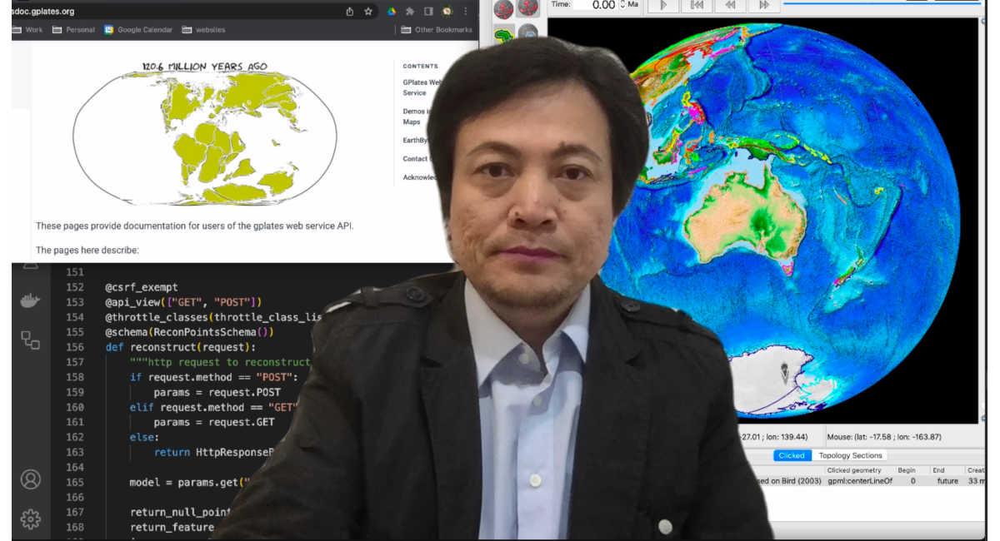

Xiaodong Qin is also known as Michael Chin.

Michael joined the GPlates development team in 2010. He is the architect of GPlates Portal and Web service. He is also the development lead of GPlates mobile App.

You may find Xiaodong Qin at https://www.linkedin.com/in/michael-chin-38745913.
