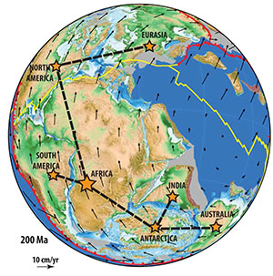
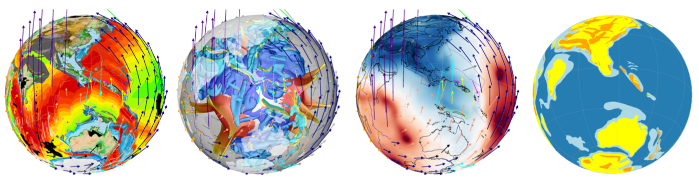
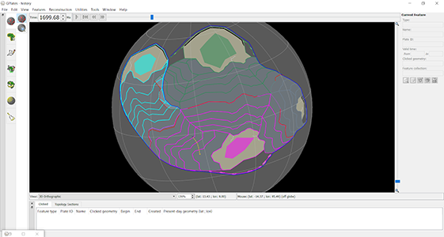
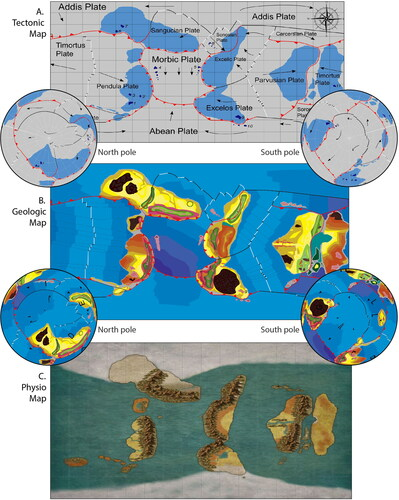

### Plate tectonics and kinematics in GPlates (High School)

This exercise is an introduction of how to load in a **plate reconstruction**, achieve some basic visualisation, and also interrogate the speeds and relative motions between *tectonic plates*.

[Download PDF](https://www.earthbyte.org/webdav/ftp/earthbyte/Teaching/GPlates_Kinematics/GPlates_Kinematics.pdf)

[Download Data Pack](https://www.earthbyte.org/webdav/ftp/earthbyte/Teaching/GPlates_Kinematics/GPlates_Kinematics.zip)

---

### Reconstructions of Gondwana using GPlates (Undergraduate)

This activity applies first principles of **Plate Tectonics** to reconstruct the original arrangement of **Gondwana** in the Pangea supercontinent. It uses continent-ocean boundaries, fossil data, and geophysics to help guide the restoration of Gondwana. 

[Download PDF](https://www.earthbyte.org/webdav/ftp/earthbyte/Teaching/GPlates_Gondwana/GPlates_Gondwana.pdf)

[Download Data Pack](https://www.earthbyte.org/webdav/ftp/earthbyte/Teaching/GPlates_Gondwana/GPlates_Gondwana_DataPack.zip)

---

### AN APPLE PIE FROM SCRATCH, PART V SUPPLEMENT: TECTONICS: USING GPLATES

There is a blog writen by **WORLDBUILDING PASTA**, describing how to use Gplates to turn that concept into a tangible reality. 

[Go To The Blog Page](https://worldbuildingpasta.blogspot.com/2020/06/an-apple-pie-from-scratch-part-v.html)

---
### Worldbuilding from tectonic first principles: Integrating and challenging undergraduate knowledge through a course project

Lindsay M. Schoenbohm & Mitchell McMillan

**Abstract**:

In this integrative, team-based capstone project, students in an upper year Tectonics course built a planet of their own design from the basic concepts of plate tectonics. They created a tectonic map complete with plate boundaries, continental-ocean boundaries, motion vectors, and hot spot traces. In subsequent weeks, students produced a geologic map illustrating features that were a consequence of decisions made in creating their tectonic map. Students designed their own legend and determined the specificity or generality in which they conveyed geologic features at the scale of their map. Students also created a physiographic map reflective of the geology of their planet. Evaluation of student artifacts indicates the project was successful in meeting learning outcomes that challenged students to think in three-dimensions and over geologic timescales, and to develop problem-solving skills; a learning outcome of integrating knowledge from other courses was also met, but to a lesser degree and with more variability among teams. With minor adjustments, this project could be implemented in any tectonics course, or in other subjects including oceanography, atmospheric science, or paleontology.

Read the full article at https://www.tandfonline.com/doi/full/10.1080/10899995.2021.1908810 .

---

### GPlates Tutorials

	
There are many [Introductory Tutorials](https://sites.google.com/site/gplatestutorials/) viewable online via Google Docs or downloadable as PDF. Each one describes how to accomplish a specific task in GPlates. Read these for a more in-depth guide that explains how various GPlates functions can be used within the context of an example workflow.

A video showcasing some of the most recently added functionality of GPlates can be found on the [Features page](/features/).

The live versions of the tutorials are hosted on Google servers. If you are in China or cannot access Google servers, the tutorial PDFs and related files may be downloaded from the archive found [here](https://www.earthbyte.org/webdav/ftp/earthbyte/GPlates/TutorialData_GPlates2.2.zip).

---

### GPlates Python Tutorials

There are [PyGPlates tutorials](https://github.com/GPlates/pygplates-tutorials) in the form of Jupyter Notebooks that analyse and visualise real-world data using pyGPlates.

These tutorials complement the sample code in the pyGPlates documentation by providing a more research-oriented focus.

---
