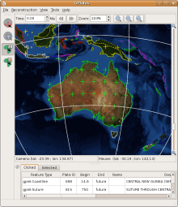

Changes since 0.9.1:

* In addition to reconstructable features with point- and polyline-geometries, GPlates 0.9.2 is able to display raster images on the globe. These images can represent any kind of imagery or gridded data which covers the whole globe (with the image spanning the longitude range of -180 degrees to +180 degrees, and the latitude range of -90 to +90). GPlates is able to read raster images in the widely-used JPEG image format; once a raster is loaded, it is displayed as an OpenGL texture, enabling GPlates to remain responsive when the globe is rotated or the zoom is changed. (Currently, raster images are not reconstructed by GPlates.)
* GPlates is able to display time-dependent global raster images. The user can instruct GPlates to load a sequence of JPEG image files contained in a folder (each image in the sequence corresponding to a particular instant in geological time) and GPlates will display the appropriate image on the globe for the current reconstruction time. As the user changes the reconstruction time, the raster image on the globe will update accordingly.
* The Query Feature Properties dialog has been extended to enable the editing of GPGIM feature properties in an easy-to-use fashion (using a variety of custom-designed user-interface widgets for the various property types). Thus, GPlates now makes the transition from pure visualisation to editing as well. In addition, the reconstructed geometries of a feature can be displayed in parallel with the present-day geometries that are stored in data files.
* Enhanced synchronisation between the user-interface elements which display the properties of GPGIM features means that when a property is changed, the program will react instantly to update the presentation of the feature — whether the changed property was a text field (which will be updated in the "Clicked" feature table), the time-period of existence of the feature (which may cause the feature to appear or disappear at the current reconstruction time) or the reconstruction plate ID (which may cause the feature to change colour and move to a different reconstructed position).
* The new Total Reconstruction Poles dialog provides a variety of informative representations of the total reconstruction poles (finite rotations) for the current reconstruction time: tables of the relative and equivalent finite rotations for each plate ID in the hierarchy; a tree-like representation of the hierarchy of relative rotations; and the circuit between any plate and the user-specified stationary plate. This dialog also enables the export of the tables of finite rotations in CSV (comma-separated value) format.
* The ability to map attributes in a Shapefile to GPlates Model properties on a per-Shapefile basis enables local Shapefile attribute-naming conventions to be integrated seamlessly into GPlates usage. The user-specified mappings will be saved to disk automatically, enabling GPlates to remember mappings between sessions. The attributes can be mapped to different properties at any time.

Download GPlates 0.9.2 from the [Downloads](/download) page.

GPlates 0.9.2 compiles and runs on Linux and Windows XP. Qt 4.3 or above is required.

A GPlates-compatible global coastline file and a rotation file may be downloaded from the [EarthByte Project Resources](http://www.earthbyte.org/category/resources/) page. For more information, see the [Downloads](/download) page.

A GPlates-compatible sequence of time-dependent global raster images (JPEG images, generated from GMT grid files of dynamic topography created by Bernhard Steinberger at the Norwegian Geological Survey) may be downloaded from the Norwegian Geological Survey FTP site. For more information, see the [Downloads](/download) page.

An animated screenshot of the new time-dependent raster image functionality in action (using EarthByte data and Bernhard Steinberger's dynamic topography raster images) may be found on the [Screenshots](/screenshots) page.