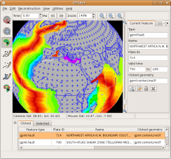

Changes since 0.9.2:

* It is now possible to digitise new feature geometries using the point, polyline and polygon digitisation tools. After a feature geometry has been digitised, an easy-to-use wizard is provided for the creation of a feature, enabling the user to specify the basic properties of the feature such as plate ID, time of existence and name, as well as the feature collection into which the new feature should be placed.
* The new Modify Reconstruction Pole tool enables the interactive modification of the Total Reconstruction Poles which define a reconstruction. The user may drag the geometries of a plate around the globe to modify the Total Reconstruction Pole which reconstructs that plate. When the user is happy with the new position of the plate, he or she may click the “Apply” button to cause a dialog box to appear which lists the calculated finite rotations for review; if the user then clicks the “OK” button, a new Total Reconstruction Pole will be inserted automatically into the loaded rotation file at the appropriate reconstruction time.
* When a feature geometry is focused or a new feature geometry is being digitised, the geometry will be highlighted in white. When a geometry is dragged around the globe, its position will be updated in real time in grey.
* The Task Panel is a new user interface element in the main window which provides status information about whichever feature-interaction tool is currently active. Depending upon which tool is active, this information consists of: a summary of the feature (when the Choose Feature tool is active); a listing of the coordinates which have been digitised so far (when one of the digitisation tools is active); or the adjustment by which the Total Reconstruction Pole has been modified (when the Modify Reconstruction Pole tool is active).
* It is now possible to choose between different feature-colouring schemes (by feature-type, by feature age or by a single user-specified colour), in addition to the existing colouring by plate ID.
* The long-awaited GPML reader is now operational! This reader is able to read all reconstructable feature-types and reconstruction feature-types (Total Reconstruction Poles and Absolute Reference Frames) defined in the GPGIM 1.6 specification. [GPML](/gpml), the GPlates Markup Language, is the GML-based “native” file format of GPlates.
* The XML-conformance of GPML input, output and in-memory storage has been improved, to ensure GPlates handles XML namespaces correctly.
* GPML may be compressed or uncompressed as it is being written to file or read from disk, using the freely-available free software program GZip. GZipped GPML files can be up to 30 times smaller than uncompressed files!
* It is now possible to encode a variety of Shapefile attribute-types, with arbitrary attribute-names, in GPML.
* The internal geometry types, reconstruction mechanism and display graphics have been overhauled to enable GPlates to handle and display polygons and multi-geometries, as well as store duplicate vertices in polylines and polygons.
* Geometric property-values may now be edited in the Feature Properties dialog in the same easy-to-use fashion as non-geometric property-values.

The GPlates 0.9.3.1 release is a minor bugfix to GPlates 0.9.3, to fix a bug in the mapping of Shapefile attributes which was noticed after GPlates 0.9.3 was uploaded, but before any release announcement had been made. There are no other changes from 0.9.3.

Download GPlates 0.9.3.1 from the [Downloads](/download) page.

GPlates 0.9.3.1 compiles and runs on Linux, Windows XP and Windows Vista. (Support for MacOS X is currently in testing — [contact us](/contact) if you'd like to participate in the testing process!) Qt 4.3 or above is required.

A GPlates-compatible global coastline file and a rotation file may be downloaded from the [EarthByte Project Resources page](http://www.earthbyte.org/category/resources/). For more information, see the [Downloads](/download) page.

A GPlates-compatible sequence of time-dependent global raster images (JPEG images, generated from GMT grid files of dynamic topography created by Bernhard Steinberger at the Norwegian Geological Survey) may be downloaded from the Norwegian Geological Survey FTP site. For more information, see the Downloads page.