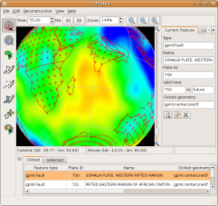

Changes since 0.9.3:

* The transition to the CMake build system has been completed. This new build system replaces both the Autoconf/Automake/Libtool-based build system for Linux and the project files for the MS Visual Studio compilers, in addition to enabling compilation on MacOS X.
* GPlates now compiles and runs on the three main desktop operating systems: Windows, Linux and MacOS X.
* It is now possible to manipulate geometries interactively, dragging vertices using the new Move Vertex tool. This tool can be used on both existing feature geometries, as well as geometries which are in the process of being digitised. When the tool has been selected, the selected geometry will be drawn in grey, while its vertices will be highlighted and draggable.
* Previously, a raster image would always be shown by GPlates to cover the whole globe, from -180 to +180 degrees longitude and -90 to +90 latitude. It's now possible to specify a surface extent of any longitude and latitude range for the raster, enabling rasters of a smaller size to be correctly sized and positioned.
* The Manage Feature Collections dialog offers the ability to reload a file from disk with a single click, as well as the ability to enable or disable a feature collection without unloading or reloading the file.
* It is now possible to save feature collections in GMT format, with a choice of header formats: PLATES4 line header; GPGIM feature properties; or a mixture of the two. It's also possible to export a digitised geometry in GMT format (it was already possible to export a digitised geometry in PLATES4 line-format) during the digitisation process, without needing to create a whole new feature.
* Shapefile attributes may now be edited in the Feature Properties dialog in the same way as native GPGIM property-values.
* The Task Panel can now be resized in the main window, enabling text fields to be widened in order to display longer lines of text.
* All the attributes in a Shapefile may additionally be viewed in a more compact tabular (spreadsheet-like) format, with one attribute per column.

GPlates 0.9.4 compiles and runs on Windows Vista, Windows XP, Linux and MacOS X. Qt 4.3 (or above) and CMake are required. Download GPlates 0.9.4 from the [Download](/download) page.

GPlates-compatible data have been made available. For more information, see the [Download](/download) page.