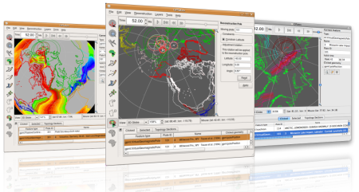

Changes since 0.9.7.1:

* The new 0.9.8 release of GPlates can use a loaded topological plate polygon data set to "__cookie-cut__" a feature collection and __assign Plate IDs__ to the data based on which plate polygon intersects them. This enables users to load data files that do not have Plate ID or reconstruction time information, and then manipulate that data with the loaded reconstruction model.
* Support for __virtual geomagnetic pole data__ is ongoing. As a special preview of GPlates paleo-mag functionality, GPlates is now able to import data from the __IAGA Global Paleomagnetic Database__ created by Mike McElhinny and Jo Lock, later maintained by Sergei Pisarevsky. GPlates can then assign Plate IDs from a topological plate polygon data set and then display the reconstructed virtual geomagnetic pole locations on the globe. The database is available online here: [http://www.ngu.no/geodynamics/gpmdb/](http://www.ngu.no/geodynamics/gpmdb/)
In future releases, full editing capabilities and support for a wide range of data (such as the [MagIC](https://www2.earthref.org/MagIC) database) will be forthcoming.
* __Small circle arcs__ can be rendered by GPlates to indicate the error bounds of virtual geomagnetic poles.
* Development on new colouring options has started. GPlates' default Plate ID colouring scheme has been tweaked, and a __new colour by Plate ID region__ colouring scheme has been created.
* The Modify Reconstruction Pole tool can now __constrain the latitude__ of the pole manipulation while interactively making adjustments.
* The topological capabilities of GPlates are undergoing constant improvement and expansion. As a consequence of these ongoing developments, GPlates now links with [CGAL](https://www.cgal.org/), the Computational Geometry Algorithms Library. This will enable many impressive extensions to the topology tools in the future.

GPlates 0.9.8 compiles and runs on Windows Vista, Windows XP, Linux and MacOS X. Qt 4.3.2 (or above) and CMake are required. Download GPlates 0.9.8 from the [Download](/download) page.

GPlates-compatible data have been made available. For more information, see the [Download](/download)page.
