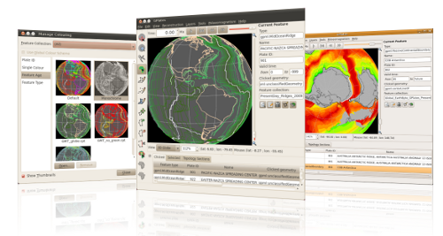

Changes since 0.9.8:

* New paleomagnetic functionality including the ability to:
  * create a Virtual Geomeomagnetic Pole (VGP) feature,
  * generate a total rotation pole adjustment between the VGP and the geographic pole,
  * specify when Virtual Geomeomagnetic Pole features are displayed.
* Colouring improvements including the ability to:
  * preview the effects of each colouring option,
  * load colour tables from GMT CPT files for user-defined colouring,
  * change colouring globally or per feature collection.
* New tools to delete, split and clone features.
* Support for "unsaved changes" to feature collections:
  * highlight feature collections with unsaved changes in red,
  * new icons in the GPlates main window to indicate unsaved changes and file loading errors,
  * exiting GPlates brings up a dialog with options to save unsaved changes.
* Export improvements:
  * all exports (including time-sequence and single snapshot exports) have been unified into a single dialog,
  * new export method: - export the globe view as a single image (or time-sequence of images),
  * new export method: - export total rotation poles for each plate id relative to the anchor plate or relative to the next plate in the circuit,
  * filenames of exports (notably time-sequence exports) can have parameters (such as reconstruction time) inserted in them.
* Generate CitcomS 3.1 meshes inside GPlates.
* Cookie-cutting and plate id assignment has been extended:
  * to regular static polygon features (in addition to topological closed plate boundary features),
  * to assign time of appearance/disappearance (in addition to plate ids).
* Topological closed plate boundary improvements including:
  * automated reversal of topological line sections,
  * support for feature ids in Shapefiles,
  * more flexibility when adding topological line sections (such as adding same section multiple times to a boundary).
* Option to rotate daughter/children plates in the "Modify Reconstruction Pole" tool.
* Other improvements including:
  * conjugate plate id option in "Create Feature" dialog for the relevant features,
  * read/write 4-digit plate ids from/to PLATES line format files,
  * multipoint support in PLATES line format (eg, hotspots),
  * root of time-dependent raster filenames can vary, for example, "imageA" and "imageB" in "imageA-0.jpg" and "imageB-1.jpg".

GPlates 0.9.9 compiles and runs on Windows Vista, Windows XP, Linux and MacOS X. Qt 4.3.2 (or above) and CMake are required. Download GPlates 0.9.9 from the [Download](/download) page.

GPlates-compatible data have been made available. For more information, see the [Download](/download) page.
