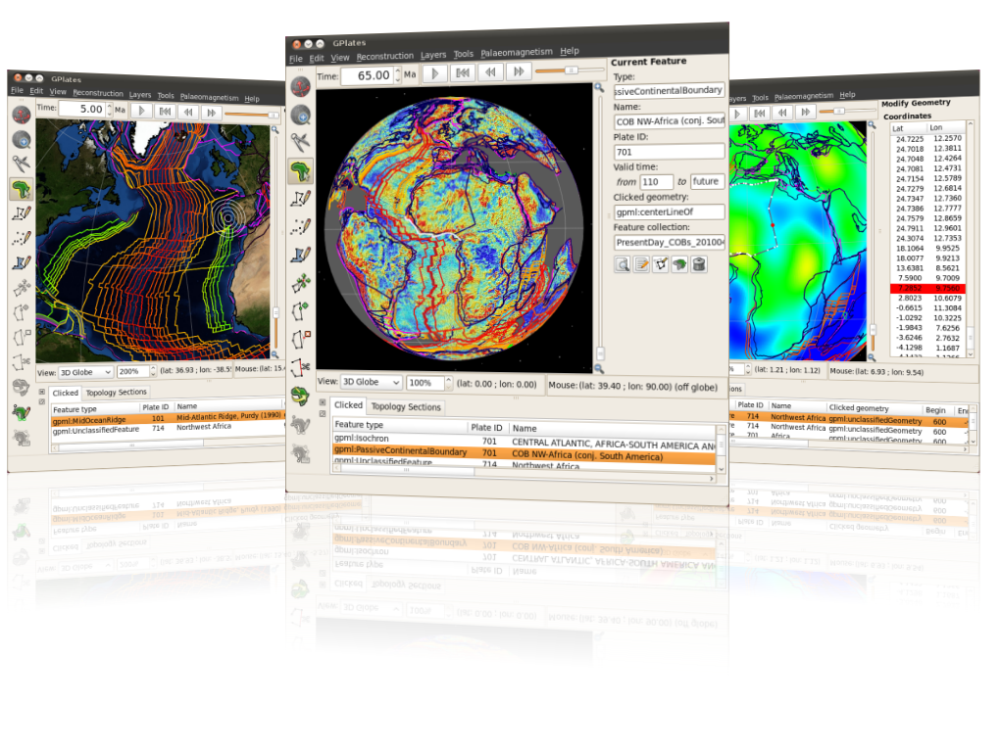

What's new in version 1.0:-

* The ability to create and visualise flowlines and motion paths of points across plates.
* A new Small Circle tool, to help visualise stage rotations.
* When closing, GPlates will remember the files that you had loaded. The new Recent Session menu allows you to re-open files from a previous session.
* The viewport can now be annotated with text including the current reconstruction time.
* The background colour of the globe and graticule resolution can be configured.
* Layers can now be toggled on and off in the Layers dialog.
* The default Rotation layer can also be controlled directly from the Layers dialog.
* A preview of a new Total Reconstruction Sequences dialog to enable more powerful control over the rotations.
* ...as well as a host of other improvements throughout the application.

GPlates 1.0 compiles and runs on Windows Vista, Windows XP, Linux and MacOS X. Download GPlates 1.0 from the [Download](/download) page.

GPlates-compatible data have been made available. For more information, see the [Download](/download) page.
