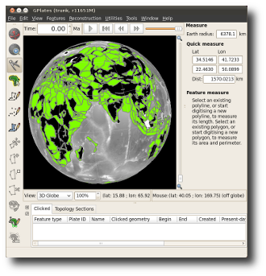

What's new in version 1.1:-

* The Recent Session menu can now restore the layer connections you were using.
* Can display filled polygons for dynamic and static polygons (per-layer).
* Added new OGRGMT file format ('.gmt') compatible with OGR library and ogr2ogr tool.
* Improvements to topology build/edit tools including:
  * Ability to add sections to interior and boundary of topological networks.
  * Options to visualise triangulations associated with each network.
* Velocity layers now calculate velocities inside static polygons (in addition to topological plate polygons).
* Velocity layers can now calculate velocities at the vertices of polyline/polygon geometries.
* Can now load and display higher resolution rasters, including up to 0.3 minute resolution global rasters for the JPEG format.
* GPlates fitted with a novel cube 'loose' quad tree spatial partition, supporting region-of-interest queries, fast insertion of reconstructed geometries, hierarchical visibility culling.
* Improved layers user interface including:
  * A button (in top-right of Layers dialog) to open the Colouring dialog.
  * Layers grouped by layer type.
  * A 'tick' icon for 'Reconstruction Tree' layers to toggle default layer.
  * Can prevent the default 'Reconstruction Tree' layer from changing when opening a new rotation file.
* Improved file load/unload performance when many compute-heavy files already loaded - for example, dense velocity mesh cap files.
* Improved export dialog general user interface.
* New export options to control granularity of exports.
* New OGRGMT exports for reconstructed geometries, flowlines and motion paths.
* Export resolved topologies to Shapefile format.
* Improved rendering performance for flowlines.
* ... Plus a lot of other behind-the-scenes work to prepare for exciting future functionality.

GPlates 1.1 compiles and runs on Windows 7/Vista/XP, Linux and MacOS X. Download GPlates 1.1 from the [Download](/download) page.

GPlates-compatible data have been made available. For more information, see the [Download](/download) page.
