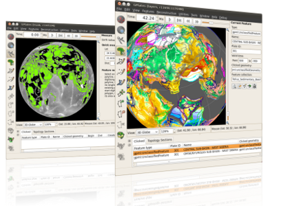

Many bugs were fixed in version 1.1.1:-

* Added back missing age-grid smoothing of raster reconstruction.
* Fixed a number of issues with session save/restore of pre-1.1 sessions.
* Fixed a number of focused feature highlights issues including:
  * Losing highlight when reconstruction time changes.
  * Other geometries associated with focused feature not getting highlighted.
* Fixed a number of problems building/editing topologies:
  * Topological sections not getting inserted.
  * Incorrect auto-segment reversal.
  * Inability to add same topological section more than once to topological boundary.
  * Inability to add point geometries to boundary of topological network.
* Fixed a few update issues including:
  * Globe not updating after changing the anchor Plate ID.
  * Resolved topological boundaries not updated after editing a boundary feature's geometry.
* Filled polygons related fixes include:
  * 'Fill polygons' option toggling wrong layer.
  * Filled polygons rendered as square tiles for high zoom levels.
  * Small improvement in rendering speed.
* A few export related issues including:
  * Not exporting full motion path.
  * Option to export resolved topologies to OGRGMT format removed (not supported).
  * OGRGMT format now supports option to export to a single file.
  * Resolved topologies not exporting when only "Export each Plate Polygon to a separate file" checkbox is ticked.
  * Missing export of topological network boundaries.
  * Inappropriate default directory for exported files.
  * Exporting a single snapshot now does not modify current animation range.
* A couple of feature creation bugs fixed:
  * Fixed incorrectly creating a conjugate isochron feature when creating a mid-ocean ridge feature is created.
  * Fixed incorrectly adding a 'reconstruction' plate ID and conjugate plate ID to a new mid-ocean ridge feature.

GPlates 1.1.1 compiles and runs on Windows 7/Vista/XP, Linux and MacOS X. Download GPlates 1.1.1 from the [Download](/download) page.

GPlates-compatible data have been made available. For more information, see the [Download](/download) page.

