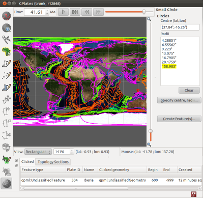

What's new in version 1.2:-

* New Small Circle tool:
  * Create small circles directly on the globe or map using the mouse.
  * Create small circles by specifying the centre and radii, and generating the centre from a stage pole if desired.
  * Create small circle features which can be: exported to gpml, imported from gpml, and visualised as a layer.
  * Query and edit small cirles through the Click Feature canvas tool.
* The Total Reconstruction Sequence dialog has been extended to allow:
  * Creation, editing and deletion of Total Reconstuction Sequences (TRSs).
  * Saving TRSs to existing rotation files, or to a new rotation file.
* Rasters can now be visualized in the map views:
  * Supports all raster variations (reconstructed, time-dependent, age-grid and combinations of these).
* Raster opacity (and intensity) can be adjusted per layer to control semi-transparency.
* Python colouring (see user manual for details):
  * Power users can create/register their own Python colouring scripts.
  * Can use preliminary Python Application Programming Interface (API) to query feature properties.
* Option to dateline wrap Shapefiles when saving and exporting.
* New Log dialog displays low-level debug, warning and error messages.
* New Preferences dialog provides an interface to view and modify settings and parameters used in GPlates.
* Improved interactivity for very high resolution rasters (eg, approx. 1 minute resolution).
  * New GPlates raster streaming tiled file format (files ending with ".gplates.cache").
* Clone Geometry tool can clone topological plate polygons.
* The Calculate Rotation Pole tool has its field automatically filled from an already-selected pmag VGP.
* Fixed slow saving to Shapefiles.
* Fixed rotation taking the longer path around a pole on rare occasions.
* Fixed holes appearing in large filled polygons.
* Fixed extremely long running time for Assign Plate ID assignment.
* Fixed exponential loading times when restoring many files during a session restore.
* ... Plus a number of other improvements and bug fixes.

GPlates 1.2 compiles and runs on Windows 7/Vista/XP, Linux and MacOS X. Download GPlates 1.2 from the [Download](/download) page.

GPlates-compatible data have been made available. For more information, see the [Download](/download) page.

