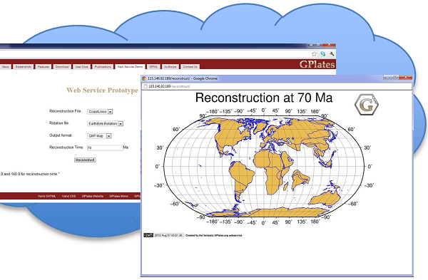

__Congratulations__ to GPlates team on winning this year's __NeCTAR/ANDS #nadojo__ competition. 

The award-winning work demonstrated a new web-enabled GPlates prototype on the NECTAR/ANDS eResearch computing infrastructure, porting some of the powerful plate reconstruction capabilities to the web. The new GPlates competed with several other candidates from universities and research institutes in Australia, and winning on the basis of the novelty and future potential. A judge was quoted as saying: "...being able to look at tectonic plates and how they move over 140Ma years ago brought me back to that child-like awe of wonder and amazement, like the first time you look up at the stars and realise how many (light?) years away they are..." 

__Well done GPlates team!__

