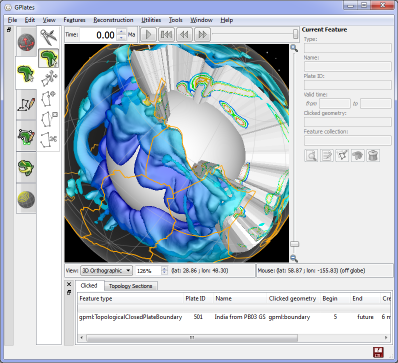

What's new in version 1.3:-

* Integration of Orange and GPlates as a data mining toolkit suite.
  * Includes Orange widgets to obtain pre-processed (co-registration) data from GPlates via network socket requests.
* New GPlates Rotation (GROT) file format:
  * Extends PLATES4 rotation format to include a much richer set of metadata attributes.
  * Please visit the GPlates Rotation (GROT) page for more details.
* Surface relief lighting:
  * Visually transpose one raster onto another in the form of relief/height map shading.
* Volume visualisation of 3D scalar fields (early preview functionality):
  * Developed in collaboration with Tobias Pfaffelmoser (Technical University Munich).
  * For more details please see A Custom Implementation for Visualizing Sub-surface 3D Scalar Fields in GPlates
  * To be officially released in GPlates 1.4.
  * This release (1.3) contains preview functionality available to advanced users:
      * Requires the "--enable-scalar-field-import" command-line switch to enable scalar field import.
      * For example, "cd C:\Program Files (x86)\GPlates\GPlates 1.3.0" and "gplates-1.3.0.exe --enable-scalar-field-import".
      * Enables menu item 'File -> Import -> Import 3D Scalar Field...'
* SVG export includes rasters, 3D scalar fields and filled polygons.
* Export arbitrary resolution rasters (eg, 3,000 x 3,000 pixels).
* Support for reading the OGRGMT file format ('.gmt').
* New finite rotation calculator utilities.
* New velocity imports/exports:
  * Velocity domain generators for Terra and Lat/Lon meshes.
  * Export velocities to Terra (text), CitcomS global and GMT formats.
* Calculate velocities in "Calculated Velocity Fields" layer:
  * 'of domain points' - calculate velocities of reconstructed points.
  * 'of surfaces' - calculate velocities of surfaces that intersect domain points.
* Enhanced velocity arrow display controls including screen space density and arrow scaling.
* New topological 'line' tool creates dynamic polylines.
* Canvas tools grouped into workflow tabs.
* Centralised GPlates Geological Information Model (GPGIM):
  * GPGIM stored in a single XML file.
  * All GPlates dialogs now conform to this central GPGIM.
  * Features can now have either topological (dynamic) geometries or static geometries.
* Upgrades to Manage Feature Collections dialog including sort-by-filename and group selections.
* GPlates now contains a small assortment of commands (on the command-line):
  * Commands are specified on the command-line and do not invoke the graphical interface of GPlates.
  * Run GPlates with "--help" to list the commands and the options available to each command.
  * However, in future, we will be recommending our GPlates Python programming interface (work in progress).
* Filled polygons in 2D map views.
* Improved filled polygon performance.
* Filled polygon opacity and intensity controls.
* Raster reconstruction now works with 'self-intersecting' polygons:
  * Should mostly fix holes in reconstructed rasters due to missing polygons.
* 'age' colour palette button in raster layer (to use when loaded raster is an age grid).

...and many other changes that are listed in the CHANGELOG file in the [GPlates source-code releases](/download).

GPlates 1.3 compiles and runs on Windows 7/Vista/XP, Linux and MacOS X. Download GPlates 1.3 from the [Download](/download) page.

GPlates-compatible data have been made available. For more information, see the [Download](/download) page.

