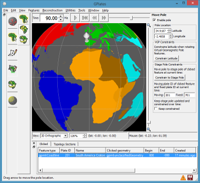

What's new in version 1.4:-

* Export numerical and colour reconstructed rasters:
  * Exports each visible raster layer to a separate raster file.
      * User specified latitude/longitude export region and pixel resolution.
  * Numerical export writes floating-point data:
      * Supported raster formats: NetCDF, GMT NetCDF, GeoTIFF and Erdas Imagine.
      * Standard use of not-a-number (NaN) for pixels not covered by reconstructed raster.
  * Colour export:
      * New supported colour raster formats: GeoTIFF and Erdas Imagine.
      * Uses per-layer colour palette as needed.
      * Includes surface relief lighting.
* Import raster improvements:
  * New import raster formats: ERMapper, Erdas Imagine and GeoTIFF.
  * Imports georeferencing from source raster file.
  * Supports inbuilt raster spatial reference system:
      * Includes projections (for example, Lambert Conformal Conic).
  * Improved performance when importing very large rasters and displaying in 2D map views.
* New Move Pole canvas tool:
  * Supports Modify Reconstruction Pole canvas tool:
      * by allowing user to specify location of pole used for rotation adjustments.
  * Drag pole location with mouse or enter text coordinates.
  * Optionally constrain pole location to moving/fixed stage pole of clicked feature.
      * Includes tracking stage pole over time.
* Velocity smoothing near plate boundaries.
* Mid-ocean ridges:
  * Supports spreading asymmetry.
  * More accurate half-stage rotation.
      * Needed in some rare cases.
* Volume visualisation of 3D scalar fields (continued early preview functionality):
  * To be officially released in GPlates 1.5.
  * This release (1.4) adds preview functionality (since 1.3) available to advanced users:
      * Requires the "--enable-scalar-field-import" command-line switch to enable scalar field import.
      * For example, "cd C:\Program Files (x86)\GPlates\GPlates 1.4.0" and "gplates-1.4.0.exe --enable-scalar-field-import".
      * Enables menu item 'File -> Import -> Import 3D Scalar Field...'
  * Preliminary support for 'regional' (non-global) scalar fields.
  * Colour palette improvements:
      * Optionally remap scalar/gradient palette range.
      * Adjust range using mean and standard deviation of scalar field.
  * Supports transparent colours for isosurface and cross sections.

...and other changes listed in the CHANGELOG file in the [GPlates source-code releases](/download).

GPlates 1.4 compiles and runs on Windows 7/8/8.1, Linux and MacOS X. Download GPlates 1.4 from the [Download](/download) page.

GPlates-compatible data have been made available. For more information, see the [Download](/download) page.
