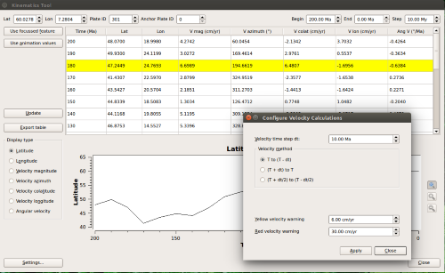

What's new in version 1.5:-

* Projects:
  * Save and restore your sessions with project files.
* New kinematics tool:
  * Displays table of latitude, longitude, velocity, and velocity-related quantities for a given lat-lon point, plate ID, and range of times.
  * Displays graph of above quantities against time.
  * Exports table to text file.
  * Kinematic tool settings dialog to change details of the velocity calcliations.
  * Kinematic tool settings are saved in user preferences.
  * Auto-fills point data from focussed feature.
  * Auto-fills time ranges from animation settings.
* Import and export GeoJSON format feature collections.

...and other changes listed in the CHANGELOG file in the [GPlates source-code releases](/download).

GPlates 1.5 compiles and runs on Windows 7/8/8.1, Linux and MacOS X. Download GPlates 1.5 from the [Download](/download) page.

GPlates-compatible data have been made available. For more information, see the [Download](/download) page.

