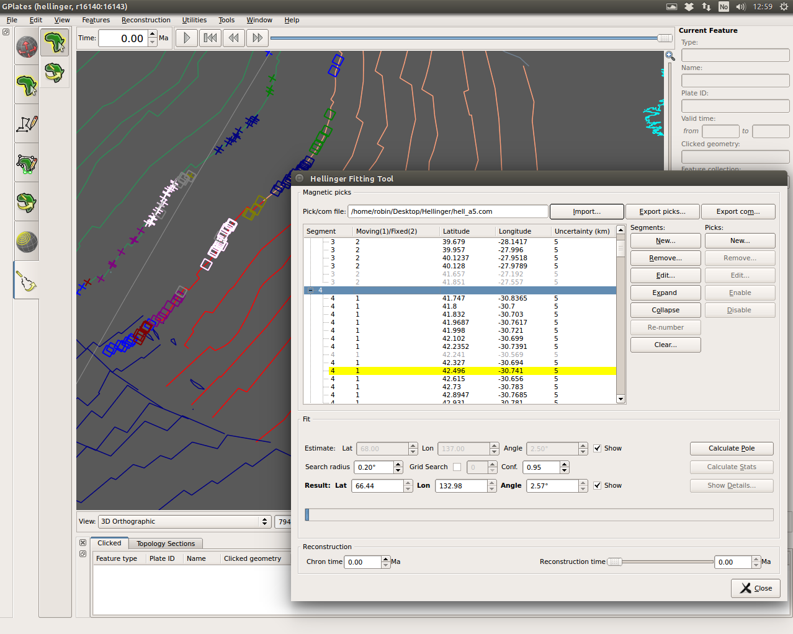

  

What's new in version 1.5 + hellinger-testing:-

* New Hellinger tool:
  * Added new workflow to determine best-fitting poles by the method of Hellinger:
      * Import and export data files compatible with the FORTRAN programs of Chang and co-workers.
      * Edit and create magnetic pick data points, via the canvas or tabularly via the Hellinger dialog.
      * Adjust segmentation of magnetic picks.
      * Enable/disable magnetic picks from inclusion in the fitting algorithms.
      * Specify pole and angle estimates via the canvas or via the Hellinger dialog.
      * Perform fitting using a Python implementation the FORTRAN programs.
      * Visualise resulting fit and uncertainty on the canvas.
      * Export fit and uncertainty data to text file.

This __experimental__ release of GPlates contains a new Hellinger tool in addition to all functionality available in the recent [GPlates 1.5 official release](/news/2015-02-14-GPlates-1-5-released/).

This release compiles and runs on Windows 7/8/8.1, Linux and MacOS X. Download this release from the [Download](/download) page.

GPlates-compatible data have been made available. For more information, see the [Download](/download) page.
