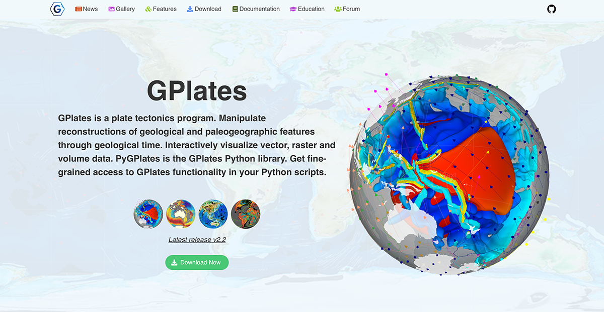

We are very excited to announce the launch of the newly designed GPlates website. Visit the new website at [www.gplates.org](https://www.gplates.org). After a few months of team work and dedication, we have made the new GPlates website more responsive and more mobile-friendly.

As the development team of the GPlates open source project, our goal with this new website is to provide our visitors an easier way to know GPlates, download data and learn how to use it. The new website is a good way to present and promote the GPlates open source software. And it is also a fantastic source of information about the plate tectonic software and research.

For any questions, suggestions, feedback or comments, please leave a message at our [forum](https://discourse.gplates.org).

Thank you!