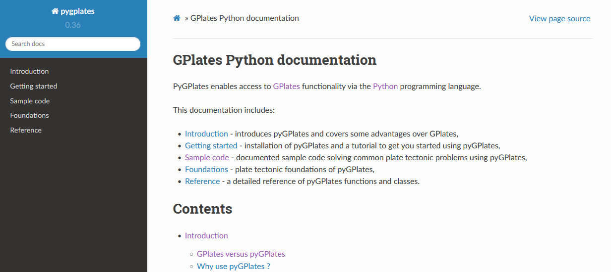

PyGPlates enables access to GPlates functionality via the [Python](https://www.python.org/) programming language.

#### Download PyGPlates 0.36:-

Download PyGPlates 0.36 from the [Download](/download) page.

#### What's new in PyGPlates 0.36:-

* [Versioning scheme](/docs/pygplates/generated/pygplates.version) changed:
    * This release is version 0.36 (instead of *revision 36*).
* Separate [binary packages](https://www.earthbyte.org/download-pygplates-0-36/) for macOS on __Intel__ (x84_64) and macOS on __M1__ (arm64).
    * Unlike GPlates, pyGPlates typically needs to be compiled separately for these two architectures.
* New class [topological model](/docs/pygplates/generated/pygplates.topologicalmodel):
    * Use it to create a [topological snapshot](/docs/pygplates/generated/pygplates.topologicalsnapshot) for a particular geological time.
        * Then query snapshot for resolved topological plates and deforming networks,
            * and their shared boundaries.
        * Easier than using the [resolve_topologies()](/docs/pygplates/generated/pygplates.resolve_topologies.html) function.
    * Also use it to [reconstruct and deform points over a time period](/docs/pygplates/generated/pygplates.topologicalmodel#pygplates.TopologicalModel.reconstruct_geometry):
        * To get a history of reconstructed positions, crustal stretching and tectonic subsidence.
            * See the [sample code](/docs/pygplates/sample-code/pygplates_reconstruct_crustal_thickness_and_tectonic_subsidence.html).
        * Equivalent to the "`Reconstruct using topologies`" option in green layers in GPlates.
            * Use same [algorithm as GPlates](/docs/pygplates/generated/pygplates.reconstructedgeometrytimespan#pygplates.ReconstructedGeometryTimeSpan.DefaultDeactivatePoints) for deactivating points (eg, subduction of oceanic points),
            * Or override with [your own algorithm](/docs/pygplates/generated/pygplates.reconstructedgeometrytimespan#pygplates.ReconstructedGeometryTimeSpan.DeactivatePoints).
        * Control [strain rate clamping](/docs/pygplates/generated/pygplates.resolvetopologyparameters) to avoid excessive crustal stretching.
            * Similar to clamping in brown "`Resolved Topological Networks`" layers in GPlates.
* File I/O:
    * GeoJSON and GeoPackage supported when reading/writing [feature collections](/docs/pygplates/generated/pygplates.featurecollection).
    * GeoJSON supported when exporting [reconstructed](/docs/pygplates/generated/pygplates.reconstruct.html) and [resolved](/docs/pygplates/generated/pygplates.topologicalsnapshot#pygplates.TopologicalSnapshot.export_resolved_topologies) geometries.
* New ways to create a rotation between two points, or between two lines:
    * Search for "`New in version 0.29`" in [FiniteRotation](/docs/pygplates/generated/pygplates.finiterotation).
* Interior holes supported in [polygons](/docs/pygplates/generated/pygplates.polygononsphere) (including [dateline-wrapped polygons](/docs/pygplates/generated/pygplates.datelinewrapper#pygplates.DateLineWrapper.wrap)).
* All geometry types support `get_centroid()`.
    * Avoids having to first test if geometry is a point, multi-point, polyline or polygon.
* Support all NumPy integer and float scalar types as arguments in pyGPlates:
    * For example, a pyGPlates function accepting a `float` will also accept a `numpy.float64`.
* Bug fixes.

#### Coming soon:-

* Anaconda support:
    * `conda install pygplates`

#### What's next:-

* Improve velocities:
    * Make velocities generally easier to calculate.
    * Query velocities (and strain rates) inside deforming networks.
    * Query velocities on topological boundaries (rigid and deforming).
* Improve the reconstruction/deformation of points using topogical plates and deforming networks:
    * Support creating deforming mesh points within a specific deforming network.
        * Similar to the "`Generate Deforming Mesh Points`" dialog in GPlates.
    * Query velocities, strain rates and accumulated strain at [reconstructed/deformed points](/docs/pygplates/generated/pygplates.reconstructedgeometrytimespan).
        * Currently can query their positions and scalars (eg, crustal stretching and tectonic subsidence).

#### Documentation:-

Documentation and tutorials are available on the [User Documentation](/docs) page, and include:

* an introduction to pyGPlates,
* an installation guide,
* a 'Getting Started' tutorial,
* documented sample code,
* foundations of pyGPlates, and
* a detailed reference of pyGPlates functions and classes.

The pyGPlates tutorials are Jupyter Notebooks that analyse and visualise real-world data using pyGPlates. These tutorials complement the sample code in the pyGPlates documentation by providing a more research-oriented focus.
