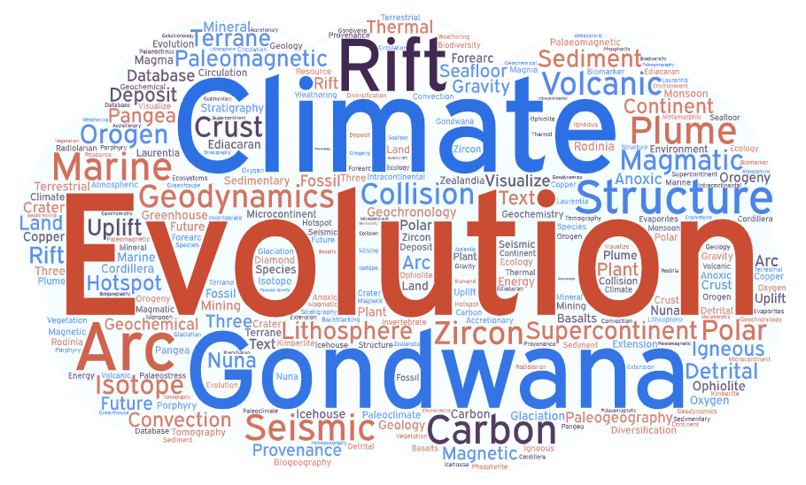

<button style="position:fixed; bottom:10px;right:10px;"><a href="#top">Go back to top</a></button> <a href="#2023" style="margin-left:10px;">2023(<strong><i>136</i></strong>)</a>;<a href="#2022" style="margin-left:10px;">2022(<strong><i>304</i></strong>)</a>; <a href="#2021" style="margin-left:10px;">2021(<strong><i>278</i></strong>)</a>; <a href="#2020" style="margin-left:10px;">2020(<strong><i>110</i></strong>)</a>; <a href="#2019" style="margin-left:10px;">2019(<strong><i>136</i></strong>)</a>; <a href="#2018" style="margin-left:10px;">2018(<strong><i>127</i></strong>)</a>; <a href="#2017" style="margin-left:10px;">2017(<strong><i>87</i></strong>)</a>; <a href="#2016" style="margin-left:10px;">2016(<strong><i>72</i></strong>)</a>; <a href="#2015" style="margin-left:10px;">2015(<strong><i>71</i></strong>)</a>; <a href="#2014" style="margin-left:10px;">2014(<strong><i>52</i></strong>)</a>; <a href="#2013" style="margin-left:10px;">2013(<strong><i>56</i></strong>)</a>; <a href="#2012" style="margin-left:10px;">2012(<strong><i>57</i></strong>)</a>; <a href="#2011" style="margin-left:10px;">2011(<strong><i>27</i></strong>)</a>; <a href="#2010" style="margin-left:10px;">2010(<strong><i>14</i></strong>)</a>; <a href="#2009" style="margin-left:10px;">2009(<strong><i>8</i></strong>)</a>; <a href="#2008" style="margin-left:10px;">2008(<strong><i>10</i></strong>)</a>; <a href="#2007" style="margin-left:10px;">2007(<strong><i>3</i></strong>)</a>; <a href="#2006" style="margin-left:10px;">2006(<strong><i>1</i></strong>)</a>;

**Total: 1549** (_as of 2023-06-01_)

_This web page was created by a Python script automatically using the data retrieved from [Google Scholar](https://scholar.google.com.au/). Your publications are listed here because we believe you have used GPlates/pyGPlates in your publications directly or indirectly(such as GPlates being used in your references). If you believe that any of the papers has been listed here mistakenly, you may [contact us](https://www.earthbyte.org/contact-us-3/)._

<strong id="2023">2023(136)</strong>

- [3D geometric modelling of the Northwest Pacific slabs: A review and new high-precision model](https://www.sciencedirect.com/science/article/pii/S0012825223000405) J Wang, H Xing, Z Jin, Y Tan, S Pang, J Liu - Earth-Science Reviews, 2023 - Elsevier

- [A Great late Ediacaran ice age](https://academic.oup.com/nsr/advance-article-pdf/doi/10.1093/nsr/nwad117/50455717/nwad117.pdf) R Wang, B Shen, X Lang, B Wen… - National Science …, 2023 - academic.oup.com

- [A Laurentian affinity for the Embu Terrane, Ribeira Belt (SE Brazil), revealed by zircon provenance statistical analysis](https://www.sciencedirect.com/science/article/pii/S167498712200130X) BV Ribeiro, FM Faleiros, GAC Campanha… - Geoscience …, 2023 - Elsevier

- [A Multi-proxy Provenance Study of Late Carboniferous to Middle Jurassic Sandstones in the Eastern Sverdrup Basin and Its Bearing on Arctic Palaeogeographic …](http://www.tara.tcd.ie/bitstream/handle/2262/101938/geosciences-13-00010-v2.pdf?sequence=1) Q Crowley - 2023 - tara.tcd.ie

- [A Multi-proxy Provenance Study of Late Carboniferous to Middle Jurassic Sandstones in the Eastern Sverdrup Basin and Its Bearing on Arctic …](https://www.mdpi.com/article/10.3390/geosciences13010010) MA Pointon, H Smyth, JE Omma, AC Morton… - Geosciences, 2023 - mdpi.com

- [A complete genus-level phylogeny reveals the Cretaceous biogeographic diversification of the poppy family](https://www.sciencedirect.com/science/article/pii/S105579032300012X) HW Peng, KL Xiang, AS Erst, L Lian, RDC Ortiz… - Molecular Phylogenetics …, 2023 - Elsevier

- [A dynamic 2000–540 Ma Earth history: From cratonic amalgamation to the age of supercontinent cycle](https://www.sciencedirect.com/science/article/pii/S0012825223000259) ZX Li, Y Liu, R Ernst - Earth-Science Reviews, 2023 - Elsevier

- [A geospatial platform for the tectonic interpretation of low-temperature thermochronology Big Data](https://www.nature.com/articles/s41598-023-35776-3) SC Boone, F Kohlmann, W Noble, M Theile… - Scientific Reports, 2023 - nature.com

- [A global reassessment of the spatial and temporal expression of the Late Miocene Biogenic Bloom](https://agupubs.onlinelibrary.wiley.com/doi/pdfdirect/10.1029/2022PA004564) Q Pillot, B Suchéras‐Marx, AC Sarr… - Paleoceanography …, 2023 - Wiley Online Library

- [A new view of the Pangea supercontinent with an emphasis on the East Asian blocks](https://www.sciencedirect.com/science/article/pii/S0012821X23001565) Z Yi, Y Liu, JG Meert, T Wang, B Huang - Earth and Planetary Science …, 2023 - Elsevier

- [A review of the Gippsland Basin history based on comparison of 3D structural, stratigraphic and forward sedimentation models: recognition of source, reservoir, traps …](https://www.tandfonline.com/doi/full/10.1080/08120099.2023.2136241) X Yang, GC Smith - Australian Journal of Earth Sciences, 2023 - Taylor & Francis

- [Along-strike island-arc crustal growth rate estimation: case study of the Izu–Bonin–Mariana subduction system](https://academic.oup.com/gji/article/232/3/1886/6779681) Y Bai, X Mu, W Zhang, S Li, D Zhang… - Geophysical Journal …, 2023 - academic.oup.com

- [An early Miocene (~ 20 Ma) paleogeographic reconstruction for paleoclimate modelling](https://www.sciencedirect.com/science/article/pii/S0031018222005533) Z He, Z Zhang, Z Guo, CR Scotese, C Deng - Palaeogeography …, 2023 - Elsevier

- [Astrochronology and carbon-isotope stratigraphy of the Fengcheng Formation, Junggar Basin: terrestrial evidence for the Carboniferous-Permian Boundary](https://www.sciencedirect.com/science/article/pii/S1342937X23000114) R Huang, F Jiang, D Chen, R Qiu, T Hu, L Fang… - Gondwana …, 2023 - Elsevier

- [Backtracking potential mantle sources of North American kimberlites through kinematic models to constrain their origin](https://krex.k-state.edu/dspace/bitstream/handle/2097/42890/EstherLee2023.pdf?sequence=1) E Lee - 2023 - krex.k-state.edu

- [Back‐Arc Tectonics and Plate Reconstruction of the Philippine Sea‐South China Sea Region Since the Eocene](https://agupubs.onlinelibrary.wiley.com/doi/pdf/10.1029/2022GL102154) J Liu, S Li, X Cao, H Dong, Y Suo… - Geophysical …, 2023 - Wiley Online Library

- [Basin formation, magmatism, and exhumation document southward migrating flat-slab subduction in the central Andes](https://www.sciencedirect.com/science/article/pii/S0012821X23000638) JE Saylor, KE Sundell, ND Perez, JB Hensley… - Earth and Planetary …, 2023 - Elsevier

- [Breaking the Ring of Fire: How ridge collision, slab age, and convergence rate narrowed and terminated the Antarctic continental arc](https://agupubs.onlinelibrary.wiley.com/doi/pdf/10.1029/2022TC007634) A Burton‐Johnson, J Bastias, S Kraus - Tectonics, 2023 - Wiley Online Library

- [Carbon cycle during the late Aptian–early Albian OAE 1b: A focus on the Kilian–Paquier levels interval](https://www.sciencedirect.com/science/article/pii/S0921818123000474) S Bodin, M Charpentier, CV Ullmann, A Rudra… - Global and Planetary …, 2023 - Elsevier

- [Cenozoic exhumation in the Mediterranean and the Middle East](https://www.sciencedirect.com/science/article/pii/S001282522300017X) R Lanari, A Boutoux, C Faccenna, F Herman… - Earth-Science …, 2023 - Elsevier

- [Cisuralian (Early Permian) paleogeographic evolution of South China Block and sea-level changes: Implications for the global Artinskian Warming Event](https://www.sciencedirect.com/science/article/pii/S0031018223000135) Z Hou, S Shen, CM Henderson, D Yuan… - Palaeogeography …, 2023 - Elsevier

- [Comparing Plate Tectonics and Expansion Tectonics.](https://search.ebscohost.com/login.aspx?direct=true&profile=ehost&scope=site&authtype=crawler&jrnl=22025685&AN=163297539&h=01bMjKGzeJCuX63UtqjP1VVDgFmuj0bsHvp1omvfrZK6nSoMDYQnEOYwD9axfhcwuTXRRo%2FNlTLk60rZvRiaFA%3D%3D&crl=c) J Maxlow - New Concepts in Global Tectonics Journal, 2023 - search.ebscohost.com

- [Comparison of Granites from the Eastern and Western Districts of the Gejiu Ore District in South China: Implication for Petrogenesis and Tin Metallogeny](https://www.mdpi.com/2075-163X/13/5/691) S Sun, J Zhang, S Li, H Niu, Z Wu, W Sun - Minerals, 2023 - mdpi.com

- [Contrasting transform and passive margin subsidence history and heat flow evolution: Insights from 3D thermo-mechanical modelling](https://www.lyellcollection.org/doi/pdf/10.1144/SP524-2021-94) A Balázs, T Gerya, D May, G Tari - Geological Society, London …, 2023 - lyellcollection.org

- [Correlations among large igneous provinces related to the West Gondwana breakup: A geochemical database reappraisal of Early Cretaceous plumbing …](https://www.sciencedirect.com/science/article/pii/S1674987122001323) AA Macêdo Filho, MHBM Hollanda, S Fraser… - Geoscience …, 2023 - Elsevier

- [Coupling of geographic range and provincialism in Cambrian marine invertebrates](https://www.cambridge.org/core/services/aop-cambridge-core/content/view/32789AB0084AA9F48DD2875ACA5DB85F/S0094837322000367a.pdf/coupling-of-geographic-range-and-provincialism-in-cambrian-marine-invertebrates.pdf) L Na, ÁT Kocsis, Q Li, W Kiessling - Paleobiology, 2023 - cambridge.org

- [Cretaceous–Paleogene tectonic reconstructions of the South Scotia Ridge and implications for the initiation of subduction in the Scotia Sea](https://www.lyellcollection.org/doi/pdf/10.1144/jgs2023-013) TR Riley, A Burton-Johnson, KA Hogan… - Journal of the …, 2023 - lyellcollection.org

- [Deconstructing plate tectonic reconstructions](https://www.nature.com/articles/s43017-022-00384-8) M Seton, SE Williams, M Domeier, AS Collins… - Nature Reviews Earth & …, 2023 - nature.com

- [Deep structure of the Demerara Plateau and its two-fold tectonic evolution: from a volcanic margin to a Transform Marginal Plateau, insights from the conjugate Guinea …](https://www.lyellcollection.org/doi/pdf/10.1144/SP524-2021-96) D Graindorge, T Museur, F Klingelhoefer… - Geological Society …, 2023 - lyellcollection.org

- [Deep time spatio‐temporal data analysis using py GP lates with P late T ectonic T ools and GP lately](https://rmets.onlinelibrary.wiley.com/doi/pdf/10.1002/gdj3.185) BR Mather, RD Müller, S Zahirovic… - Geoscience Data …, 2023 - Wiley Online Library

- [Determining Mid-Ocean Ridge Geography from Upper Mantle Temperature](https://www.authorea.com/doi/pdf/10.22541/essoar.167898504.49087820) X Bao, T Mittal, C Lithgow-Bertelloni - 2023 - authorea.com

- [Detrital zircon U-Pb ages of Proterozoic and Cretaceous sandstones of Narmada region in Central India: Implications for provenance and the closure age of the …](https://eartharxiv.org/repository/object/5030/download/9953/) V Kumari, S Tandon, T Kallukalam, A Ghatak - 2023 - eartharxiv.org

- [Dispersed spore assemblages from the Lower Devonian Rañeces-La Vid groups of Northern Spain: Palaeogeographical implications](https://www.sciencedirect.com/science/article/pii/S0034666722002238) CH Wellman, P Steemans, G Lopes - Review of Palaeobotany and …, 2023 - Elsevier

- [Dynamic modeling of tectonic carbon processes: State of the art and conceptual workflow](https://link.springer.com/article/10.1007/s11430-022-1038-5) L Zhao, Z Guo, H Yuan, X Wang, H Shen… - Science China Earth …, 2023 - Springer

- [EaDz: A web-based, relational database for detrital zircons from East Asia](https://www.sciencedirect.com/science/article/pii/S0098300422002370) B Zhang, S Liu, C Zhang - Computers & Geosciences, 2023 - Elsevier

- [Early post-breakup kinematic adjustments of continental–oceanic transform fault zones: Cape Range, Coromandal and Romanche transform margin case study](https://www.lyellcollection.org/doi/pdf/10.1144/SP524-2021-110) M Nemčok, L Ledvényiová, A Henk… - Geological Society …, 2023 - lyellcollection.org

- [Editorial preface to special issue: Cenozoic tectonics and paleoclimate in Inner Asia: From case studies to climatic modelling](https://www.sciencedirect.com/science/article/pii/S0031018223002341) J Sun, W Xiao, BF Windley, Y Hu - Palaeogeography, Palaeoclimatology …, 2023 - Elsevier

- [Environmental controls on the resilience of Scott Reefs since the Miocene (North West Shelf, Australia): Insights from 3D seismic data](https://www.sciencedirect.com/science/article/pii/S0264817223000946) C Williams, V Paumard, JM Webster, J Leonard… - Marine and Petroleum …, 2023 - Elsevier

- [Eocene/Oligocene global disruption and the revolution of Caribbean mangroves](https://www.sciencedirect.com/science/article/pii/S1433831923000173) V Rull - Perspectives in Plant Ecology, Evolution and …, 2023 - Elsevier

- [Evolution of an accretionary complex (LeMay Group) and terrane translation in the Antarctic Peninsula](https://nora.nerc.ac.uk/id/eprint/533168/1/Tectonics%20-%202023%20-%20Riley%20-%20Evolution%20of%20an%20Accretionary%20Complex%20%20LeMay%20Group%20%20and%20Terrane%20Translation%20in%20the%20Antarctic.pdf) TR Riley, IL Millar, A Carter, MJ Flowerdew… - Tectonics, 2023 - nora.nerc.ac.uk

- [Evolution of the Exmouth-Barrow carbonate margin through the Miocene: Insights from 3D seismic data and field investigations (North West Shelf, Australia)](https://www.sciencedirect.com/science/article/pii/S003707382300043X) R Riera, V Paumard, J Bourget, T Allan, U Lebrec - Sedimentary Geology, 2023 - Elsevier

- [Evolution, systematics and historical biogeography of Palparini and Palparidiini antlions (Neuroptera: Myrmeleontidae): Old origin and in situ diversification in …](https://resjournals.onlinelibrary.wiley.com/doi/pdf/10.1111/syen.12593) NMC Hévin, GJ Kergoat, AL Clamens… - Systematic …, 2023 - Wiley Online Library

- [Geochemical and radiogenic isotope records of the Weissert Event in south Tethyan sediments](https://www.lyellcollection.org/doi/pdf/10.1144/jgs2022-023) M Shmeit, C Chauvel, F Giraud, E Jaillard… - Journal of the …, 2023 - lyellcollection.org

- [Ghost-arc geochemical anomaly at a spreading ridge caused by supersized flat subduction](https://www.nature.com/articles/s41467-023-37799-w) GM Gianni, J Likerman, CR Navarrete… - Nature …, 2023 - nature.com

- [Glendonites throughout the Phanerozoic](https://www.sciencedirect.com/science/article/pii/S0012825223001198) M Rogov, V Ershova, C Gaina, O Vereshchagin… - Earth-Science …, 2023 - Elsevier

- [Global bioregions of reptiles confirm the consistency of bioregionalization processes across vertebrate clades](https://onlinelibrary.wiley.com/doi/pdf/10.1111/geb.13694) M Falaschi, S Marta, E Lo Parrino, U Roll… - Global Ecology and …, 2023 - Wiley Online Library

- [Global impact and selectivity of the Cretaceous-Paleogene mass extinction among sharks, skates, and rays](https://www.science.org/doi/full/10.1126/science.abn2080) G Guinot, FL Condamine - Science, 2023 - science.org

- [Gravity Anomalies and Implications for Shallow Mantle Processes of the Western Cocos‐Nazca Spreading Center](https://agupubs.onlinelibrary.wiley.com/doi/pdfdirect/10.1029/2022GL102133) T Zheng, J Lin, H Schouten, DK Smith… - Geophysical …, 2023 - Wiley Online Library

- [High-latitude Cretaceous–Paleogene transition: New paleoenvironmental and paleoclimatic insights from Seymour Island, Antarctica](https://www.sciencedirect.com/science/article/pii/S0377839823000130) LCF da Silva, A Santos, G Fauth, LME Manríquez… - Marine …, 2023 - Elsevier

- [High‐Resolution Magnetic‐Geochemical Mapping of the Serpentinized and Carbonated Atlin Ophiolite, British Columbia: Toward Establishing Magnetometry as a …](https://agupubs.onlinelibrary.wiley.com/doi/pdf/10.1029/2022GC010730) M Tominaga, A Beinlich, EA Lima… - Geochemistry …, 2023 - Wiley Online Library

- [Hundred million years of landscape dynamics from catchment to global scale](https://www.science.org/doi/full/10.1126/science.add2541) T Salles, L Husson, P Rey, C Mallard, S Zahirovic… - Science, 2023 - science.org

- [Impact of Deccan Volcanism on Reorganization of the Indian plate kinematics](https://www.authorea.com/doi/pdf/10.1002/essoar.10512728.1) A Bhagat, S Sangode - Authorea Preprints, 2023 - authorea.com

- [Importance of global spherical geometry to model slab dynamics and evolution in models with data assimilation](https://www.sciencedirect.com/science/article/pii/S0012825223001034) D Peng, L Liu - Earth-Science Reviews, 2023 - Elsevier

- [Into the future](/scholar?output=instlink&q=info:phQeOpG_jzcJ:scholar.google.com/&hl=en&as_sdt=0,5&as_ylo=2023&scillfp=15656291886335765198&oi=lle) HS Davies, JC Duarte, M Green - A Journey Through Tides, 2023 - Elsevier

- [Kinematic reconstruction of the Tibetan-Himalayan orogen since the Cretaceous](https://meetingorganizer.copernicus.org/EGU23/EGU23-1136.html) T Schouten, L Boschman, S Li, S Willett - 2023 - meetingorganizer.copernicus.org

- [Kungurian sedimentary environments in the slope facies of the Xuyong area, South China, and a comparative analysis of low-latitude palaeogeography](https://link.springer.com/article/10.1007/s13146-023-00853-1) L Wu, H Jiang, M Pan, P Wang, J Hu, J Wu… - Carbonates and …, 2023 - Springer

- [Late Cenozoic Sea Surface Temperature evolution of the South Atlantic Ocean](https://egusphere.copernicus.org/preprints/2023/egusphere-2023-291/egusphere-2023-291.pdf) FS Hoem, A López-Quirós… - …, 2023 - egusphere.copernicus.org

- [Linking Pacific Plate formation and Early Cretaceous metallogenic response on the circum-Pacific continental margins](https://pubs.geoscienceworld.org/gsa/gsabulletin/article-pdf/doi/10.1130/B36717.1/5842201/b36717.pdf) C Wu, H Chen, M Chiaradia… - Geological Society of …, 2023 - pubs.geoscienceworld.org

- [Lipid-biomarker-based sea surface temperature record<? xmltex\break?> offshore Tasmania over the last 23 million years](https://cp.copernicus.org/articles/19/787/2023/cp-19-787-2023.html) S Hou, F Lamprou, FS Hoem, MRN Hadju… - Climate of the …, 2023 - cp.copernicus.org

- [Long-term global sea-level change due to dynamic topography since 410 Ma](https://www.sciencedirect.com/science/article/pii/S0967063722002576) A Yang - Deep Sea Research Part I: Oceanographic Research …, 2023 - Elsevier

- [Mantle contribution to Late Paleozoic glaciations of SW Gondwana](https://www.sciencedirect.com/science/article/pii/S0921818122002855) FM Dávila, F Martina, P Ávila, M Ezpeleta - Global and Planetary Change, 2023 - Elsevier

- [Megafossils of Betulaceae from the Oligocene of Qaidam Basin and their paleoenvironmental and phytogeographic implications](https://www.sciencedirect.com/science/article/pii/S2468265923000525) T Yang, JH Cai, YZ Dai, HY Chen, L Han, L Zhang… - Plant Diversity, 2023 - Elsevier

- [Modelos de reconstrução cinemática e paleogeográfica das bacias mesozóicas onshore do nordeste do Brasil](https://pantheon.ufrj.br/bitstream/11422/20016/1/AZAMBUJA%2C%20R.G.C.pdf) RGC Azambuja - 2023 - pantheon.ufrj.br

- [Named Landforms of the World: A Geomorphological and Physiographic Compilation](https://www.tandfonline.com/doi/pdf/10.1080/24694452.2023.2200548) C Frye, R Sayre, AB Murphy, D Karagülle… - Annals of the …, 2023 - Taylor & Francis

- [Neogene burial of organic carbon in the global ocean](https://www.nature.com/articles/s41586-022-05413-6) Z Li, YG Zhang, M Torres, BJW Mills - Nature, 2023 - nature.com

- [New Middle Jurassic Paleomagnetic and Geochronologic Results From the Lhasa Terrane: Contributions to the Closure of the Meso‐Tethys Ocean and Jurassic True …](https://agupubs.onlinelibrary.wiley.com/doi/pdf/10.1029/2023GL103343) S Wang, T Yang, J Ma, W Bian, X Jiao… - Geophysical …, 2023 - Wiley Online Library

- [New U–Pb geochronology for the Central Atlantic Magmatic Province, critical reevaluation of high-precision ages and their impact on the end-Triassic …](https://www.nature.com/articles/s41598-023-32534-3) AL Oliveira, MD Schmitz, CJ Wall, JL Crowley… - Scientific Reports, 2023 - nature.com

- [New paleomagnetic constraints on the amalgamation of the Tuva and Mongolia blocks from Late Carboniferous andesites in the Mongolia Block](https://agupubs.onlinelibrary.wiley.com/doi/pdfdirect/10.1029/2022TC007683) Q Ren, S Zhang, M Hou, A Chen, H Wu, T Yang… - Tectonics, 2023 - Wiley Online Library

- [New records of dinosaur tracks in eastern Tibet and a review of Middle Jurassic dinosaur faunas from the eastern Tethys, southwest China](https://www.tandfonline.com/doi/pdf/10.1080/08912963.2023.2209784) L Xing, H Klein, MG Lockley, H Li, B Tong, Y Ye… - Historical …, 2023 - Taylor & Francis

- [No Furongian Biodiversity Gap: Evidence from South China](https://www.sciencedirect.com/science/article/pii/S0031018223001104) Y Deng, J Fan, S Yang, Y Shi, Z Lu, H Xu, Z Sun… - Palaeogeography …, 2023 - Elsevier

- [North Atlantic Drift Sediments Constrain Eocene Tidal Dissipation and the Evolution of the Earth‐Moon System](https://agupubs.onlinelibrary.wiley.com/doi/pdf/10.1029/2022PA004555) D De Vleeschouwer, DE Penman… - Paleoceanography …, 2023 - Wiley Online Library

- [North Atlantic surface ocean warming and salinization in response to middle Eocene greenhouse warming](https://www.science.org/doi/full/10.1126/sciadv.abq0110) R Van Der Ploeg, MJ Cramwinckel, IJ Kocken… - Science …, 2023 - science.org

- [Observations and models of dynamic topography: Current status and future directions](https://eartharxiv.org/repository/object/3251/download/6523/) DR Davies, S Ghelichkhan, MJ Hoggard… - … of Plate Tectonics and …, 2023 - Elsevier

- [Oceanic Core Complex or not? When bathymetric structures challenge seafloor spreading models](https://www.sciencedirect.com/science/article/pii/S004019512300032X) F Szitkar, L Gernigon, A Lim, M Brönner - Tectonophysics, 2023 - Elsevier

- [Oceanward rift migration during formation of Santos–Benguela ultra-wide rifted margins](https://www.lyellcollection.org/doi/pdf/10.1144/SP524-2021-123) MN Araujo, M Pérez-Gussinyé… - … Society, London, Special …, 2023 - lyellcollection.org

- [Oligo-Miocene radiation within South-west Pacific arc terranes underpinned repeated upstream continental dispersals in pigeons (Columbiformes)](https://academic.oup.com/biolinnean/article-pdf/138/4/437/49745676/blad003.pdf) PM Oliver, AF Hugall, A Prasteya… - Biological Journal of …, 2023 - academic.oup.com

- [Ordovician Plate Tectonic and Paleogeographic Maps](https://www.lyellcollection.org/doi/pdf/10.1144/SP532-2022-311) CR Scotese - Geological Society, London, Special Publications, 2023 - lyellcollection.org

- [Origin of Late Triassic Granitoids of the Coastal Cordillera of Southern Central Chile (34°–37° S): Multi‐Isotopic Evidence of Slab Tearing Effects on Pre‐Andean …](https://agupubs.onlinelibrary.wiley.com/doi/pdfdirect/10.1029/2022TC007354) P Rossel, GM Gianni, V Reinoso, CM Fanning… - …, 2023 - Wiley Online Library

- [Palaeomagnetic investigations across Hinlopenstretet border zone: from Caledonian metamorphosed rocks of Ny Friesland to foreland facies of Nordaustlandet (NE …](https://www.lyellcollection.org/doi/pdf/10.1144/jgs2021-167) K Michalski, GM Manby, K Nejbert… - Journal of the …, 2023 - lyellcollection.org

- [Paleogene evolution of the External Rif Zone (Morocco) and comparison with other western Tethyan margins](https://www.sciencedirect.com/science/article/pii/S0037073823000398) M Martín-Martín, F Guerrera, JC Cañaveras… - Sedimentary …, 2023 - Elsevier

- [Paleogeographic reconstructions using QGIS: Introducing Terra Antiqua plugin and its application to 30 and 50 Ma maps](https://www.sciencedirect.com/science/article/pii/S0012825223000909) J Aminov, G Dupont-Nivet, D Ruiz, B Gailleton - Earth-Science Reviews, 2023 - Elsevier

- [Paleoposition and Paleogeography of Egypt During the Phanerozoic Era](https://link.springer.com/chapter/10.1007/978-3-030-95637-0_4) U Kirscher, E Dallanave, V Bachtadse - The Phanerozoic Geology and …, 2023 - Springer

- [Peatland wildfires in the Lower Cretaceous Damoguaihe Formation, Hailar Basin, Northeast China](https://www.sciencedirect.com/science/article/pii/S0195667123001064) Z Wang, Y Xu, Q Zhao, M Zhang, W Li, B Panchal… - Cretaceous …, 2023 - Elsevier

- [Phylogenomics of the Ancient and Species-Depauperate Gars Tracks 150 Million Years of Continental Fragmentation in the Northern Hemisphere](https://academic.oup.com/sysbio/article-pdf/72/1/213/50396805/syac080.pdf) C Doran Brownstein, L Yang, M Friedman… - Systematic …, 2023 - academic.oup.com

- [Planktonic foraminifera document palaeoceanographic changes across the middle Cenomanian carbon-isotope excursion MCE 1: new evidence from the UK chalk](https://www.cambridge.org/core/services/aop-cambridge-core/content/view/12CC74F3C1F850A012333CC8C1318FA7/S0016756822000991a.pdf/div-class-title-planktonic-foraminifera-document-palaeoceanographic-changes-across-the-middle-cenomanian-carbon-isotope-excursion-mce-1-new-evidence-from-the-uk-chalk-div.pdf) MR Petrizzo, AS Gale - Geological Magazine, 2023 - cambridge.org

- [Plate rotation of the northern Antarctic Peninsula since the Late Cretaceous: Implications for the tectonic evolution of the Scotia Sea region](https://agupubs.onlinelibrary.wiley.com/doi/pdfdirect/10.1029/2022JB026110) L Gao, Y Zhao, Z Yang, J Pei, SH Zhang… - Journal of …, 2023 - Wiley Online Library

- [Plume-ridge interactions: ridgeward versus plate-drag plume flow](https://discovery.ucl.ac.uk/id/eprint/10168451/1/se-14-353-2023.pdf) F Pang, J Liao, MD Ballmer, L Li - Solid Earth, 2023 - discovery.ucl.ac.uk

- [Plume–lithosphere interactions and LIP-triggered climate crises constrained by the origin of Karoo lamproites](https://www.sciencedirect.com/science/article/pii/S0016703723001680) S Tappe, NS Ngwenya, A Stracke, RL Romer… - … et Cosmochimica Acta, 2023 - Elsevier

- [Poleward amplification, seasonal rainfall and forest heterogeneity in the Miocene of the eastern USA](https://www.sciencedirect.com/science/article/pii/S0921818123000462) T Reichgelt, A Baumgartner, R Feng… - Global and Planetary …, 2023 - Elsevier

- [Populating a Continent: Phylogenomics Reveal the Timing of Australian Frog Diversification](https://www.biorxiv.org/content/10.1101/2023.05.03.539251.full.pdf) IG Brennan, AR Lemmon, E Lemmon, CJ Hoskin… - bioRxiv, 2023 - biorxiv.org

- [Precambrian History of the Pacific Mantle Domain: New Constraints from Woodsreef and Port Macquarie Serpentinized Spinel Harzburgites of the New England …](https://academic.oup.com/petrology/advance-article-pdf/doi/10.1093/petrology/egad028/50462907/egad028.pdf) LS Doucet, ZX Li, D Brennan, R Offler… - Journal of …, 2023 - academic.oup.com

- [Present‐Day Caribbean‐North American Oblique Convergence Through the Ocoa‐Bonao‐La Guacara Fault Zone, Southern Central Hispaniola: A Transition Zone …](https://agupubs.onlinelibrary.wiley.com/doi/pdfdirect/10.1029/2022TC007618) J Escuder‐Viruete, FJ Fernández, FP Valera… - …, 2023 - Wiley Online Library

- [Progradation of a shallow carbonate platform developed on a fault-block in the Western Tethys (lower Aptian, Sierra de Bedmar-Jódar, Prebetic of Jaén, Spain …](https://link.springer.com/article/10.1007/s10347-023-00664-9) R Martínez-Rodríguez, LM Nieto, JM Castro… - Facies, 2023 - Springer

- [Proterozoic (2500–541 Ma)](/scholar?output=instlink&q=info:tqwVRVeDIaQJ:scholar.google.com/&hl=en&as_sdt=0,5&as_ylo=2023&scillfp=8513258904410065173&oi=lle) M Green, C Scotese, HS Davies - A Journey Through Tides, 2023 - Elsevier

- [Proterozoic fold and thrust belt imaged on reflection seismic in Arabian plate basement](https://www.sciencedirect.com/science/article/pii/S0040195123001452) SA Stewart, AS Salem - Tectonophysics, 2023 - Elsevier

- [Provenance analysis of Paleozoic strata in the Falkland/Malvinas Islands: Implications for paleogeography and Gondwanan reconstructions](https://www.sciencedirect.com/science/article/pii/S1342937X23001156) JR Malone, IWD Dalziel, P Stone, BK Horton - Gondwana Research, 2023 - Elsevier

- [Quantifying climate conditions for the formation of coals and evaporites](https://academic.oup.com/nsr/article/10/6/nwad051/7059225) X Bao, Y Hu, CR Scotese, X Li, J Guo… - National Science …, 2023 - academic.oup.com

- [Quantitative methods for the analysis of comparative geological data: Large igneous province barcoding and supercontinent reconstruction](https://www.sciencedirect.com/science/article/pii/S030192682200393X) B Michaux, EM Dowding, MC Ebach - Precambrian Research, 2023 - Elsevier

- [Radiolarian size and silicification across the Paleocene-Eocene boundary and into the early Eocene](https://www.sciencedirect.com/science/article/pii/S0031018222004588) S Westacott, CJ Hollis, KM Pascher, GR Dickens… - Palaeogeography …, 2023 - Elsevier

- [Reconstructing a dismembered Neogene basin along the active Hikurangi subduction margin, New Zealand](https://pubs.geoscienceworld.org/gsa/gsabulletin/article/135/3-4/1009/616259) BR Hines, H Seebeck, JS Crampton, KJ Bland… - …, 2023 - pubs.geoscienceworld.org

- [Reorganization of continent‐scale sediment routing based on detrital zircon and rutile multi‐proxy analysis](https://www.earthdoc.org/content/journals/10.1111/bre.12715?crawler=true) M Dröllner, M Barham, CL Kirkland - Basin Research, 2023 - earthdoc.org

- [Retracing the Africa–Eurasia nascent convergent boundary in the Western Mediterranean based on earthquake and GNSS data](https://www.sciencedirect.com/science/article/pii/S0012821X22005428) A Billi, M Cuffaro, B Orecchio, M Palano, D Presti… - Earth and Planetary …, 2023 - Elsevier

- [Review and critical assessment on plate reconstruction models for the South Atlantic](https://www.sciencedirect.com/science/article/pii/S0012825223000223) JF Bonifacio, CE Ganade, AC dos Santos… - Earth-Science …, 2023 - Elsevier

- [Rifting Continents](/scholar?output=instlink&q=info:OLo_RzIp1u4J:scholar.google.com/&hl=en&as_sdt=0,5&as_ylo=2023&scillfp=3620978587873011009&oi=lle) SJH Buiter, S Brune, D Keir, G Peron-Pinvidic - Dynamics of Plate Tectonics …, 2023 - Elsevier

- [Satellite Magnetics Suggest a Complex Geothermal Heat Flux Pattern beneath the Greenland Ice Sheet](https://www.mdpi.com/2072-4292/15/5/1379/pdf) ME Kolster, A Døssing, SA Khan - Remote Sensing, 2023 - mdpi.com

- [Seafloor Tectonics in Northeast Atlantic Ocean and South China Sea: Preface](https://www.sciencedirect.com/science/article/pii/S1342937X23000977) S Li, GR Foulger, Y Suo, M Zhao, W Ding, L Liu - Gondwana Research, 2023 - Elsevier

- [Silurian paleogeography in the framework of global plate tectonics](https://www.sciencedirect.com/science/article/pii/S0031018223002158) J Golonka, SJ Porębski, A Waśkowska - Palaeogeography …, 2023 - Elsevier

- [Structural configuration and tectonics of the Flemish Cap, offshore Newfoundland, from newly acquired seismic reflection data](https://pubs.geoscienceworld.org/jgs/article-pdf/doi/10.1144/jgs2022-115/5839593/jgs2022-115.pdf) P Yang, JK Welford - Journal of the Geological Society, 2023 - pubs.geoscienceworld.org

- [Structure and morphology of the Red Sea, from the mid-ocean ridge to the ocean-continent boundary](https://www.sciencedirect.com/science/article/pii/S0040195123000264) A Delaunay, G Baby, J Fedorik, AM Afifi, P Tapponnier… - Tectonophysics, 2023 - Elsevier

- [Synchronous exhumation episodes across Arctic Canada, North Greenland and Svalbard in relation to the Eurekan Orogeny](https://www.sciencedirect.com/science/article/pii/S1342937X23000333) P Japsen, PF Green, JA Chalmers - Gondwana Research, 2023 - Elsevier

- [Tethys and Apulia (Adria), 100 years of reconstructions](https://comptes-rendus.academie-sciences.fr/geoscience/articles/10.5802/crgeos.198/) L Jolivet - Comptes Rendus. Géoscience, 2023 - comptes-rendus.academie-sciences …

- [The Cretaceous stationary Lhasa terrane constrained by the paleolatitude of 103 Ma volcanic rocks from the Nima area](https://www.sciencedirect.com/science/article/pii/S092181812200265X) C Niu, Y Ma, H Wang, T Yang, H Li, F Han, C Xu… - Global and Planetary …, 2023 - Elsevier

- [The Eocene carbonate platforms of the Ghomaride Domain (Internal Rif Zone, N Morocco): A segment of the westernmost Tethys](https://www.sciencedirect.com/science/article/pii/S0037073823000957) M Martín-Martín, J Tosquella, F Guerrera, A Maaté… - Sedimentary …, 2023 - Elsevier

- [The Geological Setting of the Moroccan High Atlas and Its Plate Tectonics Context](https://link.springer.com/chapter/10.1007/978-3-031-16693-8_1) B Moussaid, H El-Ouardi, AM Casas-Sainz… - Tectonic Evolution of the …, 2023 - Springer

- [The High Arctic Large Igneous Province: first seismic-stratigraphic evidence for multiple Mesozoic volcanic pulses on the Lomonosov Ridge, central Arctic Ocean](https://www.lyellcollection.org/doi/pdf/10.1144/jgs2022-153) Y Kristoffersen, E Harris Nilsen… - Journal of the Geological …, 2023 - lyellcollection.org

- [The Importance of Eurekan Mountains on Cenozoic Sediment Routing on the Western Barents Shelf](https://www.mdpi.com/2076-3263/13/3/91/pdf) MJ Flowerdew, EJ Fleming, DM Chew, AC Morton… - Geosciences, 2023 - mdpi.com

- [The Numidian formation and its Lateral Successions (Central-Western Mediterranean): a review](https://www.tandfonline.com/doi/pdf/10.1080/00206814.2023.2199429) H Belayouni, F Guerrera, M Martin-Martin… - International Geology …, 2023 - Taylor & Francis

- [The Ordovician ocean circulation: a modern synthesis based on data and models](https://www.lyellcollection.org/doi/pdf/10.1144/SP532-2022-1) A Pohl, E Nardin, TRA Vandenbroucke… - Geological Society …, 2023 - lyellcollection.org

- [The Shkoder Peja Normal Fault system at the Dinaric-Hellenic Junction: a structural and thermochronological study](https://refubium.fu-berlin.de/bitstream/handle/fub188/38557/Dissertation_Grund_2023.pdf?sequence=3) MU Grund - 2023 - refubium.fu-berlin.de

- [The amalgamation of Gondwana: calcite twinning and finite strains from the early–late Paleozoic Buzios, Ross, Kurgiakh and Gondwanide orogens](https://www.lyellcollection.org/doi/full/10.1144/SP531-2022-165) J Craddock, T Paulsen, R da Silva Schmitt… - Geological Society …, 2023 - lyellcollection.org

- [The forearc ophiolites of California formed during trench-parallel spreading: Kinematic reconstruction of the western USA Cordillera since the Jurassic](https://www.sciencedirect.com/science/article/pii/S0012825222003592) C Arkula, N Lom, J Wakabayashi, G Rea-Downing… - Earth-Science …, 2023 - Elsevier

- [The geological, tectonic, and geodynamic fingerprint of the elusive Proto South China Sea back-arc basin in northern Borneo](https://meetingorganizer.copernicus.org/EGU23/EGU23-10720.html) S Zahirovic - 2023 - meetingorganizer.copernicus.org

- [The oldest Gondwanan record of the extinct durophagous hybodontiform chondrichthyan, Strophodus from the Bajocian of Morocco](https://link.springer.com/article/10.1186/s13358-023-00270-w) S Stumpf, C Kettler, R Kindlimann, G Cuny… - Swiss Journal of …, 2023 - Springer

- [The reinstated identity of agglutinated foraminifer Campanellula capuensis from the Lower Cretaceous of southern Italy by means of a 3D model investigations](https://www.app.pan.pl/archive/published/app68/app010472022.pdf) F Schlagintweit, S Amodio, F Barattolo, M Septfontaine - 2023 - app.pan.pl

- [The role of crustal scale shear zones in Southwest Gondwana consolidation-Transatlantic correlation](https://www.lyellcollection.org/doi/pdf/10.1144/SP531-2022-278) RS Schmitt, RAJ Trouw, EA Da Silva… - Geological Society …, 2023 - lyellcollection.org

- [The role of the Ebro Block on the deformation experienced within the Pyrenean realm: Insights from deformable plate tectonic models](https://www.sciencedirect.com/science/article/pii/S0264370723000029) MT King, JK Welford, J Tugend - Journal of Geodynamics, 2023 - Elsevier

- [The spatial–temporal evolution of the Asian summer monsoon during the late Miocene and potential CO2 forcing: A data–model comparison](https://www.sciencedirect.com/science/article/pii/S0921818123000255) Z He, Z Zhang, Z Guo, N Tan, Z Zhang, Z Wu… - Global and Planetary …, 2023 - Elsevier

- [Thermo-tectonic evolution of the northern Erlian Basin (NE China): Evidence from fission track and (U–Th)/He thermochronology](https://www.sciencedirect.com/science/article/pii/S1367912023000810) W Xu, Y Zhou, J Zhang, Y Li - Journal of Asian Earth Sciences, 2023 - Elsevier

- [Time trees and clock genes: a systematic review and comparative analysis of contemporary avian migration genetics](https://onlinelibrary.wiley.com/doi/pdf/10.1111/brv.12943) LS Le Clercq, G Bazzi, JG Cecere… - Biological …, 2023 - Wiley Online Library

- [Timing the break-up of the Baltica and Laurentia connection in Nuna–Rapid plate motion oscillation and plate tectonics in the Mesoproterozoic](https://www.sciencedirect.com/science/article/pii/S0301926822003679) J Salminen, SÅ Elming, P Layer - Precambrian Research, 2023 - Elsevier

- [Tracing North Atlantic volcanism and seaway connectivity across the Paleocene–Eocene Thermal Maximum (PETM)](https://egusphere.copernicus.org/preprints/2023/egusphere-2023-36/egusphere-2023-36.pdf) MT Jones, EW Stokke, AD Rooney, J Frieling… - …, 2023 - egusphere.copernicus.org

- [Two distinct Paleozoic metamorphic events in the Tarim-North China Collage](https://academic.oup.com/nsr/article/10/2/nwac133/6638993) J Soldner - National Science Review, 2023 - academic.oup.com

- [Utilization of continental transforms in break-up: observations, models, and a potential link to magmatism](https://www.lyellcollection.org/doi/pdf/10.1144/SP524-2021-119) ER Lundin, AG Doré, J Naliboff… - … Society, London, Special …, 2023 - lyellcollection.org

- [Volcanic passive margins and break-up processes in the southern Red Sea](https://www.sciencedirect.com/science/article/pii/S1342937X23000266) F Chauvet, L Geoffroy, B Le Gall, M Jaud - Gondwana Research, 2023 - Elsevier

- [Wildfire activity driven by the 405-kyr orbital climate cycles in the Middle Jurassic](https://www.sciencedirect.com/science/article/pii/S0921818123000425) Z Zhang, D Lv, M Lu, Z Yu, Y Gao, T Wang… - Global and Planetary …, 2023 - Elsevier

- [palaeoverse: A community‐driven R package to support palaeobiological analysis](https://besjournals.onlinelibrary.wiley.com/doi/pdf/10.1111/2041-210X.14099) LA Jones, W Gearty, BJ Allen… - Methods in Ecology …, 2023 - Wiley Online Library

<strong id="2022">2022(304)</strong>

- [1.79–1.75 Ga mafic magmatism of the Siberian craton and late Paleoproterozoic paleogeography](https://www.sciencedirect.com/science/article/pii/S0301926822000018) DP Gladkochub, TV Donskaya, SA Pisarevsky… - Precambrian …, 2022 - Elsevier

- [87Sr/86Sr Isotopic Ratio of Ferromanganese Crusts as a Record of Detrital Influx to the Western North Pacific Ocean](https://www.mdpi.com/2075-163X/12/8/943/pdf) K Azami, N Hirano, JI Kimura, Q Chang, H Sumino… - Minerals, 2022 - mdpi.com

- [A Comprehensive Geochronology Study of the Rio Grande Rise: Evidence for Prolonged On and Off-ridge Volcanism](https://www.authorea.com/doi/pdf/10.1002/essoar.10509890.1) P Davidson, A Koppers, C Class, W Sager - Authorea Preprints, 2022 - authorea.com

- [A New Insight into the Structural Framework of a Crystalline Formation and the Adjoining Sedimentary Terrain in Parts of the Precambrian Basement Complex …](https://link.springer.com/article/10.1007/s00024-022-02994-1) LS Adebiyi, AB Eluwole, NB Salawu, SC Falade… - Pure and Applied …, 2022 - Springer

- [A Pennsylvanian saline-alkaline lake in Gondwana mid-latitude: Evidence from the Piauí Formation chert deposits, Parnaíba Basin, Brazil](https://www.sciencedirect.com/science/article/pii/S0031018222003625) C Kifumbi, CM dos Santos Scherer, LF De Ros… - Palaeogeography …, 2022 - Elsevier

- [A coherent biogeographical framework for Old World Neogene and Pleistocene mammals](https://onlinelibrary.wiley.com/doi/pdf/10.1111/pala.12594) C Gibert, A Zacaï, F Fluteau, G Ramstein… - …, 2022 - Wiley Online Library

- [A crucial geologic test of Late Jurassic exotic collision versus endemic re-accretion in the Klamath Mountains Province, western United States, with implications for the …](https://pubs.geoscienceworld.org/gsa/gsabulletin/article/134/3-4/965/606013) TA LaMaskin, JA Rivas, DL Barbeau… - GSA …, 2022 - pubs.geoscienceworld.org

- [A deforming plate tectonic model of the South China Block since the Jurassic](https://www.sciencedirect.com/science/article/pii/S1342937X20303051) X Cao, S Zahirovic, S Li, Y Suo, P Wang, J Liu… - Gondwana …, 2022 - Elsevier

- [A forearc pull-apart basin under oblique arc-continent collision: Insights from the North Luzon Trough](https://www.sciencedirect.com/science/article/pii/S0040195122002554) R Zhang, S Li, Y Suo, J Liu, X Cao, J Zhou, Z Jiang… - Tectonophysics, 2022 - Elsevier

- [A long-tailed marine reptile from China provides new insights into the Middle Triassic pachypleurosaur radiation](https://www.nature.com/articles/s41598-022-11309-2) GH Xu, Y Ren, LJ Zhao, JL Liao, DH Feng - Scientific Reports, 2022 - nature.com

- [A multifaceted study of the offshore Titihaoa-1 drillhole and a Neogene accretionary slope basin, Hikurangi subduction margin](https://www.tandfonline.com/doi/pdf/10.1080/00288306.2021.1932527) AG Griffin, KJ Bland, HEG Morgans… - New Zealand Journal of …, 2022 - Taylor & Francis

- [A new online tool for δ18O-temperature conversions](https://cp.copernicus.org/preprints/cp-2022-74/cp-2022-74.pdf) DE Gaskell, PM Hull - Climate of the Past Discussions, 2022 - cp.copernicus.org

- [A new species of Eretmophyllum (Ginkgoales) from the Middle Jurassic of Turpan-Hami Basin, Xinjiang, China](https://www.sciencedirect.com/science/article/pii/S1871174X21000937) DL Tang, ZE Wang, YT Huang, H Ding, ST Ding, JY Wu - Palaeoworld, 2022 - Elsevier

- [A review of the Gippsland Basin history based on comparison of 3D structural, stratigraphic and forward sedimentation models: recognition of source, reservoir, traps …](https://www.tandfonline.com/doi/full/10.1080/08120099.2023.2136241) X Yang, GC Smith - Australian Journal of Earth Sciences, 2022 - Taylor & Francis

- [A study on benthic molluscs and stable isotopes from Kutch, western India reveals early Eocene hyperthermals and pronounced transgression during ETM2 …](https://sjpp.springeropen.com/articles/10.1186/s13358-022-00255-1) A Mitra, R Dutta, K Halder - Swiss Journal of Palaeontology, 2022 - sjpp.springeropen.com

- [A tectonic-rules-based mantle reference frame since 1 billion years ago–implications for supercontinent cycles and plate–mantle system evolution](https://se.copernicus.org/articles/13/1127/2022/) RD Müller, N Flament, J Cannon, MG Tetley… - Solid Earth, 2022 - se.copernicus.org

- [Absence of a strong, deep-reaching Antarctic Circumpolar Current zonal flow across the Tasmanian gateway during the Oligocene to early Miocene](https://www.sciencedirect.com/science/article/pii/S0921818121003039) D Evangelinos, C Escutia, T van de Flierdt… - Global and Planetary …, 2022 - Elsevier

- [Absolute Paleolatitude of Northern Zealandia From the Middle Eocene to the Early Miocene](https://agupubs.onlinelibrary.wiley.com/doi/pdfdirect/10.1029/2022JB024736) E Dallanave, R Sutherland, GR Dickens… - Journal of …, 2022 - Wiley Online Library

- [Advances in deformable plate tectonic models: 1. Reconstructing deformable continental blocks and crustal thicknesses back through time](https://agupubs.onlinelibrary.wiley.com/doi/pdfdirect/10.1029/2022GC010372) MT King, JK Welford - Geochemistry, Geophysics, Geosystems, 2022 - Wiley Online Library

- [Advances in deformable plate tectonic models: 2. Reconstructing the southern North Atlantic back through time](https://agupubs.onlinelibrary.wiley.com/doi/pdf/10.1029/2022GC010373) MT King, JK Welford - Geochemistry, Geophysics, Geosystems, 2022 - Wiley Online Library

- [Age constraints on the fossil fishes (Mesoclupea-Paraclupea assemblage) from the Lower Cretaceous of Zhejiang Province, South China](https://www.sciencedirect.com/science/article/pii/S0195667122001276) HL Gao, GH Xu, YZ Fu, CY Cai, ZC Tang, SC Zheng… - Cretaceous …, 2022 - Elsevier

- [An updated internet-based Global Paleomagnetic Database](https://www.sciencedirect.com/science/article/pii/S0012825222003427) SA Pisarevsky, ZX Li, MG Tetley, Y Liu… - Earth-Science …, 2022 - Elsevier

- [Angiosperm pollen assemblages from the Lower Cretaceous (Barremian–lower Aptian) of offshore Saudi Arabia and their implications for early patterns of …](https://www.sciencedirect.com/science/article/pii/S003101822200222X) H Boukhamsin, D Peyrot, M Vecoli - Palaeogeography, Palaeoclimatology …, 2022 - Elsevier

- [Archaeal lipids trace ecology and evolution of marine ammonia-oxidizing archaea](https://www.pnas.org/doi/pdf/10.1073/pnas.2123193119?download=true) R Rattanasriampaipong, YG Zhang… - Proceedings of the …, 2022 - National Acad Sciences

- [Architectural elements, geometry, and magmatism of the Sub-Saharan Western African passive margin basins: Seismic and gravity data integration](https://www.sciencedirect.com/science/article/pii/S0895981122003480) MANF De Aragão, LSA Szameitat… - Journal of South …, 2022 - Elsevier

- [Arctic rift system driven by a giant stagnant slab](https://www.authorea.com/doi/pdf/10.1002/essoar.10507442.1) G Toyokuni, D Zhao - Authorea Preprints, 2022 - authorea.com

- [Aspectos diagenéticos, tectono-estratigráficos e potencial exploratório de hidrocarbonetos da Formação Poti, Bacia do Parnaíba, Nordeste do Brasil](https://repositorio.ufpe.br/bitstream/123456789/48183/1/DISSERTA%C3%87%C3%83O%20Jo%C3%A3o%20Vicente%20Tavares%20Calandrini%20de%20Azevedo.pdf) JVTC AZEVEDO - 2022 - repositorio.ufpe.br

- [Assembly of the basal mantle structure beneath Africa](https://www.nature.com/articles/s41586-022-04538-y) N Flament, ÖF Bodur, SE Williams, AS Merdith - Nature, 2022 - nature.com

- [BIOSTRATIGRAPHIC AND SEDIMENTOLOGICAL STUDIES IN PARTS OF MIOCENE DEPOSITS OF KUTCH BASIN GUJARAT, INDIA: IMPLICATIONS ON …](https://www.researchgate.net/profile/Nongmaithem-Singh/publication/366951775_BIOSTRATIGRAPHIC_AND_SEDIMENTOLOGICAL_STUDIES_IN_PARTS_OF_MIOCENE_DEPOSITS_OF_KUTCH_BASIN_GUJARAT_INDIA_IMPLICATIONS_ON_PALAEOENVIRONMENT_PALAEOCLIMATE_AND_PALAEOBIOGEOGRAPHY_NONGMAITHEM_AMARDAS_SINGH/links/63ba2a7ea03100368a607d93/BIOSTRATIGRAPHIC-AND-SEDIMENTOLOGICAL-STUDIES-IN-PARTS-OF-MIOCENE-DEPOSITS-OF-KUTCH-BASIN-GUJARAT-INDIA-IMPLICATIONS-ON-PALAEOENVIRONMENT-PALAEOCLIMATE-AND-PALAEOBIOGEOGRAPHY-NONGMAITHEM-AMARDAS-SIN.pdf) NA SINGH - 2022 - researchgate.net

- [Back-Arc Spreading Centers and Superfast Subduction: The Case of the Northern Lau Basin (SW Pacific Ocean)](https://www.mdpi.com/2076-3263/12/2/50/pdf) C Palmiotto, E Ficini, MF Loreto, F Muccini, M Cuffaro - Geosciences, 2022 - mdpi.com

- [Balkanatolia: The insular mammalian biogeographic province that partly paved the way to the Grande Coupure](https://www.sciencedirect.com/science/article/pii/S0012825222000137) A Licht, G Métais, P Coster, D İbilioğlu, F Ocakoğlu… - Earth-Science …, 2022 - Elsevier

- [Bayesian paleomagnetic Euler pole inversion for paleogeographic reconstruction and analysis](https://agupubs.onlinelibrary.wiley.com/doi/pdfdirect/10.1029/2021JB023890) IR Rose, Y Zhang… - Journal of Geophysical …, 2022 - Wiley Online Library

- [Biogéographie marine](https://books.google.com/books?hl=en&lr=&id=K52LEAAAQBAJ&oi=fnd&pg=PA267&dq=gplates+tectonic&ots=XQJW4l5iRi&sig=4QkiPD_n7bk4MIvG2ztCDpw0dwk) JG MOLINOS, ID ALABIA - … approche intégrative de l'évolution du …, 2022 - books.google.com

- [Biotic and paleoceanographic changes across the Late Cretaceous Oceanic Anoxic Event 2 in the southern high latitudes (IODP sites U1513 and U1516, SE Indian …](https://agupubs.onlinelibrary.wiley.com/doi/pdfdirect/10.1029/2022PA004474) MR Petrizzo, G Amaglio, DK Watkins… - Paleoceanography …, 2022 - Wiley Online Library

- [Body size disparity of the archosauromorph reptiles during the first 90 million years of their evolution](https://bioone.org/journals/ameghiniana/volume-59/issue-1/AMGH.16.09.2021.3441/Body-Size-Disparity-of-the-Archosauromorph-Reptiles-during-the-First/10.5710/AMGH.16.09.2021.3441.pdf) LA Pradelli, JM Leardi, MD Ezcurra - Ameghiniana, 2022 - BioOne

- [CAGE22-6 cruise report: GEO-3144/8144 Teaching Cruise: Geologically controlled hydrocarbon seepage in Hopendjupet and the wider Barents Sea](https://septentrio.uit.no/index.php/cage/article/download/6769/6790) P Serov, H Patton, A Mazzini… - CAGE–Centre for …, 2022 - septentrio.uit.no

- [Carbon-isotope chemostratigraphy, geochemistry, and biostratigraphy of the Paleocene-Eocene Thermal Maximum, deep-water Wilcox Group, Gulf of Mexico (USA)](https://cp.copernicus.org/preprints/cp-2022-86/cp-2022-86.pdf) GR Sharman, E Szymanski… - Climate of the Past …, 2022 - cp.copernicus.org

- [Carboniferous and Permian integrative stratigraphy and timescale of North China Block](https://link.springer.com/article/10.1007/s11430-021-9909-9) B Shen, S Shen, Q Wu, S Zhang, B Zhang… - Science China Earth …, 2022 - Springer

- [Catastrophic slab loss in southwestern Pangea preserved in the mantle and igneous record](https://www.nature.com/articles/s41467-022-28290-z) GM Gianni, CR Navarrete - Nature communications, 2022 - nature.com

- [Chameleon biogeographic dispersal is associated with extreme life history strategies](https://onlinelibrary.wiley.com/doi/pdf/10.1111/ecog.06323) SS Weil, L Gallien, S Lavergne, L Börger… - …, 2022 - Wiley Online Library

- [Characterization of Late Aptian Upper Shuaiba Sequences in Western Abu Dhabi Based on Newly Acquired 3D Seismic Data](https://onepetro.org/SPEADIP/proceedings-abstract/22ADIP/2-22ADIP/D021S036R004/513356) A Nag, B Tokhi - ADIPEC, 2022 - onepetro.org

- [Climate-driven compositional modifications of arc volcanoes along the East Equatorial Pacific Margin—The magmatic response to a cooling planet](https://www.sciencedirect.com/science/article/pii/S0012825222003129) C Errázuriz-Henao, A Gómez-Tuena, M Parolari… - Earth-Science …, 2022 - Elsevier

- [Compared structure and evolution of the conjugate Demerara and Guinea transform marginal plateaus](https://www.sciencedirect.com/science/article/pii/S0040195121003942) L Loncke, MM de Lépinay, C Basile, A Maillard… - Tectonophysics, 2022 - Elsevier

- [Computational skills in geosciences higher education system for the 21st century](https://www.bib.irb.hr/1204766/download/1204766.Medunic_Chakravarty_Kundu.pdf) G Medunić, S Chakravarty, R Kundu - Mathematical methods and …, 2022 - bib.irb.hr

- [Constraining the timescales of mafic magmatism of the Central Karoo Large Igneous Province using high precision U-Pb zircon geochronology](https://pubs.geoscienceworld.org/gssa/sajg/article/125/1/99/612605) T Muedi, S Maclennan… - … African Journal of …, 2022 - pubs.geoscienceworld.org

- [Constraints on the mantle wavespeed and discontinuity structure below the Turkana Depression, East Africa: Insights into topographic development and Ethiopian …](https://www.authorea.com/doi/pdf/10.1002/essoar.10508941.2) A Boyce, R Kounoudis, I Bastow, S Cottaar… - Authorea …, 2022 - authorea.com

- [Continental Rifting and Precambrian Tectonics: Insights from Gravity Modeling and Apparent Polar Wander Paths](https://search.proquest.com/openview/8beba38bfac533a41a258b0b12fd8ef1/1?pq-origsite=gscholar&cbl=18750&diss=y) RP Elling - 2022 - search.proquest.com

- [Continental rifting in the South China Sea through extension and high heat flow: An extended history](https://www.sciencedirect.com/science/article/pii/S1342937X2200243X) A Burton-Johnson, AB Cullen - Gondwana Research, 2022 - Elsevier

- [Could the Réunion plume have thinned the Indian craton?](https://pubs.geoscienceworld.org/gsa/geology/article/50/3/346/610092) J Paul, A Ghosh - Geology, 2022 - pubs.geoscienceworld.org

- [Coupling of geographic range and provincialism in Cambrian marine invertebrates](https://www.cambridge.org/core/services/aop-cambridge-core/content/view/32789AB0084AA9F48DD2875ACA5DB85F/S0094837322000367a.pdf/coupling-of-geographic-range-and-provincialism-in-cambrian-marine-invertebrates.pdf) L Na, ÁT Kocsis, Q Li, W Kiessling - Paleobiology, 2022 - cambridge.org

- [Crustal Structure of the Camamu‐Almada Margin Along the Northeastern Rift Segment of Brazil From an Integration of Deep‐Penetration Seismic Reflection Profiles …](/scholar?output=instlink&q=info:I9pIyVL4zLAJ:scholar.google.com/&hl=en&as_sdt=0,5&as_ylo=2022&scillfp=11694751715493727220&oi=lle) S Romito, P Mann - Tectonics, 2022 - Wiley Online Library

- [Crustal block origins of the South Scotia Ridge](https://onlinelibrary.wiley.com/doi/pdf/10.1111/ter.12613) TR Riley, A Carter, A Burton‐Johnson, PT Leat… - Terra …, 2022 - Wiley Online Library

- [Crustal structure and tectonic evolution of the Newfoundland Ridge, Fogo Basin, and southern Newfoundland transform margin](https://www.sciencedirect.com/science/article/pii/S0264817222002422) AJ Cawood, DA Ferrill, D Norris, NP Bowness… - Marine and Petroleum …, 2022 - Elsevier

- [Dataset of antiarch placoderms (the most basal jawed vertebrates) throughout Middle Paleozoic](https://scholar.archive.org/work/2i75ynceg5eszpxi5lxda3eeda/access/wayback/https://essd.copernicus.org/preprints/essd-2021-394/essd-2021-394.pdf) Z Pan, Z Niu, Z Xian, M Zhu - Earth System Science Data …, 2022 - scholar.archive.org

- [Data–driven prospectivity modelling of sediment–hosted Zn–Pb mineral systems and their critical raw materials](https://www.sciencedirect.com/science/article/pii/S0169136821006612) CJM Lawley, AE McCafferty, GE Graham, DL Huston… - Ore Geology …, 2022 - Elsevier

- [Dense melt residues drive mid-ocean-ridge “hotspots”](https://pubs.geoscienceworld.org/gsa/books/edited-volume/2323/chapter-standard/132156514/Dense-melt-residues-drive-mid-ocean-ridge-hotspots) JJJ Phethean, M Papadopoulou, AL Peace - 2022 - pubs.geoscienceworld.org

- [Deriving a denudation index for terrestrial meteorite impact craters using drainages as proxies](https://www.sciencedirect.com/science/article/pii/S0169555X21004153) GK Indu, S James, SR Chandran, V Aneeshkumar… - Geomorphology, 2022 - Elsevier

- [Developing Kinematic Models of the Development of North West Shelf Basins to Quantify the Energy Resources](https://scholar.archive.org/work/77cpfotgcbc7xh2lwqap5bguju/access/wayback/https://unsworks.unsw.edu.au/server/api/core/bitstreams/509b1cef-6e0a-4a56-b456-5e3178ebbf0f/content) P Makuluni - 2022 - scholar.archive.org

- [Diachronous initiation of Arabia–Eurasia collision from eastern Anatolia to the southeastern Zagros Mountains since middle Eocene time](https://www.tandfonline.com/doi/pdf/10.1080/00206814.2022.2048272) MH Darin, PJ Umhoefer - International Geology Review, 2022 - Taylor & Francis

- [Digital paleogeographic reconstruction of the eastern Tethyan tectonic domain from the Middle Permian to the Middle Triassic](https://www.sciencedirect.com/science/article/pii/S2772883822001029) M Tang, Q Ren, M Hou, Z Li, W Du, A Chen… - Geosystems and …, 2022 - Elsevier

- [Discovery of Ultra‐depleted Melt Inclusion in Late Cretaceous Intracontinental Basaltic Andesites in South China: Implications for Recycling of Lower Oceanic Crust](https://agupubs.onlinelibrary.wiley.com/doi/pdfdirect/10.1029/2022JB025324) Y Wu, F Guo, XC Wang, J Liao - Journal of Geophysical …, 2022 - Wiley Online Library

- [Dispersal, not vicariance, explains the biogeographic origin of iguanas on Madagascar](https://www.sciencedirect.com/science/article/pii/S1055790321002785) RS Welt, CJ Raxworthy - Molecular Phylogenetics and Evolution, 2022 - Elsevier

- [Diversity-dependent diversification in the history of marine animals](https://www.journals.uchicago.edu/doi/pdf/10.1086/723626) M Foote - 2022 - journals.uchicago.edu

- [Does tectonic deformation control episodic continental arc magmatism? Evidence from granitic magnetic fabrics (AMS)](https://www.sciencedirect.com/science/article/pii/S1342937X22002520) A Burton-Johnson, TR Riley, RJ Harrison… - Gondwana …, 2022 - Elsevier

- [Drivers of late Miocene tropical sea surface cooling: a new perspective from the equatorial Indian Ocean](https://agupubs.onlinelibrary.wiley.com/doi/pdfdirect/10.1029/2021PA004407) C Martinot, CT Bolton, AC Sarr… - Paleoceanography …, 2022 - Wiley Online Library

- [Dynamic Evolution of Back‐Arc Basins Affected by Double Subduction](https://agupubs.onlinelibrary.wiley.com/doi/pdfdirect/10.1029/2022JB024294) Y Shen, J Liao, K Zhang - Journal of Geophysical Research …, 2022 - Wiley Online Library

- [Dynamics of the Subducted Izanagi-Pacific Plates Since the Mesozoic and Its Implications for the Formation of Big Mantle Wedge beneath Eastern Asia](https://www.frontiersin.org/articles/10.3389/feart.2022.829163/pdf) B Wu, Y Wang, J Huang - Frontiers in Earth Science, 2022 - frontiersin.org

- [Dynamics of the abrupt change in Pacific Plate motion around 50 million years ago](https://www.nature.com/articles/s41561-021-00862-6) J Hu, M Gurnis, J Rudi, G Stadler, RD Müller - Nature Geoscience, 2022 - nature.com

- [Early Paleozoic Cascadia-type active-margin evolution of the Dunhuang block (NW China): Geochemical and geochronological constraints](https://pubs.geoscienceworld.org/gsa/gsabulletin/article-pdf/134/9-10/2503/5675472/b36220.1.pdf) J Soldner, C Yuan, K Schulmann, Y Jiang… - …, 2022 - pubs.geoscienceworld.org

- [Early Triassic super-greenhouse climate driven by vegetation collapse](https://www.researchsquare.com/article/rs-2084887/latest.pdf) Z Xu, J Yu, H Yin, A Merdith, J Hilton, B Allen, P Wignall… - 2022 - researchsquare.com

- [Early tetrapod diversification under neutral theory](https://www.biorxiv.org/content/biorxiv/early/2022/02/26/2022.02.08.476633.full.pdf) EM Dunne, SED Thompson, RJ Butler, J Rosindell… - bioRxiv, 2022 - biorxiv.org

- [Earth's oldest hotspot track at ca. 1.8 Ga advected by a global subduction system](https://www.sciencedirect.com/science/article/pii/S0012821X22001662) P Peng, H Xu, RN Mitchell, W Teixeira… - Earth and Planetary …, 2022 - Elsevier

- [Earth's one‐of‐a‐kind fault: The Tanlu fault](https://onlinelibrary.wiley.com/doi/pdf/10.1111/ter.12611) P Peng, RN Mitchell, Y Chen - Terra Nova, 2022 - Wiley Online Library

- [Enhanced continental chemical weathering during the multiple early Eocene hyperthermals: New constraints from the southern Indian Ocean](https://www.sciencedirect.com/science/article/pii/S0016703722002654) E Tanaka, K Yasukawa, J Ohta, Y Kato - Geochimica et Cosmochimica Acta, 2022 - Elsevier

- [Enhanced hydrological cycle during Oceanic Anoxic Event 2 at southern high latitudes: New insights from IODP Site U1516](https://www.sciencedirect.com/science/article/pii/S0921818122000029) H Chen, Z Xu, G Bayon, D Lim, SJ Batenburg… - Global and Planetary …, 2022 - Elsevier

- [Eocene-Oligocene southwest Pacific Ocean paleoceanography new insights from foraminifera chemistry (DSDP site 277, Campbell Plateau)](https://hal.science/hal-03906973/document) F Hodel, C Fériot, G Dera, M De Rafelis… - Frontiers in Earth …, 2022 - hal.science

- [Eocene/Oligocene global disruption and the revolution of Caribbean mangroves](https://eartharxiv.org/repository/object/3619/download/7221/) V Rull - 2022 - eartharxiv.org

- [Episodic Plate Tectonics on Europa: Evidence for Widespread Patches of Mobile-lid Behavior in the Antijovian Hemisphere](https://www.authorea.com/doi/pdf/10.1002/essoar.10511967.1) PG Wesley, P Louise, P Reid - Authorea Preprints, 2022 - authorea.com

- [Evaluation of paleomagnetic bias in Ediacaran global paleogeographic reconstructions](https://agupubs.onlinelibrary.wiley.com/doi/pdf/10.1029/2022GL100405) L Wu, JB Murphy, RD Nance - Geophysical Research Letters, 2022 - Wiley Online Library

- [Evidence for active upper mantle flow in the Atlantic and Indo-Australian realms since the Upper Jurassic from hiatus maps and spreading rate changes](https://royalsocietypublishing.org/doi/pdf/10.1098/rspa.2021.0764) B Vilacís, JN Hayek, IL Stotz… - … of the Royal …, 2022 - royalsocietypublishing.org

- [Evidence for paleo-continental margin and folding of relic fragment of oceanic lithosphere, northeast Indian subcontinent](https://www.sciencedirect.com/science/article/pii/S0025322722001980) KS Krishna, R Abhimanyu, M Ismaiel - Marine Geology, 2022 - Elsevier

- [Evidence for paleo-continental margin and folding of relic fragment of the Bay of Bengal, northeast Indian subcontinent](https://www.researchsquare.com/article/rs-1314446/latest.pdf) K Krishna, M Ismaiel, A Rajan - 2022 - researchsquare.com

- [Evolution of Earth's tectonic carbon conveyor belt](https://www.nature.com/articles/s41586-022-04420-x) RD Müller, B Mather, A Dutkiewicz, T Keller, A Merdith… - Nature, 2022 - nature.com

- [Evolution of continental temperature seasonality from the Eocene greenhouse to the Oligocene icehouse–a model–data comparison](https://cp.copernicus.org/articles/18/341/2022/) A Toumoulin, D Tardif, Y Donnadieu, A Licht… - Climate of the …, 2022 - cp.copernicus.org

- [Expansion/shrinkage history of the Paratethys Sea during the Eocene: New insights from eolian Red Clay records in the Altyn Mountains, northern China](http://eprints.digiacademicpress.org/id/eprint/484/1/pubmed-zip/versions/1/package-entries/feart-10-1052627/feart-10-1052627.pdf) B Guo, J Nie, J Li, W Xiao… - Frontiers in Earth …, 2022 - eprints.digiacademicpress.org

- [Extreme variability in atmospheric oxygen levels in the late Precambrian](https://www.science.org/doi/full/10.1126/sciadv.abm8191) AJ Krause, BJW Mills, AS Merdith, TM Lenton… - Science …, 2022 - science.org

- [Facies variations in the Upper Jurassic source rocks of the Norwegian North Sea; from micro-to macro scale](https://www.sciencedirect.com/science/article/pii/S0264817222003348) G Skarstein, S Ohm, A Cedeno, A Escalona - Marine and Petroleum …, 2022 - Elsevier

- [First record of oceanic anoxic event 1d at southern high latitudes: Sedimentary and geochemical evidence from International Ocean Discovery Program Expedition …](https://agupubs.onlinelibrary.wiley.com/doi/pdf/10.1029/2021GL097641) Q Fan, Z Xu, KG MacLeod, HJ Brumsack… - Geophysical …, 2022 - Wiley Online Library

- [First views from assimilation of a new'tomographic'circum-Pacific plate reconstruction into mantle circulation models](https://ui.adsabs.harvard.edu/abs/2022EGUGA..2410560W/abstract) J Wu, YA Lin, L Colli, YW Chen… - EGU General …, 2022 - ui.adsabs.harvard.edu

- [Foraminiferal stratigraphy and palaeoenvironment of a storm-influenced marine shelf: Upper Aptian–lower Albian, Svalbard, Arctic Norway](https://www.sciencedirect.com/science/article/pii/S0195667121002810) HR Hjálmarsdóttir, Ø Hammer, J Nagy… - Cretaceous Research, 2022 - Elsevier

- [Fossil fruits of Trapa L. from the late Miocene of southeastern Qaidam Basin (Qinghai, China)](https://www.tandfonline.com/doi/full/10.1080/08912963.2022.2140045) J Cai, T Yang, W Liang, L Han, X Li, Y Dai, W Li… - Historical …, 2022 - Taylor & Francis

- [From Plate Loading to Regional Fault Network: Toward Mechanical Understanding of the Kinematics](https://link.springer.com/chapter/10.1007/978-981-16-8607-8_3) J Liu-Zeng, H Wang, J Xu, S Li, P Wang, L Han… - … Framework and Ongoing …, 2022 - Springer

- [From supercontinent to superplate: Late Paleozoic Pangea's inner deformation suggests it was a short-lived superplate](https://www.sciencedirect.com/science/article/pii/S0012825222000022) D Pastor-Galán - Earth-Science Reviews, 2022 - Elsevier

- [Frontier Exploration](https://link.springer.com/chapter/10.1007/978-3-030-73319-3_9) A Laake, A Laake - Remote Sensing for Hydrocarbon Exploration, 2022 - Springer

- [Geochemical Correlations among Tholeiitic Plumbing Systems of the South Atlantic-Related Igneous Provinces](https://papers.ssrn.com/sol3/papers.cfm?abstract_id=4289549) AA Macêdo Filho, MH Hollanda, S Fraser… - Available at SSRN …, 2022 - papers.ssrn.com

- [Geochemical and radiogenic isotope records of the Weissert Event in south Tethyan sediments](https://www.lyellcollection.org/doi/pdf/10.1144/jgs2022-023) M Shmeit, C Chauvel, F Giraud, E Jaillard… - Journal of the …, 2022 - lyellcollection.org

- [Geochemical fingerprinting of continental and oceanic basalts: A machine learning approach](https://www.sciencedirect.com/science/article/pii/S0012825222002768) LS Doucet, MG Tetley, ZX Li, Y Liu… - Earth-Science Reviews, 2022 - Elsevier

- [Geochemistry of red and cream phosphorites from the Şemikan phosphorite deposit, SE Turkey: Implication for phosphorite deposition conditions in the Upper …](https://www.sciencedirect.com/science/article/pii/S1464343X21002995) S Ghasemian, H Öztürk, Z Cansu - Journal of African Earth Sciences, 2022 - Elsevier

- [Geochronology and geochemistry of Devonian magmatism in the Frontal cordillera (Argentina): geodynamic implications for the pre-Andean SW Gondwana margin](/scholar?output=instlink&q=info:PEAtV7Womz4J:scholar.google.com/&hl=en&as_sdt=0,5&as_ylo=2022&scillfp=16402528372271821266&oi=lle) JA Dahlquist, MM Morales Camera… - International Geology …, 2022 - Taylor & Francis

- [Geographic variation of leaf form among indigenous woody angiosperms in New Zealand](/scholar?output=instlink&q=info:isUraDgR8csJ:scholar.google.com/&hl=en&as_sdt=0,5&as_ylo=2022&scillfp=8160171053426657090&oi=lle) T Reichgelt, WG Lee - New Zealand Journal of Botany, 2022 - Taylor & Francis

- [Geological and Geophysical Constraints Guide New Tectonic Reconstruction of the Gulf of Mexico](https://www.authorea.com/doi/pdf/10.1002/essoar.10511463.1) I Filina, E Beutel - Authorea Preprints, 2022 - authorea.com

- [Geophagic materials and their potential impacts on human health in South Africa: a case study from Fetakgomo Tubatse Local Municipality (FTLM) area in …](https://ujcontent.uj.ac.za/view/pdfCoverPage?instCode=27UOJ_INST&filePid=136788110007691&download=true) RE Malepe - 2022 - ujcontent.uj.ac.za

- [Glacial‐Interglacial Controls on Ocean Circulation and Temperature During the Permo‐Carboniferous](https://agupubs.onlinelibrary.wiley.com/doi/pdf/10.1029/2022PA004417) SI Macarewich, CJ Poulsen - Paleoceanography and …, 2022 - Wiley Online Library

- [Global Phanerozoic sea levels from paleogeographic flooding maps](https://www.sciencedirect.com/science/article/pii/S1342937X22001563) CM Marcilly, TH Torsvik, CP Conrad - Gondwana Research, 2022 - Elsevier

- [Global back-arc extension due to trench-parallel mid-ocean ridge subduction](https://www.sciencedirect.com/science/article/pii/S0012821X22005258) Y Liu, L Liu, Y Li, D Peng, Z Wu, Z Cao, S Li… - Earth and Planetary …, 2022 - Elsevier

- [Global warming generates predictable extinctions of warm‐and cold‐water marine benthic invertebrates via thermal habitat loss](https://onlinelibrary.wiley.com/doi/pdf/10.1111/gcb.16333) CJ Reddin, M Aberhan, NB Raja… - Global Change …, 2022 - Wiley Online Library

- [Gone with Gondwana: Amphipod diversification in freshwaters followed the breakup of the supercontinent](https://www.sciencedirect.com/science/article/pii/S105579032200077X) AG Cannizzaro, DJ Berg - Molecular Phylogenetics and Evolution, 2022 - Elsevier

- [H2S origin, generation, and distribution in the Etame Marin Permit, offshore Gabon: A three-dimensional migration modeling prediction using field data](https://pubs.geoscienceworld.org/aapgbull/article/610221/H2S-origin-generation-and-distribution-in-the) M Loegering, P Kaminski, I Hutchinson… - AAPG …, 2022 - pubs.geoscienceworld.org

- [Has the impact flux of small and large asteroids varied through time on Mars, the Earth and the Moon?](https://www.sciencedirect.com/science/article/pii/S0012821X2100618X) A Lagain, M Kreslavsky, D Baratoux, Y Liu… - Earth and Planetary …, 2022 - Elsevier

- [Hemispheric geochemical dichotomy of the mantle is a legacy of austral supercontinent assembly and onset of deep continental crust subduction](https://agupubs.onlinelibrary.wiley.com/doi/pdfdirect/10.1029/2022AV000664) MG Jackson, FA Macdonald - AGU Advances, 2022 - Wiley Online Library

- [Historical biogeography of the gingers and its implications for shifts in tropical rain forest habitats](https://onlinelibrary.wiley.com/doi/pdf/10.1111/jbi.14386) JL Zhao, XQ Yu, WJ Kress, YL Wang… - Journal of …, 2022 - Wiley Online Library

- [Hotspots of Cenozoic tropical marine biodiversity](https://api.taylorfrancis.com/content/chapters/oa-edit/download?identifierName=doi&identifierValue=10.1201/9781003288602-5&type=chapterpdf) M Yasuhara, HHM Huang, M Reuter… - … and Marine Biology …, 2022 - taylorfrancis.com

- [Hydrocarbon seepage in the mid-Cretaceous greenhouse world: A new perspective from southern Tibet](https://www.sciencedirect.com/science/article/pii/S092181812100268X) H Yao, X Chen, B Brunner, D Birgel, Y Lu, H Guo… - Global and Planetary …, 2022 - Elsevier

- [Hydrous Regions of the Mantle Transition Zone Affect Patterns of Intraplate Volcanism](https://www.duo.uio.no/bitstream/handle/10852/96609/Wang_Helene_MasterThesis_2022.pdf?sequence=5) H Wang - 2022 - duo.uio.no

- [Impact of Deccan Volcanism on Reorganization of the Indian plate kinematics](https://www.researchsquare.com/article/rs-2216924/latest.pdf) AR Bhagat, SJ Sangode, A Dongre - 2022 - researchsquare.com

- [Impact of Eocene‐Oligocene Antarctic Glaciation on the Paleoceanography of the Weddell Sea](https://agupubs.onlinelibrary.wiley.com/doi/pdf/10.1029/2022PA004440) V Hojnacki, A Lepp, J Horowitz Castaldo… - Paleoceanography …, 2022 - Wiley Online Library

- [Impact of mountains in Southern China on the Eocene climates of East Asia](https://agupubs.onlinelibrary.wiley.com/doi/pdfdirect/10.1029/2022JD036510) Z Zhang, Z Zhang, Z He, N Tan, Z Guo… - Journal of …, 2022 - Wiley Online Library

- [Insights into the Migration Routes and Historical Dispersion of Species Surviving the Messinian Crisis: The Case of Patella ulyssiponensis and Epizoic …](https://www.mdpi.com/article/10.3390/hydrobiology1010003) N Gomes, C Antunes, DA Costa - Hydrobiology, 2022 - mdpi.com

- [Insights on Formation of the Gulf of Mexico by Rayleigh surface wave imaging](https://agupubs.onlinelibrary.wiley.com/doi/pdf/10.1029/2022GC010566) LC Nguyen, A Levander, F Niu… - Geochemistry …, 2022 - Wiley Online Library

- [Intensive peatland wildfires during the Aptian–Albian oceanic anoxic event 1b: Evidence from borehole SK-2 in the Songliao Basin, NE China](https://www.sciencedirect.com/science/article/pii/S2095383622000645) ZH Zhang, DW Lü, TT Wang, DZ An, HY Liu… - Journal of …, 2022 - Elsevier

- [Joint 4-D Visualisation and Analysis of Geodynamic Models and Geological Data](https://www.researchsquare.com/article/rs-2047226/latest.pdf) ÖF Bodur, N Flament - 2022 - researchsquare.com

- [Jurassic Paleomagnetism of the Lhasa Terrane–Implications for Tethys Evolution and True Polar Wander](https://agupubs.onlinelibrary.wiley.com/doi/pdf/10.1029/2022JB025577) Y Ma, Q Wang, H Wang, B Wan… - Journal of …, 2022 - Wiley Online Library

- [Jurassic and Cretaceous Radiolarians from the Ust'Belaya and Algan Mountains, Koryak Highland, Chukotka](https://link.springer.com/article/10.1134/S0869593822070012) TN Palechek - Stratigraphy and Geological Correlation, 2022 - Springer

- [Jurassic true polar wander recorded by the Lhasa terrane on its northward journey from Gondwana to Eurasia](https://www.sciencedirect.com/science/article/pii/S0012821X2200245X) Z Li, L Ding, DJJ van Hinsbergen, PC Lippert… - Earth and Planetary …, 2022 - Elsevier

- [Kinematic plate modelling of the Goban Spur margin, offshore Ireland, with deforming zones constrained by seismic reflection data](https://www.sciencedirect.com/science/article/pii/S0264817222000733) P Yang, JK Welford - Marine and Petroleum Geology, 2022 - Elsevier

- [Kinematic reconstruction of the Raohe accretionary complex, Northeast China: Integration of onshore geologic evidence and global plate model](https://www.sciencedirect.com/science/article/pii/S0264370721000818) Z Zhou, Z Han, S Li, Z Jiang, X Li, H Lan - Journal of Geodynamics, 2022 - Elsevier

- [Land plant evolution and volcanism led to the Late Devonian mass extinction](https://www.researchsquare.com/article/rs-2126251/latest.pdf) M Smart, G Filippelli, W Gilhooly III, K Ozaki… - 2022 - researchsquare.com

- [Landward mantle flow associated with the Pacific subduction system opened the South China Sea](https://www.researchsquare.com/article/rs-2332418/latest.pdf) Y Suo, H Dong, L Liu, D Peng, Y Li, J Liu, L Dai, X Cao… - 2022 - researchsquare.com

- [Late Cretaceous paleoceanographic evolution and the onset of cooling in the Santonian at southern high latitudes (IODP Site U1513, SE Indian Ocean)](https://agupubs.onlinelibrary.wiley.com/doi/pdf/10.1029/2021PA004353) MR Petrizzo, KG MacLeod, DK Watkins… - Paleoceanography …, 2022 - Wiley Online Library

- [Late Mesozoic multi-plate convergence in East Asia: Insights from 3-D global mantle flow models](https://www.sciencedirect.com/science/article/pii/S0040195122004309) Z Zhang, Q Zheng, H Zhang, Q Wang, Y Shi - Tectonophysics, 2022 - Elsevier

- [Late Paleocene to middle Eocene carbon isotope stratigraphy of the Northern Negev, Southern Israel: potential for paleoclimate reconstructions](https://dspace.library.uu.nl/bitstream/handle/1874/421721/nos_Volume_55_Number_3_p361_384_Late_Paleocene_to_middle_Eocene_carbon_isotope_stratigraphy_of_the_Northern_Negev_Southern_Israel_potential_for_paleoclimate_reconstructions_100793.pdf?sequence=1) CD Fokkema, S Buijs, OM Bialik… - Newsletters on …, 2022 - dspace.library.uu.nl

- [Latitude-dependant climate changes across the Aptian Oceanic Anoxic Event 1a](https://www.sciencedirect.com/science/article/pii/S0031018222002553) CN Blok, J Ineson, K Anderskouv, A Fantasia… - Palaeogeography …, 2022 - Elsevier

- [Latitudinal diversity gradient dynamics during Carboniferous to Triassic icehouse and greenhouse climates](https://pubs.geoscienceworld.org/gsa/geology/article-pdf/50/10/1166/5695186/g50110.1.pdf) SH Zhang, SZ Shen, DH Erwin - Geology, 2022 - pubs.geoscienceworld.org

- [Linking South China Plate to Arabian margin of Gondwana: Significance for Cambrian global plate reconstruction](https://www.sciencedirect.com/science/article/pii/S1367912022002723) Y Han, B Ran, M Santosh, C Luo, S Liu, Z Li… - Journal of Asian Earth …, 2022 - Elsevier

- [Lipid biomarker-based sea (sub) surface temperature record offshore Tasmania over the last 23 million years](https://cp.copernicus.org/preprints/cp-2022-79/cp-2022-79.pdf) S Hou, F Lamprou, FS Hoem, MRN Hadju… - Climate of the Past …, 2022 - cp.copernicus.org

- [Litho-and biostratigraphy of a late Oligocene–Early Miocene succession in the Weber area, southern Hawke's Bay, and implications for early Hikurangi subduction …](https://www.tandfonline.com/doi/full/10.1080/00288306.2022.2108069) KJ Bland, HEG Morgans, DP Strogen… - New Zealand Journal of …, 2022 - Taylor & Francis

- [Location of the Lhasa terrane in the Late Cretaceous and its implications for crustal deformation](https://www.sciencedirect.com/science/article/pii/S0031018221006064) Y Ma, Q Wang, T Yang, Q Ou, X Zhang, W Dan… - Palaeogeography …, 2022 - Elsevier

- [Longitudinal expansion fitness of brachiopod genera controlled by the Wilson cycle](https://www.sciencedirect.com/science/article/pii/S092181812200193X) A Spiridonov, L Balakauskas, S Lovejoy - Global and Planetary Change, 2022 - Elsevier

- [Low atmospheric CO2 levels before the rise of forested ecosystems](https://www.nature.com/articles/s41467-022-35085-9) TW Dahl, MAR Harding, J Brugger, G Feulner… - Nature …, 2022 - nature.com

- [Low-latitude? upper Barremian–lower Aptian palynoflora and paleovegetation of the Biyadh Formation (Arabian Plate, eastern margin of northern Gondwana) …](https://www.sciencedirect.com/science/article/pii/S0195667121002433) H Boukhamsin, D Peyrot, S Lang, M Vecoli - Cretaceous Research, 2022 - Elsevier

- [Maastrichtian–Danian palynomorphs from the Pedro Luro Formation, Ombucta 1 Borehole, Colorado Basin, Argentina](https://www.sciencedirect.com/science/article/pii/S0895981121005058) LS Agüero, ME Quattrocchio - Journal of South American Earth Sciences, 2022 - Elsevier

- [Magmatic records of Gondwana assembly and break-up in the eastern Himalayan syntaxis, northeast India](https://www.sciencedirect.com/science/article/pii/S1342937X22002611) G Oinam, AK Singh, A Dutt, S Khogenkumar, M Joshi… - Gondwana …, 2022 - Elsevier

- [Mantle exhumation at magma-poor rifted margins controlled by frictional shear zones](https://www.nature.com/articles/s41467-022-29058-1) T Theunissen, RS Huismans - Nature communications, 2022 - nature.com

- [Map-view restorations of the South Island, New Zealand: a reappraisal of the last 10 Myr of evolution of the Alpine and Wairau faults](https://www.tandfonline.com/doi/pdf/10.1080/00288306.2021.1878243) FC Ghisetti - New Zealand Journal of Geology and Geophysics, 2022 - Taylor & Francis

- [Marine Biogeography](https://books.google.com/books?hl=en&lr=&id=7b5WEAAAQBAJ&oi=fnd&pg=PA245&dq=gplates+tectonic&ots=Sk8jiFYsxp&sig=EjjjvOgvrmwiRDfpwIQv6ERNcRA) JG MOLINOS, ID ALABIA - … Approach of the Evolution of Living, 2022 - books.google.com

- [Marine anoxia linked to abrupt global warming during Earth's penultimate icehouse](https://www.pnas.org/doi/full/10.1073/pnas.2115231119) J Chen, IP Montañez, S Zhang… - Proceedings of the …, 2022 - National Acad Sciences

- [Mechanistic Thermal Modeling of Late Triassic Terrestrial Amniotes Predicts Biogeographic Distribution](https://www.mdpi.com/1424-2818/14/11/973/pdf) SA Hartman, DM Lovelace, BJ Linzmeier… - Diversity, 2022 - mdpi.com

- [Melanosclerites from the Late Ordovician to earliest Silurian of Estonia and their palaeogeographical implications](https://www.tandfonline.com/doi/full/10.1080/01916122.2021.2012538) M Du, J Nõlvak, J Tan, S Gao, W Wang - Palynology, 2022 - Taylor & Francis

- [Meteorite impact crater positions based on paleo-positions and its unrestrained latitudinal distribution](https://www.sciencedirect.com/science/article/pii/S0032063322001611) S James, SR Chandran, J Aswathi… - Planetary and Space …, 2022 - Elsevier

- [Middle Miocene climate and stable oxygen isotopes in Europe based on numerical modeling](https://agupubs.onlinelibrary.wiley.com/doi/pdf/10.1029/2022PA004442) S Botsyun, TA Ehlers, A Koptev… - Paleoceanography …, 2022 - Wiley Online Library

- [Middle Miocene climate–carbon cycle dynamics: Keys for understanding future trends on a warmer Earth?](https://www.researchgate.net/profile/Kenji-Matsuzaki-4/publication/360577408_Middle_Miocene_climate-carbon_cycle_dynamics_Keys_for_understanding_future_trends_on_a_warmer_Earth/links/627ee896973bbb29cc7ca91a/Middle-Miocene-climate-carbon-cycle-dynamics-Keys-for-understanding-future-trends-on-a-warmer-Earth.pdf) A Holbourn, W Kuhnt, KGD Kochhann, KM Matsuzaki… - 2022 - pubs.geoscienceworld.org

- [Modeling lithospheric thickness along the conjugate South Atlantic passive margins implies asymmetric rift initiation](https://agupubs.onlinelibrary.wiley.com/doi/pdf/10.1029/2021TC006828) P Haas, RD Müller, J Ebbing, NP Finger, MK Kaban… - …, 2022 - Wiley Online Library

- [Modelling evidence for late Eocene Antarctic glaciations](https://www.sciencedirect.com/science/article/pii/S0012821X22001686) J Van Breedam, P Huybrechts, M Crucifix - Earth and Planetary Science …, 2022 - Elsevier

- [Molecular phylogeny and historical biogeography of marine palaemonid shrimps (Palaemonidae: Palaemonella–Cuapetes group)](https://www.nature.com/articles/s41598-022-19372-5) P Frolová, I Horká, Z Ďuriš - Scientific Reports, 2022 - nature.com

- [Monsoonal climate of East Asia in Eocene times inferred from an analysis of plant functional types](https://www.sciencedirect.com/science/article/pii/S003101822200308X) Q Li, T Utescher, YC Liu, D Ferguson, H Jia… - Palaeogeography …, 2022 - Elsevier

- [Movement history of the microcontinents from the Tibetan plateau based on paleomagnetic results with Sufficient sampling Units](https://link.springer.com/content/pdf/10.1007/s12583-022-1721-2.pdf) Y Ma, W Ruan, C Niu, T Yang - Journal of Earth Science, 2022 - Springer

- [NEW GROUP OF TOURNAISIAN ADVANCED SIPHONODELLA (CONODONTS, LOWER CARBONIFEROUS)](https://www.researchgate.net/profile/Artem-Plotitsyn/publication/362635114_NEW_GROUP_OF_TOURNAISIAN_ADVANCED_SIPHONODELLA_CONODONTS_LOWER_CARBONIFEROUS/links/62f57aeb79550d6d1c74fd0c/NEW-GROUP-OF-TOURNAISIAN-ADVANCED-SIPHONODELLA-CONODONTS-LOWER-CARBONIFEROUS.pdf) AN Plotitsyn - RIVISTA ITALIANA DI PALEONTOLOGIA E …, 2022 - researchgate.net

- [NW Pacific‐Panthalassa Intra‐Oceanic Subduction During Mesozoic Times From Mantle Convection and Geoid Models](https://agupubs.onlinelibrary.wiley.com/doi/pdf/10.1029/2022GC010514) YA Lin, L Colli, J Wu - Geochemistry, Geophysics, Geosystems, 2022 - Wiley Online Library

- [New detrital zircon geochronological results from the Meso-Neoproterozoic sandstones in the southern-eastern Liaoning region, North China craton, and their …](https://www.sciencedirect.com/science/article/pii/S0301926822002911) Z Wu, C Lu, L Qiu, H Zhao, H Wang, W Tan… - Precambrian …, 2022 - Elsevier

- [New insights on the age and stratigraphy of the Cisuralian succession in the Cooper Basin, Australia, based on U–Pb CA-TIMS dating of volcanic air-fall tuffs](/scholar?output=instlink&q=info:bASV9_jaScYJ:scholar.google.com/&hl=en&as_sdt=0,5&as_ylo=2022&scillfp=11079944925572837751&oi=lle) CC Wainman, PJ McCabe… - Australian Journal of Earth …, 2022 - Taylor & Francis

- [New magnetic data indicate successive ridge jumps and rotations of seafloor spreading in the South China Sea](https://www.authorea.com/doi/pdf/10.1002/essoar.10502989.1) J Li, Q Guan, T Zhang, B Taylor, J Gao - Authorea Preprints, 2022 - authorea.com

- [New maps of global geological provinces and tectonic plates](https://www.sciencedirect.com/science/article/pii/S0012825222001532) D Hasterok, JA Halpin, AS Collins, M Hand… - Earth-Science …, 2022 - Elsevier

- [New paleomagnetic results from the ca. 1.0 Ga Jiayuan Formation of the Huaibei Group in the North China craton, and their paleogeographic implications](https://www.sciencedirect.com/science/article/pii/S0301926822002510) H Zhao, S Zhang, W Ren, J Ding, K Yang, H Li… - Precambrian …, 2022 - Elsevier

- [North Atlantic temperature change across the Eocene-Oligocene Transition](https://www.authorea.com/doi/pdf/10.1002/essoar.10511014.1) IJ Kocken, PD Nooteboom, K van der Veen… - Authorea …, 2022 - authorea.com

- [Northward shift of the Northern Hemisphere westerlies in the early to late Miocene and its links to Tibetan uplift](https://agupubs.onlinelibrary.wiley.com/doi/pdf/10.1029/2022GL099311) Y Tang, S Wan, PD Clift, D Zhao, Z Xu… - Geophysical …, 2022 - Wiley Online Library

- [Northwest Pacific-Izanagi plate tectonics since Cretaceous times from western Pacific mantle structure](https://www.sciencedirect.com/science/article/pii/S0012821X22000814) J Wu, YA Lin, N Flament, JTJ Wu, Y Liu - Earth and Planetary Science …, 2022 - Elsevier

- [Ocean temperatures through the Phanerozoic reassessed](https://www.nature.com/articles/s41598-022-11493-1) EL Grossman, MM Joachimski - Scientific Reports, 2022 - nature.com

- [Offshore Co-Produced Critical Minerals and Geothermal Energy Generation](https://onepetro.org/OTCONF/proceedings-abstract/22OTC/2-22OTC/484501) SS Nash - Offshore Technology Conference, 2022 - onepetro.org

- [Oligo-Miocene colonisation and radiation within South-West Pacific arc terranes underpinned repeated upstream continental colonisations in pigeons (Columbiformes …](https://www.authorea.com/doi/pdf/10.22541/au.166549195.57268331) P Oliver, A Hugall, A Prasetya, A Slavenko… - Authorea …, 2022 - authorea.com

- [Oligocene/early Miocene E/W‐shortening in the Oman Mountains related to oblique Arabia‐India convergence](https://agupubs.onlinelibrary.wiley.com/doi/pdf/10.1029/2022TC007271) A Scharf, F Mattern, R Bolhar, I Callegari, P Mattern… - …, 2022 - Wiley Online Library

- [Oligocene/early Miocene major E/W-shortening and NW-oriented sinistral slip with associated wrench-fault assemblage in the Oman Mountains related to oblique …](https://www.authorea.com/doi/pdf/10.1002/essoar.10508453.1) A Scharf, F Mattern, R Bolhar, I Callegari… - Authorea …, 2022 - authorea.com

- [Onset of carbonate biomineralization drove global reorganization of sedimentation and subsidence patterns](https://www.authorea.com/doi/pdf/10.1002/essoar.10511913.1) KD Bergmann, J Wilcots, T Pico, N Boekelheide… - Authorea …, 2022 - authorea.com

- [Open Source–GIS](/scholar?output=instlink&q=info:5PTK0z84ymsJ:scholar.google.com/&hl=en&as_sdt=0,5&as_ylo=2022&scillfp=16097043540486145139&oi=lle) P Löwe, Á Anguix Alfaro, A Antonello… - Springer Handbook of …, 2022 - Springer

- [Opening of the Gulf of Mexico: what we know, what questions remain, and how we might answer them](https://www.sciencedirect.com/science/article/pii/S0040195121004327) I Filina, J Austin, T Doré, E Johnson, D Minguez… - Tectonophysics, 2022 - Elsevier

- [Ordovician–Silurian true polar wander as a mechanism for severe glaciation and mass extinction](https://www.nature.com/articles/s41467-022-35609-3) X Jing, Z Yang, RN Mitchell, Y Tong, M Zhu… - Nature …, 2022 - nature.com

- [Organic geochemical evidence for the transition of Aptian-Albian hypersaline environments into marine restricted seas: The South Atlantic oceanic northern …](https://www.sciencedirect.com/science/article/pii/S0264817222001106) LPH Bastos, EA Jagniecki, WH dos Santos… - Marine and Petroleum …, 2022 - Elsevier

- [Oriental freshwater mussels arose in East Gondwana and arrived to Asia on the Indian Plate and Burma Terrane](https://www.nature.com/articles/s41598-022-05257-0%3C/div%3E) IN Bolotov, R Pasupuleti, NV Subba Rao… - Scientific Reports, 2022 - nature.com

- [Origen de las rotaciones tectónicas en el margen occidental de América del Sur: influencia de heterogeneidades en las placa de Nazca y Sudamérica](https://repositorio.uchile.cl/bitstream/handle/2250/187231/Origen-de-las-rotaciones-tectonicas-en-el-margen-occidental-de-America-del-Sur.pdf?sequence=1) MA Peña Gómez - 2022 - repositorio.uchile.cl

- [Origin and composition of the Subcontinental Lithospheric Mantle (SCLM) along the lineament of 125° Azimuth, Brazil](https://www.teses.usp.br/teses/disponiveis/44/44143/tde-10022023-085905/publico/PhD_Thesis_Takenaka_2022_FINAL_USP_resumo.pdf) LBT Oliveira - 2022 - teses.usp.br

- [Osmium and lithium isotope evidence for weathering feedbacks linked to orbitally paced organic carbon burial and Silurian glaciations](https://www.sciencedirect.com/science/article/pii/S0012821X21005161) AD Sproson, PAEP von Strandmann, D Selby… - Earth and Planetary …, 2022 - Elsevier

- [Ostracods in databases: State of the art, mobilization and future applications](https://www.sciencedirect.com/science/article/pii/S037783982200010X) HHM Huang, M Yasuhara, DJ Horne, V Perrier… - Marine …, 2022 - Elsevier

- [Overview on GPlates: focus on plate reconstruction](https://journals.tubitak.gov.tr/cgi/viewcontent.cgi?article=1758&context=earth) S CHATTERJEE… - Turkish Journal of Earth …, 2022 - journals.tubitak.gov.tr

- [Oxygen Isotopic Studies of a Species of Pitar (Hyphantosoma) from Quilon Formation, Kerala, Southwest India: Inferences on Seasonality during the Miocene (late …](https://link.springer.com/content/pdf/10.1007/s12594-022-2075-1.pdf) K Prasanna, VV Kapur - Journal of the Geological Society of India, 2022 - Springer

- [PSVM: A global database for the Miocene indicating elevated paleosecular variation relative to the last 10 Myrs](https://agupubs.onlinelibrary.wiley.com/doi/pdfdirect/10.1029/2022GC010480) YA Engbers, RK Bono, AJ Biggin - Geochemistry, Geophysics …, 2022 - Wiley Online Library

- [Palaeogeographic evolution of Zealandia: mid-Cretaceous to present](https://www.tandfonline.com/doi/pdf/10.1080/00288306.2022.2115520) DP Strogen, H Seebeck, BR Hines… - New Zealand Journal …, 2022 - Taylor & Francis

- [Palaeolatitudinal distribution of the Ediacaran macrobiota](https://www.lyellcollection.org/doi/pdf/10.1144/jgs2021-030) CE Boddy, EG Mitchell, A Merdith… - Journal of the Geological …, 2022 - lyellcollection.org

- [Palaeomagnetic indication for India–Asia collision at 12° N and maximum 810 km Greater India extent in the western suture zone](https://academic.oup.com/gji/article/229/2/1193/6496034) S Dannemann, E Appel, W Rösler… - Geophysical Journal …, 2022 - academic.oup.com

- [Palaeomagnetism of the uppermost carbonate units of the Purana basins in southern India: new demagnetization results from the Kaladgi and Bhima basins …](https://pubs.geoscienceworld.org/geolmag/article/610861/Palaeomagnetism-of-the-uppermost-carbonate-units) H Wabo, MO De Kock, NJ Beukes… - Geological …, 2022 - pubs.geoscienceworld.org

- [Palaeozoic–Early Mesozoic geological history of the Antarctic Peninsula and correlations with Patagonia: Kinematic reconstructions of the proto-Pacific …](https://www.sciencedirect.com/science/article/pii/S001282522200349X) TR Riley, A Burton-Johnson, MJ Flowerdew… - Earth-Science …, 2022 - Elsevier

- [Paleoatmospheric CO2 oscillations through a cool middle/Late Cretaceous recorded from pedogenic carbonates in Africa](https://www.sciencedirect.com/science/article/pii/S0195667122000556) TJ Orr, CM Wurster, EM Roberts, RE Singleton… - Cretaceous …, 2022 - Elsevier

- [Paleocene to Miocene migmatization and kinematics of the deformation at the northern boundary of the Xolapa Complex: implications for the Chortís Block-southern …](https://www.tandfonline.com/doi/pdf/10.1080/00206814.2020.1870248) A Sarmiento-Villagrana, R Vega-Granillo… - International Geology …, 2022 - Taylor & Francis

- [Paleomagnetic and 40Ar/39Ar age constraints on the timing of deposition of deep-water carbonates of the Kurnool Group (Cuddapah basin) and correlation …](https://www.sciencedirect.com/science/article/pii/S1367912021003229) H Wabo, NJ Beukes, S Patranabis-Deb, D Saha… - Journal of Asian Earth …, 2022 - Elsevier

- [Paleomagnetic evidence for a Paleoproterozoic rotational assembly of the North Australian craton in the leadup to supercontinent formation](https://agupubs.onlinelibrary.wiley.com/doi/pdf/10.1029/2022GL099842) U Kirscher, RN Mitchell, Y Liu… - Geophysical …, 2022 - Wiley Online Library

- [Paleomagnetism of the La Mora Formation: Late Triassic-Late Jurassic paleolatitudinal record for Southern Mexico and its Gondwanan disconnection](https://www.tandfonline.com/doi/pdf/10.1080/00206814.2022.2121945) CI Caballero-Miranda, BI García-Amador… - International Geology …, 2022 - Taylor & Francis

- [Paleozoic orogenies and relative plate motions at the sutures of the Iapetus-Rheic Ocean](https://pubs.geoscienceworld.org/gsa/books/book/2335/chapter-pdf/5643813/spe554-01.pdf) U Kroner, T Stephan, RL Romer - 2022 - pubs.geoscienceworld.org

- [Paleozoic paleogeographic reconstruction and evolution of the three continental blocks of central and western China](https://www.earthsciencefrontiers.net.cn/EN/10.13745/j.esf.sf.2022.8.3) Y Fengli, XU Mingchen, Z Yuan… - Earth Science …, 2022 - earthsciencefrontiers.net.cn

- [Permian Magnetostratigraphy and End of the Kiaman Reverse Polarity Superchron From the Southeast Karoo Basin, South Africa](https://agupubs.onlinelibrary.wiley.com/doi/pdf/10.1029/2022JB024384) MO De Kock, AO Abubakre - Journal of Geophysical Research …, 2022 - Wiley Online Library

- [Persistent high latitude amplification of the Pacific Ocean over the past 10 million years](https://www.nature.com/articles/s41467-022-35011-z) X Liu, M Huber, GL Foster, A Dessler… - Nature …, 2022 - nature.com

- [Phylogenomics of the Ancient and Species-Depauperate Gars Tracks 150 Million Years of Continental Fragmentation in the Northern Hemisphere](https://academic.oup.com/sysbio/advance-article-pdf/doi/10.1093/sysbio/syac080/48654249/syac080.pdf) C Doran Brownstein, L Yang, M Friedman… - Systematic …, 2022 - academic.oup.com

- [Phylogeny and biogeography of the ancient spider family Filistatidae (Araneae) is consistent both with long‐distance dispersal and vicariance following continental …](https://onlinelibrary.wiley.com/doi/pdf/10.1111/cla.12505) ILF Magalhaes, MJ Ramírez - Cladistics, 2022 - Wiley Online Library

- [Planktonic foraminifera document palaeoceanographic changes across the middle Cenomanian carbon-isotope excursion MCE 1: new evidence from the UK chalk](https://www.cambridge.org/core/services/aop-cambridge-core/content/view/12CC74F3C1F850A012333CC8C1318FA7/S0016756822000991a.pdf/div-class-title-planktonic-foraminifera-document-palaeoceanographic-changes-across-the-middle-cenomanian-carbon-isotope-excursion-mce-1-new-evidence-from-the-uk-chalk-div.pdf) MR Petrizzo, AS Gale - Geological Magazine, 2022 - cambridge.org

- [Plate tectonic chain reaction revealed by noise in the Cretaceous quiet zone](https://www.nature.com/articles/s41561-022-00893-7) D Gürer, R Granot, DJJ van Hinsbergen - Nature Geoscience, 2022 - nature.com

- [Plate tectonic modelling and energy transition](https://www.sciencedirect.com/science/article/pii/S0012825222003117) JC Wrobel-Daveau, G Nicoll, MG Tetley, B Gréselle… - Earth-Science …, 2022 - Elsevier

- [Plate tectonics as a tool for global screening of magmatic arcs and predictions for related porphyry deposits](https://pubs.geoscienceworld.org/segweb/economicgeology/article-pdf/117/6/1429/5644728/4944_wrobel-daveau_and_nicoll.pdf) JC Wrobel-Daveau, GR Nicoll - Economic Geology, 2022 - pubs.geoscienceworld.org

- [Plumes, Plates and Porphyries](https://ses.library.usyd.edu.au/handle/2123/28474) M Fletcher - 2022 - ses.library.usyd.edu.au

- [Plume–MOR decoupling and the timing of India–Eurasia collision](https://www.nature.com/articles/s41598-022-16981-y) H Sehsah, H Furnes, LT Pham, AM Eldosouky - Scientific Reports, 2022 - nature.com

- [Podocarpium (Fabaceae) from the late Eocene of central Tibetan Plateau and its biogeographic implication](https://www.sciencedirect.com/science/article/pii/S0034666722001439) WC Li, J Huang, LL Chen, RA Spicer, SF Li… - Review of Palaeobotany …, 2022 - Elsevier

- [Post-extinction recovery of the Phanerozoic oceans and biodiversity hotspots](https://www.nature.com/articles/s41586-022-04932-6) P Cermeño, C García-Comas, A Pohl, S Williams… - Nature, 2022 - nature.com

- [Proterozoic basin evolution and tectonic geography of Madagascar during the Nuna/Columbia Supercontinent](https://www.authorea.com/doi/pdf/10.1002/essoar.10503959.1) SE Armistead, AS Collins, R da Silva Schmitt… - Authorea …, 2022 - authorea.com

- [Pyrite mega-analysis reveals modes of anoxia through geological time](https://www.science.org/doi/pdf/10.1126/sciadv.abj5687) JF Emmings, SW Poulton, J Walsh, KA Leeming… - Science …, 2022 - science.org

- [Quantifying slab sinking rates using global geodynamic models with data-assimilation](https://www.sciencedirect.com/science/article/pii/S0012825222001234) D Peng, L Liu - Earth-Science Reviews, 2022 - Elsevier

- [Quantifying the Biogeochemical Impact of Land Plant Expansion in the Mid Devonian and Implications in Marine Anoxic Events](https://search.proquest.com/openview/01af74951d22265c958eca237f9da2ab/1?pq-origsite=gscholar&cbl=18750&diss=y) MS Smart - 2022 - search.proquest.com

- [Quantifying the Link Between the Detrital Zircon Record and Tectonic Settings](https://agupubs.onlinelibrary.wiley.com/doi/pdfdirect/10.1029/2022JB024606) D Jian, SE Williams, S Yu… - Journal of Geophysical …, 2022 - Wiley Online Library

- [Realistic and theoretical 3D modelling of the sedimentation, burial, thermal and tectonic history of the gippsland rift basin](https://espace.curtin.edu.au/bitstream/handle/20.500.11937/88696/Yang%20X%202022%20Public.pdf?sequence=1&isAllowed=y) X Yang - 2022 - espace.curtin.edu.au

- [Reconciling supercontinent cycle models with ancient subduction zones](https://www.sciencedirect.com/science/article/pii/S0012821X21005495) J Wolf, DAD Evans - Earth and Planetary Science Letters, 2022 - Elsevier

- [Reconciling the Cretaceous breakup and demise of the Phoenix Plate with East Gondwana orogenesis in New Zealand](https://www.sciencedirect.com/science/article/pii/S0012825222003609) SHA van de Lagemaat, PJJ Kamp, LM Boschman… - Earth-Science …, 2022 - Elsevier

- [Reconstructing deformable continental blocks and crustal thicknesses back through time within the North Atlantic Ocean](https://ui.adsabs.harvard.edu/abs/2022EGUGA..24.1310K/abstract) M King, JK Welford - EGU General Assembly Conference …, 2022 - ui.adsabs.harvard.edu

- [Recurrent tectonic activity in northeastern Brazil during Pangea breakup: Constraints from U-Pb carbonate dating](https://pubs.geoscienceworld.org/gsa/geology/article-pdf/50/8/969/5655046/g50032.1.pdf) CE Ganade, CR Cioffi, JP Machado, T Miranda… - …, 2022 - pubs.geoscienceworld.org

- [Red Sea tectonics unveil one of the largest terrestrial ice streams: New constraints on Late Ordovician ice sheet dynamics](https://www.sciencedirect.com/science/article/pii/S0012821X22001674) MS Elhebiry, M Sultan, AZ Abotalib, AE Kehew… - Earth and Planetary …, 2022 - Elsevier

- [Reduced plate motion controlled timing of Early Jurassic Karoo-Ferrar large igneous province volcanism](https://www.science.org/doi/pdf/10.1126/sciadv.abo0866) M Ruhl, SP Hesselbo, HC Jenkyns, W Xu, RL Silva… - Science …, 2022 - science.org

- [Regional geophysics of the Caribbean and northern South America: Implications for tectonics](https://agupubs.onlinelibrary.wiley.com/doi/pdfdirect/10.1029/2021GC010112) CV Barrera‐Lopez, WD Mooney… - Geochemistry …, 2022 - Wiley Online Library

- [Regional landscape change triggered by Andean uplift: The extinction of Sparassodonta (Mammalia, Metatheria) in South America](https://www.sciencedirect.com/science/article/pii/S092181812200025X) K Pino, P Vallejos-Garrido, N Espinoza-Aravena… - Global and Planetary …, 2022 - Elsevier

- [Reply to Comments by Aizprua, C.; Witt, C. Reynaud, JY, Poujol, M. and Barba, D. on “The Chongón/Colonche orocline transrotational bending and the coeval …](https://www.sciencedirect.com/science/article/pii/S0895981122001043) AM Alemán, AA Palencia, EE Lezama… - Journal of South …, 2022 - Elsevier

- [Resolving the tectonic setting of South China in the late Paleozoic](https://agupubs.onlinelibrary.wiley.com/doi/pdfdirect/10.1029/2022GL099809) B Gao, J Chen, X Huang, H Xin… - Geophysical Research …, 2022 - Wiley Online Library

- [Revisiting hotspots and continental breakup—Updating the classical three-arm model](https://sites.northwestern.edu/sethstein/files/2021/12/whproofs.pdf) CA Stein, S Stein, MM Gallahue, RP Elling - 2022 - pubs.geoscienceworld.org

- [Searching for slabs within the Earth’ s mantle through Tomographic Analysis of the Pacific Basin](https://uh-ir.tdl.org/handle/10657/11623) S Ramirez - Provost's Undergraduate Research Scholarship, 2022 - uh-ir.tdl.org

- [Secular Variations in Provenance of Sedimentary Components in the Western North Pacific Ocean Constrained by Sr Isotopic Features of Deep‐Sea Sediments](https://agupubs.onlinelibrary.wiley.com/doi/pdfdirect/10.1029/2021GC009729) E Tanaka, K Yasukawa, K Nakamura… - Geochemistry …, 2022 - Wiley Online Library

- [Secular and orbital-scale variability of equatorial Indian Ocean summer monsoon winds during the late Miocene](https://cp.copernicus.org/preprints/cp-2021-77/cp-2021-77.pdf) CT Bolton, E Gray, W Kuhnt, AE Holbourn… - Climate of the …, 2022 - cp.copernicus.org

- [Secular variability of the thermal regimes of continental flood basalts in large igneous provinces since the Late Paleozoic: Implications for the supercontinent …](https://www.sciencedirect.com/science/article/pii/S0012825222000125) MPM Prasanth, JG Shellnutt, TY Lee - Earth-Science Reviews, 2022 - Elsevier

- [Sediment deformation atop the Lomonosov Ridge, central Arctic Ocean: Evidence for gas-charged sediment mobilization?](https://www.sciencedirect.com/science/article/pii/S0264817222000332) Y Kristoffersen, JK Hall, EH Nilsen - Marine and Petroleum Geology, 2022 - Elsevier

- [Sediment source-to-sink processes of the southeastern Indian Ocean during the Late Eocene-Oligocene and their potential significance for paleoclimate](https://dzkjqb.cug.edu.cn/en/article/doi/10.19509/j.cnki.dzkq.2022.0066) F Qingchao, X Zhaokai, S Tianqi, L Tiegang… - 地质科技  …, 2022 - dzkjqb.cug.edu.cn

- [Sedimentology and lithofacies of organic-rich Namurian Shale, Namur Synclinorium and Campine Basin (Belgium and S-Netherlands)](https://www.sciencedirect.com/science/article/pii/S0264817222000319) W Wei, R Swennen - Marine and Petroleum Geology, 2022 - Elsevier

- [Seismic evidence for the syndepositional fault activity controls on geometry and facies distribution patterns of Cenomanian (Lidam) reservoir, Dahra Platform …](https://www.sciencedirect.com/science/article/pii/S0264817221005742) MS Gumati - Marine and Petroleum Geology, 2022 - Elsevier

- [Seismic imaging of an Intracrustal deformation in the northwestern margin of the South China Sea: The role of a ductile layer in the crust](https://www.authorea.com/doi/pdf/10.1002/essoar.10502932.1) X Qiu, H Huang, F Klingelhöfer, Y Li, P Wang - Authorea Preprints, 2022 - authorea.com

- [Seismic investigations around an aseismic Comorin ridge, Indian Ocean](https://pubs.geoscienceworld.org/jgs/article/615015/Seismic-investigations-around-an-aseismic-Comorin) DK Pandey, LS Ningthoujam… - Journal of the …, 2022 - pubs.geoscienceworld.org

- [Seismic volcanostratigraphy: The key to resolving the Jan Mayen microcontinent and Iceland Plateau Rift evolution](https://www.duo.uio.no/bitstream/handle/10852/100239/2/Geochem%2BGeophys%2BGeosyst%2B-%2B2022%2B-%2BBlischke%2B-%2BSeismic%2BVolcanostratigraphy%2B%2BThe%2BKey%2Bto%2BResolving%2Bthe%2BJan%2BMayen%2BMicrocontinent.pdf) A Blischke, B Brandsdóttir, MS Stoker, C Gaina… - Geochemistry …, 2022 - duo.uio.no

- [Sequence Stratigraphic Analysis of the Bagh Group of Gujarat Western India](https://search.proquest.com/openview/4fab3985b9a4f01be1e3a7ec63e6c447/1?pq-origsite=gscholar&cbl=2026366&diss=y) AD Shilote - 2022 - search.proquest.com

- [Shallow Water Records of the PETM: Novel Insights From NE India (Eastern Tethys)](https://agupubs.onlinelibrary.wiley.com/doi/pdf/10.1029/2021PA004257) S Sarkar, LJ Cotton, PJ Valdes… - Paleoceanography and …, 2022 - Wiley Online Library

- [Short-term paleogeographic reorganizations and climate events shaped diversification of North American freshwater gastropods over deep time](https://www.nature.com/articles/s41598-022-19759-4) TA Neubauer, M Harzhauser, JH Hartman… - Scientific reports, 2022 - nature.com

- [Signature of slab fragmentation and dynamic interaction between slabs and the mantle transition zone in northeast Asia](https://www.authorea.com/doi/pdf/10.1002/essoar.10509545.1) JH Song, S Kim, J Rhie - Authorea Preprints, 2022 - authorea.com

- [Source-to-sink analysis of deepwater systems: Principles, applications and case studies](https://www.sciencedirect.com/science/article/pii/B9780323919180000141) E Szymanski, L Fielding, L Davies - Deepwater Sedimentary Systems, 2022 - Elsevier

- [South Atlantic Ocean: postbreakup configuration and Cenozoic magmatism](https://www.sciencedirect.com/science/article/pii/B9780128239889000071) WU Mohriak, JCH de Almeida, AC Gordon - Meso-Cenozoic Brazilian …, 2022 - Elsevier

- [South Tarim tied to north India on the periphery of Rodinia and Gondwana and implications for the evolution of two supercontinents](https://pubs.geoscienceworld.org/gsa/geology/article/50/2/131/608222) P Wang, G Zhao, PA Cawood, Y Han, S Yu… - …, 2022 - pubs.geoscienceworld.org

- [Southern Ocean biogenic blooms freezing-in Oligocene colder climates](https://www.nature.com/articles/s41467-022-34623-9) K Hochmuth, JM Whittaker, I Sauermilch… - Nature …, 2022 - nature.com

- [Spatial distribution of 1.4-1.3 Ga LIPs and carbonatite-related REE deposits: Evidence for large-scale continental rifting in the Columbia (Nuna) …](https://www.sciencedirect.com/science/article/pii/S0012821X22004514) SH Zhang, RE Ernst, Z Yang, Z Zhou, J Pei… - Earth and Planetary …, 2022 - Elsevier

- [Strength and variability of the Oligocene Southern Ocean surface temperature gradient](https://www.nature.com/articles/s43247-022-00666-5) FS Hoem, I Sauermilch, AK Aleksinski… - … Earth & Environment, 2022 - nature.com

- [Subduction and carbonate platform interactions](https://rmets.onlinelibrary.wiley.com/doi/pdfdirect/10.1002/gdj3.146) S Zahirovic, A Eleish, S Doss, J Pall… - Geoscience Data …, 2022 - Wiley Online Library

- [Subduction invasion polarity switch from the Pacific to the Atlantic Ocean: A new geodynamic model of subduction initiation based on the Scotia Sea region](https://www.sciencedirect.com/science/article/pii/S0012825222003610) WP Schellart, V Strak, A Beniest, JC Duarte… - Earth-Science …, 2022 - Elsevier

- [Tectonic and climatic controls on sediment transport to the Southeast Indian Ocean during the Eocene: New insights from IODP Site U1514](https://www.sciencedirect.com/science/article/pii/S0921818122002235) W Wang, C Colin, Z Xu, D Lim, S Wan, T Li - Global and Planetary Change, 2022 - Elsevier

- [Tectonic controls on the isotopic juvenility of mid-Cretaceous continental arcs: Global compilations and implications for chemical weathering](https://www.sciencedirect.com/science/article/pii/S0012821X22001868) W Cao, CP Bataille, ER Leuchter, X Zhou - Earth and Planetary Science …, 2022 - Elsevier

- [Tectonic controls on the timing of fjord incision at the Antarctic Peninsula](https://www.sciencedirect.com/science/article/pii/S0012821X22001649) A Clinger, M Fox, G Balco, K Cuffey… - Earth and Planetary …, 2022 - Elsevier

- [Tectonics, cooling rates and temperatures during emplacement of the Rajmahal traps, India](https://www.sciencedirect.com/science/article/pii/S0377027322000270) A Agarwal, LM Alva-Valdivia… - Journal of Volcanology …, 2022 - Elsevier

- [Tectonostratigraphic evolution of the Sohar Basin, exploration concepts and emerging plays offshore on the UAE's east coast](https://www.sciencedirect.com/science/article/pii/S0264817222002859) C Thurley, D Stewart, G Williams, E Cox… - Marine and Petroleum …, 2022 - Elsevier

- [Temporal and spatial evolution of orogens: a guide for geological mapping](https://www.episodes.org/journal/download_pdf.php?doi=10.18814/epiiugs/2021/021025) C François, M Pubellier, C Robert, C Bulois… - Episodes Journal of …, 2022 - episodes.org

- [Terrane history of the Iapetus Ocean as preserved in the northern Appalachians and western Caledonides](https://www.sciencedirect.com/science/article/pii/S0012825222002471) JWF Waldron, PJA McCausland, SM Barr… - Earth-Science …, 2022 - Elsevier

- [Terrestrial impact craters track the voyage of lithospheric plates](https://onlinelibrary.wiley.com/doi/pdf/10.1002/gj.4512) V Aneeshkumar, GK Indu, M Santosh… - Geological …, 2022 - Wiley Online Library

- [The Abrolhos Magmatic Province, the largest postbreakup magmatism of the Eastern Brazilian margin: a geological, geophysical, and geochemical review](https://www.sciencedirect.com/science/article/pii/B9780128239889000149) N Stanton, AC Gordon, SC Valente, WU Mohriak… - Meso-Cenozoic …, 2022 - Elsevier

- [The African continental divide: Indian versus Atlantic Ocean spreading during Gondwana dispersal](https://pubs.geoscienceworld.org/gsa/books/edited-volume/2323/chapter-standard/132029024/The-African-continental-divide-Indian-versus) AL Peace, JJJ Phethean - 2022 - pubs.geoscienceworld.org

- [The Assabet barcode: Mesoproterozoic detrital zircons in Neoproterozoic strata from Mauritania, West Africa](/scholar?output=instlink&q=info:Yu-p3GozgCoJ:scholar.google.com/&hl=en&as_sdt=0,5&as_ylo=2022&scillfp=11862823693948339831&oi=lle) DC Bradley, DAD Evans, P O'sullivan… - American Journal of …, 2022 - ajsonline.org

- [The Cenozoic evolution of the Intrarif (Rif, Morocco)](https://pubs.geoscienceworld.org/gsa/geosphere/article-pdf/18/2/850/5575970/850.pdf) M Martín-Martín, F Guerrera, A Maaté, R Hlila… - …, 2022 - pubs.geoscienceworld.org

- [The Eocene carbonate platform of the central-western Malaguides (Internal Betic Zone, S Spain) and its meaning for the Cenozoic paleogeography of the …](https://www.sciencedirect.com/science/article/pii/S0031018222000104) J Tosquella, M Martín-Martín, F Guerrera… - Palaeogeography …, 2022 - Elsevier

- [The Late Miocene Biogenic Bloom: A globally distributed but not an ubiquitous event](https://hal.science/hal-03843365/document) Q Pillot, B Suchéras-Marx, AC Sarr, CT Bolton… - 2022 - hal.science

- [The Middle-Late Cretaceous Zagros ophiolites, Iran: Linking of a 3000 km swath of subduction initiation fore-arc lithosphere from Troodos, Cyprus to Oman](https://pubs.geoscienceworld.org/gsa/gsabulletin/article-pdf/134/5-6/1414/5594240/b36041.1.pdf) HS Moghadam, QL Li, WL Griffin… - GSA …, 2022 - pubs.geoscienceworld.org

- [The Nadir Crater offshore West Africa: A candidate Cretaceous-Paleogene impact structure](https://www.science.org/doi/pdf/10.1126/sciadv.abn3096?fbclid=IwAR0Y9YzBrvLIk79hTeTNuJpA-BGqomFPFkSW6I50gTaDdkTusXIrc3J9p08) U Nicholson, VJ Bray, SPS Gulick, B Aduomahor - Science Advances, 2022 - science.org

- [The Paleogene to Neogene climate evolution and driving factors on the Qinghai-Tibetan Plateau](https://link.springer.com/article/10.1007/s11430-021-9932-2) J Zhao, S Li, A Farnsworth, PJ Valdes… - Science China Earth …, 2022 - Springer

- [The Role of Slab Steps on Tectonic Loading Along Subduction Zones: Inferences on the Seismotectonics of the Sunda Convergent Margin](https://agupubs.onlinelibrary.wiley.com/doi/pdf/10.1029/2022TC007242) M Zuhair, T Gollapalli, FA Capitanio, PG Betts… - …, 2022 - Wiley Online Library

- [The Serpukhovian–Bashkirian amalgamation of Laurussia and the Siberian continent and implications for assembly of Pangea](https://agupubs.onlinelibrary.wiley.com/doi/pdfdirect/10.1029/2022TC007218) Y Xu, BF Han, W Liao, A Li - Tectonics, 2022 - Wiley Online Library

- [The Tectonic Memory of the Mantle](https://ro.uow.edu.au/cgi/viewcontent.cgi?article=1223&context=thsci) RJ Marks - 2022 - ro.uow.edu.au

- [The age and origin of the Balleny and Scott volcanic provinces, Ross Sea, Antarctica](https://www.sciencedirect.com/science/article/pii/S0009281922000447) RE Merle, Q Jiang, F Jourdan, H Olierook - Geochemistry, 2022 - Elsevier

- [The early Oligocene establishment of modern topography and plant diversity on the southeastern margin of the Tibetan Plateau](https://www.sciencedirect.com/science/article/pii/S0921818122001230) M Wu, J Huang, RA Spicer, S Li, J Zhao, W Deng… - Global and Planetary …, 2022 - Elsevier

- [The extinction of Miocene broad-leaved deciduous Nothofagaceae and loss of seasonal forest biomes in New Zealand](https://www.sciencedirect.com/science/article/pii/S0034666722001774) T Reichgelt, WG Lee, DE Lee - Review of Palaeobotany and Palynology, 2022 - Elsevier

- [The flight of impact craters based on paleo-positions and its unrestrained latitudinal distribution](https://www.authorea.com/doi/pdf/10.1002/essoar.10505643.1) S James, R Saranya, V Aneeshkumar, GK Indu… - Authorea …, 2022 - authorea.com

- [The forearc ophiolites of California (USA) formed during trench-parallel spreading: kinematic reconstruction of the western USA Cordillera since the Jurassic](https://eartharxiv.org/repository/object/4643/download/9277/) C Arkula, N Lom, J Wakabayashi, G Rea-Downing… - 2022 - eartharxiv.org

- [The history of Cenozoic carbonate flux in the Atlantic Ocean constrained by multiple regional carbonate compensation depth reconstructions](https://agupubs.onlinelibrary.wiley.com/doi/pdfdirect/10.1029/2022GC010667) A Dutkiewicz, RD Müller - Geochemistry, Geophysics …, 2022 - Wiley Online Library

- [The last of the large-sized tortoises of the Mediterranean islands](https://academic.oup.com/zoolinnean/article-pdf/196/4/1704/47367548/zlac044.pdf) P Valenti, E Vlachos, C Kehlmaier… - Zoological Journal of …, 2022 - academic.oup.com

- [The late proterozoic evolution of the Cuddapah Basin (Southern India)](https://ujcontent.uj.ac.za/esploro/fulltext/graduate/The-late-proterozoic-evolution-of-the/9915706807691?repId=126788170007691&mId=136788160007691&institution=27UOJ_INST) I Malatji - 2022 - ujcontent.uj.ac.za

- [The origin of seamount volcanism in the northeast Indian Ocean](https://figshare.mq.edu.au/articles/thesis/The_origin_of_seamount_volcanism_in_the_northeast_Indian_Ocean/19434335/1/files/34530452.pdf) R Taneja - 2022 - figshare.mq.edu.au

- [The resonant tidal evolution of the Earth-Moon distance](https://www.aanda.org/articles/aa/pdf/2022/09/aa43445-22.pdf) M Farhat, P Auclair-Desrotour, G Boué… - Astronomy & …, 2022 - aanda.org

- [The role of plate geometry and boundary type in global plate ductility and mantle convection](https://www.sciencedirect.com/science/article/pii/S0191814122000724) Z Ismat - Journal of Structural Geology, 2022 - Elsevier

- [The rotation of the Pacific Plate induced by the Ontong Java large igneous province](https://link.springer.com/content/pdf/10.1007/s12583-021-1582-0.pdf) W Sun, L Zhang, X Liu - Journal of Earth Science, 2022 - Springer

- [Thin-section detrital zircon geochronology mitigates bias in provenance investigations](https://pubs.geoscienceworld.org/jgs/article/179/2/jgs2021-070/607848) IC Zutterkirch, CL Kirkland… - Journal of the …, 2022 - pubs.geoscienceworld.org

- [Tidal dynamics in palaeo‐seas in response to changes in physiography, tidal forcing and bed shear stress](https://onlinelibrary.wiley.com/doi/pdf/10.1111/sed.12975) V Zuchuat, E Steel, RP Mulligan, DS Collins… - …, 2022 - Wiley Online Library

- [Tilting of the Australian continent: New evidence from the subsidence and deposition history of the Northern Carnarvon Basin](https://www.sciencedirect.com/science/article/pii/S0264817221005869) P Makuluni, J Hauser, S Clark - Marine and Petroleum Geology, 2022 - Elsevier

- [Time for Giants: Titanosaurs from the Berriasian–Santonian Age](https://www.researchgate.net/profile/Femke-Holwerda/publication/360169441_Sauropods_from_the_Early_Jurassic_of_South_America_and_the_Radiation_of_Eusauropoda/links/62d18138a6abd57c6ae77b6d/Sauropods-from-the-Early-Jurassic-of-South-America-and-the-Radiation-of-Eusauropoda.pdf#page=310) PA Gallina, BJ González Riga… - … : Record, Diversity and …, 2022 - Springer

- [Towards an Investigation of the Effects of Dynamic Topography on Vertical Land Motions Along the North American Atlantic Coast](https://www.authorea.com/doi/pdf/10.1002/essoar.10509911.1) K Williams, DS Stamps, J Austermann… - Authorea …, 2022 - authorea.com

- [Towards automatic finite-element methods for geodynamics via Firedrake](https://gmd.copernicus.org/articles/15/5127/2022/) DR Davies, SC Kramer, S Ghelichkhan… - Geoscientific Model …, 2022 - gmd.copernicus.org

- [Transient mobilization of subcrustal carbon coincident with Palaeocene–Eocene Thermal Maximum](https://www.nature.com/articles/s41561-022-00967-6) TM Gernon, R Barr, JG Fitton, TK Hincks, D Keir… - Nature …, 2022 - nature.com

- [Two Buried and Stacked Ice Masses Dated to Early and Late Pliocene; Ong Valley, Antarctica](https://search.proquest.com/openview/5c34404b95f3dab3a8eb4ab86bbd4778/1?pq-origsite=gscholar&cbl=18750&diss=y) M Bergelin - 2022 - search.proquest.com

- [Two cosmopolitanism events driven by different extreme paleoclimate regimes](https://www.sciencedirect.com/science/article/pii/S0921818122001667) S Zhang, S Shen, DH Erwin - Global and Planetary Change, 2022 - Elsevier

- [Two new petrified gymnosperms with solenoid piths from the Pedra de Fogo Formation, Permian of Maranhão, Brazil](https://www.sciencedirect.com/science/article/pii/S0034666722000203) DM da Conceição, MGFE Júnior, R Iannuzzi… - Review of Palaeobotany …, 2022 - Elsevier

- [Understanding the early Paleozoic carbon cycle balance and climate change from modelling](https://www.sciencedirect.com/science/article/pii/S0012821X22003533) CM Marcilly, P Maffre, G Le Hir, A Pohl… - Earth and Planetary …, 2022 - Elsevier

- [Unraveling an alkaline lake and a climate change in Northeastern Brazil during the Late Aptian](https://www.sciencedirect.com/science/article/pii/S0037073822002111) VMJ Salgado-Campos, I de Souza Carvalho… - Sedimentary …, 2022 - Elsevier

- [Validating marine Devonian biogeography: a study in bioregionalization](https://onlinelibrary.wiley.com/doi/pdfdirect/10.1111/pala.12578) EM Dowding, MC Ebach, EV Mavrodiev - Palaeontology, 2022 - Wiley Online Library

- [Virgatasporites and Attritasporites: the oldest land plant derived spores, cryptospores or acritarchs?](https://www.tandfonline.com/doi/pdf/10.1080/23818107.2022.2113560) N Navidi-Izad, H Benachour, DM Kroeck… - Botany …, 2022 - Taylor & Francis

- [Whole-lithosphere shear during oblique rifting](https://pubs.geoscienceworld.org/gsa/geology/article/50/4/412/610212) BM Lutz, GJ Axen, JW van Wijk, FM Phillips - Geology, 2022 - pubs.geoscienceworld.org

- [Whole-mantle tomography of Southeast Asia: New insight into plumes and slabs](https://www.authorea.com/doi/pdf/10.1002/essoar.10510681.1) G Toyokuni, D Zhao, K Kurata - Authorea Preprints, 2022 - authorea.com

- [Worldbuilding from tectonic first principles: Integrating and challenging undergraduate knowledge through a course project](/scholar?output=instlink&q=info:lNkL-fa36w8J:scholar.google.com/&hl=en&as_sdt=0,5&as_ylo=2022&scillfp=9961367220244187652&oi=lle) LM Schoenbohm, M McMillan - Journal of Geoscience Education, 2022 - Taylor & Francis

- [[BOOK][B] Continental Rifted Margins 1: Definition and Methodology](https://books.google.com/books?hl=en&lr=&id=zE5zEAAAQBAJ&oi=fnd&pg=PT11&dq=gplates+tectonic&ots=smHWIrl68U&sig=I037pW0r0Chcmh-d5ppUke9plrk) G Peron-Pinvidic - 2022 - books.google.com

- [palaeoverse: a community-driven R package to support palaeobiological analysis](https://eartharxiv.org/repository/object/4619/download/9242/) LA Jones, W Gearty, BJ Allen, K Eichenseer, CD Dean… - 2022 - eartharxiv.org

- [МЕЖРЕГИОНАЛЬНАЯ КОРРЕЛЯЦИЯ СРЕДНЕГО ФРАНА (ВЕРХНИЙ ДЕВОН) СЕВЕРО-ЗАПАДА РУССКОЙ ПЛИТЫ И ВОСТОКА ПЕЧОРСКОЙ ПЛИТЫ …](https://cyberleninka.ru/article/n/mezhregionalnaya-korrelyatsiya-srednego-frana-verhniy-devon-severo-zapada-russkoy-plity-i-vostoka-pechorskoy-plity) АВ Журавлев - Геодинамика и тектонофизика, 2022 - cyberleninka.ru

- [东营凹陷孔一段 “红-灰” 岩层旋回沉积记录: 以王家岗地区王 46 井为例](https://dzkjqb.cug.edu.cn/cn/article/doi/10.19509/j.cnki.dzkq.2021.0072) 年涛， 姜在兴， 刘惠民， 黄壹铭， 邓有根， 孟嘉轶… - 地质科技  …, 2022 - dzkjqb.cug.edu.cn

- [古生代中国中西部三大陆块古地理位置重建与演变](https://www.earthsciencefrontiers.net.cn/CN/Y2022/V29/I6/265) 杨风丽， 徐铭辰， 庄圆， 赵西西， 胡虞杨… - 地学前缘, 2022 - earthsciencefrontiers.net.cn

- [晚始新世-渐新世东南印度洋沉积物源-汇过程及其古气候指示意义](https://dzkjqb.cug.edu.cn/cn/article/doi/10.19509/j.cnki.dzkq.2022.0066?viewType=HTML) 范庆超， 徐兆凯， 孙天琪， 李铁刚， 常凤鸣  - 地质科技通报, 2022 - dzkjqb.cug.edu.cn

- [航空地球物理勘探在南极调查中的应用](http://en.cgsjournals.com/zgdzdcqkw-data/wtyht/2022/1/PDF/20220102.pdf) 李筱， 佟晶， 张婉， 姚国涛， 张玄杰  - 物探与化探, 2022 - en.cgsjournals.com

<strong id="2021">2021(278)</strong>

- [3-D thermal regime and dehydration processes around the regions of slow earthquakes along the Ryukyu Trench](https://www.nature.com/articles/s41598-021-90199-2) N Suenaga, S Yoshioka, Y Ji - Scientific reports, 2021 - nature.com

- [3D Gravity Inversion Supports the Guyana-Suriname Rifted-Passage Margin of Jurassic Age: But Where Is Its Conjugate?](https://www.earthdoc.org/content/papers/10.3997/2214-4609.202188023) K Shipper, P Mann - Third HGS and EAGE Conference on Latin …, 2021 - earthdoc.org

- [3D printing the world: developing geophysical teaching materials and outreach packages](https://www.frontiersin.org/articles/10.3389/feart.2021.669095/full) P Koelemeijer, J Winterbourne - Frontiers in Earth Science, 2021 - frontiersin.org

- [A Late Cretaceous true polar wander oscillation](https://www.nature.com/articles/s41467-021-23803-8) RN Mitchell, CJ Thissen, DAD Evans… - Nature …, 2021 - nature.com

- [A Natural Colonisation of Asia: Phylogenomic and Biogeographic History of Coin Spiders (Araneae: Nephilidae: Herennia)](https://www.mdpi.com/1424-2818/13/11/515/pdf) E Turk, JE Bond, RC Cheng, K Čandek, CA Hamilton… - Diversity, 2021 - mdpi.com

- [A forearc stratigraphic response to Cretaceous plateau collision and slab detachment, South Island, New Zealand](https://agupubs.onlinelibrary.wiley.com/doi/pdfdirect/10.1029/2021TC006806) NP Gardiner, MWD Hall, PA Cawood - Tectonics, 2021 - Wiley Online Library

- [A kinematic reconstruction of Iberia using intracontinental strike‐slip corridors](https://onlinelibrary.wiley.com/doi/pdf/10.1111/ter.12549) G Frasca, G Manatschal, P Cadenas, J Miró… - Terra …, 2021 - Wiley Online Library

- [A meta-analysis of the Steptoean positive carbon isotope excursion: the SPICEraq database](https://www.sciencedirect.com/science/article/pii/S0012825220304888) MA Pulsipher, JD Schiffbauer, MJ Jeffrey… - Earth-Science …, 2021 - Elsevier

- [A multiscale view of the Phanerozoic fossil record reveals the three major biotic transitions](https://www.nature.com/articles/s42003-021-01805-y) A Rojas, J Calatayud, M Kowalewski… - Communications …, 2021 - nature.com

- [A new passalid fossil (Insecta: Coleoptera) from the Santana Formation (Crato member, Lower Cretaceous), Araripe Basin, NE Brazil: Paleoecological and …](https://www.sciencedirect.com/science/article/pii/S0195667120303517) MFA dos Santos, I Mattos, JRM Mermudes… - Cretaceous …, 2021 - Elsevier

- [A new species of Eretmophyllum (Ginkgoales) from the Middle Jurassic of Turpan-Hami Basin, Xinjiang, China](https://www.sciencedirect.com/science/article/pii/S1871174X21000937) DL Tang, ZE Wang, YT Huang, H Ding, ST Ding, JY Wu - Palaeoworld, 2021 - Elsevier

- [A newly discovered Late‐Cretaceous East Asian flat slab explains its unique lithospheric structure and tectonics](https://agupubs.onlinelibrary.wiley.com/doi/pdfdirect/10.1029/2021JB022103) D Peng, L Liu, Y Wang - Journal of Geophysical Research …, 2021 - Wiley Online Library

- [A positive relationship between functional redundancy and temperature in Cenozoic marine ecosystems](https://www.science.org/doi/full/10.1126/science.abf8732) TM Womack, JS Crampton, MJ Hannah, KS Collins - Science, 2021 - science.org

- [A record of plume-induced plate rotation triggering seafloor spreading and subduction initiation](https://eartharxiv.org/repository/object/2095/download/4827/) DJJ van Hinsbergen, B Steinberger, C Guilmette… - 2021 - eartharxiv.org

- [A record of plume-induced plate rotation triggering subduction initiation](https://www.nature.com/articles/s41561-021-00780-7) DJJ van Hinsbergen, B Steinberger, C Guilmette… - Nature …, 2021 - nature.com

- [A revised synthesis of the rift and drift history of the Gulf of Mexico and surrounding regions in the light of improved age dating of the Middle Jurassic salt](https://sp.lyellcollection.org/content/specpubgsl/504/1/29.full.pdf) J Pindell, D Villagómez, R Molina-Garza… - Geological Society …, 2021 - sp.lyellcollection.org

- [Age and geochemistry of the Boucaut Volcanics in the Neoproterozoic Adelaide Rift Complex, South Australia](https://www.tandfonline.com/doi/pdf/10.1080/08120099.2021.1840435) SE Armistead, AS Collins, S Buckman… - Australian Journal of …, 2021 - Taylor & Francis

- [Amazonia as the origin and diversification area of Didelphidae (Mammalia: Metatheria), and a review of the fossil record of the clade](https://link.springer.com/article/10.1007/s10914-021-09548-7) MC Castro, MJ Dahur, GS Ferreira - Journal of Mammalian Evolution, 2021 - Springer

- [An extreme climate gradient-induced ecological regionalization in the Upper Cretaceous Western Interior Basin of North America](https://pubs.geoscienceworld.org/gsa/gsabulletin/article/594464/An-extreme-climate-gradient-induced-ecological) L Burgener, E Hyland, E Griffith, H Mitášová… - GSA …, 2021 - pubs.geoscienceworld.org

- [Andean mountain building since the Late Cretaceous: A paleoelevation reconstruction](https://www.sciencedirect.com/science/article/pii/S0012825221001409) LM Boschman - Earth-Science Reviews, 2021 - Elsevier

- [Análise estratigráfica da Formação El Molino (Maastrichtiano-Daniano), Grupo Puca, na Sinclinal Tototoro, Potosí, Bolívia](https://www.lume.ufrgs.br/bitstream/handle/10183/224452/001129071.pdf?sequence=1) SFL Dias - 2021 - lume.ufrgs.br

- [Aptian–Albian clumped isotopes from northwest China: cool temperatures, variable atmospheric pCO2 and regional shifts in the hydrologic cycle](https://cp.copernicus.org/articles/17/1607/2021/cp-17-1607-2021.pdf) DT Harper, MB Suarez, J Uglesich, H You, D Li… - Climate of the …, 2021 - cp.copernicus.org

- [Arctic Ocean Mega Project: Paper 3-Mesozoic to Cenozoic geological evolution](https://www.sciencedirect.com/science/article/pii/S0012825219301746) AM Nikishin, EI Petrov, S Cloetingh, SI Freiman… - Earth-Science …, 2021 - Elsevier

- [Arctic rift system driven by a giant stagnant slab](https://www.researchgate.net/profile/Genti-Toyokuni-2/publication/352907599_Arctic_rift_system_driven_by_a_giant_stagnant_slab/links/60df4414a6fdccb745ffc156/Arctic-rift-system-driven-by-a-giant-stagnant-slab.pdf) G Toyokuni, D Zhao - Earth and Space Science Open Archive …, 2021 - researchgate.net

- [Assessing the contribution of the La Luna Sea to the global sink of organic carbon during the Cenomanian-Turonian Oceanic Anoxic Event 2 (OAE2)](https://www.sciencedirect.com/science/article/pii/S0921818121000096) M Paez-Reyes, H Carvajal-Ortiz, SK Sahoo… - Global and Planetary …, 2021 - Elsevier

- [Assessing the rotation and segmentation of the Porcupine Bank, Irish Atlantic margin, during oblique rifting using deformable plate reconstruction](https://agupubs.onlinelibrary.wiley.com/doi/pdf/10.1029/2020TC006665) P Yang, JK Welford, MT King - Tectonics, 2021 - Wiley Online Library

- [Azores-Biscay Rise and Bay of Biscay: A key area for the reconstruction of the geodynamic evolution of the early North Atlantic, 31.07. 2021–29.08. 2021, Emden …](https://oceanrep.geomar.de/id/eprint/54527/1/M176%20Cruise%20Report.pdf) J Geldmacher, R Werner - 2021 - oceanrep.geomar.de

- [Baddeleyite PbPb geochronology and paleomagnetic poles for~ 1.89–1.86 Ga mafic intrusions from the Dharwar craton, India, and their paleogeographic …](https://www.sciencedirect.com/science/article/pii/S0040195121000731) V Parashuramulu, R Shankar, DS Sarma, E Nagaraju… - Tectonophysics, 2021 - Elsevier

- [Bayesian Phylogenetic Assessments for Enigmatic Taxa from Three Lineages of African Placental Mammals](https://search.proquest.com/openview/3feb689bab3761b0a4b8bb4da83fe796/1?pq-origsite=gscholar&cbl=18750&diss=y) SW Heritage - 2021 - search.proquest.com

- [Bending curvatures of subducting plates: old versus young slabs](https://academic.oup.com/gji/article/225/3/1963/6144597) R Dasgupta, J Sen, N Mandal - Geophysical Journal …, 2021 - academic.oup.com

- [Beyond 'crumple zones': recent advances, applications and future directions in deformable plate tectonic modelling](https://www.cambridge.org/core/services/aop-cambridge-core/content/view/DE0647463FBBD5387F2796FABD9F59A8/S0016756821000534a.pdf/beyond-crumple-zones-recent-advances-applications-and-future-directions-in-deformable-plate-tectonic-modelling.pdf) AL Peace - Geological Magazine, 2021 - cambridge.org

- [Biotic response to early Eocene warming events: Integrated record from offshore Zealandia, north Tasman Sea](https://agupubs.onlinelibrary.wiley.com/doi/pdfdirect/10.1029/2020PA004179) L Alegret, DT Harper, C Agnini… - Paleoceanography …, 2021 - Wiley Online Library

- [Bottom-up controls, ecological revolutions and diversification in the oceans through time](https://www.sciencedirect.com/science/article/pii/S0960982221012057) GS Antell, EE Saupe - Current Biology, 2021 - Elsevier

- [Carbon and nitrogen cycle dynamic in continental late-Carboniferous to early Permian basins of eastern Pangea (northeastern Massif Central, France)](https://www.frontiersin.org/articles/10.3389/feart.2021.705351/pdf) M Mercuzot, C Thomazo, J Schnyder… - Frontiers in Earth …, 2021 - frontiersin.org

- [Carbonatites and global tectonics](https://pubs.geoscienceworld.org/msa/elements/article/17/5/339/611032) ER Humphreys-Williams… - Elements: An …, 2021 - pubs.geoscienceworld.org

- [Cenozoic Evolution of the Sulu Sea Arc‐Basin System: An Overview](https://agupubs.onlinelibrary.wiley.com/doi/pdf/10.1029/2020TC006630) CK Lai, XP Xia, R Hall, S Meffre, B Tsikouras… - …, 2021 - Wiley Online Library

- [Cenozoic exhumation history of the eastern margin of the northern Canadian Cordillera](https://agupubs.onlinelibrary.wiley.com/doi/pdf/10.1029/2020TC006582) R McKay, E Enkelmann, T Hadlari, W Matthews… - …, 2021 - Wiley Online Library

- [Cenozoic uplift and erosion of the Norwegian Barents Shelf–A review](https://www.sciencedirect.com/science/article/pii/S0012825221001094) APE Lasabuda, NS Johansen, JS Laberg… - Earth-Science …, 2021 - Elsevier

- [Changes in fluvial architecture induced by discharge variability, Jaicós Formation (Silurian-Devonian), Parnaíba Basin, Brazil](https://www.sciencedirect.com/science/article/pii/S0037073821000762) MO Manna, CM dos Santos Scherer, MB Bállico… - Sedimentary …, 2021 - Elsevier

- [Climate and biotic evolution during the Permian-Triassic transition in the temperate Northern Hemisphere, Kuznetsk Basin, Siberia, Russia](https://www.sciencedirect.com/science/article/pii/S0031018221002170) VI Davydov, EV Karasev, NG Nurgalieva… - Palaeogeography …, 2021 - Elsevier

- [Climate and geological change as drivers of Mauritiinae palm biogeography](https://onlinelibrary.wiley.com/doi/pdf/10.1111/jbi.14098) G Bogota-Angel, H Huang, PE Jardine… - Journal of …, 2021 - Wiley Online Library

- [Climate forcing of terrestrial carbon sink during the Middle Jurassic greenhouse climate: Chronostratigraphic analysis of the Yan'an Formation, Ordos Basin …](https://pubs.geoscienceworld.org/msa/gsabulletin/article/593339/Climate-forcing-of-terrestrial-carbon-sink-during) Z Zhang, T Wang, J Ramezani, D Lv… - GSA Bulletin, 2021 - pubs.geoscienceworld.org

- [Climatic drivers of latitudinal variation in Late Triassic tetrapod diversity](https://onlinelibrary.wiley.com/doi/pdfdirect/10.1111/pala.12514) EM Dunne, A Farnsworth, SE Greene, DJ Lunt… - …, 2021 - Wiley Online Library

- [Closure of the Proterozoic Mozambique Ocean was instigated by a late Tonian plate reorganization event](https://www.nature.com/articles/s43247-021-00149-z) AS Collins, ML Blades, AS Merdith… - Communications Earth & …, 2021 - nature.com

- [Comment to “Neoproterozoic magmatic arc systems of the central Ribeira belt, SE-Brazil, in the context of the West-Gondwana pre-collisional history: A review …](https://www.sciencedirect.com/science/article/pii/S0895981120305952) H Fossen, VT Meira, C Cavalcante, J Konopásek… - Journal of South …, 2021 - Elsevier

- [Conjugate volcanic passive margins in the austral segment of the South Atlantic–Architecture and development](https://www.sciencedirect.com/science/article/pii/S0012825220305079) F Chauvet, F Sapin, L Geoffroy, JC Ringenbach… - Earth-Science …, 2021 - Elsevier

- [Constraints from exhumed rocks on the seismic signature of the deep subduction interface](https://agupubs.onlinelibrary.wiley.com/doi/full/10.1029/2021GL093831) CM Tewksbury‐Christle… - Geophysical Research …, 2021 - Wiley Online Library

- [Contrasting styles of magmatism and rifting in the High Arctic LIP, Sverdrup Basin, Canadian Arctic](https://ui.adsabs.harvard.edu/abs/2021EGUGA..2312230W/abstract) MC Williamson, GE Shephard… - EGU General Assembly …, 2021 - ui.adsabs.harvard.edu

- [Controls of subducting slab dip and age on the extensional versus compressional deformation in the overriding plate](https://www.sciencedirect.com/science/article/pii/S0040195120303991) R Dasgupta, N Mandal, C Lee - Tectonophysics, 2021 - Elsevier

- [Controls on the present-day dynamic topography predicted from mantle flow models since 410 Ma](https://academic.oup.com/gji/article/225/3/1637/6132270) A Yang, T Yang - Geophysical Journal International, 2021 - academic.oup.com

- [Coupled evolution of plate tectonics and basal mantle structure](https://agupubs.onlinelibrary.wiley.com/doi/pdfdirect/10.1029/2020GC009244) X Cao, N Flament, RD Müller - Geochemistry, Geophysics …, 2021 - Wiley Online Library

- [Creating spatial-based paleogeography from plate reconstructions: A methodology](https://archives.datapages.com/data/specpubs/memoir123/data/347_aapg-sp2130347.htm) L Watson, A Escalona - 2021 - archives.datapages.com

- [Cretaceous (Albian-Turonian) calcareous nannofossil biostratigraphy of the onshore Cauvery Basin, southeastern India](https://www.sciencedirect.com/science/article/pii/S019566712030330X) S Kanungo, P Bown, A Gale - Cretaceous Research, 2021 - Elsevier

- [Cretaceous to Recent net continental uplift from paleobiological data: Insights into sub-plate support](https://pubs.geoscienceworld.org/gsa/gsabulletin/article/133/5-6/1217/592266) VM Fernandes, GG Roberts - Bulletin, 2021 - pubs.geoscienceworld.org

- [Crustal variability along the rifted/sheared East African margin: a review](https://link.springer.com/article/10.1007/s00367-021-00690-y) M Vormann, W Jokat - Geo-Marine Letters, 2021 - Springer

- [Deciphering paleogeography from orogenic architecture: constructing orogens in a future supercontinent as thought experiment](https://eartharxiv.org/repository/object/2005/download/4179/) DJJ Van Hinsbergen, TLA Schouten - American Journal of Science, 2021 - ajsonline.org

- [Deep ocean temperatures through time](https://cp.copernicus.org/articles/17/1483/2021/cp-17-1483-2021.pdf) PJ Valdes, CR Scotese, DJ Lunt - Climate of the Past, 2021 - cp.copernicus.org

- [Determinants of zoogeographical boundaries differ between vertebrate groups](https://onlinelibrary.wiley.com/doi/pdf/10.1111/geb.13345) GF Ficetola, F Mazel, M Falaschi… - Global Ecology and …, 2021 - Wiley Online Library

- [Detrital zircon geothermochronology reveals pre-Alleghanian exhumation of regional Mississippian sediment sources in the southern Appalachian Valley and Ridge …](https://pubs.geoscienceworld.org/gsa/geosphere/article-pdf/17/6/1840/5476106/1840.pdf) M McKay, WT Jackson Jr, D Spurgeon… - …, 2021 - pubs.geoscienceworld.org

- [Detrital zircon provenance record of the Zagros mountain building from the Neotethys obduction to the Arabia–Eurasia collision, NW Zagros fold–thrust belt, Kurdistan …](https://se.copernicus.org/preprints/se-2021-68/se-2021-68-ATC1.pdf) RI Koshnaw, F Schlunegger, DF Stockli - Solid Earth, 2021 - se.copernicus.org

- [Diamond ascent by rift-driven disruption of cratonic mantle keels](https://www.researchsquare.com/article/rs-986686/latest.pdf) T Gernon, S Jones, S Brune, T Hincks, A Glerum… - 2021 - researchsquare.com

- [Did the Boreal Realm extend into the equatorial region? New paleomagnetic evidence from the Tuva–Mongol and Amuria blocks](https://www.sciencedirect.com/science/article/pii/S0012821X21005021) Q Ren, S Zhang, T Sukhbaatar, H Zhao, H Wu… - Earth and Planetary …, 2021 - Elsevier

- [Do the 85° E Ridge and Conrad Rise form a hotspot track crossing the Indian Ocean?](https://www.sciencedirect.com/science/article/pii/S002449372100270X) S Homrighausen, K Hoernle, JA Wartho, F Hauff… - Lithos, 2021 - Elsevier

- [Does evolutionary relatedness predict ecological similarity?](https://www.cambridge.org/core/services/aop-cambridge-core/content/view/251BE8DDFB494940B2085EC3F8C36A76/S0094837320000482a.pdf/does-evolutionary-relatedness-predict-ecological-similarity.pdf) JA Sclafani, CR Congreve, ME Patzkowsky - Paleobiology, 2021 - cambridge.org

- [Drift history and subsidence process of Weijia Guyot, China contract area of Co-rich crust](http://en.cgsjournals.com/article/id/6153fe38ed73f876a05b5cf4) Z WEI, Y YANG, G HE, S YANG… - Geological Bulletin of …, 2021 - en.cgsjournals.com

- [Dynamic Constraints on Slab Stagnation in the Mantle Transition Zone and Mantle Viscosity from Modeling Mantle Convection](https://search.proquest.com/openview/7605ed5f8eac542b0e5c1644a8ac48ea/1?pq-origsite=gscholar&cbl=18750&diss=y) W Mao - 2021 - search.proquest.com

- [Dynamic palaeogeographic reconstruction utilizing GPlates in deep time: A case study of the Wuchiapingian Stage of the South China Block](https://cpfd.cnki.com.cn/Article/CPFDTOTAL-ZGKW202108001007.htm) 侯章帅  - 第十六届全国古地理学及沉积学学术会议论文摘要集, 2021 - cpfd.cnki.com.cn

- [Early Paleozoic accretionary orogens along the Western Gondwana margin](https://www.sciencedirect.com/science/article/pii/S1674987120301493) S Oriolo, B Schulz, S Geuna, PD González… - Geoscience …, 2021 - Elsevier

- [East Antarctica magnetically linked to its ancient neighbours in Gondwana](https://www.nature.com/articles/s41598-021-84834-1) J Ebbing, Y Dilixiati, P Haas, F Ferraccioli… - Scientific reports, 2021 - nature.com

- [East Asian lithospheric evolution dictated by multistage Mesozoic flat-slab subduction](https://www.sciencedirect.com/science/article/pii/S0012825221001215) L Liu, D Peng, L Liu, L Chen, S Li, Y Wang, Z Cao… - Earth-Science …, 2021 - Elsevier

- [Ecological Controls on the Campanian Distribution of Hesperornis (Aves: Hesperornithiformes) in the Western Interior Seaway](https://scholars.fhsu.edu/cgi/viewcontent.cgi?article=4218&context=theses) B Chapman - 2021 - scholars.fhsu.edu

- [Effects of basal drag on subduction dynamics from 2D numerical models](https://se.copernicus.org/articles/12/79/2021/) L Suchoy, S Goes, B Maunder, F Garel, R Davies - Solid Earth, 2021 - se.copernicus.org

- [Eocene-Oligocene paleoenvironmental changes in the South Orkney Microcontinent (Antarctica) linked to the opening of Powell Basin](https://www.sciencedirect.com/science/article/pii/S0921818121001661) A López-Quirós, C Escutia, J Etourneau… - Global and Planetary …, 2021 - Elsevier

- [Evidence of the latest Paleoproterozoic (~ 1615 Ma) mafic magmatism the southern Siberia: Extensional environments in Nuna supercontinent](https://www.sciencedirect.com/science/article/pii/S0301926820306380) DP Gladkochub, TV Donskaya, SA Pisarevsky… - Precambrian …, 2021 - Elsevier

- [Evolution of the Alpine orogenic belts in the Western Mediterranean region as resolved by the kinematics of the Europe-Africa diffuse plate boundary](https://pubs.geoscienceworld.org/sgf/bsgf/article/192/1/42/[XSLTDownloadPPT]) P Angrand, F Mouthereau - BSGF-Earth Sciences …, 2021 - pubs.geoscienceworld.org

- [Evolution of the northern Australian flora: role of the Sunda-Sahul Floristic Exchange](https://researchonline.jcu.edu.au/71388/1/JCU_71388_Joyce_2021_thesis.pdf) EM Joyce - 2021 - researchonline.jcu.edu.au

- [Evolutionary geological models of the central-western peri-Mediterranean chains: a review](https://www.tandfonline.com/doi/pdf/10.1080/00206814.2019.1706056) F Guerrera, M Martín-Martín… - International Geology …, 2021 - Taylor & Francis

- [Evolutionary trends of body size and hypsodonty in notoungulates and their probable drivers](https://www.sciencedirect.com/science/article/pii/S0031018221000912) A Solórzano, M Núñez-Flores - Palaeogeography, Palaeoclimatology …, 2021 - Elsevier

- [Expanding the Reliable Paleomagnetic Constraints on Configurations of Pre-Pangean Supercontinents](https://search.proquest.com/openview/ceb9dcd0f3bf04d46d3be0a4672768e7/1?pq-origsite=gscholar&cbl=18750&diss=y) Z Gong - 2021 - search.proquest.com

- [Exploring the impact of Cenomanian paleogeography and marine gateways on oceanic oxygen](https://agupubs.onlinelibrary.wiley.com/doi/pdfdirect/10.1029/2020PA004202) M Laugié, Y Donnadieu, J Ladant… - Paleoceanography …, 2021 - Wiley Online Library

- [Extending full-plate tectonic models into deep time: Linking the Neoproterozoic and the Phanerozoic](https://www.sciencedirect.com/science/article/pii/S0012825220305237) AS Merdith, SE Williams, AS Collins, MG Tetley… - Earth-Science …, 2021 - Elsevier

- [Facultative monogamy in an early Eocene brooding oyster and its evolutionary implications](https://polish.polar.pan.pl/archive/published/app66/app008632020.pdf) K Halder, A Mitra - Acta Palaeontologica Polonica, 2021 - polish.polar.pan.pl

- [Formation of East Asian Stagnant Slabs Due To a Pressure‐Driven Cenozoic Mantle Wind Following Mesozoic Subduction](https://agupubs.onlinelibrary.wiley.com/doi/pdfdirect/10.1029/2021GL094638) D Peng, L Liu, J Hu, S Li, Y Liu - Geophysical Research Letters, 2021 - Wiley Online Library

- [Fresh, pseudotachylyte-bearing mantle peridotites from the lawsonite eclogite-facies San Petrone unit, Alpine Corsica](https://www.researchgate.net/profile/Francesco-Giuntoli/publication/354067598_Fresh_pseudotachylyte-bearing_mantle_peridotites_from_the_lawsonite_eclogite-facies_San_Petrone_unit_Alpine_Corsica/links/61274a9338818c2eaf5f636b/Fresh-pseudotachylyte-bearing-mantle-peridotites-from-the-lawsonite-eclogite-facies-San-Petrone-unit-Alpine-Corsica.pdf) AV Brovarone, F Piccoli, G Frasca… - … • Virtual• 4-9 July, 2021 - researchgate.net

- [GEODYNAMIC SETTING AND MINERALIZATION IN THE WESTERN NEO-TETHYS](https://harvest.usask.ca/bitstream/handle/10388/13438/ALLAHYARI-THESIS-2021.pdf?sequence=1&isAllowed=y) K Allahyari - 2021 - harvest.usask.ca

- [Geoconservation and Geotourism on Fossil Forest of the Aragoncillo Range, Molina-Alto Tajo UNESCO Global Geopark (central Spain)](https://journals.iau.ir/article_683398.html) Y Sanchez Moya, C Álvarez-Vázquez… - Geoconservation …, 2021 - journals.iau.ir

- [Geodynamic Insights on Critical Climate Events in Earth History](https://search.proquest.com/openview/b7ee36cd2e2f54a441d8f1f2490e83dd/1?pq-origsite=gscholar&cbl=18750&diss=y) S Coulson - 2021 - search.proquest.com

- [Geological and geophysical constraints guide new tectoni c reconstruction of the Gulf of Mexico](https://www.researchgate.net/profile/Irina-Filina-2/publication/360868045_Geological_and_Geophysical_Constraints_Guide_New_Tectonic_Reconstruction_of_the_Gulf_of_Mexico/links/628f7ce38d19206823dca53c/Geological-and-Geophysical-Constraints-Guide-New-Tectonic-Reconstruction-of-the-Gulf-of-Mexico.pdf) I Filina, E Beutel - Tectoni c Processes: a Global View, 2021 - researchgate.net

- [Geological features and resource potential of deep-sea mud highly enriched in rare-earth elements in the Central Pacific Basin and the Penrhyn Basin](https://www.sciencedirect.com/science/article/pii/S0169136821004662) J Ohta, K Yasukawa, K Nakamura, K Fujinaga… - Ore Geology …, 2021 - Elsevier

- [Glimpses into Earth's history using a revised global sedimentary basin map](https://www.sciencedirect.com/science/article/pii/S0012825221000635) JC Evenick - Earth-Science Reviews, 2021 - Elsevier

- [Global chemical weathering dominated by continental arcs since the mid-Palaeozoic](https://www.nature.com/articles/s41561-021-00806-0) TM Gernon, TK Hincks, AS Merdith, EJ Rohling… - Nature …, 2021 - nature.com

- [Global mantle flow retrodictions for the early Cenozoic using an adjoint method: evolving dynamic topographies, deep mantle structures, flow trajectories and …](https://academic.oup.com/gji/article/226/2/1432/6177682) S Ghelichkhan, HP Bunge… - Geophysical Journal …, 2021 - academic.oup.com

- [Hazard assessment for typhoon‐induced coastal flooding and inundation in Shanghai, China](https://agupubs.onlinelibrary.wiley.com/doi/pdfdirect/10.1029/2021JC017319) J Yin, N Lin, Y Yang, WJ Pringle, J Tan… - Journal of …, 2021 - Wiley Online Library

- [Heat flow distribution in the Chukchi Borderland and surrounding regions, Arctic Ocean](https://agupubs.onlinelibrary.wiley.com/doi/pdfdirect/10.1029/2021GC010033) T Zhang, ZY Shen, F Zhang… - Geochemistry, Geophysics …, 2021 - Wiley Online Library

- [Hemispheric geochemical dichotomy of the mantle is a legacy of austral supercontinent assembly and deep subduction of continental crust](https://eartharxiv.org/repository/object/2817/download/5720/) MG Jackson, FA Macdonald - 2021 - eartharxiv.org

- [Imaging paleoslabs and inferring the Clapeyron slope in D ″beneath the northern Pacific based on high-resolution inversion of seismic waveforms for 3-D …](https://www.sciencedirect.com/science/article/pii/S0031920121001096) Y Suzuki, K Kawai, RJ Geller - Physics of the Earth and Planetary Interiors, 2021 - Elsevier

- [Impact of Cenozoic Antarctic continent-ocean configuration patterns on global climate change](http://en.cgsjournals.com/article/doi/10.12090/j.issn.1006-6616.2021.27.05.070?viewType=HTML) J PEI, Y ZHAO, Z ZHOU, Z YANG, X LIU… - Journal of …, 2021 - en.cgsjournals.com

- [Impacts of the Middle Miocene Climatic Transition on deep-water carbonate preservation and oxygenation in the equatorial Indian Ocean](https://www.sciencedirect.com/science/article/pii/S0031018221002960) KGD Kochhann, W Kuhnt, AE Holbourn, Y Usui… - Palaeogeography …, 2021 - Elsevier

- [India‐Elan Bank‐East Antarctica Breakup, Crustal Architecture, and Margin Evolution: Results From Constrained Potential Field and Process‐Oriented Gravity …](https://agupubs.onlinelibrary.wiley.com/doi/pdf/10.1029/2019TC005804) GS Rao, M Radhakrishna - Tectonics, 2021 - Wiley Online Library

- [Insights into the Migration Routes and Historical Dispersion of Species Surviving the Messinian Crisis: The Case of Patella ulyssiponensis and Epizoic Rhodolith …](https://www.mdpi.com/2673-9917/1/1/3/pdf) N Gomes, C Antunes, DA Costa - Hydrobiology, 2021 - mdpi.com

- [Integrated analysis of magnetic, gravity and multichannel seismic reflection data along a transect southeast of Sri Lanka, Bay of Bengal: New constraints](https://www.sciencedirect.com/science/article/pii/S0025322721001250) MA Desa, MV Ramana - Marine Geology, 2021 - Elsevier

- [Integrated multi-proxy source-to-sink analysis of the Lower Cretaceous of the Essaouira-Agadir Basin.](https://eartharxiv.org/repository/object/2276/download/4685/) E Roquette, JL Kennedy, LM Pichel, S Schröder… - 2021 - eartharxiv.org

- [Intrusivos Cretácico Superior en la Cordillera de la Costa del área de Valdivia: magmatismo de antearco relacionado al paso de un punto triple?](https://www.scielo.cl/scielo.php?pid=S0718-71062021000100024&script=sci_arttext) Ó Figueroa, D Demaiffe, M Mella, P Duhart… - Andean …, 2021 - SciELO Chile

- [Investigating the Porcupine Atlantic margin, offshore Ireland, through integration of new seismic reflection and gravity data](https://www.sciencedirect.com/science/article/pii/S0040195121000937) P Yang, JK Welford - Tectonophysics, 2021 - Elsevier

- [Investigating the plate kinematics of the Bay of Biscay using deformable plate tectonic models](https://agupubs.onlinelibrary.wiley.com/doi/pdf/10.1029/2020TC006467) MT King, JK Welford, P Cadenas, J Tugend - Tectonics, 2021 - Wiley Online Library

- [Investigating the tectonic evolution of the NE Newfoundland-Porcupine Atlantic conjugate margins using new seismic reflection data and deformable plate modelling](https://research.library.mun.ca/15248/1/thesis.pdf) P Yang - 2021 - research.library.mun.ca

- [Is the Earth Currently in a Global Tidal Maximum? 500 Ma of Coupled Tectonic and Tidal Modelling](https://search.proquest.com/openview/992a4bced42bd27c2a8985b1ee4b8bda/1?pq-origsite=gscholar&cbl=2026366&diss=y) HS Davies - 2021 - search.proquest.com

- [Jurassic fast polar shift rejected by a new high-quality paleomagnetic pole from southwest Greenland](https://www.sciencedirect.com/science/article/pii/S1342937X21001672) EV Kulakov, TH Torsvik, PV Doubrovine, T Slagstad… - Gondwana …, 2021 - Elsevier

- [Kinematic and geodynamic evolution of the Isthmus of Panama region: Implications for Central American Seaway closure](https://pubs.geoscienceworld.org/gsa/gsabulletin/article-pdf/133/3-4/867/5236203/867.pdf) R McGirr, M Seton, S Williams - GSA Bulletin, 2021 - pubs.geoscienceworld.org

- [Kinematic models for the northern Appalachians and Caledonides.](/scholar?output=instlink&q=info:3qXqeCrDi_cJ:scholar.google.com/&hl=en&as_sdt=0,5&as_ylo=2021&scillfp=17132955119101657693&oi=lle) JWF Waldron, SM Barr, PJA Mccausland… - Atlantic Geology, 2021 - go.gale.com

- [Kinematics and extent of the Piemont–Liguria Basin–implications for subduction processes in the Alps](https://se.copernicus.org/articles/12/885/2021/) E Le Breton, S Brune, K Ustaszewski, S Zahirovic… - Solid Earth, 2021 - se.copernicus.org

- [Kinematics of deformable blocks: application to the opening of the tyrrhenian basin and the formation of the apennine Chain](https://www.mdpi.com/2076-3263/11/4/177/htm) E Turco, C Macchiavelli, G Penza, A Schettino… - Geosciences, 2021 - mdpi.com

- [Lagerstätte effect drives notosuchian palaeodiversity (Crocodyliformes, Notosuchia)](https://www.tandfonline.com/doi/pdf/10.1080/08912963.2020.1844682) A de Celis, I Narváez, A Arcucci, F Ortega - Historical Biology, 2021 - Taylor & Francis

- [Landscape responses to dynamic topography and climate change on the South African source-to-sink system since the Oligocene](https://esurf.copernicus.org/preprints/esurf-2021-89/esurf-2021-89.pdf) CA Mallard, T Salles - Earth Surface Dynamics Discussions, 2021 - esurf.copernicus.org

- [Large-Magnitude Extension in the Death Valley Region, SW USA: Thermo-Kinematic Modeling, Whole-Lithosphere Shear, and Disruption of Drainage …](https://search.proquest.com/openview/8e951848fd641aa8a2c314bbc5fa5abc/1?pq-origsite=gscholar&cbl=18750&diss=y) BM Lutz - 2021 - search.proquest.com

- [Late Cretaceous ridge reorganization, microplate formation, and the evolution of the Rio Grande Rise–Walvis Ridge hot spot twins, South Atlantic Ocean](https://agupubs.onlinelibrary.wiley.com/doi/pdf/10.1029/2020GC009390) WW Sager, S Thoram, DW Engfer… - Geochemistry …, 2021 - Wiley Online Library

- [Late Eocene–early Miocene evolution of the southern Australian subtropical front: a marine palynological approach](https://jm.copernicus.org/articles/40/175/2021/) FS Hoem, I Sauermilch, S Hou… - Journal of …, 2021 - jm.copernicus.org

- [Late Jurassic Changmar complex from the Shyok ophiolite, NW Himalaya: A prelude to the Ladakh arc](https://www.cambridge.org/core/services/aop-cambridge-core/content/view/B7684261AB66BD4656BE1551A9FF0E26/S0016756820000400a.pdf/div-class-title-late-jurassic-changmar-complex-from-the-shyok-ophiolite-nw-himalaya-a-prelude-to-the-ladakh-arc-div.pdf) WM Saktura, S Buckman, AP Nutman… - Geological …, 2021 - cambridge.org

- [Late Permian tectono-sedimentary setting and basin evolution in the Upper Yangtze region, South China: Implications for the formation mechanism of intra …](https://www.sciencedirect.com/science/article/pii/S1367912020303928) H Huang, D He, Y Li, D Li, Y Zhang, J Chen - Journal of Asian Earth …, 2021 - Elsevier

- [Latest Neoproterozoic Hafnium Isotope Excursion Records the Assembly of Gondwana](https://ui.adsabs.harvard.edu/abs/2021AGUFM.T32A..06S/abstract) K Sundell, F Macdonald - AGU Fall Meeting Abstracts, 2021 - ui.adsabs.harvard.edu

- [Lithosphere Structure and Seismic Anisotropy Offshore Eastern North America: Implications for Continental Breakup and Ultra‐Slow Spreading Dynamics](https://agupubs.onlinelibrary.wiley.com/doi/pdf/10.1029/2021JB022955) JB Russell, JB Gaherty - Journal of Geophysical Research …, 2021 - Wiley Online Library

- [Lithostratigraphy and Biostratigraphy of the Cheleken Formation Based on Calcareous Nannoplankton in Gorgan Plain (South Caspian Bain)](/scholar?output=instlink&q=info:vq-VckoDzP8J:scholar.google.com/&hl=en&as_sdt=0,5&as_ylo=2021&scillfp=6572761463066910651&oi=lle) M Sharafi, N Mousavi, M Moradpour… - … Quarterly Journal of …, 2021 - gsjournal.ir

- [Locating the Indo-Antarctica suture–correlating the Rengali, Rauer and Ruker terranes in Gondwana](https://www.sciencedirect.com/science/article/pii/S1873965221000669) S Gupta, S Chatterjee, D Arora, S Bose, R Dobe - Polar Science, 2021 - Elsevier

- [Lost islands in the northern Lesser Antilles: possible milestones in the Cenozoic dispersal of terrestrial organisms between South-America and the Greater …](https://www.sciencedirect.com/science/article/pii/S0012825221001173) JJ Cornee, P Münch, M Philippon… - Earth-Science …, 2021 - Elsevier

- [Low paleolatitude of the Carajás Basin at∼ 2.75 Ga: Paleomagnetic evidence from basaltic flows in Amazonia](https://www.sciencedirect.com/science/article/pii/S0301926821003399) PLG Martins, CLB Toledo, AM Silva, PYJ Antonio… - Precambrian …, 2021 - Elsevier

- [Luminescence signals of quartz and feldspar as new methods for stratigraphic discrimination and provenance analysis of siliciclastic successions: The case of the …](https://onlinelibrary.wiley.com/doi/pdf/10.1111/bre.12590) I Del Rio, AO Sawakuchi, AM Góes, MHBM Hollanda… - Basin …, 2021 - earthdoc.org

- [Maastrichtian–Rupelian paleoclimates in the southwest Pacific–a critical re-evaluation of biomarker paleothermometry and dinoflagellate cyst paleoecology at …](https://cp.copernicus.org/articles/17/2393/2021/) PK Bijl, J Frieling, MJ Cramwinckel… - Climate of the …, 2021 - cp.copernicus.org

- [Magma-assisted fragmentation of Pangea: continental breakup initiation and propagation](https://www.sciencedirect.com/science/article/pii/S1342937X21001246) H Guan, L Geoffroy, M Xu - Gondwana Research, 2021 - Elsevier

- [Magnetostratigraphic evidence for post-depositional distortion of osmium isotopic records in pelagic clay and its implications for mineral flux estimates](https://earth-planets-space.springeropen.com/articles/10.1186/s40623-020-01338-4) Y Usui, T Yamazaki - Earth, Planets and Space, 2021 - earth-planets-space.springeropen …

- [Magnetostratigraphy and magnetic properties of the Jurassic to Lower Cretaceous Girón Group (northern Andes, Colombia)](https://pubs.geoscienceworld.org/gsa/geosphere/article-pdf/17/6/2172/5476183/2172.pdf) G Jiménez, H García-Delgado… - …, 2021 - pubs.geoscienceworld.org

- [Map-view restorations of the South Island, New Zealand: a reappraisal of the last 10 Myr of evolution of the Alpine and Wairau faults](https://www.tandfonline.com/doi/pdf/10.1080/00288306.2021.1878243) FC Ghisetti - New Zealand Journal of Geology and Geophysics, 2021 - Taylor & Francis

- [Mapping paleocoastlines and continental flooding during the Phanerozoic](https://www.sciencedirect.com/science/article/pii/S0012825220305092) ÁT Kocsis, CR Scotese - Earth-Science Reviews, 2021 - Elsevier

- [Meso-Neoproterozoic Rodinia supercycle](/scholar?output=instlink&q=info:TpGQxcuuSPIJ:scholar.google.com/&hl=en&as_sdt=0,5&as_ylo=2021&scillfp=13945011654994795943&oi=lle) DAD Evans - Ancient Supercontinents and the Paleogeography of …, 2021 - Elsevier

- [Mesozoic Rift Evolution and Crustal Structure of the Gulf of Mexico Basin from Integration of Multiple Geological and Geophysical Datasets](https://uh-ir.tdl.org/bitstream/handle/10657/9384/LIU-DISSERTATION-2021.pdf?sequence=1&isAllowed=y) M Liu - 2021 - uh-ir.tdl.org

- [Mesozoic intracontinental deformation of the Alxa Block in the middle part of Central Asian Orogenic Belt: A review](https://www.tandfonline.com/doi/full/10.1080/00206814.2020.1783583?af=R&utm_source=researcher_app&utm_medium=referral&utm_campaign=RESR_MRKT_Researcher_inbound) J Zhang, Y Wang, J Qu, B Zhang, H Zhao… - International Geology …, 2021 - Taylor & Francis

- [Metabolic tradeoffs control biodiversity gradients through geological time](https://www.sciencedirect.com/science/article/pii/S0960982221005340) TH Boag, W Gearty, RG Stockey - Current Biology, 2021 - Elsevier

- [Microfossil and geochemical records reveal high-productivity paleoenvironments in the Cretaceous Western Interior Seaway during Oceanic Anoxic Event 2](https://www.sciencedirect.com/science/article/pii/S0031018221004648) R Bryant, RM Leckie, TJ Bralower, MM Jones… - Palaeogeography …, 2021 - Elsevier

- [Micro‐Blocks in NE Asia Amalgamated Into the Unified Amuria Block by∼ 300 Ma: First Paleomagnetic Evidence From the Songliao Block, NE China](https://agupubs.onlinelibrary.wiley.com/doi/pdfdirect/10.1029/2021JB022881) D Zhang, B Huang, JG Meert, G Zhao… - Journal of …, 2021 - Wiley Online Library

- [Middle Miocene (∼ 14 Ma) and Late Miocene (∼ 6 Ma) Paleogeographic Boundary Conditions](https://agupubs.onlinelibrary.wiley.com/doi/pdfdirect/10.1029/2021PA004298) Z He, Z Zhang, Z Guo, CR Scotese… - Paleoceanography and …, 2021 - Wiley Online Library

- [Middle Miocene tropical oligotrophic lagoon deposit sheds light on the origin of the Western Australian coral reef province](https://www.sciencedirect.com/science/article/pii/S0031018221002868) R Riera, J Bourget, E Håkansson, V Paumard… - Palaeogeography …, 2021 - Elsevier

- [Mobilization of lithospheric mantle carbon during the Palaeocene-Eocene thermal maximum](https://www.researchsquare.com/article/rs-333061/latest.pdf) T Gernon, R Barr, J Fitton, T Hincks, J Longman… - 2021 - researchsquare.com

- [Modeling Ocean Dynamics and Vegetation-Climate Interactions Under Evolving CO2 During the Late Paleozoic Ice Age](https://deepblue.lib.umich.edu/bitstream/handle/2027.42/171392/sophmaca_1.pdf?sequence=1) S Macarewich - 2021 - deepblue.lib.umich.edu

- [Modelling thermal lithospheric thickness along the conjugate South Atlantic passive margins implies asymmetric rift initiation](https://meetingorganizer.copernicus.org/EGU21/presentation/EGU21-4877) P Haas, RD Müller, J Ebbing… - EGU General …, 2021 - meetingorganizer.copernicus.org

- [Morphotectonic signatures and revised timing of opening of the Andaman Backarc Basin, Northeast Indian Ocean](https://www.sciencedirect.com/science/article/pii/S0040195121003905) V Yatheesh, KK Aswini, KAK Raju, JJ Savio, A Gawas… - Tectonophysics, 2021 - Elsevier

- [Multiple melt source origin of the Line Islands (Pacific Ocean)](https://pubs.geoscienceworld.org/gsa/geology/article/49/11/1358/606364) R Pockalny, G Barth, B Eakins, KA Kelley… - …, 2021 - pubs.geoscienceworld.org

- [NW Pacific-Panthalassa intra-oceanic subduction during Mesozoic times from mantle convection and geoid models](https://search.proquest.com/openview/9204b3bffe31124475b03c4cda163a6f/1?pq-origsite=gscholar&cbl=4882998) L Yi-An, L Colli, J Wu - Earth and Space Science Open Archive …, 2021 - search.proquest.com

- [Neoarchean–Paleoproterozoic supercycles](/scholar?output=instlink&q=info:VloyDPOIMMQJ:scholar.google.com/&hl=en&as_sdt=0,5&as_ylo=2021&scillfp=17020293446198273513&oi=lle) J Salminen, S Pehrsson, DAD Evans… - … Supercontinents and the …, 2021 - Elsevier

- [New constraints for paleogeographic reconstructions at ca. 1.88 Ga from geochronology and paleomagnetism of the Carajás dyke swarm (eastern Amazonia)](https://www.sciencedirect.com/science/article/pii/S0301926820306288) PYJ Antonio, MS D'Agrella-Filho, A Nedelec… - Precambrian …, 2021 - Elsevier

- [New high-quality paleomagnetic data from the Borborema Province (NE Brazil): Refinement of the APW path of Gondwana in the Early Cambrian](https://www.sciencedirect.com/science/article/pii/S0301926821001716) PYJ Antonio, RIF Trindade, B Giacomini, D Brandt… - Precambrian …, 2021 - Elsevier

- [New interpretation of the spreading evolution of the Knipovich Ridge derived from aeromagnetic data](https://academic.oup.com/gji/article/224/2/1422/5956491) MA Dumais, L Gernigon, O Olesen… - Geophysical Journal …, 2021 - academic.oup.com

- [New paleogeographic and degassing parameters for long-term carbon cycle models](https://www.sciencedirect.com/science/article/pii/S1342937X21001568) CM Marcilly, TH Torsvik, M Domeier, DL Royer - Gondwana Research, 2021 - Elsevier

- [New paleomagnetic constraints on the Cretaceous tectonic framework of the Antarctic Peninsula](https://agupubs.onlinelibrary.wiley.com/doi/pdf/10.1029/2021JB022503) L Gao, J Pei, Y Zhao, Z Yang, TR Riley… - Journal of …, 2021 - Wiley Online Library

- [Noise in the Cretaceous Quiet Zone uncovers plate tectonic chain reaction](https://eartharxiv.org/repository/object/2530/download/5162/) D Gürer, R Granot, DJJ van Hinsbergen - 2021 - eartharxiv.org

- [North China block underwent simultaneous true polar wander and tectonic convergence in late Jurassic: New paleomagnetic constraints](https://www.sciencedirect.com/science/article/pii/S0012821X21002715) Y Gao, S Zhang, H Zhao, Q Ren, T Yang, H Wu… - Earth and Planetary …, 2021 - Elsevier

- [Novelly discovered post-mid-Eocene sinistral slip in the eastern Oman Mountains: widely distributed shear with wrench-fault assemblage related to Arabia-India …](https://meetingorganizer.copernicus.org/EGU21/presentation/EGU21-8321) F Mattern, R Bolhar, A Scharf… - EGU General …, 2021 - meetingorganizer.copernicus.org

- [Numerical modeling of continental collision and intraplate deformation. Application to the Cenozoic geodynamic evolution of North Iberia](https://digital.csic.es/bitstream/10261/261213/1/Angel_Valverde_PhDThesis2021.pdf) Á Valverde Pérez - 2021 - digital.csic.es

- [Oceanic and super-deep continental diamonds share a transition zone origin and mantle plume transportation](https://www.nature.com/articles/s41598-021-96286-8) LS Doucet, ZX Li, H Gamal El Dien - Scientific reports, 2021 - nature.com

- [Oligocene vegetation of Europe and western Asia—Diversity change and continental patterns reflected by plant functional types](https://onlinelibrary.wiley.com/doi/pdfdirect/10.1002/gj.3830) T Utescher, B Erdei, L François, AJ Henrot… - Geological …, 2021 - Wiley Online Library

- [Oligocene/early Miocene major E/W-shortening and NW-oriented sinistral slip with associated wrench-fault assemblage in the Oman Mountains related to oblique …](https://www.essoar.org/doi/abs/10.1002/essoar.10508453.1) A Scharf, F Mattern, R Bolhar, I Callegari, PE Mattern… - 2021 - essoar.org

- [Opposite symmetry in the lithospheric structure of the Alboran and Algerian basins and their margins (Western Mediterranean): Geodynamic implications](https://agupubs.onlinelibrary.wiley.com/doi/pdfdirect/10.1029/2020JB021388) A Kumar, M Fernàndez, J Vergés… - Journal of …, 2021 - Wiley Online Library

- [Ordovician palaeogeography and climate change](https://www.sciencedirect.com/science/article/pii/S1342937X20302756) LRM Cocks, TH Torsvik - Gondwana Research, 2021 - Elsevier

- [Orographic evolution of northern Tibet shaped vegetation and plant diversity in eastern Asia](https://www.science.org/doi/full/10.1126/sciadv.abc7741) SF Li, PJ Valdes, A Farnsworth, T Davies-Barnard… - Science …, 2021 - science.org

- [PALEOSTRIPv1. 0–a user-friendly 3D backtracking software to reconstruct paleo-bathymetries](https://gmd.copernicus.org/articles/14/5285/2021/) F Colleoni, L De Santis, E Pochini… - Geoscientific Model …, 2021 - gmd.copernicus.org

- [Palaeobiogeography of the North Pacific toothed mysticetes (Cetacea, Aetiocetidae): a key to Oligocene cetacean distributional patterns](https://onlinelibrary.wiley.com/doi/pdf/10.1111/pala.12507) AE Hernandez Cisneros, J Velez‐Juarbe - Palaeontology, 2021 - Wiley Online Library

- [Paleo-Mesoproterozoic Nuna supercycle](/scholar?output=instlink&q=info:YQdtlIxREwYJ:scholar.google.com/&hl=en&as_sdt=0,5&as_ylo=2021&scillfp=378869175031785928&oi=lle) SÅ Elming, J Salminen, LJ Pesonen - Ancient Supercontinents and the …, 2021 - Elsevier

- [Paleoclimate and paleoenvironment reconstruction of paleosols spanning the Lower to Upper Cretaceous from the Rukwa Rift Basin, Tanzania](https://www.sciencedirect.com/science/article/pii/S0031018221003242) TJ Orr, EM Roberts, CM Wurster, C Mtelela… - Palaeogeography …, 2021 - Elsevier

- [Paleoenvironmental contexts of South American Cretaceous sauropod tracks](https://www.sciencedirect.com/science/article/pii/S0895981121002406) MB Tomaselli, LDO David, BJG Riga - Journal of South American Earth …, 2021 - Elsevier

- [Paleogeography of Late Jurassic large-igneous-province activity in the Paleo-Pacific Ocean: Constraints from the Mikabu greenstones and Chichibu …](https://www.sciencedirect.com/science/article/pii/S1342937X20302641) K Tominaga, H Hara - Gondwana Research, 2021 - Elsevier

- [Paleomagnetic insights into the Cambrian biogeographic conundrum: Did the North China craton link Laurentia and East Gondwana?](https://pubs.geoscienceworld.org/gsa/geology/article/49/4/372/592908) H Zhao, S Zhang, M Zhu, J Ding, H Li, T Yang… - …, 2021 - pubs.geoscienceworld.org

- [Paleomagnetic studies of rapakivi complexes in the Fennoscandian shield–Implications to the origin of Proterozoic massif-type anorthosite magmatism](https://www.sciencedirect.com/science/article/pii/S030192682100334X) J Salminen, SÅ Elming, S Mertanen, C Wang… - Precambrian …, 2021 - Elsevier

- [Paleomagnetismo do Magmatismo Alcalino Cretácico da Bacia Lusitânica e Implicações para a Curva de Deriva Polar Aparente da Ibéria-Caso de estudo das …](https://eg.uc.pt/bitstream/10316/96106/1/Disserta%C3%A7%C3%A3o_Rafael_Dinis_vfinal.pdf) RO Dinis - 2021 - eg.uc.pt

- [Paleozoic plate kinematics during the Pannotia–Pangaea supercontinent cycle](https://sp.lyellcollection.org/content/specpubgsl/503/1/83.full.pdf) U Kroner, T Stephan, RL Romer… - Geological Society …, 2021 - sp.lyellcollection.org

- [Palynology and organic geochemistry of an Early to Middle Devonian succession from TCB X-1001–Tacobo borehole, sub-Andean basin, southern Bolivia](https://www.sciencedirect.com/science/article/pii/S0895981120304557) VJ García-Muro, CV Rubinstein, SC Camina… - Journal of South …, 2021 - Elsevier

- [Pannotia's mantle signature: the quest for supercontinent identification](https://sp.lyellcollection.org/content/specpubgsl/503/1/41.full.pdf) PJ Heron, JB Murphy, RD Nance… - Geological Society …, 2021 - sp.lyellcollection.org

- [Papanin Ridge and Ojin Rise Seamounts (Northwest Pacific): Dual Hotspot Tracks Formed by the Shatsky Plume](https://agupubs.onlinelibrary.wiley.com/doi/pdfdirect/10.1029/2021GC009847) A Dürkefälden, J Geldmacher… - Geochemistry …, 2021 - Wiley Online Library

- [Pelagic clays as archives of marine iron isotope chemistry](https://www.sciencedirect.com/science/article/pii/S0009254121001455) AG Dunlea, LA Tegler, B Peucker-Ehrenbrink… - Chemical …, 2021 - Elsevier

- [Petrogenesis of Late Carboniferous–Early Permian mafic igneous series in the Baoshan block: Implications to birth of Neo-Tethys and generation of magmatic …](https://www.sciencedirect.com/science/article/pii/S0169136821005795) G Li, S Xue, J Liu, X Tang, X Hu, J Deng - Ore Geology Reviews, 2021 - Elsevier

- [Petrography, geochemistry and origin of South Atlantic evaporites: the Brazilian side](https://www.sciencedirect.com/science/article/pii/S0264817220305882) P Szatmari, CM de Lima, G Fontaneta… - Marine and Petroleum …, 2021 - Elsevier

- [Phanerozoic paleogeography and Pangea](/scholar?output=instlink&q=info:amgn66cx0IoJ:scholar.google.com/&hl=en&as_sdt=0,5&as_ylo=2021&scillfp=6092469513219095974&oi=lle) TH Torsvik, M Domeier, LRM Cocks - Ancient Supercontinents and the …, 2021 - Elsevier

- [Phylogenomics of monitor lizards and the role of competition in dictating body size disparity](https://academic.oup.com/sysbio/article/70/1/120/5855686) IG Brennan, AR Lemmon, EM Lemmon… - Systematic …, 2021 - academic.oup.com

- [Plate tectonics and Earth System Science](https://ui.adsabs.harvard.edu/abs/2021EGUGA..23.9351M/abstract) D Müller - EGU General Assembly Conference Abstracts, 2021 - ui.adsabs.harvard.edu

- [Plume-ridge interaction induced migration of the Hawaiian-Emperor seamounts](https://www.sciencedirect.com/science/article/pii/S2095927321003078) W Sun, CH Langmuir, NM Ribe, L Zhang, S Sun, H Li… - Science Bulletin, 2021 - Elsevier

- [Post-extinction recovery of the Phanerozoic oceans and the rise of biodiversity hotspots](https://www.researchsquare.com/article/rs-1013308/latest.pdf) P Cermeño, C García-Comas, A Pohl, S Williams… - 2021 - researchsquare.com

- [Precambrian supercontinents and supercycles—an overview](/scholar?output=instlink&q=info:YJnb8Krt67cJ:scholar.google.com/&hl=en&as_sdt=0,5&as_ylo=2021&scillfp=49156757997213135&oi=lle) LJ Pesonen, DAD Evans, T Veikkolainen… - … Supercontinents and the …, 2021 - Elsevier

- [Predicting geothermal heat flow in Antarctica with a machine learning approach](https://agupubs.onlinelibrary.wiley.com/doi/pdf/10.1029/2020JB021499) M Lösing, J Ebbing - Journal of Geophysical Research: Solid …, 2021 - Wiley Online Library

- [Predicting the emplacement of Cordilleran porphyry copper systems using a spatio-temporal machine learning model](https://www.sciencedirect.com/science/article/pii/S0169136821003267) J Diaz-Rodriguez, RD Müller, R Chandra - Ore Geology Reviews, 2021 - Elsevier

- [Programación didáctica de Biología y Geología de 4º ESO y desarrollo de una unidad didáctica.](https://riull.ull.es/xmlui/bitstream/handle/915/22965/Programacion%20Didactica%20de%20Biologia%20y%20Geologia%20de%204%C2%BA%20ESO%20y%20desarrollo%20de%20una%20Unidad%20Didactica..pdf?sequence=1) LA Mcknight Morales - 2021 - riull.ull.es

- [Proterozoic basin evolution and tectonic geography of Madagascar: implications for an East Africa connection during the Paleoproterozoic](https://agupubs.onlinelibrary.wiley.com/doi/pdf/10.1029/2020TC006498) SE Armistead, AS Collins, RS Schmitt, RL Costa… - …, 2021 - Wiley Online Library

- [Provenance and tectonic setting of late Paleozoic sedimentary rocks from the Alxa Tectonic Belt (NW China): Implications for accretionary tectonics of the southern …](https://pubs.geoscienceworld.org/gsa/gsabulletin/article-pdf/133/1-2/253/5202677/253.pdf) D Song, W Xiao, BF Windley, C Han - Bulletin, 2021 - pubs.geoscienceworld.org

- [Provenance of Upper Jurassic–Lower Cretaceous strata in the Mentelle Basin, southwestern Australia, reveals a trans-Gondwanan fluvial pathway](https://www.sciencedirect.com/science/article/pii/S1342937X21000629) A Maritati, JA Halpin, JM Whittaker, NR Daczko… - Gondwana …, 2021 - Elsevier

- [Providing Model Results to Diverse User Communities](https://onlinelibrary.wiley.com/doi/abs/10.1002/9781119163091.ch17) P Wycisk, L Schimpf - Applied Multidimensional Geological …, 2021 - Wiley Online Library

- [Quantifying the Extent of the Paleo‐Asian Ocean During the Late Carboniferous to Early Permian](https://agupubs.onlinelibrary.wiley.com/doi/pdf/10.1029/2021GL094498) D Zhang, B Huang, G Zhao, JG Meert… - Geophysical …, 2021 - Wiley Online Library

- [Quantifying the middle–late Cambrian trilobite diversity pattern in South China](https://www.sciencedirect.com/science/article/pii/S0031018221001462) S Zhang, J Fan, CA Morgan, CM Henderson… - Palaeogeography …, 2021 - Elsevier

- [Quantitative comparison of geological data and model simulations constrains early Cambrian geography and climate](https://www.nature.com/articles/s41467-021-24141-5) TW Wong Hearing, A Pohl, M Williams… - Nature …, 2021 - nature.com

- [Quantitative plate tectonic reconstructions of the Caribbean region from Jurassic to present](https://archives.datapages.com/data/specpubs/memoir123/data/239_aapg-sp2130239.htm) A Escalona, IO Norton, LA Lawver, L Gahagan - 2021 - archives.datapages.com

- [Raising the Resurrection plate from an unfolded-slab plate tectonic reconstruction of northwestern North America since early Cenozoic time](https://pubs.geoscienceworld.org/gsa/gsabulletin/article/592051/Raising-the-Resurrection-plate-from-an-unfolded) S Fuston, J Wu - GSA Bulletin, 2021 - pubs.geoscienceworld.org

- [Reassessing the structure and tectonics between the Flemish Cap and the Irish Atlantic margins during oblique rifting.](/scholar?output=instlink&q=info:mOlXqhtYHYgJ:scholar.google.com/&hl=en&as_sdt=0,5&as_ylo=2021&scillfp=6555431998093833398&oi=lle) P Yang, JK Welford - Atlantic Geology, 2021 - go.gale.com

- [Reconciling patagonia with Gondwana in early Paleozoic? Paleomagnetism of the valcheta granites, NE North Patagonian Massif](https://www.sciencedirect.com/science/article/pii/S0895981120305137) CIM Dopico, PYJ Antonio, AE Rapalini… - Journal of South …, 2021 - Elsevier

- [Reconstructing lost plates of the panthalassa ocean through Paleomagnetic data from circum-pacific accretionary orogens](https://www.researchgate.net/profile/Douwe-Van-Hinsbergen/publication/355115661_Reconstructing_lost_plates_of_the_Panthalassa_Ocean_through_paleomagnetic_data_from_circum-Pacific_accretionary_orogens/links/6207e3b887866404a163939a/Reconstructing-lost-plates-of-the-Panthalassa-Ocean-through-paleomagnetic-data-from-circum-Pacific-accretionary-orogens.pdf) LM Boschman, DJJ Van Hinsbergen… - American Journal of …, 2021 - ajsonline.org

- [Reconstructing seafloor age distributions in lost ocean basins](https://www.sciencedirect.com/science/article/pii/S1674987120301432) S Williams, NM Wright, J Cannon, N Flament… - Geoscience …, 2021 - Elsevier

- [Reconstruction of pCO2 and Paleo-Plant Physiology during the Late Paleozoic](https://search.proquest.com/openview/579061a552d052b3ad58f6ce11d22f71/1?pq-origsite=gscholar&cbl=18750&diss=y) JD Richey - 2021 - search.proquest.com

- [Reconstruction of the cenozoic deformation of the Bohai Bay Basin, north China](https://onlinelibrary.wiley.com/doi/pdf/10.1111/bre.12470) Y Zhu, S Liu, B Zhang, M Gurnis, P Ma - Basin Research, 2021 - earthdoc.org

- [Red Sea tectonics unveil the largest known terrestrial ice stream: New constraints on Late Ordovician ice sheet dynamics](https://www.researchsquare.com/article/rs-639303/latest.pdf) M Elhebiry, M Sultan, A Abotalib, A Kehew, P Voice… - 2021 - researchsquare.com

- [Regional Scale Tectonic Features at Argadnel Regio and Agenor Linea, Europa: Evidence in Support of a Plate Tectonic Paradigm](https://search.proquest.com/openview/97ad1838f51db02498a7129bca626dce/1?pq-origsite=gscholar&cbl=18750&diss=y) CE Detelich - 2021 - search.proquest.com

- [Remnants of early Earth differentiation in the deepest mantle-derived lavas](https://www.pnas.org/doi/full/10.1073/pnas.2015211118) A Giuliani, MG Jackson… - Proceedings of the …, 2021 - National Acad Sciences

- [Revisiting mafic dykes of Bornholm–implications for Baltica in supercontinent Nuna at 1.3 Ga](https://www.sciencedirect.com/science/article/pii/S0301926821003727) T Luoto, J Salminen, K Obst - Precambrian Research, 2021 - Elsevier

- [SE Abu Dhabi Aptian 5 Shuaiba System: Understanding a Heterogeneous Reservoir Trend](https://www.researchgate.net/profile/Bernardo-Franco-2/publication/356927059_SE_Abu_Dhabi_Aptian_5_Shuaiba_System_Understanding_a_Heterogeneous_Reservoir_Trend/links/61d41d9de669ee0f5c83e592/SE-Abu-Dhabi-Aptian-5-Shuaiba-System-Understanding-a-Heterogeneous-Reservoir-Trend.pdf) N Whitcomb, A Seliem, R Marzen, BJ Franco… - … Petroleum Exhibition & …, 2021 - onepetro.org

- [Seismic imaging of an intracrustal deformation in the northwestern margin of the South China Sea: The role of a ductile layer in the crust](https://agupubs.onlinelibrary.wiley.com/doi/pdf/10.1029/2020TC006260) H Huang, F Klingelhoefer, X Qiu, Y Li, P Wang - Tectonics, 2021 - Wiley Online Library

- [Seismological Constraints on the Upper Mantle Structure in Northeast Asia and Implications for Mantle Dynamics and Intraplate Volcanism](https://s-space.snu.ac.kr/bitstream/10371/178948/1/000000167698.pdf) 송정훈 - 2021 - s-space.snu.ac.kr

- [Similarities between the Madeira and Canary Hotspots Revealed by Seismic Anisotropy from Teleseismic and Local Shear-Wave Splitting with the SIGHT …](https://meetingorganizer.copernicus.org/EGU21/presentation/EGU21-10797) D Schlaphorst, G Silveira… - EGU General …, 2021 - meetingorganizer.copernicus.org

- [Simulation of oxygen isotopes and circulation in a late Carboniferous epicontinental sea with implications for proxy records](https://www.sciencedirect.com/science/article/pii/S0012821X21000297) SI Macarewich, CJ Poulsen, IP Montañez - Earth and Planetary Science …, 2021 - Elsevier

- [South Tarim tied to north India on the periphery of Rodinia and Gondwana and implications for the evolution of two](https://www.researchgate.net/profile/Wang-Peng-15/publication/355317762_South_Tarim_tied_to_north_India_on_the_periphery_of_Rodinia_and_Gondwana_and_implications_for_the_evolution_of_two_supercontinents/links/616adb26b90c5126624deb58/South-Tarim-tied-to-north-India-on-the-periphery-of-Rodinia-and-Gondwana-and-implications-for-the-evolution-of-two-supercontinents.pdf) P Wang - 2021 - researchgate.net

- [Southern Ocean bottom-water cooling and ice sheet expansion during the middle Miocene climate transition](https://cp.copernicus.org/articles/17/2255/2021/) TJ Leutert, S Modestou, SM Bernasconi… - Climate of the …, 2021 - cp.copernicus.org

- [Southward expanding plate coupling due to variation in sediment subduction as a cause of Andean growth](https://www.nature.com/articles/s41467-021-27518-8) J Hu, L Liu, M Gurnis - Nature communications, 2021 - nature.com

- [Spatial scaling of beta diversity in the shallow-marine fossil record](https://www.cambridge.org/core/services/aop-cambridge-core/content/view/C1C2329761A7444AD167A6239288E8B5/S0094837320000445a.pdf/spatial-scaling-of-beta-diversity-in-the-shallow-marine-fossil-record.pdf) TM Womack, JS Crampton, MJ Hannah - Paleobiology, 2021 - cambridge.org

- [Spectral analysis and inverse modeling of satellite data and aeromagnetic data](https://macau.uni-kiel.de/servlets/MCRFileNodeServlet/macau_derivate_00003480/thesis_DY_V8_V4_black.pdf) Y Dilixiati - 2021 - macau.uni-kiel.de

- [Speeding up Python-based Lagrangian Fluid-Flow Particle Simulations via Dynamic Collection Data Structures](https://arxiv.org/pdf/2105.00057) C Kehl, E van Sebille, A Gibson - arXiv preprint arXiv:2105.00057, 2021 - arxiv.org

- [Stratigraphic Lexicon: The Onshore Cenozoic Sedimentary Formations of The Republic of Panama](https://www.researchgate.net/profile/Jacques-Leblanc/publication/349777810_Stratigraphic_Lexicon_The_Onshore_Cenozoic_Sedimentary_Formations_of_The_Republic_of_Panama/links/604183d54585154e8c77ec7c/Stratigraphic-Lexicon-The-Onshore-Cenozoic-Sedimentary-Formations-of-The-Republic-of-Panama.pdf) J LeBlanca - Biosis: Biological Systems, 2021 - researchgate.net

- [Structure and evolution of the Atlantic passive margins: A review of existing rifting models from wide-angle seismic data and kinematic reconstruction](https://www.sciencedirect.com/science/article/pii/S0264817221000027) Y Biari, F Klingelhoefer, D Franke, T Funck… - Marine and Petroleum …, 2021 - Elsevier

- [Subduction history of the Caribbean from upper-mantle seismic imaging and plate reconstruction](https://www.nature.com/articles/s41467-021-24413-0) B Braszus, S Goes, R Allen, A Rietbrock… - Nature …, 2021 - nature.com

- [Subduction initiation in the Scotia Sea region and opening of the Drake Passage: When and why?](https://www.sciencedirect.com/science/article/pii/S0012825221000507) SHA van de Lagemaat, MLA Swart, B Vaes… - Earth-Science …, 2021 - Elsevier

- [Subduction of the Izanagi-Pacific Ridge–transform intersection at the northeastern end of the Eurasian plate](https://pubs.geoscienceworld.org/gsa/geology/article/49/8/952/596509) T Yamasaki, G Shimoda, K Tani, J Maeda… - …, 2021 - pubs.geoscienceworld.org

- [Tectonic Evolution and Key Geological Issues of the Proto‐South China Sea](https://onlinelibrary.wiley.com/doi/pdf/10.1111/1755-6724.14644) Z TIAN, W TANG, P WANG, Z ZHAO… - Acta Geologica …, 2021 - Wiley Online Library

- [Tectonic escape of Sicily Microplate in the context of Africa-Europe collision](https://meetingorganizer.copernicus.org/EGU21/presentation/EGU21-14921) G Penza, PP Pierantoni… - EGU General …, 2021 - meetingorganizer.copernicus.org

- [Temperate Oligocene surface ocean conditions offshore of Cape Adare, Ross Sea, Antarctica](https://cp.copernicus.org/articles/17/1423/2021/) FS Hoem, L Valero, D Evangelinos, C Escutia… - Climate of the …, 2021 - cp.copernicus.org

- [Temporal and spatial evolution of orogens: a guide for geological mapping](https://www.episodes.org/journal/download_pdf.php?doi=10.18814/epiiugs/2021/021025) C François, M Pubellier, C Robert, C Bulois… - Episodes Journal of …, 2021 - episodes.org

- [Terrestrial impact craters track the voyage of lithospheric plates](https://onlinelibrary.wiley.com/doi/pdf/10.1002/gj.4512) V Aneeshkumar, GK Indu, M Santosh… - Geological …, 2021 - Wiley Online Library

- [The Deep-Time Digital Earth program: data-driven discovery in geosciences](https://academic.oup.com/nsr/article/8/9/nwab027/6133474) C Wang, RM Hazen, Q Cheng… - National Science …, 2021 - academic.oup.com

- [The EarthLife Consortium API: an extensible, open-source service for accessing fossil data and taxonomies from multiple community paleodata resources](https://escholarship.org/content/qt7gs0h1w1/qt7gs0h1w1.pdf) MD Uhen, PI Buckland, SJ Goring… - Frontiers of …, 2021 - escholarship.org

- [The Eocene–Oligocene transition: a review of marine and terrestrial proxy data, models and model–data comparisons](https://cp.copernicus.org/articles/17/269/2021/) DK Hutchinson, HK Coxall, DJ Lunt… - Climate of the …, 2021 - cp.copernicus.org

- [The Late Jurassic–Palaeogene Carbonate Platforms in the Outer Western Carpathian Tethys—A Regional Overview](https://www.mdpi.com/2075-163X/11/7/747/pdf) J Kowal-Kasprzyk, A Waśkowska, J Golonka… - Minerals, 2021 - mdpi.com

- [The PLATES 2020 Atlas of Plate Reconstructions (500 Ma to Present Day), PLATES Progress Report No. 396-1220](https://repositories.lib.utexas.edu/handle/2152/84643) LA Lawver, IO Norton, IWD Dalziel, MB Davis - 2021 - repositories.lib.utexas.edu

- [The Precambrian drift history and paleogeography of Baltica](/scholar?output=instlink&q=info:GIuL1q2Gf9AJ:scholar.google.com/&hl=en&as_sdt=0,5&as_ylo=2021&scillfp=1090808406284152110&oi=lle) J Salminen, E Lehtonen, S Mertanen… - … Supercontinents and the …, 2021 - Elsevier

- [The Precambrian paleogeography of Laurentia](https://escholarship.org/content/qt9ft608qj/qt9ft608qj.pdf) NL Swanson-Hysell - Ancient Supercontinents and the Paleogeography of …, 2021 - Elsevier

- [The South American and Antarctic Peninsula fossil record of Salviniales (water ferns): Its implication for understanding their evolution and past distribution](https://www.sciencedirect.com/science/article/pii/S0034666721001457) F De Benedetti, MC Zamaloa, MA Gandolfo… - Review of Palaeobotany …, 2021 - Elsevier

- [The West Burma Terrane, a review of recent paleo-latitude data, its geological implications and constraints](https://www.sciencedirect.com/science/article/pii/S0012825221002233) CK Morley, S Chantraprasert, J Kongchum… - Earth-Science …, 2021 - Elsevier

- [The amalgamation of Pangea: Paleomagnetic and geological observations revisited](https://pubs.geoscienceworld.org/gsa/gsabulletin/article-pdf/133/3-4/625/5236058/625.pdf) L Wu, JB Murphy, C Quesada, ZX Li… - GSA …, 2021 - pubs.geoscienceworld.org

- [The birth and demise of the vast epicontinental Permian Irati-Whitehill sea: Evidence from organic geochemistry, geochronology, and paleogeography](https://www.sciencedirect.com/science/article/pii/S0031018220305514) LPH Bastos, R Rodrigues, E Pereira… - Palaeogeography …, 2021 - Elsevier

- [The birth of the Alps: Ediacaran to Paleozoic accretionary processes and crustal growth along the northern Gondwana margin](https://link.springer.com/article/10.1007/s00531-021-02019-7) S Siegesmund, S Oriolo, B Schulz, T Heinrichs… - International Journal of …, 2021 - Springer

- [The challenge in restoring magma-rich rifted margins: The example of the Mozambique-Antarctica conjugate margins](https://www.sciencedirect.com/science/article/pii/S1342937X21001027) S Tomasi, N Kusznir, G Manatschal, F Despinois - Gondwana Research, 2021 - Elsevier

- [The effects of geographic range size and abundance on extinction during a time of “sluggish”'evolution](https://www.cambridge.org/core/services/aop-cambridge-core/content/view/189C7DDF166D6D75ACFFC5B4690C4331/S0094837320000524a.pdf/effects_of_geographic_range_size_and_abundance_on_extinction_during_a_time_of_sluggish_evolution.pdf) MM Casey, EE Saupe, BS Lieberman - Paleobiology, 2021 - cambridge.org

- [The evolution of triple junctions: from failure to success](https://eartharxiv.org/repository/object/2703/download/5512/) HM Khalil, F Capitanio, AR Cruden - 2021 - eartharxiv.org

- [The geodynamic evolution of the Famatinian orogen from the paleomagnetic record of El Hongo trondhjemite (Early Paleozoic, Sierras Pampeanas de …](https://www.sciencedirect.com/science/article/pii/S0895981120306027) SE Geuna, LD Escosteguy, BD Appella, L Pinotti… - Journal of South …, 2021 - Elsevier

- [The horizontal slab beneath East Asia and its subdued surface dynamic response](https://agupubs.onlinelibrary.wiley.com/doi/pdf/10.1029/2020JB021156) S Liu, P Ma, B Zhang, M Gurnis - Journal of Geophysical …, 2021 - Wiley Online Library

- [The influence of mantle flow on intracontinental basins: Three examples from Australia](https://onlinelibrary.wiley.com/doi/pdf/10.1111/bre.12520) A Young, N Flament, L Hall, A Merdith - Basin Research, 2021 - earthdoc.org

- [The palaeogeographical impact on the biodiversity of marine faunas during the Ordovician radiations](https://www.sciencedirect.com/science/article/pii/S0921818121002502) DAT Harper, B Cascales-Miñana, DM Kroeck… - Global and Planetary …, 2021 - Elsevier

- [The preserved plume of the Caribbean Large Igneous Plateau revealed by 3D data-integrative models](https://se.copernicus.org/articles/12/275/2021/) ÁM Gómez-García, E Le Breton… - Solid Earth, 2021 - se.copernicus.org

- [The role of megacontinents in the supercontinent cycle](https://pubs.geoscienceworld.org/gsa/geology/article/592913/The-role-of-megacontinents-in-the-supercontinent) C Wang, RN Mitchell, JB Murphy, P Peng… - …, 2021 - pubs.geoscienceworld.org

- [The role of the seismically slow Central‐East Atlantic anomaly in the genesis of the Canary and Madeira volcanic provinces](https://agupubs.onlinelibrary.wiley.com/doi/pdfdirect/10.1029/2021GL092874) C Civiero, S Custódio, M Neres… - Geophysical …, 2021 - Wiley Online Library

- [The tectonic evolution of the Dras-Nindam Terrane, Ladakh Himalaya, NW India](https://ro.uow.edu.au/cgi/viewcontent.cgi?article=2194&context=theses1) JMJ Walsh - 2021 - ro.uow.edu.au

- [Timing of seafloor spreading cessation at the Macquarie Ridge Complex (SW Pacific) and implications for upper mantle heterogeneity](https://agupubs.onlinelibrary.wiley.com/doi/pdf/10.1029/2020GC009485) Q Jiang, RE Merle, F Jourdan… - Geochemistry …, 2021 - Wiley Online Library

- [Towards interactive global paleogeographic maps, new reconstructions at 60, 40 and 20 Ma](https://www.sciencedirect.com/science/article/pii/S0012825221000076) F Poblete, G Dupont-Nivet, A Licht… - Earth-Science …, 2021 - Elsevier

- [Tracking Proterozoic–Triassic sediment routing to western Laurentia via bivariate non-negative matrix factorization of detrital provenance data](https://jgs.lyellcollection.org/content/jgs/178/3/jgs2020-215.full.pdf) JE Saylor, KE Sundell - Journal of the Geological Society, 2021 - jgs.lyellcollection.org

- [Trends and Rhythms in Climate Change During the Early Permian Icehouse](https://agupubs.onlinelibrary.wiley.com/doi/pdfdirect/10.1029/2021PA004340) Q Fang, H Wu, S Shen, S Zhang, T Yang… - Paleoceanography …, 2021 - Wiley Online Library

- [Triton, a new species-level database of Cenozoic planktonic foraminiferal occurrences](https://www.nature.com/articles/s41597-021-00942-7) IS Fenton, A Woodhouse, T Aze, D Lazarus… - Scientific Data, 2021 - nature.com

- [Truncated bimodal latitudinal diversity gradient in early Paleozoic phytoplankton](https://www.science.org/doi/pdf/10.1126/sciadv.abd6709) A Zacaï, C Monnet, A Pohl, G Beaugrand, G Mullins… - Science …, 2021 - science.org

- [U-Pb detrital zircon ages of Cambrian–Ordovician sandstones from the Taebaeksan Basin, Korea: Provenance variability in platform shelf sequences and …](https://pubs.geoscienceworld.org/gsa/gsabulletin/article/133/3-4/488/587773) M Cho, W Cheong, WG Ernst, Y Kim, K Yi - Bulletin, 2021 - pubs.geoscienceworld.org

- [Upper Cretaceous intrusives in the Coastal Cordillera near Valdivia: forearc magmatism related to the passage of a triple junction?](http://www.andeangeology.cl/index.php/revista1/article/view/V48n1-3062/html) D de la Fuente, Ó Figueroa, D Demaiffe… - Andean …, 2021 - andeangeology.cl

- [Upper Jurassic to Lower Cretaceous source rocks in the Norwegian Barents Sea, part I: Organic geochemical, petrographic, and paleogeographic …](https://www.sciencedirect.com/science/article/pii/S0264817221004451) A Cedeno, S Ohm, A Escalona, D Marín… - Marine and Petroleum …, 2021 - Elsevier

- [Upper Jurassic to Lower Cretaceous source rocks in the Norwegian Barents Sea, part II: Insights from open-and closed-system pyrolysis experiments](https://www.sciencedirect.com/science/article/pii/S0264817221004463) A Cedeno, S Ohm, A Escalona, D Marín… - Marine and Petroleum …, 2021 - Elsevier

- [Utilization of continental transforms in break-up: observations, models, and a potential link to magmatism](https://sp.lyellcollection.org/content/specpubgsl/early/2022/02/03/SP524-2021-119.full.pdf) ER Lundin, AG Doré, J Naliboff… - Geological Society …, 2021 - sp.lyellcollection.org

- [We have always been geohackers](<https://pearl.plymouth.ac.uk/bitstream/handle/10026.1/18174/10.14361_9783839457658-019%20(1).pdf?sequence=1>) H Pritchard, J Rocha, F Snelting - 2021 - pearl.plymouth.ac.uk

- [West Africa in Rodinia: High quality paleomagnetic pole from the~ 860 Ma Manso dyke swarm (Ghana)](https://www.sciencedirect.com/science/article/pii/S1342937X2100071X) PYJ Antonio, L Baratoux, RIF Trindade, S Rousse… - Gondwana …, 2021 - Elsevier

- [Whence Australia: Its Precambrian drift history and paleogeography](/scholar?output=instlink&q=info:mQiOJqTdwgkJ:scholar.google.com/&hl=en&as_sdt=0,5&as_ylo=2021&scillfp=17119110947128044606&oi=lle) U Kirscher, A Nordsvan, P Schmidt - Ancient Supercontinents and the …, 2021 - Elsevier

- [Zircon U‐Pb Geochronology Constrains Continental Expression of Great Meteor Hotspot Magmatism](https://agupubs.onlinelibrary.wiley.com/doi/pdf/10.1029/2020GL091390) ST Kinney, SA MacLennan, CB Keller… - Geophysical …, 2021 - Wiley Online Library

- [[BOOK][B] Ancient Supercontinents and the Paleogeography of Earth](https://books.google.com/books?hl=en&lr=&id=4AQhEAAAQBAJ&oi=fnd&pg=PP1&dq=gplates+tectonic&ots=fOZPtD_4w5&sig=o6qb2vEysbw1MfllgF_-dnEArPw) LJ Pesonen, J Salminen, SA Elming, DAD Evans… - 2021 - books.google.com

- [[BOOK][B] Plant turnover in response to climate change in the Cenozoic: Palynological insights from Myanmar, Southeast Asia and beyond](https://www.researchgate.net/profile/Huasheng-Huang/publication/352131062_Plant_turnover_in_response_to_climate_change_in_the_Cenozoic_Palynological_insights_from_Myanmar_Southeast_Asia_and_beyond/links/60bbb2a492851cb13d7eb6e0/Plant-turnover-in-response-to-climate-change-in-the-Cenozoic-Palynological-insights-from-Myanmar-Southeast-Asia-and-beyond.pdf) H Huang - 2021 - researchgate.net

- [[BOOK][B] Structure and evolution of the oceanic lithosphere-asthenosphere system from high-resolution surface-wave imaging](https://search.proquest.com/openview/164fa3a3f761f659241a984dcb3f4380/1?pq-origsite=gscholar&cbl=18750&diss=y) JB Russell - 2021 - search.proquest.com

- [[BOOK][B] Tectonics as Recorded by Thermochronometry, Deformed Datums, and Submarine Landscapes in Western North America](https://search.proquest.com/openview/aacafdeefc5fd0ac75080c7454c6b0e4/1?pq-origsite=gscholar&cbl=18750&diss=y) P Schoettle-Greene - 2021 - search.proquest.com

- [Интернет-портал «История земли: геологический ракурс». Высокотехнологичная популяризация научных геологических знаний](https://elbib.ru/article/download/698/780) АС Еременко, ВВ Наумова, АА Загумённов… - Электронные …, 2021 - elbib.ru

- [… and provenance of high-grade paragneisses from the Mérida Andes, Venezuela: Implications for the Ediacaran–Cambrian tectonic setting of northwestern …](https://www.sciencedirect.com/science/article/pii/S0024493721004722) MD Tazzo-Rangel, B Weber, D Frei… - Lithos, 2021 - Elsevier

- [… the plate kinematics of continental blocks and their role on the deformation experienced along the Iberia-Eurasia plate boundary using deformable plate tectonic …](https://ui.adsabs.harvard.edu/abs/2021EGUGA..23.1402K/abstract) M King, K Welford, P Cadenas… - EGU General Assembly …, 2021 - ui.adsabs.harvard.edu

- [中国古地理学近十年主要进展](http://www.bmpg.ac.cn/EN/article/downloadArticleFile.do?attachType=PDF&id=11840) 郑秀娟， 杜远生， 朱筱敏， 刘招君， 胡斌， 吴胜和… - 矿物岩石地球化学  …, 2021 - bmpg.ac.cn

- [南大西洋中段共轭盐盆盐构造变形期次对比及意义](http://www.earth-science.net/article/doi/10.3799/dqkx.2020.033) 章雨， 李江海， 程鹏  - 地球科学, 2021 - earth-science.net

- [南极新生代海陆格局变迁对全球气候变化的影响](https://www.cgsjournals.com/article/doi/10.12090/j.issn.1006-6616.2021.27.05.070) 裴军令， 赵越， 周在征， 杨振宇， 刘晓春， 郑光高… - 地质力学  …, 2021 - cgsjournals.com

- [印度板块持续向北运动的驱动力来源](https://www.researchgate.net/profile/Yaolin-Shi/publication/358041053_2021_yindubankuaichixuxiangbeiyundongdequdonglilaiyuan_jiyudemandonglixueshuzhimonidetaolun/links/61ecfde0dafcdb25fd45f8a2/2021-yindubankuaichixuxiangbeiyundongdequdonglilaiyuan-jiyudemandonglixueshuzhimonidetaolun.pdf) 郑群凡， 石耀霖  - Journal of University of Chinese Academy of …, 2021 - researchgate.net

- [发表论文-中国古地理学近十年主要进展](http://124.17.88.225/bitstream/20.500.11759/2466/1/16%E4%B8%AD%E5%9B%BD%E5%8F%A4%E5%9C%B0%E7%90%86%E5%AD%A6%E8%BF%91%E5%8D%81%E5%B9%B4%E4%B8%BB%E8%A6%81%E8%BF%9B%E5%B1%95_%E9%83%91%E7%A7%80%E5%A8%9F.pdf) 郑秀娟， 杜远生， 朱筱敏， 刘招君， 胡斌， 吴胜和… - 2021 - 124.17.88.225

- [多金属结壳 Os 同位素组成区域性和阶段性偏高异常](http://www.earth-science.net/cn/article/doi/10.3799/dqkx.2020.051?viewType=HTML) 王洋， 方念乔， 刘景昱  - 地球科学, 2021 - earth-science.net

<strong id="2020">2020(110)</strong>

- [A Global Data Set of Present‐Day Oceanic Crustal Age and Seafloor Spreading Parameters](https://agupubs.onlinelibrary.wiley.com/doi/pdf/10.1029/2020GC009214) M Seton, RD Müller, S Zahirovic… - Geochemistry …, 2020 - Wiley Online Library

- [A Quantitative Tomotectonic Plate Reconstruction of Western North America and the Eastern Pacific Basin](https://agupubs.onlinelibrary.wiley.com/doi/pdfdirect/10.1029/2020GC009117) EJ Clennett, K Sigloch, MG Mihalynuk… - Geochemistry …, 2020 - Wiley Online Library

- [A closure of the Mongol‐Okhotsk Ocean by the Middle Jurassic: Reconciliation of paleomagnetic and geological evidence](https://agupubs.onlinelibrary.wiley.com/doi/pdf/10.1029/2020GL088235) Z Yi, JG Meert - Geophysical Research Letters, 2020 - Wiley Online Library

- [A deforming plate tectonic model of the South China Block since the Jurassic](https://www.sciencedirect.com/science/article/pii/S1342937X20303051) X Cao, S Zahirovic, S Li, Y Suo, P Wang, J Liu… - Gondwana …, 2020 - Elsevier

- [A fresh look at Gulf of Mexico tectonics: Testing rotations and breakup mechanisms from the perspective of seismically constrained potential-fields modeling and plate …](https://library.seg.org/doi/pdf/10.1190/int-2019-0256.1) D Minguez, E Gerald Hensel, EAE Johnson - Interpretation, 2020 - library.seg.org

- [A pan-latitudinal Rodinia in the Tonian true polar wander frame](https://www.sciencedirect.com/science/article/pii/S0012821X19305722) X Jing, Z Yang, DAD Evans, Y Tong, Y Xu… - Earth and Planetary …, 2020 - Elsevier

- [A reconstruction of Iberia accounting for Western Tethys–North Atlantic kinematics since the late-Permian–Triassic](https://se.copernicus.org/articles/11/1313/2020/se-11-1313-2020.pdf) P Angrand, F Mouthereau, E Masini, R Asti - Solid Earth, 2020 - se.copernicus.org

- [A review of the geology of the Canadian Cordillera and kinematic restoration of its dextral strike-slip faults since the mid-Cretaceous](https://dspace.library.uu.nl/handle/1874/397782) IS van der Lucht - 2020 - dspace.library.uu.nl

- [A tracer-based algorithm for automatic generation of seafloor age grids from plate tectonic reconstructions](https://www.sciencedirect.com/science/article/pii/S0098300419308325) KS Karlsen, M Domeier, C Gaina, CP Conrad - Computers & Geosciences, 2020 - Elsevier

- [A transdisciplinary and community-driven database to unravel subduction zone initiation](https://www.nature.com/articles/s41467-020-17522-9) F Crameri, V Magni, M Domeier, GE Shephard… - Nature …, 2020 - nature.com

- [AGU Centennial Grand Challenge: Volcanoes and Deep Carbon Global CO2 Emissions From Subaerial Volcanism—Recent Progress and Future Challenges](https://agupubs.onlinelibrary.wiley.com/doi/pdfdirect/10.1029/2019GC008690) TP Fischer, A Aiuppa - Geochemistry, Geophysics, Geosystems, 2020 - Wiley Online Library

- [Age and geochemistry of the Boucaut Volcanics in the Neoproterozoic Adelaide Rift Complex, South Australia](https://www.tandfonline.com/doi/pdf/10.1080/08120099.2021.1840435) SE Armistead, AS Collins, S Buckman… - Australian Journal of …, 2020 - Taylor & Francis

- [An Early Cretaceous subduction-modified mantle underneath the ultraslow spreading Gakkel Ridge, Arctic Ocean](https://advances.sciencemag.org/content/6/44/eabb4340?utm_campaign=toc_advances_2020-10-30&et_rid=697909539&et_cid=3539464) M Richter, O Nebel, R Maas, B Mather… - Science …, 2020 - advances.sciencemag.org

- [An Early Pliocene relative sea level record from Patagonia (Argentina)](http://sedici.unlp.edu.ar/bitstream/handle/10915/105588/Versi%C3%B3n_preliminar.pdf?sequence=1) A Rovere, M Pappalardo, SM Richiano… - Nature …, 2020 - sedici.unlp.edu.ar

- [Anticline growth by shortening during crustal exhumation of the Moroccan Atlantic margin](https://www.sciencedirect.com/science/article/pii/S0191814120301140) D Fernández-Blanco, M Gouiza, R Charton… - Journal of Structural …, 2020 - Elsevier

- [Arc‐type magmatism due to continental‐edge plowing through ancient subduction‐enriched mantle](https://agupubs.onlinelibrary.wiley.com/doi/pdfdirect/10.1029/2020GL087484) DJJ van Hinsbergen, W Spakman… - Geophysical …, 2020 - Wiley Online Library

- [Back to the future II: tidal evolution of four supercontinent scenarios](https://esd.copernicus.org/articles/11/291/2020/) HS Davies, JA Green, JC Duarte - Earth System Dynamics, 2020 - esd.copernicus.org

- [Biogeographical history of golden orbweavers: Chronology of a global conquest](https://onlinelibrary.wiley.com/doi/pdf/10.1111/jbi.13838) E Turk, K Čandek, S Kralj‐Fišer… - Journal of …, 2020 - Wiley Online Library

- [Causes and consequences of asymmetric lateral plume flow during South Atlantic rifting](https://www.pnas.org/content/pnas/117/45/27877.full.pdf) JP Morgan, JM Taramón, M Araujo… - Proceedings of the …, 2020 - National Acad Sciences

- [Comparison of the Petroleum Geology in the Deep-Water Basins between the Passive Margin of Morocco and Its Conjugate Margin of Canada](http://en.earth-science.net/en/article/doi/10.1007/s12583-020-1340-8?) C Song, S Jiang, Z Wen, Z Wang - Journal of Earth Science, 2020 - Springer

- [Conjugate margins—An oversimplification of the complex southern North Atlantic rift and spreading system?](https://pubs.geoscienceworld.org/interpretation/article/8/2/sh33/583498) AL Peace, J Kim Welford - Interpretation, 2020 - library.seg.org

- [Construction Method and Comparison of Global Paleogeographic Reconstruction Models and Associated Knowledge Discovery](https://geology.nju.edu.cn/EN/article/downloadArticleFile.do?attachType=PDF&id=10088) HOU Zhangshuai, FAN Junxuan, Z Linna… - … Journal of China …, 2020 - geology.nju.edu.cn

- [Cretaceous arc volcanism of Palmer Land, Antarctic Peninsula: Zircon U-Pb geochronology, geochemistry, distribution and field relationships](https://www.sciencedirect.com/science/article/pii/S037702732030233X) TR Riley, MJ Flowerdew, A Burton-Johnson… - Journal of Volcanology …, 2020 - Elsevier

- [Cretaceous intracontinental rifting at the southern Chatham Rise margin and initialisation of seafloor spreading between Zealandia and Antarctica](https://www.sciencedirect.com/science/article/pii/S0040195119304135) F Riefstahl, K Gohl, B Davy, K Hoernle, N Mortimer… - Tectonophysics, 2020 - Elsevier

- [Cretaceous ocean formation in the High Arctic](https://www.sciencedirect.com/science/article/pii/S0012821X20304969) A Døssing, C Gaina, HR Jackson… - Earth and Planetary …, 2020 - Elsevier

- [Decoding earth's plate tectonic history using sparse geochemical data](https://www.sciencedirect.com/science/article/pii/S1674987119300908) MG Tetley, ZX Li, KJ Matthews, SE Williams… - Geoscience …, 2020 - Elsevier

- [Deconstructing tectonics: Ten animated explorations](https://agupubs.onlinelibrary.wiley.com/doi/pdfdirect/10.1029/2019EA000989) CR Scotese, BA van der Pluijm - Earth and Space Science, 2020 - Wiley Online Library

- [Deformation Analysis in the Barents Sea in Relation to Paleogene Transpression Along the Greenland‐Eurasia Plate Boundary](https://agupubs.onlinelibrary.wiley.com/doi/pdfdirect/10.1029/2020TC006172) S Gac, A Minakov, GE Shephard, JI Faleide… - Tectonics, 2020 - Wiley Online Library

- [Detailed tectonic reconstructions of the Western Mediterranean region for the last 35 Ma, insights on driving mechanismsReconstructions détaillées de la …](https://pubs.geoscienceworld.org/sgf/bsgf/article/191/1/37/593203) A Romagny, L Jolivet, A Menant… - Bulletin de la …, 2020 - pubs.geoscienceworld.org

- [Dynamic palaeogeographic reconstructions of the Wuchiapingian Stage (Lopingian, Late Permian) for the South China Block](https://www.sciencedirect.com/science/article/pii/S0031018220301127) Z Hou, J Fan, CM Henderson, D Yuan, B Shen… - Palaeogeography …, 2020 - Elsevier

- [East African topography and volcanism explained by a single, migrating plume](https://www.sciencedirect.com/science/article/pii/S1674987120300220) R Hassan, SE Williams, M Gurnis, D Müller - Geoscience Frontiers, 2020 - Elsevier

- [Eastward Tectonic Escape of Sicily Microplate: preliminary results](https://ui.adsabs.harvard.edu/abs/2020EGUGA..22.9351P/abstract) G Penza, C Macchiavelli… - EGU General …, 2020 - ui.adsabs.harvard.edu

- [Enhanced arctic-tethys connectivity ended the toarcian oceanic anoxic event in NW Europe](https://www.cambridge.org/core/services/aop-cambridge-core/content/view/3C563D030616FC11BCE44B0F220D5DB8/S0016756819001262a.pdf/enhanced_arctictethys_connectivity_ended_the_toarcian_oceanic_anoxic_event_in_nw_europe.pdf) B Van De Schootbrugge, AJP Houben… - Geological …, 2020 - cambridge.org

- [Episodicity and the dance of late mesozoic magmatism and deformation along the northern circum-pacific margin: nerussia to the cordillera](https://www.sciencedirect.com/science/article/pii/S0012825220303184) VV Akinin, EL Miller, J Toro, AV Prokopiev… - Earth-Science …, 2020 - Elsevier

- [Evolution of cratons through the ages: A time-dependent study](https://www.sciencedirect.com/science/article/pii/S0012821X19306545) J Paul, A Ghosh - Earth and Planetary Science Letters, 2020 - Elsevier

- [Evolution of deep-sea sediments across the Paleocene-Eocene and Eocene-Oligocene boundaries](https://www.sciencedirect.com/science/article/pii/S0012825220304499) BS Wade, JF O'Neill, C Phujareanchaiwon, I Ali… - Earth-Science …, 2020 - Elsevier

- [Evolutionary Models of the Cenozoic Basins of Central-Western Mediterranean Area: A Review of Methodological Approaches](https://www.mdpi.com/2076-3263/10/9/366/pdf) F Guerrera, M Martín-Martín, M Tramontana - Geosciences, 2020 - mdpi.com

- [Expanse of Greater India in the late Cretaceous](https://www.sciencedirect.com/science/article/pii/S0012821X20302740) J Meng, SA Gilder, Y Li, C Wang, T Liu - Earth and Planetary Science …, 2020 - Elsevier

- [Exploring carbon mineral systems: recent advances in C mineral evolution, mineral ecology, and network analysis](https://www.frontiersin.org/articles/10.3389/feart.2020.00208/full?&utm_source=Email_to_authors_&utm_medium=Email&utm_content=T1_11.5e1_author&utm_campaign=Email_publication&field=&journalName=Frontiers_in_Earth_Science&id=482049) SM Morrison, J Buongiorno, RT Downs… - Frontiers in Earth …, 2020 - frontiersin.org

- [Extending full-plate tectonic models into deep time: Linking the neoproterozoic and the phanerozoic](https://www.sciencedirect.com/science/article/pii/S0012825220305237) AS Merdith, SE Williams, AS Collins, MG Tetley… - Earth-Science …, 2020 - Elsevier

- [Formation and evolution of the Lower Magdalena Valley Basin and San Jacinto fold belt of northwestern Colombia: Insights from Upper Cretaceous to recent …](https://www.researchgate.net/profile/Josue_Mora_Bohorquez/publication/346551246_Formation_and_Evolution_of_the_Lower_Magdalena_Valley_Basin_and_San_Jacinto_Fold_Belt_of_Northwestern_Colombia_Insights_from_Upper_Cretaceous_to_Recent_tectono-stratigraphy/links/5fc6d779299bf188d4e8e0d3/Formation-and-Evolution-of-the-Lower-Magdalena-Valley-Basin-and-San-Jacinto-Fold-Belt-of-Northwestern-Colombia-Insights-from-Upper-Cretaceous-to-Recent-tectono-stratigraphy.pdf) JA Mora–Bohórquez, O Oncken… - The Geology of …, 2020 - researchgate.net

- [Geodynamics of the SW Pacific: a brief review and relations with New Caledonian geology](https://mem.lyellcollection.org/content/memoirs/51/1/13.full.pdf) J Collot, M Patriat, R Sutherland… - Geological Society …, 2020 - mem.lyellcollection.org

- [Geological Association of Canada, Newfoundland and Labrador Section Abstracts: Technical Meeting 2020](https://journals.lib.unb.ca/index.php/ag/article/download/31154/1882526407/1882528247) J Butler, A Westhues - 2020 - erudit.org

- [Global Cenozoic Paleobathymetry with a focus on the Northern Hemisphere Oceanic Gateways](https://www.sciencedirect.com/science/article/pii/S1342937X20301659) EO Straume, C Gaina, S Medvedev… - Gondwana Research, 2020 - Elsevier

- [Global chemical weathering dominated by continental arcs since the mid-Paleozoic](https://www.researchsquare.com/article/rs-91938/latest.pdf) T Gernon, T Hincks, A Merdith, E Rohling, M Palmer… - 2020 - researchsquare.com

- [India-Asia collision paleogeography constrained by Burma Terrane (Myanmar) Late Cretaceous to Miocene paleomagnetic data](https://ui.adsabs.harvard.edu/abs/2020EGUGA..22.1523W/abstract) J Westerweel, P Roperch, A Licht… - EGU General …, 2020 - ui.adsabs.harvard.edu

- [Insights about the structure and development of Zhongsha Bank in the South China Sea from integrated geophysical modelling](https://www.tandfonline.com/doi/pdf/10.1080/00206814.2019.1653798) H Huang, E He, X Qiu, X Guo, J Fan… - International Geology …, 2020 - Taylor & Francis

- [Intraplate volcanism triggered by bursts in slab flux](https://advances.sciencemag.org/content/advances/6/51/eabd0953.full.pdf) BR Mather, RD Müller, M Seton, S Ruttor… - Science …, 2020 - advances.sciencemag.org

- [Investigating the role of Iberia and its interplay with the Newfoundland and Irish offshore margins using plate reconstructions](https://ui.adsabs.harvard.edu/abs/2020EGUGA..22.3701K/abstract) M King, K Welford, A Peace - EGU General Assembly …, 2020 - ui.adsabs.harvard.edu

- [Investigating the role of the Galicia Bank on the formation of the North West Iberian margin using deformable plate tectonic models](https://www.sciencedirect.com/science/article/pii/S0040195120302201) MT King, JK Welford, AL Peace - Tectonophysics, 2020 - Elsevier

- [Kinematic Analyses and Radiometric Dating of the Large‐Scale Paleogene Two‐Phase Faulting Along the Median Tectonic Line, Southwest Japan](https://agupubs.onlinelibrary.wiley.com/doi/pdf/10.1029/2018TC005372) Y Kubota, T Takeshita, K Yagi, T Itaya - Tectonics, 2020 - Wiley Online Library

- [Late Cretaceous (Cenomanian and Turonian) organofacies and TOC maps: Example of leveraging the global rise in public-domain geochemical source rock …](https://www.sciencedirect.com/science/article/pii/S026481721930409X) JC Evenick - Marine and Petroleum Geology, 2020 - Elsevier

- [Late Cretaceous-Cenozoic basin inversion and palaeostress fields in the North Atlantic-western Alpine-Tethys realm: Implications for intraplate tectonics](https://www.sciencedirect.com/science/article/pii/S0012825220302981) R Stephenson, C Schiffer, A Peace, SB Nielsen… - Earth-Science …, 2020 - Elsevier

- [Late Devonian paleogeography in the framework of global plate tectonics](https://www.sciencedirect.com/science/article/pii/S0921818120300187) J Golonka - Global and Planetary Change, 2020 - Elsevier

- [Macroalgae: a hitherto neglected source of 'blue carbon'](https://challenger-society.org.uk/oceanchallenge/2020_24_1.pdf#page=22) R Head, W Channel - EDITORIAL BOARD, 2020 - challenger-society.org.uk

- [Magnetic characterization of the zigzag shaped J‐anomaly: Implications for kinematics and breakup processes at the Iberia–Newfoundland margins](https://onlinelibrary.wiley.com/doi/pdf/10.1111/ter.12466) LSA Szameitat, G Manatschal, M Nirrengarten… - Terra …, 2020 - Wiley Online Library

- [Mapping paleocoastlines and continental flooding during the Phanerozoic](https://www.sciencedirect.com/science/article/pii/S0012825220305092) ÁT Kocsis, CR Scotese - Earth-Science Reviews, 2020 - Elsevier

- [Marine fish diversity in Tropical America associated with both past and present environmental conditions](https://onlinelibrary.wiley.com/doi/pdf/10.1111/jbi.13985) A Polanco F, F Fopp, C Albouy, P Brun… - Journal of …, 2020 - Wiley Online Library

- [Mesozoic–Cenozoic thermal evolution of the Linqing Sub‐basin, Bohai Bay Basin (eastern North China Craton): Constraints from vitrinite reflectance data and apatite …](https://onlinelibrary.wiley.com/doi/pdf/10.1002/gj.3701) W Xu, N Qiu, J Chang, Y Zhou, Y Xiao… - Geological …, 2020 - Wiley Online Library

- [Microcontinents and continental fragments associated with subduction systems](https://agupubs.onlinelibrary.wiley.com/doi/pdf/10.1029/2020TC006063) JM van den Broek, C Gaina - Tectonics, 2020 - Wiley Online Library

- [Multi-stage tectonics and metallogeny associated with Phanerozoic evolution of the South China Block: A holistic perspective from the Youjiang Basin](https://www.sciencedirect.com/science/article/pii/S0012825220304517) Q Wang, L Yang, X Xu, M Santosh, Y Wang… - Earth-Science …, 2020 - Elsevier

- [Neoproterozoic geochronology and provenance of the Adelaide Superbasin](https://www.sciencedirect.com/science/article/pii/S0301926820300875) JC Lloyd, ML Blades, JW Counts, AS Collins… - Precambrian …, 2020 - Elsevier

- [New geochronologic and paleomagnetic results from early Neoproterozoic mafic sills and late Mesoproterozoic to early Neoproterozoic successions in the …](https://pubs.geoscienceworld.org/gsa/gsabulletin/article/132/3-4/739/572622) H Zhao, S Zhang, J Ding, L Chang, Q Ren… - GSA …, 2020 - pubs.geoscienceworld.org

- [Oligocene and Miocene Global Spatial Trends of Shallow-Marine Carbonate Architecture](https://www.journals.uchicago.edu/doi/full/10.1086/712186) J Michel, C Lanteaume, A Lettéron… - The Journal of …, 2020 - journals.uchicago.edu

- [On the Dynamics of Plate Tilting: An Analytical and Numerical Approach](https://ses.library.usyd.edu.au/bitstream/handle/2123/22687/bodur_of_thesis.pdf?sequence=1&isAllowed=y) OF Bodur - 2020 - ses.library.usyd.edu.au

- [Opposite response modes of NADW dynamics to obliquity forcing during the late Paleogene](https://www.nature.com/articles/s41598-020-70020-2) H Lee, K Jo, S Hyun - Scientific reports, 2020 - nature.com

- [Ordovician palaeogeography and climate change](https://www.sciencedirect.com/science/article/pii/S1342937X20302756) LRM Cocks, TH Torsvik - Gondwana Research, 2020 - Elsevier

- [Orogenic architecture of the Mediterranean region and kinematic reconstruction of its tectonic evolution since the Triassic](https://www.sciencedirect.com/science/article/pii/S1342937X19302230) DJJ Van Hinsbergen, TH Torsvik, SM Schmid… - Gondwana …, 2020 - Elsevier

- [Palaeomagnetic assessment of tectonic rotation in Northeast Asia： implications for the coupling of intracontinental deformation and mantle convection](https://www.tandfonline.com/doi/pdf/10.1080/00206814.2019.1689532) Z Zhou, S Li, L Guo, X Li, Z Jiang, Y Liu… - International Geology …, 2020 - Taylor & Francis

- [Paleomagnetic evidence for modern-like plate motion velocities at 3.2 Ga](https://advances.sciencemag.org/content/6/17/eaaz8670?__cf_chl_jschl_tk__=34b920a2fa6e64c2813749496ca6ad11c1e45993-1587642286-0-AeAGiMk2aGiT6q-ZWYGZjYTVkKXJvy73mTqJdrPVMqFWRfczEd6cD6q8fyIdpuIs_Xmvxv9cq02rfHvHerpYPw3rHnkJE2EiyEqT8-agng8ryWtxCjMLTeqe54K8jlbPxqWQJy3VeecTSVs_UQrVxrNWi_Gmlw6XNQnxnk8zH2kXJSvBQEVuvpHhj06CkmRg93kaysytHOlU-5b-jO70FKzf3uSb00EaAynZxulzCUG_WVe4S7g4nxdSTjPJ4eQSa4IcixMlCv03KzCjYEhUp7RTS6d1uhzL2pC794yjiy0D) AR Brenner, RR Fu, DAD Evans… - Science …, 2020 - advances.sciencemag.org

- [Pangea rifting shaped the East Antarctic landscape](https://agupubs.onlinelibrary.wiley.com/doi/pdfdirect/10.1029/2020TC006180) A Maritati, M Danišík, JA Halpin, JM Whittaker… - …, 2020 - Wiley Online Library

- [Peri-Gondwanan acritarchs from the Ordovician of the Llanos Orientales Basin, Colombia](https://www.tandfonline.com/doi/pdf/10.1080/01916122.2019.1624279) DM Kroeck, A Pardo-Trujillo, A Plata Torres… - …, 2020 - Taylor & Francis

- [Possible tectonic patterns along the eastern margin of Gondwanaland from numerical studies of mantle convection](https://www.sciencedirect.com/science/article/pii/S0040195120301591) M Yoshida, S Saito, K Yoshizawa - Tectonophysics, 2020 - Elsevier

- [Proactive Disaster Detection](https://ieeexplore.ieee.org/abstract/document/9154174/) KL Sreeram, VM Sundharam… - 2020 International …, 2020 - ieeexplore.ieee.org

- [Proterozoic basin evolution and tectonic geography of Madagascar during the Nuna/Columbia Supercontinent](https://search.proquest.com/openview/e691ff174bc413bbb6e947879e25e4f1/1?pq-origsite=gscholar&cbl=4882998) SE Armistead, AS Collins… - Earth and Space …, 2020 - search.proquest.com

- [Pulsated Global Hydrogen and Methane Flux at Mid‐Ocean Ridges Driven by Pangea Breakup](https://agupubs.onlinelibrary.wiley.com/doi/pdfdirect/10.1029/2019GC008869) AS Merdith, PG Del Real, I Daniel… - Geochemistry …, 2020 - Wiley Online Library

- [RECOMPILATION OF LITHOLOGICAL PROXIES ACROSS THE PERMIAN-TRIASSIC BOUNDARY](https://rc.library.uta.edu/uta-ir/bitstream/handle/10106/29618/BRAUER-THESIS-2020.pdf?sequence=1&isAllowed=y) HN Brauer - 2020 - rc.library.uta.edu

- [Reconstructing orogens without biostratigraphy: The Saharides and continental growth during the final assembly of Gondwana-Land](https://www.pnas.org/content/pnas/117/51/32278.full.pdf) AMC Şengör, N Lom, C Zabcı… - Proceedings of the …, 2020 - National Acad Sciences

- [Revealing tectonic evolution across the Northeastern Flemish Cap-Goban Spur margin](https://ui.adsabs.harvard.edu/abs/2020EGUGA..22.5614Y/abstract) P Yang, JK Welford - EGU General Assembly Conference …, 2020 - ui.adsabs.harvard.edu

- [Role of outer marginal collapse on salt deposition in the eastern Gulf of Mexico, Campos and Santos basins](https://sp.lyellcollection.org/content/specpubgsl/476/1/317.full.pdf) J Pindell, R Graham, BW Horn - Geological Society, London …, 2020 - sp.lyellcollection.org

- [Sandstone provenance analysis in Longyan supports the existence of a Late Paleozoic continental arc in South China](https://www.sciencedirect.com/science/article/pii/S0040195120300834) C Li, X Hu, J Wang, P Vermeesch, E Garzanti - Tectonophysics, 2020 - Elsevier

- [Seafloor Mapping of the Atlantic Ocean by GMT: Visualizing Mid-Atlantic Ridge Spreading, Sediment Distribution and Tectonic Development](https://hal.archives-ouvertes.fr/hal-02963186/document) P Lemenkova - Acta Geobalcanica, 2020 - hal.archives-ouvertes.fr

- [Slab deformation in the Bengal basin due to uplift of the Shillong Plateau and the Indo-Burmese Ranges since the Pliocene, constrained by a Dynamic Topo …](https://ui.adsabs.harvard.edu/abs/2020EGUGA..22..188R/abstract) R Rakshit, RJ Wasson… - EGU General Assembly …, 2020 - ui.adsabs.harvard.edu

- [Structural evolution and medium-temperature thermochronology of central Madagascar: implications for Gondwana amalgamation](https://jgs.lyellcollection.org/content/jgs/177/4/784.full.pdf) SE Armistead, AS Collins, A Redaa… - Journal of the …, 2020 - jgs.lyellcollection.org

- [Structural inheritance and evolving rift kinematics in transform and oblique rift systems: A comparison of global examples](https://ui.adsabs.harvard.edu/abs/2020EGUGA..2212637P/abstract) AL Peace, P Cadenas Martínez… - EGU General …, 2020 - ui.adsabs.harvard.edu

- [Subduction history reveals Cretaceous slab superflux as a possible cause for the mid-Cretaceous plume pulse and superswell events](https://www.sciencedirect.com/science/article/pii/S1342937X19302564) M East, RD Müller, S Williams, S Zahirovic, C Heine - Gondwana Research, 2020 - Elsevier

- [Surface-circulation change in the southwest Pacific Ocean across the Middle Eocene Climatic Optimum: inferences from dinoflagellate cysts and biomarker …](https://cp.copernicus.org/articles/16/1667/2020/cp-16-1667-2020.pdf) MJ Cramwinckel, L Woelders, EP Huurdeman… - Climate of the …, 2020 - cp.copernicus.org

- [Symmetry of the South China Sea conjugate margins in a rifting, drifting and collision context](https://www.sciencedirect.com/science/article/pii/S026481722030180X) Y Bai, X Wang, D Dong, S Brune, S Wu… - Marine and Petroleum …, 2020 - Elsevier

- [Tantalising new magnetic views of Precambrian and Pan-African age crustal architecture in interior East Antarctica](https://ui.adsabs.harvard.edu/abs/2020EGUGA..2211204F/abstract) F Ferraccioli, G Eagles, A Golynsky… - EGU General …, 2020 - ui.adsabs.harvard.edu

- [The Cenozoic tectonic evolution of the Scotia Sea area](https://ui.adsabs.harvard.edu/abs/2020EGUGA..22..178O/abstract) A Oldenhage, A Beniest… - EGU General Assembly …, 2020 - ui.adsabs.harvard.edu

- [The Ediacaran–Cambrian boundary: evaluating stratigraphic completeness and the Great Unconformity](https://www.sciencedirect.com/science/article/pii/S0301926819306278) S Shahkarami, LA Buatois, MG Mángano… - Precambrian …, 2020 - Elsevier

- [The Geological History: A Unique Event](https://link.springer.com/chapter/10.1007/978-3-030-18907-5_6) FJ Tapiador - The Geography of Spain, 2020 - Springer

- [The Iceland microcontinent and a continental Greenland-Iceland-Faroe ridge](https://www.sciencedirect.com/science/article/pii/S0012825218305476) GR Foulger, T Doré, CH Emeleus, D Franke… - Earth-Science …, 2020 - Elsevier

- [The Rockall and the Orphan Basins of the Southern North Atlantic Ocean: Determining Continuous Basins Across Conjugate Margins](https://www.mdpi.com/2076-3263/10/5/178/htm) H MacMahon, JK Welford, L Sandoval, AL Peace - Geosciences, 2020 - mdpi.com

- [The Tectonic “Umbilical Cord” Linking India and Sri Lanka and the Tale of their Failed Rift](https://agupubs.onlinelibrary.wiley.com/doi/pdf/10.1029/2019JB018225) RT Ratheesh‐Kumar, PL Dharmapriya… - Journal of …, 2020 - Wiley Online Library

- [The continental shelf and rifted continental margins of offshore Newfoundland revisited using constrained 3-D gravity inversions: tracking inheritance trends and rift …](https://ui.adsabs.harvard.edu/abs/2020EGUGA..22.5048W/abstract) JK Welford, M Geng - EGU General Assembly Conference …, 2020 - ui.adsabs.harvard.edu

- [The convergence history of India-Eurasia records multiple subduction dynamics processes](https://advances.sciencemag.org/content/advances/6/19/eaaz8681.full.pdf) AE Pusok, DR Stegman - Science Advances, 2020 - advances.sciencemag.org

- [The evolving paleobathymetry of the circum‐Antarctic Southern Ocean since 34 Ma: A key to understanding past cryosphere‐ocean developments](https://agupubs.onlinelibrary.wiley.com/doi/pdf/10.1029/2020GC009122) K Hochmuth, K Gohl, G Leitchenkov… - Geochemistry …, 2020 - Wiley Online Library

- [The synchronic Cenozoic subduction initiations in the west Pacific induced by the closure of the Neo-Tethys Ocean](https://www.researchgate.net/profile/Lipeng_Zhang6/publication/344125017_The_synchronic_Cenozoic_subduction_initiations_in_the_west_Pacific_induced_by_the_closure_of_the_Neo-Tethys_Ocean/links/5f65b3ca458515b7cf3ee28f/The-synchronic-Cenozoic-subduction-initiations-in-the-west-Pacific-induced-by-the-closure-of-the-Neo-Tethys-Ocean.pdf) W Sun, L Zhang, H Li, X Liu - Science Bulletin, 2020 - researchgate.net

- [Towards FAIR paleomagnetic data management through Paleomagnetism. org 2.0](https://agupubs.onlinelibrary.wiley.com/doi/pdf/10.1029/2019GC008838) MR Koymans, DJJ van Hinsbergen… - Geochemistry …, 2020 - Wiley Online Library

- [Towards a quantitative paleogeography calculator](https://ui.adsabs.harvard.edu/abs/2020EGUGA..22.2402V/abstract) T van der Linden, G Dupont-Nivet… - EGU General …, 2020 - ui.adsabs.harvard.edu

- [Tracing the patterns of non‐marine turtle richness from the Triassic to the Palaeogene: from origin to global spread](https://onlinelibrary.wiley.com/doi/pdfdirect/10.1111/pala.12486) TJ Cleary, RBJ Benson, PA Holroyd… - Palaeontology, 2020 - Wiley Online Library

- [Uplift and exhumation in Haida Gwaii driven by terrane translation and transpression along the southern Queen Charlotte fault, Canada](https://pubs.geoscienceworld.org/gsa/geology/article-pdf/48/9/908/5135210/908.pdf) P Schoettle-Greene, AR Duvall, A Blythe… - …, 2020 - pubs.geoscienceworld.org

- [Variable water input controls evolution of the Lesser Antilles volcanic arc](https://www.nature.com/articles/s41586-020-2407-5) GF Cooper, CG Macpherson, JD Blundy, B Maunder… - Nature, 2020 - nature.com

- [Volcanic rocks from the Central and Southern Palawan Ophiolites, Philippines: Tectonic and mantle heterogeneity constraints](https://www.sciencedirect.com/science/article/pii/S2590056020300141) CRL Gibaga, CA Arcilla, N Hoang - Journal of Asian Earth Sciences: X, 2020 - Elsevier

- [Weak tides during Cryogenian glaciations](https://www.nature.com/articles/s41467-020-20008-3) JAM Green, HS Davies, JC Duarte, JR Creveling… - Nature …, 2020 - nature.com

- [Where Are the Proto‐South China Sea Slabs? SE Asian Plate Tectonics and Mantle Flow History From Global Mantle Convection Modeling](https://agupubs.onlinelibrary.wiley.com/doi/pdfdirect/10.1029/2020JB019758) YA Lin, L Colli, J Wu… - Journal of Geophysical …, 2020 - Wiley Online Library

- [Wide‐angle seismic imaging of two modes of crustal accretion in mature Atlantic Ocean crust](https://agupubs.onlinelibrary.wiley.com/doi/pdfdirect/10.1029/2019JB019100) RG Davy, JS Collier, TJ Henstock… - Journal of …, 2020 - Wiley Online Library

- [Yanshanian orogeny during North China's drifting away from the trench: Implications of numerical models](https://agupubs.onlinelibrary.wiley.com/doi/pdfdirect/10.1029/2020TC006350) T Yang, S Liu, P Guo, W Leng, A Yang - Tectonics, 2020 - Wiley Online Library

- [全球古地理重建模型的构建方法, 比较与知识发现](https://geology.nju.edu.cn/CN/article/downloadArticleFile.do?attachType=PDF&id=10088) 侯章帅， 樊隽轩， 张琳娜， 沈树忠  - 高校地质学报, 2020 - geology.nju.edu.cn

<strong id="2019">2019(136)</strong>

- [A global plate model including lithospheric deformation along major rifts and orogens for the last 240 million years.](http://search.ebscohost.com/login.aspx?direct=true&profile=ehost&scope=site&authtype=crawler&jrnl=10297006&AN=140481162&h=eam%2Fja9hgUbFoM3iBXCzeGXBOtBUxRnflIkoFkpJlBdCokMp8jHLAbkXmH3q02NNUo%2FpF95q%2B0cc7V%2FHm34oQg%3D%3D&crl=c) D Muller, S Zahirovic, S Williams… - Geophysical …, 2019 - search.ebscohost.com

- [A global plate model including lithospheric deformation along major rifts and orogens since the Triassic](https://agupubs.onlinelibrary.wiley.com/doi/pdf/10.1029/2018TC005462) RD Müller, S Zahirovic, SE Williams, J Cannon… - …, 2019 - Wiley Online Library

- [A historical account of how continental drift and plate tectonics provided the framework for our current understanding of palaeogeography](https://pubs.geoscienceworld.org/geolmag/article/156/2/182/568472) G Meinhold, AM Celâl Şengör - Geological Magazine, 2019 - pubs.geoscienceworld.org

- [A review on the tectonic evolution of the Paleozoic-Triassic basins from Patagonia: Record of protracted westward migration of the pre-Jurassic subduction …](https://www.sciencedirect.com/science/article/pii/S0895981119300203) R Suárez, PD González, MC Ghiglione - Journal of South American Earth …, 2019 - Elsevier

- [A true polar wander trigger for the Great Jurassic East Asian Aridification](https://pubs.geoscienceworld.org/gsa/geology/article/47/12/1112/574375) Z Yi, Y Liu, JG Meert - Geology, 2019 - pubs.geoscienceworld.org

- [Adrift across tectonic plates: molecular phylogenetics supports the ancient Laurasian origin of old limnic crangonyctid amphipods](https://link.springer.com/article/10.1007/s13127-019-00401-7) D Copilaş-Ciocianu, D Sidorov… - Organisms Diversity & …, 2019 - Springer

- [Age and origin of Researcher Ridge and an explanation for the 14° N anomaly on the Mid-Atlantic Ridge by plume-ridge interaction](https://www.sciencedirect.com/science/article/pii/S0024493719300118) X Long, J Geldmacher, K Hoernle, F Hauff, JA Wartho… - Lithos, 2019 - Elsevier

- [Along-strike segmentation of the Farallon-Phoenix midocean ridge: Insights from the Paleogene tectonic evolution of the Patagonian Andes between 45° and 46° 30 …](/scholar?output=instlink&q=info:7TH--nepUAsJ:scholar.google.com/&hl=en&as_sdt=0,5&scillfp=10688230929833362869&oi=lle) GM Gianni, A Pesce, SR Soler, HPA García… - Andean Tectonics, 2019 - Elsevier

- [An integrated geophysical study east of the southern Chagos Laccadive Ridge complex, Central Indian Ocean Basin: implications for the Rodriguez Triple …](https://www.sciencedirect.com/science/article/pii/S0025322719300131) MA Desa, T Ramprasad, KAK Raju - Marine Geology, 2019 - Elsevier

- [Animated reconstructions of the Late Cretaceous to Cenozoic northward migration of Australia, and implications for the generation of east Australian mafic …](https://pubs.geoscienceworld.org/gsa/geosphere/article/15/6/2057/574970) I Jones, C Verdel - Geosphere, 2019 - pubs.geoscienceworld.org

- [Assessing the Impact of Outreach Through Software Citation for Community Software in Geodynamics](https://ieeexplore.ieee.org/iel7/5992/5232784/08827910.pdf) LJ Hwang, RA Pauloo, J Carlen - Computing in Science & …, 2019 - ieeexplore.ieee.org

- [Atlantic Rifted Margin Studies from the Edge: Geophysical Research at Memorial University](https://csegrecorder.com/articles/view/atlantic-rifted-margin-studies-from-the-edge-geophysical-research-at-memori) JK Welford, AE Malcolm, CG Farquharson, J Hall - csegrecorder.com

- [Burma Terrane part of the Trans-Tethyan arc during collision with India according to palaeomagnetic data](https://www.nature.com/articles/s41561-019-0443-2) J Westerweel, P Roperch, A Licht, G Dupont-Nivet… - Nature …, 2019 - nature.com

- [Cenozoic tectonic evolution of the North Andes with constraints from volcanic ages, seismic reflection, and satellite geodesy](https://www.researchgate.net/profile/James_Kellogg2/publication/333939659_Cenozoic_tectonic_evolution_of_the_North_Andes_with_constraints_from_volcanic_ages_seismic_reflection_and_satellite_geodesy/links/5ebad9f8299bf1c09ab9144c/Cenozoic-tectonic-evolution-of-the-North-Andes-with-constraints-from-volcanic-ages-seismic-reflection-and-satellite-geodesy.pdf) JN Kellogg, GBF Camelio, H Mora-Páez - Andean Tectonics, 2019 - Elsevier

- [Cenozoic tectonic evolution of the Sivas Basin from subduction to collision to escape in central Anatolia, Turkey](https://search.proquest.com/openview/529c037dc4daac8cf485c57a59fa3216/1?pq-origsite=gscholar&cbl=18750&diss=y) MH Darin - 2019 - search.proquest.com

- [Change in the geodynamic settings in the Pacific‒Eurasia transition zone at the end of the Early Cretaceous](https://link.springer.com/article/10.1134/S1028334X19080026) AN Didenko, AI Khanchuk - Doklady Earth Sciences, 2019 - Springer

- [Change of geodynamic settings in the Eurasia-Pacific Transition Zone in the late early cretaceous](https://journals.eco-vector.com/0869-5652/article/download/15831/12454) AN Didenko, AI Khanchuk - Доклады Академии наук, 2019 - journals.eco-vector.com

- [China paleogeography: Current status and future challenges](https://www.sciencedirect.com/science/article/pii/S0012825217302349) M Hou, A Chen, JG Ogg, GM Ogg, K Huang, F Xing… - Earth-Science …, 2019 - Elsevier

- [Climate change and the latitudinal selectivity of ancient marine extinctionsLATITUDINAL SELECTIVITY OF EXTINCTIONSCARL J. REDDIN ET AL.](https://pubs.geoscienceworld.org/cim/paleobiol/article/45/1/70/570546) CJ Reddin, ÁT Kocsis, W Kiessling - Paleobiology, 2019 - pubs.geoscienceworld.org

- [Coeval Early Ediacaran breakup of Amazonia, Baltica, and Laurentia: Evidence from micro‐baddeleyite dating of dykes from the Novillo Canyon, Mexico](https://agupubs.onlinelibrary.wiley.com/doi/pdfdirect/10.1029/2018GL079976) B Weber, AK Schmitt… - Geophysical …, 2019 - Wiley Online Library

- [Constraining absolute plate motions since the Triassic](https://agupubs.onlinelibrary.wiley.com/doi/pdfdirect/10.1029/2019JB017442) MG Tetley, SE Williams, M Gurnis… - Journal of …, 2019 - Wiley Online Library

- [Continental margin response to multiple arc-continent collisions: The northern Andes-Caribbean margin](https://www.sciencedirect.com/science/article/pii/S0012825219302351) C Montes, AF Rodriguez-Corcho, G Bayona… - Earth-Science …, 2019 - Elsevier

- [Coupled stratigraphic and U-Pb zircon age constraints on the late Paleozoic icehouse-to-greenhouse turnover in south-central](https://www.researchgate.net/profile/N_Griffis/publication/336222545_Coupled_stratigraphic_and_U-Pb_zircon_age_constraints_on_the_late_Paleozoic_icehouse-to-greenhouse_turnover_in_south-central_Gondwana/links/5da736194585159bc3d42a8e/Coupled-stratigraphic-and-U-Pb-zircon-age-constraints-on-the-late-Paleozoic-icehouse-to-greenhouse-turnover-in-south-central-Gondwana.pdf) NP Griffis - 2019 - researchgate.net

- [Coupled stratigraphic and U-Pb zircon age constraints on the late Paleozoic icehouse-to-greenhouse turnover in south-central Gondwana](https://pubs.geoscienceworld.org/gsa/geology/article-abstract/573870/Coupled-stratigraphic-and-UPb-zircon-age) NP Griffis, IP Montañez, R Mundil, J Richey… - …, 2019 - pubs.geoscienceworld.org

- [Creating 4-D Earth models using GPlates, CitcomS and the Geodynamic Framework](https://www.earthbyte.org/webdav/ftp/earthbyte/CitcomS/PreProcessing/DRAFT_Creating_4_D_Earth_models_using_GPlates__CitcomS_and_the_Geodynamic_Framework.pdf) M Gurnis, DJ Bower, M Turner, T Yang, N Flament… - 2019 - earthbyte.org

- [Dating Gondwanan continental crust at the Rio Grande Rise, South Atlantic](https://onlinelibrary.wiley.com/doi/pdf/10.1111/ter.12405) RV Santos, CE Ganade, CM Lacasse, ISL Costa… - Terra …, 2019 - Wiley Online Library

- [Dating the onset of motion on the Sagaing fault: Evidence from detrital zircon and titanite U-Pb geochronology](https://www.researchgate.net/profile/Francesco_Arboit/publication/332475245_Dating_the_onset_of_motion_on_the_Sagaing_fault_Evidence_from_detrital_zircon_and_titanite_U-Pb_geochronology_from_the_North_Minwun_Basin_Myanmar/links/5d5aae8c92851c37636aaf26/Dating-the-onset-of-motion-on-the-Sagaing-fault-Evidence-from-detrital-zircon-and-titanite-U-Pb-geochronology-from-the-North-Minwun-Basin-Myanmar.pdf) CK Morley, F Arboit - 2019 - researchgate.net

- [Dating the onset of motion on the Sagaing fault: Evidence from detrital zircon and titanite U-Pb geochronology from the North Minwun Basin, Myanmar](https://pubs.geoscienceworld.org/gsa/geology/article/570032/Dating-the-onset-of-motion-on-the-Sagaing-fault) CK Morley, F Arboit - Geology, 2019 - pubs.geoscienceworld.org

- [Davis Strait Paleocene picrites: Products of a plume or plates?](https://www.sciencedirect.com/science/article/pii/S0012825218303702) DB Clarke, EK Beutel - Earth-Science Reviews, 2019 - Elsevier

- [Decoding Earth's rhythms: modulation of supercontinent cycles by longer superocean episodes](https://www.sciencedirect.com/science/article/pii/S0301926819300166) ZX Li, RN Mitchell, CJ Spencer, R Ernst… - Precambrian …, 2019 - Elsevier

- [Deep carbon cycling over the past 200 million years: a review of fluxes in different tectonic settings](https://www.frontiersin.org/articles/10.3389/feart.2019.00263/full) K Wong, E Mason, S Brune, M East… - Frontiers in Earth …, 2019 - frontiersin.org

- [Defining the limits of Greater India](https://agupubs.onlinelibrary.wiley.com/doi/pdf/10.1029/2019GL082119) J Meng, SA Gilder, C Wang, RS Coe… - Geophysical …, 2019 - Wiley Online Library

- [Deformable plate tectonic models of Mesozoic continental breakup and transform system development in East Africa.](http://search.ebscohost.com/login.aspx?direct=true&profile=ehost&scope=site&authtype=crawler&jrnl=10297006&AN=140489094&h=Pc%2FJjpKsOpyzp2YKRQ19QPJX0ERSN3TaJxPHmXA0IOsVqLY1xOY2heT1gZFYkQHrVWpg7w52MCTWPZOdxxpvgA%3D%3D&crl=c) JJJ Phethean, AL Peace - Geophysical Research Abstracts, 2019 - search.ebscohost.com

- [Deformable plate tectonic models of the southern North Atlantic](https://www.sciencedirect.com/science/article/pii/S0264370718302242) AL Peace, JK Welford, PJ Ball, M Nirrengarten - Journal of Geodynamics, 2019 - Elsevier

- [Determining continuous basins across conjugate margins: The East Orphan, Porcupine, and Galicia Interior basins of the southern North Atlantic Ocean](https://www.sciencedirect.com/science/article/pii/S0264817219302995) L Sandoval, JK Welford, H MacMahon… - Marine and Petroleum …, 2019 - Elsevier

- [Diachronous demise of the Neotethys Ocean as a driver for non-cylindrical orogenesis in Anatolia](https://www.sciencedirect.com/science/article/pii/S0040195118302300) D Gürer, DJJ van Hinsbergen - Tectonophysics, 2019 - Elsevier

- [Earth history: A journey in time and space from base to top](https://www.sciencedirect.com/science/article/pii/S0040195118303147) TH Torsvik - Tectonophysics, 2019 - Elsevier

- [Ediacaran biozones identified with network analysis provide evidence for pulsed extinctions of early complex life](https://www.nature.com/articles/s41467-019-08837-3) AD Muscente, N Bykova, TH Boag, LA Buatois… - Nature …, 2019 - nature.com

- [Education matters: Field day for Queensland students/Inaugural Dr Peter Milligan Student Award for Geophysics/Theses in geophysics submitted to Australian …](https://www.tandfonline.com/doi/full/10.1080/14432471.2019.1695326) M Asten - Preview, 2019 - Taylor & Francis

- [Episodic mobile lid activity in Europa's ice shell](https://meetingorganizer.copernicus.org/EPSC-DPS2019/EPSC-DPS2019-1159-1.pdf) GC Collins, G Patterson… - EPSC-DPS …, 2019 - meetingorganizer.copernicus.org

- [Evidence for dehydration-modulated small-scale convection in the oceanic upper mantle from seafloor bathymetry and Rayleigh wave phase velocity](https://www.sciencedirect.com/science/article/pii/S0012821X18307453) Z Ma, CA Dalton - Earth and Planetary Science Letters, 2019 - Elsevier

- [Evolution of lithofacies and paleogeography and hydrocarbon distribution worldwide (I)](https://www.sciencedirect.com/science/article/pii/S1876380419602259/pdf?md5=8040a2451ce3b06efdd178f742093056&pid=1-s2.0-S1876380419602259-main.pdf) G ZHANG, T Xiaoguang, XIN Renchen… - Petroleum Exploration …, 2019 - Elsevier

- [Evolution of the Cenozoic thermal lithosphere of the Jiyang Sub-basin, Bohai Bay Basin: Implications for the lithospheric thinning mechanism](https://www.sciencedirect.com/science/article/pii/S0040195119303440) W Xu, N Qiu, Y Li - Tectonophysics, 2019 - Elsevier

- [Evolving marginal terranes during Neoproterozoic supercontinent reorganization: constraints from the Bemarivo Domain in northern Madagascar](https://agupubs.onlinelibrary.wiley.com/doi/pdfdirect/10.1029/2018TC005384) SE Armistead, AS Collins, AS Merdith, JL Payne… - …, 2019 - Wiley Online Library

- [Examining the influence of tectonic inheritance on the evolution of the North Atlantic using a palinspastic deformable plate reconstruction](https://sp.lyellcollection.org/content/specpubgsl/470/1/245.full.pdf) BE Ady, RC Whittaker - Geological Society, London, Special …, 2019 - sp.lyellcollection.org

- [Exhuming the top end of North America: episodic evolution of the Eurekan belt and its potential relationships to North Atlantic plate tectonics and Arctic climate change](https://agupubs.onlinelibrary.wiley.com/doi/full/10.1029/2019TC005621%4010.1002/%28ISSN%292169-9291.ARCTICJOINT) A Vamvaka, J Pross, P Monien, K Piepjohn… - …, 2019 - Wiley Online Library

- [Fifty years of the Wilson Cycle concept in plate tectonics: an overview](https://sp.lyellcollection.org/content/specpubgsl/470/1/1.full.pdf) RW Wilson, GA Houseman, SJH Buiter, KJW McCaffrey… - 2019 - sp.lyellcollection.org

- [From Paleogeographic maps to Evolving Deep‐time Digital Earth models](https://www.researchgate.net/profile/Mingcai_Hou/publication/333512676_From_Paleogeographic_maps_to_Evolving_Deep-time_Digital_Earth_models/links/5d22cf0992851cf4406f481c/From-Paleogeographic-maps-to-Evolving-Deep-time-Digital-Earth-models.pdf) S ZAHIROVIC, T SALLES, D MüLLER… - Acta Geologica Sinica …, 2019 - researchgate.net

- [Full-plate modelling in pre-Jurassic time](https://pubs.geoscienceworld.org/geolmag/article/156/2/261/568468) M Domeier, TH Torsvik - Geological Magazine, 2019 - pubs.geoscienceworld.org

- [GPlates Dataset for the Tectonic Reconstruction of the Northern An-des-Caribbean Margin](https://stri-apps.si.edu/docs/publications/pdfs/Montes_et_al_2019_Gplates_Dataset_Tectonic_Reconstruction.pdf) C Montes, AF Rodriguez-Corcho, G Bayona, N Hoyos… - 2019 - stri-apps.si.edu

- [GPlates dataset for the tectonic reconstruction of the Northern Andes-Caribbean Margin](https://www.sciencedirect.com/science/article/pii/S235234091930753X) C Montes, AF Rodriguez-Corcho, G Bayona, N Hoyos… - Data in brief, 2019 - Elsevier

- [Geophysically constrained microplate fragmentation model and microplate-controlled evolution of Mesozoic basins–rifted North Atlantic borderlands, offshore …](http://archives.datapages.com/data/atlantic-geology-journal/data/055/055001/pdfs/473.pdf) BD Gaetz, JK Welford - 2019 - archives.datapages.com

- [Global Meso-Neoproterozoic plate reconstruction and formation mechanism for Precambrian basins: Constraints from three cratons in China](https://www.sciencedirect.com/science/article/pii/S0012825219302016) S Li, X Li, G Wang, Y Liu, Z Wang, T Wang, X Cao… - Earth-Science …, 2019 - Elsevier

- [Global Paleogeography through the Proterozoic and Phanerozoic: Goals and Challenges](https://onlinelibrary.wiley.com/doi/pdf/10.1111/1755-6724.14245) JG OGG, CR SCOTESE, M HOU… - Acta Geologica …, 2019 - Wiley Online Library

- [Global eocene tectonic unrest: Possible causes and effects around the North American plate](https://www.sciencedirect.com/science/article/pii/S0040195118302889) C Gaina, J Jakob - Tectonophysics, 2019 - Elsevier

- [Global kinematics of tectonic plates and subduction zones since the late Paleozoic Era](https://www.sciencedirect.com/science/article/pii/S1674987118301373) A Young, N Flament, K Maloney, S Williams… - Geoscience …, 2019 - Elsevier

- [Guido M. Gianni⁎, Agustina Pesce⁎, Santiago R. Soler⁎, Héctor PA García⁎, Marcos A. Sánchez⁎, C. Navarrete, A. Echaurren‖, A. Encinas, Andrés Folguera](https://www.researchgate.net/profile/Guido_Gianni/publication/333939674_Along-strike_segmentation_of_the_Farallon-Phoenix_midocean_ridge_Insights_from_the_Paleogene_tectonic_evolution_of_the_Patagonian_Andes_between_45_and_4630'S/links/5ec2b9e7a6fdcc90d67e8f27/Along-strike-segmentation-of-the-Farallon-Phoenix-midocean-ridge-Insights-from-the-Paleogene-tectonic-evolution-of-the-Patagonian-Andes-between-45-and-4630S.pdf) MA Sánchez - 2019 - researchgate.net

- [Heat flow in southern Australia and connections with East Antarctica](https://agupubs.onlinelibrary.wiley.com/doi/pdfdirect/10.1029/2019GC008418) A Pollett, D Hasterok, T Raimondo… - Geochemistry …, 2019 - Wiley Online Library

- [How did South China connect to and separate from Gondwana? New paleomagnetic constraints from the Middle Devonian red beds in South China](https://agupubs.onlinelibrary.wiley.com/doi/pdfdirect/10.1029/2019GL083123) H Xian, S Zhang, H Li, Q Xiao, L Chang… - Geophysical …, 2019 - Wiley Online Library

- [How earth's continents became twisted and contorted over millions of years](https://search.informit.org/doi/pdf/10.3316/informit.951498381650908) D Muller, M Seton, S Zahirovic - Science Education News, 2019 - search.informit.org

- [Incipient subduction at the contact with stretched continental crust: The Puysegur Trench](https://www.sciencedirect.com/science/article/pii/S0012821X19303267) M Gurnis, H Van Avendonk, SPS Gulick, J Stock… - Earth and Planetary …, 2019 - Elsevier

- [Investigating the role of Iberia and its interplay with the Newfoundland, Canada, and Irish offshore margins using plate reconstructions](http://archives.datapages.com/data/atlantic-geology-journal/data/055/055001/pdfs/475.pdf) M King, JK Welford - 2019 - archives.datapages.com

- [Investigating the tectonic evolution of Baffin Bay, northern Canada, using a combination of constrained 3-D gravity inversion and deformable plate tectonic models](https://ui.adsabs.harvard.edu/abs/2019AGUFM.T13G0266W/abstract) JK Welford, A Peace, M Geng… - AGU Fall Meeting …, 2019 - ui.adsabs.harvard.edu

- [Izanagi-Pacific ridge subduction revealed by a 56 to 46 Ma magmatic gap along the northeast Asian margin](https://pubs.geoscienceworld.org/gsa/geology/article-abstract/573166/IzanagiPacific-ridge-subduction-revealed-by-a-56) JTJ Wu, J Wu - Geology, 2019 - pubs.geoscienceworld.org

- [Lake cyclicity as response to thermal subsidence: A post-CAMP scenario in the Parnaíba Basin, NE Brazil](https://www.sciencedirect.com/science/article/pii/S0037073819300703) AR Cardoso, ACR Nogueira, CEN Rabelo - Sedimentary Geology, 2019 - Elsevier

- [Linking Gravity Gradient Inversion with Seismological Regionalization-Implications for the Crustal Thickness of Western Gondwana Cratons](https://ui.adsabs.harvard.edu/abs/2019AGUFM.T42D..04H/abstract) P Haas, J Ebbing, W Szwillus - AGU Fall Meeting Abstracts, 2019 - ui.adsabs.harvard.edu

- [Long-lived association between Avalonia and the Meguma terrane deduced from zircon geochronology of metasedimentary granulites](https://www.nature.com/articles/s41598-019-40673-9) JG Shellnutt, JV Owen, MW Yeh, J Dostal… - Scientific reports, 2019 - nature.com

- [Long-lived transcontinental sediment transport pathways of East Gondwana](https://pubs.geoscienceworld.org/gsa/geology/article/569964/Longlived-transcontinental-sediment-transport) S Morón, PA Cawood, PW Haines… - …, 2019 - pubs.geoscienceworld.org

- [Magmatism and metamorphism at ca. 1.45 Ga in the northern Gawler Craton: the Australian record of rifting within Nuna (Columbia)](https://www.sciencedirect.com/science/article/pii/S1674987118301774) LJ Morrissey, KM Barovich, M Hand, KE Howard… - Geoscience …, 2019 - Elsevier

- [Mapping geologic features onto subducted slabs](https://academic.oup.com/gji/article/219/2/725/5531317) N Harmon, C Rychert, J Collier… - Geophysical Journal …, 2019 - academic.oup.com

- [Measuring dynamic topography in South America](https://www.researchgate.net/profile/Pilar_Avila2/publication/333935846_Measuring_dynamic_topography_in_South_America/links/5d14be0f299bf1547c827667/Measuring-dynamic-topography-in-South-America.pdf) FM Dávila, P Ávila, F Martina, HN Canelo, JC Nóbile… - Andean Tectonics, 2019 - Elsevier

- [Mercury anomalies across the Palaeocene–Eocene thermal maximum](https://cp.copernicus.org/articles/15/217/2019/) MT Jones, LME Percival, EW Stokke, J Frieling… - Climate of the …, 2019 - cp.copernicus.org

- [Mixed local and ultra-distal volcanic ash deposition within the Upper Cretaceous Kanguk Formation, Sverdrup Basin, Canadian Arctic Islands](https://pubs.geoscienceworld.org/geolmag/article/156/12/2067/576046) MA Pointon, MJ Flowerdew, P Hülse… - Geological …, 2019 - pubs.geoscienceworld.org

- [Modeling Modern Geotectonic Processes of the Siberian Platform and Its Margins](https://www.researchgate.net/profile/Alexey-Deshcherevsky/publication/337310650_Indicators_of_Changes_in_the_Stress-Strain_State_of_the_Geoenvironment_in_the_Preparation_and_Realization_of_Strong_Tectonic_Earthquakes_According_to_Long-Term_Measurements_with_Underground_Electric_A/links/5fc3b59fa6fdcc6cc67fe0e6/Indicators-of-Changes-in-the-Stress-Strain-State-of-the-Geoenvironment-in-the-Preparation-and-Realization-of-Strong-Tectonic-Earthquakes-According-to-Long-Term-Measurements-with-Underground-Electric-A.pdf#page=15) A Akhmetov, P Makarov, I Smolin… - Trigger Effects in …, 2019 - Springer

- [Modelling the Palaeozoic tectonic evolution of the Lachlan Orogen](https://www.tandfonline.com/doi/pdf/10.1080/22020586.2019.12073123) TA Schaap, S Meffre, JM Whitakker… - ASEG Extended …, 2019 - Taylor & Francis

- [Neogene sedimentation and tectonics in the Collón Curá basin (Patagonian Andes of Argentina)](https://www.sciencedirect.com/science/article/pii/S0895981119302871) B Nivière, D Huyghe, C Bonnel, P Lacan - Journal of South American Earth …, 2019 - Elsevier

- [New rock magnetic and paleomagnetic results for the 1.64 Ga Suomenniemi dyke swarm, SE Finland](https://www.sciencedirect.com/science/article/pii/S0301926817303054) J Salminen, R Klein, S Mertanen - Precambrian Research, 2019 - Elsevier

- [Numerical analysis of the state of stress and strain in the Yenisei Ridge based on the regional tectonic state in the Asian continent](https://www.fracturae.com/index.php/fis/article/download/2475/2533) A Ayan, IY Smolin, AY Peryshkin - Frattura ed Integrita Strutturale, 2019 - fracturae.com

- [Oxfordian Erg Play Fairway Evaluation in the Gulf of Mexico Using 2D and 3D Seismic Evidence](http://archives.datapages.com/data/gcags/data/069/069001/251_gcags690251.htm) K Rodriguez, E Newman, M Saunders - 2019 - archives.datapages.com

- [Pacific‐Panthalassic reconstructions: Overview, errata and the way forward](https://agupubs.onlinelibrary.wiley.com/doi/pdfdirect/10.1029/2019GC008402) TH Torsvik, B Steinberger, GE Shephard… - Geochemistry …, 2019 - Wiley Online Library

- [Palaeogeological hiatus surface mapping: a tool to visualize vertical motion of the continents](https://pubs.geoscienceworld.org/geolmag/article/156/2/308/568462) AM Friedrich - Geological Magazine, 2019 - pubs.geoscienceworld.org

- [Palaeolatitudinal distribution of lithologic indicators of climate in a palaeogeographic framework](https://pubs.geoscienceworld.org/geolmag/article/156/2/331/568470) W Cao, S Williams, N Flament… - Geological …, 2019 - pubs.geoscienceworld.org

- [Palaeomagnetism of Precambrian igneous rocks in Australia and East Antarctica: implications for the pre-Pangea supercontinents and supercontinent cycle](https://espace.curtin.edu.au/bitstream/handle/20.500.11937/80425/Liu%20Y%202019.pdf?sequence=1&isAllowed=y) Y Liu - 2019 - espace.curtin.edu.au

- [Palaeozoic palaeogeography of the East European Craton (Poland) in the framework of global plate tectonics](http://yadda.icm.edu.pl/baztech/element/bwmeta1.element.baztech-4c41b251-d91b-412d-b252-e9299f90ecb9/c/Golonka_J__Palaeozoic_palaeogeography_ASGP_Vol.89_No.4_2019.pdf) J Golonka, SJ Porębski, J Barmuta… - Annales Societatis …, 2019 - yadda.icm.edu.pl

- [Paleomagnetic constraints on the origin and drift history of the North Qiangtang terrane in the Late Paleozoic](https://agupubs.onlinelibrary.wiley.com/doi/pdfdirect/10.1029/2018GL080964) Y Ma, Q Wang, J Wang, T Yang, X Tan… - Geophysical …, 2019 - Wiley Online Library

- [Paleomagnetism of the Hart Dolerite (Kimberley, Western Australia)–A two-stage assembly of the supercontinent Nuna?](https://www.sciencedirect.com/science/article/pii/S0301926818302183) U Kirscher, Y Liu, ZX Li, RN Mitchell, SA Pisarevsky… - Precambrian …, 2019 - Elsevier

- [Permian to present tectonic and geodynamic evolution of the eastern Tethys](https://ui.adsabs.harvard.edu/abs/2019AGUFM.T51E0327Z/abstract) S Zahirovic, M Gurnis, H Wang… - AGU Fall Meeting …, 2019 - ui.adsabs.harvard.edu

- [Plate kinematic and mantle seismic tomography constraints for the India-Asia collision](https://ui.adsabs.harvard.edu/abs/2019AGUFM.T31H0296P/abstract) A Parsons, K Hosseini, RM Palin… - AGU Fall Meeting …, 2019 - ui.adsabs.harvard.edu

- [Plate motion model of Western and Central Mediterranean-Alpine area since 200 Ma.](http://search.ebscohost.com/login.aspx?direct=true&profile=ehost&scope=site&authtype=crawler&jrnl=10297006&AN=140481591&h=tXZWOSyh6KrUnIxFLhZrMCbuEoii6sK6641RMhcPRDsBsLMvEu2n2%2B%2FI%2Bv357dWOfm3sPTk3t%2FqBzNs45KuDPA%3D%3D&crl=c) EL Breton, K Ustaszewski, D Müller… - Geophysical …, 2019 - search.ebscohost.com

- [Plate tectonic modelling: review and perspectives](https://pubs.geoscienceworld.org/geolmag/article/156/2/208/568471) C Verard - Geological Magazine, 2019 - pubs.geoscienceworld.org

- [Proterozoic basin evolution and tectonic geography of Madagascar during the Nuna Supercontinent](https://digital.library.adelaide.edu.au/dspace/bitstream/2440/120752/1/Armistead2019_PhD.pdf#page=101) SE Armistead, AS Collins… - Tectonic …, 2019 - digital.library.adelaide.edu.au

- [Reconstructing early Eocene (∼ 55 Ma) paleogeographic boundary conditions for use in paleoclimate modelling](https://link.springer.com/content/pdf/10.1007/s11430-019-9366-2.pdf) Z He, Z Zhang, Z Guo - Science China Earth Sciences, 2019 - Springer

- [Regional analysis of necking domains in young, incipient and failed rifted margins from deformable plate tectonic models and geophysical data.](http://search.ebscohost.com/login.aspx?direct=true&profile=ehost&scope=site&authtype=crawler&jrnl=10297006&AN=140488934&h=r2Jt55jIEa1OyEZjM70xDqdvFH6s2iD%2B8eCPKvTRSSTh6bJFHRiFi58MiUeyvkBM5c7rDVUATVuMXEDepAM6Lg%3D%3D&crl=c) P Ball, A Peace, E Masini, D Stockli… - Geophysical …, 2019 - search.ebscohost.com

- [Register of increasing continentalization and palaeoenvironmental changes in the west-central pangaea during the Permian-Triassic, Parnaíba Basin …](https://www.sciencedirect.com/science/article/pii/S0895981118304127) FR Abrantes Jr, ACR Nogueira, LS Andrade… - Journal of South …, 2019 - Elsevier

- [Relative contributions of tectonics and dynamic topography to the Mesozoic-Cenozoic subsidence of southern Patagonia](https://www.sciencedirect.com/science/article/pii/S0895981118305017) FM Dávila, P Ávila, F Martina - Journal of South American Earth Sciences, 2019 - Elsevier

- [Rift and plate boundary evolution across two supercontinent cycles](https://www.sciencedirect.com/science/article/pii/S0921818118304600) AS Merdith, SE Williams, S Brune, AS Collins… - Global and planetary …, 2019 - Elsevier

- [Rifted margins: State of the art and future challenges](https://www.frontiersin.org/articles/10.3389/feart.2019.00218/full?utm_source=S-TWT&utm_medium=SNET&utm_campaign=ECO_FEART_XXXXXXXX_auto-dlvrit) G Peron-Pinvidic, G Manatschal - Frontiers in Earth Science, 2019 - frontiersin.org

- [Segmentation of rifts through structural inheritance: Creation of the Davis Strait](https://agupubs.onlinelibrary.wiley.com/doi/pdf/10.1029/2019TC005578) PJ Heron, AL Peace, KJW McCaffrey, JK Welford… - …, 2019 - Wiley Online Library

- [Seismic stratigraphy of the post-breakup succession offshore Northeast Greenland: Links to margin uplift](https://www.sciencedirect.com/science/article/pii/S0264817219300972) TG Petersen - Marine and Petroleum Geology, 2019 - Elsevier

- [Seismic structure of the northwestern margin of the South China Sea: implication for asymmetric continental extension](https://academic.oup.com/gji/article/218/2/1246/5505833) H Huang, X Qiu, T Pichot, F Klingelhoefer… - Geophysical Journal …, 2019 - academic.oup.com

- [Sequestration and subduction of deep-sea carbonate in the global ocean since the Early Cretaceous](https://pubs.geoscienceworld.org/gsa/geology/article/567642/pages/remote-access-information) A Dutkiewicz, RD Müller, J Cannon, S Vaughan… - …, 2019 - pubs.geoscienceworld.org

- [Slab horizontal subduction and slab tearing beneath East Asia](https://agupubs.onlinelibrary.wiley.com/doi/pdfdirect/10.1029/2018GL081703) P Ma, S Liu, M Gurnis, B Zhang - Geophysical Research Letters, 2019 - Wiley Online Library

- [Southward propagation of Nazca subduction along the Andes](https://www.nature.com/articles/s41586-018-0860-1) YW Chen, J Wu, J Suppe - Nature, 2019 - nature.com

- [Stratigraphy and paleobiology of the upper Cretaceous-lower Paleogene sediments from the trans-Saharan seaway in Mali](https://bioone.org/journals/bulletin-of-the-american-museum-of-natural-history/volume-2019/issue-436/0003-0090.436.1.1/Stratigraphy-and-Paleobiology-of-the-Upper-Cretaceous-Lower-Paleogene-Sediments/10.1206/0003-0090.436.1.1.pdf) MA O'leary, ML Bouaré, KM Claeson… - Bulletin of the American …, 2019 - BioOne

- [Supercontinents: myths, mysteries, and milestones](https://sp.lyellcollection.org/content/specpubgsl/470/1/39.full.pdf) D Pastor-Galán, RD Nance, JB Murphy… - Geological Society …, 2019 - sp.lyellcollection.org

- [Surface and mantle records reveal an ancient slab tear beneath Gondwana](https://www.nature.com/articles/s41598-019-56335-9) GM Gianni, C Navarrete, S Spagnotto - Scientific reports, 2019 - nature.com

- [Tectonic controls on Miocene sedimentation in the Southern Taranaki Basin and implications for New Zealand plate boundary deformation](https://onlinelibrary.wiley.com/doi/pdf/10.1111/bre.12319) S Bull, A Nicol, D Strogen, KF Kroeger, HS Seebeck - Basin Research, 2019 - earthdoc.org

- [Tectonic controls on carbon and serpentinite storage in subducted upper oceanic lithosphere for the past 320 ma](https://www.frontiersin.org/articles/10.3389/feart.2019.00332/full) AS Merdith, SE Atkins, MG Tetley - Frontiers in Earth Science, 2019 - frontiersin.org

- [Tectonic cycles of the New England Orogen, eastern Australia: a review](https://www.tandfonline.com/doi/pdf/10.1080/08120099.2018.1548378) K Jessop, NR Daczko, S Piazolo - Australian Journal of Earth …, 2019 - Taylor & Francis

- [Tectonic drivers of the planetary carbon cycle](https://ui.adsabs.harvard.edu/abs/2019AGUFMDI41B..08Z/abstract) S Zahirovic, M East, K Wong… - AGU Fall Meeting …, 2019 - ui.adsabs.harvard.edu

- [Tectonic evolution and copper-gold metallogenesis of the Papua New Guinea and Solomon Islands region](https://www.sciencedirect.com/science/article/pii/S0169136817307783) RJ Holm, S Tapster, HA Jelsma, G Rosenbaum… - Ore Geology …, 2019 - Elsevier

- [Tectonic evolution and regional setting of the Cuu Long Basin, Vietnam](https://www.sciencedirect.com/science/article/pii/S0040195119300733) WJ Schmidt, BH Hoang, JW Handschy, VT Hai… - Tectonophysics, 2019 - Elsevier

- [Tectonic, geodynamic and surface process driving forces of Australia's paleogeography since the Jurassic](https://www.researchgate.net/profile/Dietmar_Mueller/publication/335651775_Tectonic_geodynamic_and_surface_process_driving_forces_of_Australia's_paleogeography_since_the_Jurassic/links/5d71da0e299bf1cb808acbe7/Tectonic-geodynamic-and-surface-process-driving-forces-of-Australias-paleogeography-since-the-Jurassic.pdf) L Harrington, S Zahirovic, T Salles, C Braz, RD Müller - 2019 - archives.datapages.com

- [Tectonic, oceanographic, and climatic controls on the Cretaceous‐Cenozoic sedimentary record of the Australian‐Antarctic Basin](https://agupubs.onlinelibrary.wiley.com/doi/pdfdirect/10.1029/2018JB016683) I Sauermilch, JM Whittaker, PK Bijl… - Journal of …, 2019 - Wiley Online Library

- [Tectono-Sedimentary Evolution of the Iranian Zagros in a Global Context and Its Impact on Petroleum Habitats](https://www.sciencedirect.com/science/article/pii/B9780128150481000020) I AbdollahieFard, S Sherkati, K McClay… - … Geology and Tectonics, 2019 - Elsevier

- [The 405 kyr and 2.4 Myr eccentricity components in Cenozoic carbon isotope records](https://cp.copernicus.org/articles/15/91/2019/) IJ Kocken, MJ Cramwinckel, RE Zeebe… - Climate of the …, 2019 - cp.copernicus.org

- [The Caribbean and Farallon plates connected: Constraints from stratigraphy and paleomagnetism of the Nicoya peninsula, Costa Rica](https://agupubs.onlinelibrary.wiley.com/doi/pdfdirect/10.1029/2018JB016369) LM Boschman, E van der Wiel… - Journal of …, 2019 - Wiley Online Library

- [The Coast Range Orogeny of California: transpression or oblique subduction?](https://ui.adsabs.harvard.edu/abs/2019AGUFM.T22D..03B/abstract) MT Brandon, N Bar… - AGU Fall Meeting …, 2019 - ui.adsabs.harvard.edu

- [The Falkland Plateau in the context of Gondwana breakup](https://www.sciencedirect.com/science/article/pii/S1342937X18303083) CM Schimschal, W Jokat - Gondwana Research, 2019 - Elsevier

- [The Jan Mayen microcontinent's Cenozoic stratigraphic succession and structural evolution within the NE-Atlantic](https://www.sciencedirect.com/science/article/pii/S0264817219300625) A Blischke, MS Stoker, B Brandsdóttir… - Marine and Petroleum …, 2019 - Elsevier

- [The PLATES 2018 Atlas of Plate Reconstructions (550 Ma to Present Day), PLATES Progress Report No. 394-0219](https://repositories.lib.utexas.edu/handle/2152/84642) LA Lawver, IO Norton, IWD Dalziel, LM Gahagan - 2019 - repositories.lib.utexas.edu

- [The geotectonic features of the Southeast Indian Ridge and its current research progress](https://engine.scichina.com/publisher/scp/journal/CSB/doi/10.1360/N972018-01136?slug=abstract) X Yu, X Han, L Tang, J Liu… - Chinese Science Bulletin, 2019 - engine.scichina.com

- [The global tectonic context of the ca. 2.27-1.96 Ga Birimian Orogen–insights from comparative studies, with implications for supercontinent cycles](https://www.sciencedirect.com/science/article/pii/S0012825218304276) M Grenholm - Earth-science reviews, 2019 - Elsevier

- [The initial Gondwana break-up: a synthesis based on new potential field data of the Africa-Antarctica Corridor](https://www.sciencedirect.com/science/article/pii/S0040195118303858) CO Mueller, W Jokat - Tectonophysics, 2019 - Elsevier

- [The integration of palaeomagnetism, the geological record and mantle tomography in the location of ancient continents](https://search.proquest.com/openview/324aa57202fd7eb06969101d5fe6b988/1.pdf?pq-origsite=gscholar&cbl=42157) TH Torsvik, LRM Cocks - Geological Magazine, 2019 - pubs.geoscienceworld.org

- [The interplay of dynamic topography and eustasy on continental flooding in the late Paleozoic](https://www.sciencedirect.com/science/article/pii/S0040195119301416) W Cao, N Flament, S Zahirovic, S Williams, RD Müller - Tectonophysics, 2019 - Elsevier

- [The presence of moisture deficits in Miocene New Zealand](https://www.sciencedirect.com/science/article/pii/S0921818118303230) T Reichgelt, EM Kennedy, JG Conran, WG Lee… - Global and Planetary …, 2019 - Elsevier

- [Thermochronological constraints on Cenozoic exhumation along the southern Caribbean: The Santa Marta range, northern Colombia](/scholar?output=instlink&q=info:StldQaUdXgcJ:scholar.google.com/&hl=en&as_sdt=0,5&scillfp=2198254425452002139&oi=lle) AM Patiño, M Parra, JC Ramírez, ER Sobel, J Glodny… - Andean tectonics, 2019 - Elsevier

- [Topographic evolution of the western United States since the early Miocene](https://www.sciencedirect.com/science/article/pii/S0012821X19301268) Q Zhou, L Liu - Earth and Planetary Science Letters, 2019 - Elsevier

- [U-Pb and oxygen isotope characteristics of Timanian-and Caledonian-age detrital zircons from the Brooks Range, Arctic Alaska, USA](https://pubs.geoscienceworld.org/gsa/gsabulletin/article-pdf/doi/10.1130/B35036.1/4808697/b35036.pdf) FA Robinson, J Toro, V Pease - Bulletin, 2019 - pubs.geoscienceworld.org

- [Understanding the tectonic evolution of the West Orphan Basin, offshore Canada, and the conjugate Rockall Basin, offshore Ireland, using a seismic megatransect](https://research.library.mun.ca/13636/1/thesis.pdf) HM MacMahon - 2019 - research.library.mun.ca

- [Where are the proto-South China Sea slabs? SE Asia plate tectonic and mantle flow insights from TERRA global mantle convection models](https://ui.adsabs.harvard.edu/abs/2019AGUFM.T53B..04L/abstract) YA Lin, L Colli, J Wu - AGU Fall Meeting Abstracts, 2019 - ui.adsabs.harvard.edu

- [Where does subduction initiate and cease? A global scale perspective](https://www.sciencedirect.com/science/article/pii/S0012821X1930528X) MM Ulvrova, N Coltice, S Williams… - Earth and Planetary …, 2019 - Elsevier

- [СМЕНА ГЕОДИНАМИЧЕСКИХ ОБСТАНОВОК В ЗОНЕ ПЕРЕХОДА ТИХИЙ ОКЕАН—ЕВРАЗИЯ В КОНЦЕ РАННЕГО МЕЛА](https://www.researchgate.net/profile/Alexander_Khanchuk2/publication/336002861_Change_in_the_Geodynamic_Settings_in_the_Pacific-Eurasia_Transition_Zone_at_the_End_of_the_Early_Cretaceous/links/5e3aba3092851c7f7f1e0dc6/Change-in-the-Geodynamic-Settings-in-the-Pacific-Eurasia-Transition-Zone-at-the-End-of-the-Early-Cretaceous.pdf) ВЗПТ ОКЕАН—ЕВРАЗИЯ - Доклады Академии наук, 2019 - researchgate.net

- [“Conjugate margins”–An oversimplification of the complex southern North Atlantic rift and spreading system?](https://eartharxiv.org/repository/object/617/download/1359/) AL Peace, JK Welford - 2019 - eartharxiv.org

- [中国造山带动力学研究中的数值模拟应用与发展](http://dzlx.cnjournals.com/html/2019/2/20190201.htm) 陈振坤， 苏金宝， 陆艺  - 地质力学学报, 2019 - dzlx.cnjournals.com

<strong id="2018">2018(127)</strong>

- [3D subduction dynamics: A first-order parameter of the transition from copper-to gold-rich deposits in the eastern Mediterranean region](https://www.sciencedirect.com/science/article/pii/S0169136817304043) A Menant, L Jolivet, J Tuduri, C Loiselet, G Bertrand… - Ore Geology …, 2018 - Elsevier

- [40Ar/39Ar geochronological constraints on the age progression along the Juan Fernández Ridge, SE Pacific](https://www.frontiersin.org/articles/10.3389/feart.2018.00194/full) LE Lara, J Reyes, BR Jicha… - Frontiers in Earth Science, 2018 - frontiersin.org

- [A Full Plate Topological Animation for the Neoproterozoic: a requirement for understanding the feedback between the solid Earth and the greater Earth System](https://ui.adsabs.harvard.edu/abs/2018EGUGA..20.2707C/abstract) A Collins, A Merdith, M Blades… - EGU General …, 2018 - ui.adsabs.harvard.edu

- [A North American stem turaco, and the complex biogeographic history of modern birds](https://bmcevolbiol.biomedcentral.com/articles/10.1186/s12862-018-1212-3) DJ Field, AY Hsiang - BMC evolutionary biology, 2018 - bmcevolbiol.biomedcentral.com

- [A North Pole thermal anomaly? Evidence from new and existing heat flow measurements from the central Arctic Ocean](https://www.sciencedirect.com/science/article/pii/S0264370717301230) GE Shephard, S Wiers, E Bazhenova, LF Pérez… - Journal of …, 2018 - Elsevier

- [A quantitative analysis of transtensional margin width](https://www.sciencedirect.com/science/article/pii/S0012821X18301109) L Jeanniot, SJH Buiter - Earth and Planetary Science Letters, 2018 - Elsevier

- [A reconstruction of the North Atlantic since the earliest Jurassic](https://onlinelibrary.wiley.com/doi/pdfdirect/10.1111/bre.12214) N Barnett‐Moore, DR Müller, S Williams, J Skogseid… - Basin …, 2018 - earthdoc.org

- [A subduction and mantle plume origin for Samoan volcanism](https://www.nature.com/articles/s41598-018-28267-3) V Strak, WP Schellart - Scientific reports, 2018 - nature.com

- [Are global hotspots of endemic richness shaped by plate tectonics?](https://academic.oup.com/biolinnean/article/123/1/247/4656256) L Pellissier, C Heine, DF Rosauer… - Biological Journal of …, 2018 - academic.oup.com

- [Atlantic Universities Geoscience Conference 2018](https://www.erudit.org/en/journals/ageo/1900-v1-n1-ageo04224/1055426ar.pdf) DG Club - ATLANTIC GEOLOGY, 2018 - erudit.org

- [Atlantic Universities Geoscience Conference 2018: 68th Annual Conference, November 1–3, 2018](https://journals.lib.unb.ca/index.php/ag/article/download/28728/1882521514/) C White - Atlantic Geology, 2018 - journals.lib.unb.ca

- [Back to the future: Testing different scenarios for the next supercontinent gathering](https://www.sciencedirect.com/science/article/pii/S0921818118302054) HS Davies, JAM Green, JC Duarte - Global and Planetary Change, 2018 - Elsevier

- [Boninite and boninite-series volcanics in northern Zambales ophiolite: doubly vergent subduction initiation along Philippine Sea plate margins](https://se.copernicus.org/articles/9/713/2018/se-9-713-2018.pdf) A Perez, S Umino, GP Yumul Jr, O Ishizuka - Solid Earth, 2018 - se.copernicus.org

- [Causes of rapid uplift and exceptional topography of Gongga Shan on the eastern margin of the Tibetan Plateau](https://www.sciencedirect.com/science/article/pii/S0012821X17306118) KL Cook, N Hovius, H Wittmann, AM Heimsath… - Earth and Planetary …, 2018 - Elsevier

- [Cenozoic magmatism of the Sierra Madre del Sur and tectonic truncation of the Pacific margin of southern Mexico](https://www.sciencedirect.com/science/article/pii/S0012825217300351) DJ Morán-Zenteno, BM Martiny, L Solari, L Mori… - Earth-Science …, 2018 - Elsevier

- [Cenozoic tectonostratigraphy and pre-glacial erosion: A mass-balance study of the northwestern Barents Sea margin, Norwegian Arctic](https://www.sciencedirect.com/science/article/pii/S0264370717302272) A Lasabuda, JS Laberg, SM Knutsen… - Journal of …, 2018 - Elsevier

- [Changes in the latitudinal diversity gradient during the Great Ordovician Biodiversification Event](https://pubs.geoscienceworld.org/gsa/geology/article/46/2/127/524858) B Kröger - Geology, 2018 - pubs.geoscienceworld.org

- [Changing Seas in Central Europe: updated chronostratigraphy and paleogeographic maps for the Carpathians-Dinarides-Pannonian region during the Miocene](https://ui.adsabs.harvard.edu/abs/2018EGUGA..2014834S/abstract) K Sant, W Krijgsman, D Palcu… - EGU General …, 2018 - ui.adsabs.harvard.edu

- [Closure of the Proto-Tethys Ocean and Early Paleozoic amalgamation of microcontinental blocks in East Asia](https://www.sciencedirect.com/science/article/pii/S0012825217300363) S Li, S Zhao, X Liu, H Cao, S Yu, X Li, I Somerville… - Earth-Science …, 2018 - Elsevier

- [Conodonts and ostracodes from the late Tournaisian bathyal sequence of the Polar Urals](http://yadda.icm.edu.pl/yadda/element/bwmeta1.element.baztech-58f8adec-aa88-4e86-988b-b49f53ad9dd6/c/zhuravlev_sobolev_conodonts_1_2018.pdf) AV Zhuravlev, DB Sobolev - Contemporary Trends in Geoscience, 2018 - yadda.icm.edu.pl

- [Constraining Earth's plate tectonic evolution through data mining and knowledge discovery](https://ses.library.usyd.edu.au/bitstream/handle/2123/18737/tetley_mg_thesis.pdf?sequence=1&isAllowed=y) MG Tetley - 2018 - ses.library.usyd.edu.au

- [Controls on forearc basin formation and evolution: Insights from Oligocene to Recent tectono-stratigraphy of the Lower Magdalena Valley basin of northwest …](https://www.sciencedirect.com/science/article/pii/S0264817218302757) JA Mora, O Oncken, E Le Breton, A Mora… - Marine and Petroleum …, 2018 - Elsevier

- [Cratonic basin formation: a case study of the Parnaíba Basin of Brazil](https://sp.lyellcollection.org/content/specpubgsl/472/1/1.full.pdf) MC Daly, RA Fuck, J Julià… - Geological Society …, 2018 - sp.lyellcollection.org

- [Crustal structure of Baffin Bay from constrained three-dimensional gravity inversion and deformable plate tectonic models](https://academic.oup.com/gji/article/214/2/1281/4999634) JK Welford, AL Peace, M Geng… - Geophysical Journal …, 2018 - academic.oup.com

- [Dividing the South American continent to fit a Gondwana reconstruction: A model based on continental geology](https://www.sciencedirect.com/science/article/pii/S0040195118303160) PC Richetti, RS Schmitt, C Reeves - Tectonophysics, 2018 - Elsevier

- [Does asymmetrical seafloor spreading result from ridge jumps or proximity of single ridges to hotspots?](https://uh-ir.tdl.org/handle/10657/3797) T Russell - 2018 - uh-ir.tdl.org

- [Dynamic topography of passive continental margins and their hinterlands since the Cretaceous](https://www.sciencedirect.com/science/article/pii/S1342937X17302162) RD Müller, R Hassan, M Gurnis, N Flament… - Gondwana …, 2018 - Elsevier

- [Early Paleozoic tectonics of Asia: Towards a full-plate model](https://www.sciencedirect.com/science/article/pii/S1674987117302074) M Domeier - Geoscience Frontiers, 2018 - Elsevier

- [Earth tectonics as seen by GOCE-Enhanced satellite gravity gradient imaging](https://www.nature.com/articles/s41598-018-34733-9) J Ebbing, P Haas, F Ferraccioli, F Pappa, W Szwillus… - Scientific reports, 2018 - nature.com

- [Eastern Tethyan tectonics and geodynamics since Pangea breakup](https://ui.adsabs.harvard.edu/abs/2018EGUGA..2010810Z/abstract) S Zahirovic, J Tobin, K Hill, K Matthews… - EGU General …, 2018 - ui.adsabs.harvard.edu

- [Eocene to Oligocene upper plate tectonic response to Apennine subduction](https://ui.adsabs.harvard.edu/abs/2018EGUGA..20.3955F/abstract) G Frasca, M Ford, J Léger, P Blazquez… - EGU General …, 2018 - ui.adsabs.harvard.edu

- [Evidence for widespread remagnetizations in south america, case study of the Itararé group rocks from the state of São Paulo, Brazil](https://www.frontiersin.org/articles/10.3389/feart.2018.00182/full) D Bilardello, WC Callebert, JR Davis - Frontiers in Earth Science, 2018 - frontiersin.org

- [Evolution of the Isthmus of Panama: biological, paleoceanographic and paleoclimatological implications](https://repository.si.edu/bitstream/handle/10088/35473/Jaramillo%202018%20Panama%20Isthmus.pdf) C Jaramillo - Mountains, climate and biodiversity, 2018 - books.google.com

- [Evolving marginal terranes during Neoproterozoic supercontinent reorganisation: constraints from the Bemarivo Belt in northern Madagascar](https://www.researchgate.net/profile/Sheree-Armistead/publication/329326118_Evolving_marginal_terranes_during_Neoproterozoic_supercontinent_reorganisation_constraints_from_the_Bemarivo_Belt_in_northern_Madagascar/links/5c045b2d92851c63cab6247b/Evolving-marginal-terranes-during-Neoproterozoic-supercontinent-reorganisation-constraints-from-the-Bemarivo-Belt-in-northern-Madagascar.pdf) SE Armistead, A Collins, J Payne, G Cox, A Merdith… - 2018 - researchgate.net

- [Fault activity and diapirism in the Mississippian to Late Cretaceous Sverdrup Basin: New insights into the tectonic evolution of the Canadian Arctic](https://www.sciencedirect.com/science/article/pii/S0264370717301084) B Lopez-Mir, S Schneider, P Hülse - Journal of Geodynamics, 2018 - Elsevier

- [First Precambrian palaeomagnetic data from the Mawson Craton (East Antarctica) and tectonic implications](https://www.nature.com/articles/s41598-018-34748-2) Y Liu, ZX Li, SA Pisarevsky, U Kirscher, RN Mitchell… - Scientific reports, 2018 - nature.com

- [Forces within continental and oceanic rifts: Numerical modeling elucidates the impact of asthenospheric flow on surface stress](https://pubs.geoscienceworld.org/gsa/geology/article/46/2/191/526025) S Brune - Geology, 2018 - pubs.geoscienceworld.org

- [Formation and evolution of the Chain-Kairali Escarpment and the Vishnu Fracture Zone in the Western Indian Ocean](https://www.sciencedirect.com/science/article/pii/S136791201830244X) M Shuhail, V Yatheesh, GC Bhattacharya… - Journal of Asian Earth …, 2018 - Elsevier

- [Formation of mantle “lone plumes” in the global downwelling zone—A multiscale modelling of subduction-controlled plume generation beneath the South …](https://www.sciencedirect.com/science/article/pii/S0040195117305000) N Zhang, ZX Li - Tectonophysics, 2018 - Elsevier

- [Funding BP Exploration sponsored the Parnaíba Basin Analysis Project (PBAP).](https://books.google.com/books?hl=en&lr=&id=4fGEDwAAQBAJ&oi=fnd&pg=PA13&dq=gplates+tectonic&ots=3Ynk95qoML&sig=mNHgBvthsXXf9zzvmLPx4CMCGpE) MC DALY, V ANDRADE… - … Basin Formation: A …, 2018 - books.google.com

- [Future Earth: Testing different scenarios for the next supercontinental gathering and implications for supertidal cycles.](https://ui.adsabs.harvard.edu/abs/2018EGUGA..20..610D/abstract) H Davies, M Green, J Duarte… - EGU General …, 2018 - ui.adsabs.harvard.edu

- [GPlates and pyGPlates: Open-source software for building a virtual Earth through deep time](https://ui.adsabs.harvard.edu/abs/2018AGUFMNS53A0546G/abstract) M Gurnis, D Müller, J Cannon… - AGU Fall Meeting …, 2018 - ui.adsabs.harvard.edu

- [GPlates: building a virtual Earth through deep time](https://agupubs.onlinelibrary.wiley.com/doi/pdf/10.1029/2018GC007584) RD Müller, J Cannon, X Qin, RJ Watson… - Geochemistry …, 2018 - Wiley Online Library

- [Geodynamic Modeling of Mantle Evolution of the South China Sea and Surrounding Subduction Systems](https://ui.adsabs.harvard.edu/abs/2018AGUFM.T13A..08Z/abstract) Z Zhou, J Lin - AGU Fall Meeting Abstracts, 2018 - ui.adsabs.harvard.edu

- [Geodynamic evolution of the western Mediterranean during the Late Cenozoic: a new reconstruction using GPlates](https://ui.adsabs.harvard.edu/abs/2018EGUGA..20.4408R/abstract) A Romagny, L Jolivet, R Leprêtre… - EGU General …, 2018 - ui.adsabs.harvard.edu

- [Geodynamics of kimberlites on a cooling Earth: clues to plate tectonic evolution and deep volatile cycles](https://www.sciencedirect.com/science/article/pii/S0012821X17307124) S Tappe, K Smart, T Torsvik, M Massuyeau… - Earth and Planetary …, 2018 - Elsevier

- [Geophysically constrained microplate fragmentation model and terrane-controlled evolution of Mesozoic basins-rifted North Atlantic borderlands, offshore …](http://archives.datapages.com/data/atlantic-geology-journal/data/054/054001/pdfs/659.pdf) BD Gaetz, K Welford, L Beranek - 2018 - archives.datapages.com

- [Global paleogeography since the late Paleozoic: integrating geological databases, plate tectonic models and reconstructions of past mantle flow](https://ses.library.usyd.edu.au/bitstream/handle/2123/19947/Thesis_WenchaoCao_Corrected.pdf?sequence=4) W Cao - 2018 - ses.library.usyd.edu.au

- [Global tectonic reconstructions with continuously deforming and evolving rigid plates](https://www.sciencedirect.com/science/article/pii/S0098300417310312) M Gurnis, T Yang, J Cannon, M Turner… - Computers & …, 2018 - Elsevier

- [Gondwana large igneous provinces (LIPs): Distribution, diversity and significance](https://sp.lyellcollection.org/content/specpubgsl/463/1/1.full.pdf) S Sensarma, BC Storey… - … Society, London, Special …, 2018 - sp.lyellcollection.org

- [Hotspot tracks in the South Atlantic located above bands of fast flowing asthenosphere driven by waning pulsations from the African LLSVP](https://www.sciencedirect.com/science/article/pii/S1342937X17302484) J O'Connor, W Jokat, J Wijbrans, L Colli - Gondwana Research, 2018 - Elsevier

- [Iberia-Europe convergence and Adria subduction initiation unraveled by basins evolution](https://ui.adsabs.harvard.edu/abs/2018EGUGA..20.3951F/abstract) G Frasca, M Ford, A Dielforder… - EGU General …, 2018 - ui.adsabs.harvard.edu

- [Initiation of adakite occurrence in Cretaceous arc, Northeast Asia](https://link.springer.com/content/pdf/10.1007/s12303-017-0070-0.pdf) C Lee - Geosciences Journal, 2018 - Springer

- [Is there a tectonically driven supertidal cycle?](https://agupubs.onlinelibrary.wiley.com/doi/pdfdirect/10.1002/2017GL076695) JAM Green, JL Molloy, HS Davies… - Geophysical Research …, 2018 - Wiley Online Library

- [Kinematic evolution of the southern North Atlantic: Implications for the formation of hyperextended rift systems](https://agupubs.onlinelibrary.wiley.com/doi/pdf/10.1002/2017TC004495) M Nirrengarten, G Manatschal, J Tugend, N Kusznir… - …, 2018 - Wiley Online Library

- [Kinematics of Plate Rotation on Europa: Case study in Argadnel Regio](https://trace.tennessee.edu/cgi/viewcontent.cgi?article=6523&context=utk_gradthes) CA Melton - 2018 - trace.tennessee.edu

- [LIP formation and protracted lower mantle upwelling induced by rifting and delamination](https://www.nature.com/articles/s41598-018-34194-0) KD Petersen, C Schiffer, T Nagel - Scientific reports, 2018 - nature.com

- [Late Cenozoic lithosphere dynamics in Svalbard: Interplay of glaciation, seafloor spreading and mantle convection](https://www.sciencedirect.com/science/article/pii/S026437071730176X) A Minakov - Journal of Geodynamics, 2018 - Elsevier

- [Late Paleozoic Iberian orocline (s) and the missing shortening in the core of Pangea. Paleomagnetism from the Iberian Range](https://agupubs.onlinelibrary.wiley.com/doi/pdf/10.1029/2018TC004978) D Pastor‐Galán, EL Pueyo, M Diederen… - …, 2018 - Wiley Online Library

- [Late triassic global plate tectonics](https://www.researchgate.net/profile/Golonka_Jan/publication/321135815_Late_Triassic_Global_Plate_Tectonics/links/5edde8f04585152945445f72/Late-Triassic-Global-Plate-Tectonics.pdf) J Golonka, A Embry, M Krobicki - The late triassic world, 2018 - Springer

- [List of publications cited in the 2018 FDEPS Course](https://www.gfd-dennou.org/seminars/gfdsemi/2018-11-27/01_Nataf/lecture01/pub-web/Bibliography_Nataf.pdf) HC Nataf - 2018 - gfd-dennou.org

- [Macrostrat: a platform for geological data integration and deep‐time Earth crust research](https://agupubs.onlinelibrary.wiley.com/doi/pdf/10.1029/2018GC007467) SE Peters, JM Husson… - Geochemistry, Geophysics …, 2018 - Wiley Online Library

- [Mantle flow and deforming continents: From India‐Asia convergence to Pacific subduction](https://agupubs.onlinelibrary.wiley.com/doi/pdfdirect/10.1029/2018TC005036) L Jolivet, C Faccenna, T Becker, M Tesauro… - …, 2018 - Wiley Online Library

- [Marine invertebrate migrations trace climate change over 450 million years](https://onlinelibrary.wiley.com/doi/pdf/10.1111/geb.12732) CJ Reddin, ÁT Kocsis… - Global Ecology and …, 2018 - Wiley Online Library

- [Meso‐Cenozoic evolution of earth surface system under the East Asian tectonic superconvergence](https://onlinelibrary.wiley.com/doi/pdf/10.1111/1755-6724.13556) LV DMITRIENKO, P WANG, S LI, X CAO… - Acta Geologica …, 2018 - Wiley Online Library

- [Microplate tectonics: new insights from micro-blocks in the global oceans, continental margins and deep mantle](https://www.sciencedirect.com/science/article/pii/S0012825218302356) S Li, Y Suo, X Li, B Liu, L Dai, G Wang, J Zhou, Y Li… - Earth-Science …, 2018 - Elsevier

- [Modelling and visualising distributed crustal deformation of Australia and Zealandia using GPlates 2.0](https://www.tandfonline.com/doi/pdf/10.1071/ASEG2018abT6_2A) D Müller, S Russell, S Zahirovic, S Williams… - ASEG Extended …, 2018 - CSIRO

- [Modelling continental rift dynamics](https://d-nb.info/1219078085/34) S Brune - 2018 - d-nb.info

- [Modification of the Western Gondwana craton by plume–lithosphere interaction](https://www.nature.com/articles/s41561-018-0064-1) J Hu, L Liu, M Faccenda, Q Zhou, KM Fischer… - Nature …, 2018 - nature.com

- [Multiphase structural evolution of a continental margin during obduction orogeny: insights from the Jebel Akhdar Dome, Oman Mountains](https://agupubs.onlinelibrary.wiley.com/doi/pdfdirect/10.1002/2016TC004442) A Grobe, S Virgo, C Von Hagke, JL Urai, R Littke - Tectonics, 2018 - Wiley Online Library

- [Oblique rifting: the rule, not the exception](https://se.copernicus.org/preprints/se-2018-63/se-2018-63-ED1.pdf) S Brune, SE Williams, RD Müller - Solid Earth, 2018 - se.copernicus.org

- [Oblique strike-slip motion off the Southeastern Continental Margin of India: Implication for the separation of Sri Lanka from India](https://www.sciencedirect.com/science/article/pii/S1367912018300154) MA Desa, M Ismaiel, Y Suresh, KS Krishna - Journal of Asian Earth …, 2018 - Elsevier

- [Oceanic crustal carbon cycle drives 26-million-year atmospheric carbon dioxide periodicities](https://advances.sciencemag.org/content/advances/4/2/eaaq0500.full.pdf) RD Müller, A Dutkiewicz - Science advances, 2018 - advances.sciencemag.org

- [On the increasing size of the orogens moving from the Alps to the Himalayas in the frame of the net rotation of the lithosphere](https://www.sciencedirect.com/science/article/pii/S1342937X17303143) M Cuffaro, C Doglioni - Gondwana Research, 2018 - Elsevier

- [Origin and early evolution of the Pacific plate](https://uh-ir.tdl.org/handle/10657/3763) B Runyon - Summer Undergraduate Research Fellowship, 2018 - uh-ir.tdl.org

- [PALEOMAP paleodigital elevation models (PaleoDEMS) for the Phanerozoic](https://www.earthbyte.org/webdav/ftp/Data_Collections/Scotese_Wright_2018_PaleoDEM/Scotese_Wright2018_PALEOMAP_PaleoDEMs.pdf) CR Scotese, N Wright - URL: https://www. earthbyte. org/paleodem …, 2018 - earthbyte.org

- [Palaeocene–Eocene carbon isotopic excursion from the shallow-marine-carbonate sequence of northeast India: Implications on the CIE magnitude and …](https://link.springer.com/article/10.1007/s12040-018-1018-0) SP Sreenivasan, MK Bera, A Samanta… - Journal of Earth System …, 2018 - Springer

- [Palaeogeographical and palaeoclimatic evolution of the intracratonic Parnaíba Basin, NE Brazil using GPlates plate tectonic reconstructions and chemostratigraphic …](https://sp.lyellcollection.org/content/specpubgsl/472/1/199.full.pdf) MM Jaju, HP Mort, FH Nader… - Geological Society …, 2018 - sp.lyellcollection.org

- [Paleomagnetic constraints on the paleogeography of the East Asian blocks during Late Paleozoic and Early Mesozoic times](https://www.sciencedirect.com/science/article/pii/S0012825218300862) B Huang, Y Yan, JDA Piper, D Zhang, Z Yi, S Yu… - Earth-science …, 2018 - Elsevier

- [Paleomagnetic study of 1765 Ma dyke swarm from the Singhbhum Craton: Implications to the paleogeography of India](https://www.sciencedirect.com/science/article/pii/S136791201730456X) R Shankar, DS Sarma, NR Babu… - Journal of Asian Earth …, 2018 - Elsevier

- [Paleomagnetism and rock magnetism of the ca. 1.87 Ga Pearson Formation, Northwest Territories, Canada: A test of vertical-axis rotation within the Great …](https://www.sciencedirect.com/science/article/pii/S0301926817304928) Z Gong, XX Xu, DAD Evans, PF Hoffman… - Precambrian …, 2018 - Elsevier

- [Paleomagnetism, magnetic anisotropy and U-Pb baddeleyite geochronology of the early Neoproterozoic Blekinge-Dalarna dolerite dykes, Sweden](https://www.sciencedirect.com/science/article/pii/S0301926818302833) Z Gong, DAD Evans, SÅ Elming, U Söderlund… - Precambrian …, 2018 - Elsevier

- [Population structure of the hadal amphipod Bathycallisoma (Scopelocheirus) schellenbergi in the Kermadec Trench and New Hebrides Trench, SW Pacific](https://www.sciencedirect.com/science/article/pii/S0967064516303551) NC Lacey, DJ Mayor, TD Linley, AJ Jamieson - Deep Sea Research Part II …, 2018 - Elsevier

- [Predicted path for hotspot tracks off South America since Paleocene times: Tectonic implications of ridge-trench collision along the Andean margin](https://www.sciencedirect.com/science/article/pii/S1342937X18302260) JP Bello-González, E Contreras-Reyes… - Gondwana Research, 2018 - Elsevier

- [Proto-South China Sea plate tectonics using subducted slab constraints from tomography](https://link.springer.com/content/pdf/10.1007/s12583-017-0813-x.pdf) J Wu, J Suppe - Journal of Earth Science, 2018 - Springer

- [PyBacktrack 1.0: a tool for reconstructing paleobathymetry on oceanic and continental crust](https://agupubs.onlinelibrary.wiley.com/doi/pdf/10.1029/2017GC007313) RD Müller, J Cannon, S Williams… - Geochemistry …, 2018 - Wiley Online Library

- [Quantifying Arabia–Eurasia convergence accommodated in the Greater Caucasus by paleomagnetic reconstruction](https://www.sciencedirect.com/science/article/pii/S0012821X17306611) A Van der Boon, DJJ van Hinsbergen… - Earth and Planetary …, 2018 - Elsevier

- [Quantifying the contribute of seagrass carbonate factory from Paleocene to Present](https://meetingorganizer.copernicus.org/EGU2018/EGU2018-4947.pdf) M Brandano, M Cuffaro… - EGU General …, 2018 - meetingorganizer.copernicus.org

- [Reproducing past subduction and mantle flow using high‐resolution global convection models](https://agupubs.onlinelibrary.wiley.com/doi/pdf/10.26464/epp2018019) JS Hu, LJ Liu, Q Zhou - Earth and Planetary Physics, 2018 - Wiley Online Library

- [Rifts, rivers and climate recovery: A new model for the Triassic of England](https://www.sciencedirect.com/science/article/pii/S0016787817300512) AJ Newell - Proceedings of the Geologists' Association, 2018 - Elsevier

- [Silurian tectonic-sedimentary setting and basin evolution in the Sichuan area, southwest China: Implications for palaeogeographic reconstructions](https://www.sciencedirect.com/science/article/pii/S0264817217304403) H Huang, D He, Y Li, J Li, L Zhang - Marine and Petroleum Geology, 2018 - Elsevier

- [Southwest Pacific absolute plate kinematic reconstruction reveals major Cenozoic Tonga‐Kermadec slab dragging](https://agupubs.onlinelibrary.wiley.com/doi/pdfdirect/10.1029/2017TC004901) SHA van de Lagemaat, DJJ Van Hinsbergen… - …, 2018 - Wiley Online Library

- [Stability of cratons since early Phanerozoic](https://ui.adsabs.harvard.edu/abs/2018AGUFM.T33C0416P/abstract) J Paul, A Ghosh - AGU Fall Meeting Abstracts, 2018 - ui.adsabs.harvard.edu

- [Stratigraphic framework for the plume mode of mantle convection and the analysis of interregional unconformities on geological maps](https://www.sciencedirect.com/science/article/pii/S1342937X1730254X) AM Friedrich, HP Bunge, SM Rieger, L Colli… - Gondwana …, 2018 - Elsevier

- [Synchronous tropical and polar temperature evolution in the Eocene](https://www.nature.com/articles/s41586-018-0272-2) MJ Cramwinckel, M Huber, IJ Kocken, C Agnini, PK Bijl… - Nature, 2018 - nature.com

- [Tectonic and geodynamic evolution of the northern Australian margin and New Guinea](https://www.tandfonline.com/doi/pdf/10.1071/ASEG2018abT5_4A) J Tobin, S Zahirovic, R Hassan, P Rey - ASEG Extended Abstracts, 2018 - CSIRO

- [Tectonic evolution of structures in Southern Sindh Monocline, Indus Basin, Pakistan formed in multi-extensional tectonic episodes of Indian Plate](https://www.sciencedirect.com/science/article/pii/S1674984717302331) S Ahmed, SH Solangi, MSK Jadoon… - Geodesy and …, 2018 - Elsevier

- [Tectonic implications of Mesozoic magmatism to initiation of Cenozoic basin development within the passive South China Sea margin](https://link.springer.com/article/10.1007/s00531-017-1537-y) HA Mai, YL Chan, MW Yeh, TY Lee - International Journal of Earth …, 2018 - Springer

- [Tectonic implications of Mesozoic-Cenozoic magmatism on the Newfoundland-Ireland-Iberian margins](http://archives.datapages.com/data/atlantic-geology-journal/data/054/054001/pdfs/611.pdf) AL Peace, JK Welford, PJ Ball, N Kusznir - 2018 - archives.datapages.com

- [Tectonic predictions with mantle convection models](https://academic.oup.com/gji/article/213/1/16/4733282) N Coltice, GE Shephard - Geophysical Journal International, 2018 - academic.oup.com

- [Tectonics and geodynamics of the eastern Tethys and northern Gondwana since the Jurassic](https://www.tandfonline.com/doi/pdf/10.1071/ASEG2018abM1_1C) S Zahirovic, K Matthews, T Yang, N Flament… - ASEG Extended …, 2018 - CSIRO

- [Tectonics and mantle convection controlling the long-term emergence and flooding of Southeast Asia since the Cretaceous](https://ui.adsabs.harvard.edu/abs/2018EGUGA..2010836Z/abstract) S Zahirovic, N Flament, M Gurnis… - EGU General …, 2018 - ui.adsabs.harvard.edu

- [The Geological and Paleomagnetic Evidence for a Late Neoarchean to Early Paleoproterozoic Supercontinent](https://www.researchgate.net/profile/Oleksandr-Menshov/publication/326025972_Soil_Mapping_with_Magnetic_Methods_at_the_Agriculture_Lands_of_Pechenigy_Ukraine/links/60a0d828299bf147699f5a7d/Soil-Mapping-with-Magnetic-Methods-at-the-Agriculture-Lands-of-Pechenigy-Ukraine.pdf#page=55) A GUMSLEY, D EVANS, W BLEEKER… - … 423 (C-112), 2018 - researchgate.net

- [The Late Eocene‐Early Miocene Unconformities of the NW Indian Intraplate Basins and Himalayan Foreland: A Record of Tectonics or Mantle Dynamics?](https://agupubs.onlinelibrary.wiley.com/doi/pdfdirect/10.1029/2018TC005286) Y Najman, SD Burley, A Copley, MJ Kelly, K Pander… - …, 2018 - Wiley Online Library

- [The Mesozoic thermotectonic evolution of the western Tian Shan (Kazakhstan, Uzbekistan, Tajikistan)](https://digital.library.adelaide.edu.au/dspace/handle/2440/118799) G Jepson, S Glorie, D Konopelko, A Khudoley… - 2018 - digital.library.adelaide.edu.au

- [The PLATES 2014 Atlas of Plate Reconstructions (550 Ma to Present Day), PLATES Progress Report No. 374-0215](https://repositories.lib.utexas.edu/handle/2152/65415) LA Lawver, IWD Dalziel, IO Norton… - … of Texas Institute …, 2018 - repositories.lib.utexas.edu

- [The birth and death of a Big Pond](http://journals.pan.pl/Content/112494/PDF/035-037+golonka+3+kol_ang.pdf) J Golonka - ACADEMIA-The magazine of the Polish Academy of …, 2018 - journals.pan.pl

- [The dynamic history of 220 million years of subduction below Mexico: a correlation between slab geometry and overriding plate deformation based on geology …](https://agupubs.onlinelibrary.wiley.com/doi/pdf/10.1029/2018GC007739) LM Boschman, DJJ Van Hinsbergen… - Geochemistry …, 2018 - Wiley Online Library

- [The dynamic topography of eastern China since the latest Jurassic Period](https://agupubs.onlinelibrary.wiley.com/doi/pdfdirect/10.1029/2017TC004830) X Cao, N Flament, D Müller, S Li - Tectonics, 2018 - Wiley Online Library

- [The future of Earth's oceans: consequences of subduction initiation in the Atlantic and implications for supercontinent formation](https://pubs.geoscienceworld.org/gsa/geolmag/article/155/1/45/525897) JC Duarte, WP Schellart… - Geological …, 2018 - pubs.geoscienceworld.org

- [The impact of endothermy on the climatic niche evolution and the distribution of vertebrate diversity](https://www.nature.com/articles/s41559-017-0451-9) J Rolland, D Silvestro, D Schluter, A Guisan… - Nature ecology & …, 2018 - nature.com

- [The influence of carbonate platform interactions with subduction zone volcanism on palaeo-atmospheric CO2 since the Devonian](https://cp.copernicus.org/articles/14/857/2018/) J Pall, S Zahirovic, S Doss, R Hassan… - Climate of the …, 2018 - cp.copernicus.org

- [The interplay between the eruption and weathering of large igneous provinces and the deep‐time carbon cycle](https://agupubs.onlinelibrary.wiley.com/doi/pdfdirect/10.1029/2017GL076691) L Johansson, S Zahirovic… - Geophysical Research …, 2018 - Wiley Online Library

- [The jbel saghro au (–ag, cu) and ag–hg metallogenetic province: product of a long-lived ediacaran tectono-magmatic evolution in the moroccan anti-atlas](https://www.mdpi.com/2075-163X/8/12/592/pdf) J Tuduri, A Chauvet, L Barbanson, JL Bourdier… - Minerals, 2018 - mdpi.com

- [The role of mantle convection in driving the flooding and emergence of New Guinea since the Jurassic](https://ui.adsabs.harvard.edu/abs/2018EGUGA..2011158H/abstract) L Harrington, S Zahirovic, N Flament… - EGU General …, 2018 - ui.adsabs.harvard.edu

- [The role of tectonics, geodynamics and surface processes in shaping Australian topography since the Pangea supercontinent](https://ui.adsabs.harvard.edu/abs/2018EGUGA..2011173H/abstract) L Harrington, S Zahirovic, T Salles… - EGU General …, 2018 - ui.adsabs.harvard.edu

- [Thermochronological insights into reactivation of a continental shear zone in response to Equatorial Atlantic rifting (northern Ghana)](https://www.nature.com/articles/s41598-018-34769-x) N Fernie, S Glorie, MW Jessell, AS Collins - Scientific reports, 2018 - nature.com

- [Transient plate contraction between two simultaneous slab windows: Insights from Paleogene tectonics of the Patagonian Andes](https://www.sciencedirect.com/science/article/pii/S0264370718301042) GM Gianni, A Pesce, SR Soler - Journal of Geodynamics, 2018 - Elsevier

- [Triassic fault reactivation in eastern Saudi Arabia: implications for shear and fluid systems on the southern margin of Neotethys](https://jgs.lyellcollection.org/content/jgs/175/4/619.full.pdf) SA Stewart, AS Muslem… - Journal of the Geological …, 2018 - jgs.lyellcollection.org

- [Unveiling signs of old supercontinents by satellite gravity gradients and curvature attributes with special focus on Antarctica](https://ui.adsabs.harvard.edu/abs/2018EGUGA..20.4719H/abstract) P Haas, J Ebbing, C Gaina - EGU General Assembly …, 2018 - ui.adsabs.harvard.edu

- [Upper Cretaceous to Recent plate tectonics, basin formation and tectono-stratigraphy of the Lower Magdalena valley and San Jacinto fold belt of Northwestern …](https://refubium.fu-berlin.de/bitstream/handle/fub188/22195/PhDThesis%20Mora_JosueAlejandro_June11_18%20online.pdf?sequence=1) JA Mora Bohórquez - 2018 - refubium.fu-berlin.de

- [Visualization](https://link.springer.com/chapter/10.1007/978-3-319-55682-6_2) G Morra - Pythonic Geodynamics, 2018 - Springer

- [Volcanic geology, petrology and geochemistry of a juvenile arc sequence in northern Zambales ophiolite: Implications for subduction initiation along Philippine …](https://kanazawa-u.repo.nii.ac.jp/?action=repository_action_common_download&item_id=46780&item_no=1&attribute_id=31&file_no=2) アメリカス,デチャベス - 2018 - kanazawa-u.repo.nii.ac.jp

- [Vonhagke_etal_2016_geology_subduction_polarity_reversal](https://eartharxiv.org/repository/object/1330/download/3011/) C von Hagke, M Philippon, JP Avouac, M Gurnis - 2018 - eartharxiv.org

- [[BOOK][B] Tectonic and Structural Framework of the Zagros Fold-thrust Belt](https://books.google.com/books?hl=en&lr=&id=5Rl-DwAAQBAJ&oi=fnd&pg=PP1&dq=gplates+tectonic&ots=4hyv3e9JN1&sig=KZ_Rq2CTMAR399Eh8IBS_UR-U0M) AF Saein - 2018 - books.google.com

- [… zircon (U-Th)/He ages from Paleozoic strata of the Severnaya Zemlya Archipelago: Deciphering multiple episodes of Paleozoic tectonic evolution within the …](https://www.sciencedirect.com/science/article/pii/S0264370717301308) V Ershova, O Anfinson, A Prokopiev, A Khudoley… - Journal of …, 2018 - Elsevier

- [汤加地区地幔结构及俯冲演化的地球动力学研究](http://html.rhhz.net/dqwlxb/2018-1-127.htm) 张丹， 赵永红  - 地球物理学报, 2018 - html.rhhz.net

<strong id="2017">2017(87)</strong>

- [2. Tectonic Serendipity](https://www.degruyter.com/document/doi/10.4159/9780674978621-005/html) MK Pandit - Life in the Himalaya, 2017 - degruyter.com

- [A Plate Tectonic Model for the Neoproterozoic with Evolving Plate Boundaries](https://ui.adsabs.harvard.edu/abs/2017EGUGA..1911331M/abstract) A Merdith, A Collins, S Williams… - EGU General …, 2017 - ui.adsabs.harvard.edu

- [A full-plate global reconstruction of the Neoproterozoic](https://www.sciencedirect.com/science/article/pii/S1342937X16305093) AS Merdith, AS Collins, SE Williams, S Pisarevsky… - Gondwana …, 2017 - Elsevier

- [A global review and digital database of large-scale extinct spreading centers](https://pubs.geoscienceworld.org/geosphere/article-lookup/13/3/911) SJ MacLeod, SE Williams, KJ Matthews… - …, 2017 - pubs.geoscienceworld.org

- [A link between deglaciation and rifting of Cimmeria](http://www.mantleplumes.org/DeglaciationLIPs.html) JG Shellnutt, MW Yeh - mantleplumes.org

- [A reconstruction of the Eurekan Orogeny incorporating deformation constraints](https://agupubs.onlinelibrary.wiley.com/doi/pdf/10.1002/2015TC004094) AM Gion, SE Williams, RD Mueller - Tectonics, 2017 - Wiley Online Library

- [A three-sided orogen: A new tectonic model for Ancestral Rocky Mountain uplift and basin development](https://pubs.geoscienceworld.org/gsa/geology/article/45/8/735/207629) RJ Leary, P Umhoefer, ME Smith, N Riggs - Geology, 2017 - pubs.geoscienceworld.org

- [ADOPT: A tool for automatic detection of tectonic plates at the surface of convection models](https://agupubs.onlinelibrary.wiley.com/doi/pdfdirect/10.1002/2017GC007030) C Mallard, B Jacquet, N Coltice - Geochemistry, Geophysics …, 2017 - Wiley Online Library

- [Advancing Precambrian palaeomagnetism with the PALEOMAGIA and PINT (QPI) databases](https://www.nature.com/articles/sdata201768) TH Veikkolainen, AJ Biggin, LJ Pesonen, DA Evans… - Scientific data, 2017 - nature.com

- [An analysis of plate motions on Europa associated with the formation of Astypalaea and Libya Lineae](https://www.hou.usra.edu/meetings/lpsc2017/eposter/2576.pdf) RP Perkins, GW Patterson, LM Prockter… - Lunar Planet. Sci. Conf …, 2017 - hou.usra.edu

- [Apparent polar wandering and its implications for past plate motions](https://era.library.ualberta.ca/items/0e542845-7a50-4513-8102-0945222e5047/view/b3b769ea-a140-4142-b978-3ed398a0f94e/Wu_Lei_201701_PhD.pdf) L Wu - 2017 - era.library.ualberta.ca

- [Arc volcanism, carbonate platform evolution and palaeo-atmospheric CO2: Components and interactions in the deep carbon cycle](https://cp.copernicus.org/preprints/cp-2017-112/cp-2017-112.pdf) J Pall, S Zahirovic, S Doss, R Hassan, KJ Matthews… - cp.copernicus.org

- [Balkatach hypothesis: A new model for the evolution of the Pacific, Tethyan, and Paleo-Asian oceanic domains](https://pubs.geoscienceworld.org/gsa/geosphere/article/13/5/1664/354023) AV Zuza, A Yin - Geosphere, 2017 - pubs.geoscienceworld.org

- [Biogeographic dating of speciation times using paleogeographically informed processes](https://academic.oup.com/sysbio/article/66/2/128/2669985) MJ Landis - Systematic Biology, 2017 - academic.oup.com

- [Break-up and seafloor spreading domains in the NE Atlantic](https://sp.lyellcollection.org/content/specpubgsl/447/1/393.full.pdf) C Gaina, A Nasuti, GS Kimbell… - … Society, London, Special …, 2017 - sp.lyellcollection.org

- [Collision of Manihiki Plateau fragments to accretional margins of northern Andes and Antarctic Peninsula](https://agupubs.onlinelibrary.wiley.com/doi/pdf/10.1002/2016TC004333) K Hochmuth, K Gohl - Tectonics, 2017 - Wiley Online Library

- [Constraining shifts in North Atlantic plate motions during the Palaeocene by U-Pb dating of Svalbard tephra layers](https://www.nature.com/articles/s41598-017-06170-7) MT Jones, LE Augland, GE Shephard, SD Burgess… - Scientific reports, 2017 - nature.com

- [Contribution of global potential field data to the tectonic reconstruction of the Rio Grande Rise in the South Atlantic](https://www.sciencedirect.com/science/article/pii/S0264817217302556) ILG Galvão, DL de Castro - Marine and Petroleum Geology, 2017 - Elsevier

- [Correspondence: Reply to 'Numerical modelling of the PERM anomaly and the Emeishan large igneous province'](https://www.nature.com/articles/s41467-017-00130-5) N Flament, S Williams, RD Müller, M Gurnis… - Nature …, 2017 - nature.com

- [Crustal structure and Mesozoic tectonic evolution of conjugate volcanic passive margins of the south-central and South Atlantic Oceans](https://uh-ir.tdl.org/uh-ir/bitstream/handle/10657/1851/REUBER-DISSERTATION-2017.pdf?sequence=1&isAllowed=y) KR Reuber - 2017 - uh-ir.tdl.org

- [Decrease in oceanic crustal thickness since the breakup of Pangaea](https://www.nature.com/articles/ngeo2849) HJA Van Avendonk, JK Davis, JL Harding… - Nature Geoscience, 2017 - nature.com

- [DuncanRobertCEOASGeologicHistorySiletzia. pdf](https://ir.library.oregonstate.edu/downloads/f4752j675) R Wells, D Bukry, R Friedman, D Pyle, R Duncan… - 2017 - ir.library.oregonstate.edu

- [Dynamic topography and lithospheric stresses since 400 M a](https://agupubs.onlinelibrary.wiley.com/doi/pdf/10.1002/2017GC006936) M Greff‐Lefftz, B Robert, J Besse… - Geochemistry …, 2017 - Wiley Online Library

- [Episodic behavior of Gondwanide deformation in eastern Australia: Insights from the Gympie Terrane](https://agupubs.onlinelibrary.wiley.com/doi/pdf/10.1002/2017TC004491) D Hoy, G Rosenbaum - Tectonics, 2017 - Wiley Online Library

- [Episodic nature of continental arc activity since 750 Ma: A global compilation](https://www.sciencedirect.com/science/article/pii/S0012821X16307579) W Cao, CTA Lee, JS Lackey - Earth and Planetary Science Letters, 2017 - Elsevier

- [Evidence for Late Triassic provenance areas and Early Jurassic sediment supply turnover in the Barents Sea Basin of northern Pangea](https://pubs.geoscienceworld.org/sepm/lithosphere/article/9/1/14/196550) TG Klausen, R Müller, J Slama… - …, 2017 - pubs.geoscienceworld.org

- [Evolution of spreading rate and H2 production by serpentinization at mid-ocean ridges from 200 Ma to Present](https://ui.adsabs.harvard.edu/abs/2017AGUFM.T33D0754A/abstract) M Andreani, P García del Real… - AGU Fall Meeting …, 2017 - ui.adsabs.harvard.edu

- [Evolução geotectônica da elevação do Rio Grande com base em dados gravimétricos e magnéticos](https://repositorio.ufrn.br/jspui/bitstream/123456789/23105/1/IgorLGGalv%C3%A3o_DISSERT.pdf) ILG Galvão - 2017 - repositorio.ufrn.br

- [Expedition 356 summary](https://minerva-access.unimelb.edu.au/bitstream/handle/11343/191333/356_101.PDF) SJ Gallagher, CS Fulthorpe, K Bogus, G Auer… - 2017 - minerva-access.unimelb.edu.au

- [Exploring the Geologic Evolution of the Falkland Islands—Where Tectonics and Stratigraphy Merge](https://www.researchgate.net/profile/Carmen_Fraticelli/publication/320911989_2017_Fraticelli_et_al_Exploring_the_Geological_Evolution_of_th_Falkland_Islands_Where_Tectonics_and_Stratigraphy_Merge/links/5a02262a4585155c96cbc3e2/2017-Fraticelli-et-al-Exploring-the-Geological-Evolution-of-th-Falkland-Islands-Where-Tectonics-and-Stratigraphy-Merge.pdf) CM Fraticelli, Y Yusri, DJ Yezerski, JA Mercer… - 2017 - archives.datapages.com

- [Geodynamics of divergent double subduction: 3‐D numerical modeling of a Cenozoic example in the Molucca Sea region, Indonesia](https://agupubs.onlinelibrary.wiley.com/doi/pdf/10.1002/2017JB013991) Q Zhang, F Guo, L Zhao, Y Wu - Journal of Geophysical …, 2017 - Wiley Online Library

- [Global patterns in Earth's dynamic topography since the Jurassic: the role of subducted slabs](https://se.copernicus.org/articles/8/899/2017/se-8-899-2017.pdf) M Rubey, S Brune, C Heine, DR Davies… - Solid Earth, 2017 - se.copernicus.org

- [Global patterns of Earth's dynamic topography since the Jurassic](https://se.copernicus.org/preprints/se-2017-26/se-2017-26.pdf) M Rubey, S Brune, C Heine, DR Davies… - … Earth Discuss., 1, 2017 - se.copernicus.org

- [Global patterns of β‐diversity along the phylogenetic time‐scale: The role of climate and plate tectonics](https://onlinelibrary.wiley.com/doi/pdf/10.1111/geb.12632) F Mazel, RO Wüest, JP Lessard… - Global Ecology and …, 2017 - Wiley Online Library

- [High accuracy mantle convection simulation through modern numerical methods–II: realistic models and problems](https://academic.oup.com/gji/article/210/2/833/3807083) T Heister, J Dannberg, R Gassmöller… - Geophysical Journal …, 2017 - academic.oup.com

- [Improving global paleogeography since the late Paleozoic using paleobiology](https://bg.copernicus.org/articles/14/5425/2017/bg-14-5425-2017.pdf) W Cao, S Zahirovic, N Flament, S Williams… - …, 2017 - bg.copernicus.org

- [Interlinking the Hotspot Track in the Arctic and its Implications for Paleo‐plate Reconstrution](https://onlinelibrary.wiley.com/doi/pdf/10.1111/1755-6724.13312) Z Liu, J Li, C Liu, W Li, H Zhang - Acta Geologica Sinica …, 2017 - Wiley Online Library

- [Intracontinental mantle plume and its implications for the Cretaceous tectonic history of East Asia](https://www.sciencedirect.com/science/article/pii/S0012821X17305344) IC Ryu, C Lee - Earth and Planetary Science Letters, 2017 - Elsevier

- [Ivrea mantle wedge, arc of the Western Alps, and kinematic evolution of the Alps–Apennines orogenic system](https://www.researchgate.net/profile/Stefan_Schmid4/project/Lithosphere-Structure-and-Tectonics-of-the-Alps/attachment/581255fd08ae52d3e059329c/AS:421885163905025@1477596669471/download/Schnid+et+al.+submitted+2016.pdf?context=ProjectUpdatesLog) SM Schmid, E Kissling, T Diehl… - Swiss Journal of …, 2017 - Springer

- [Kinematic Plate Models of the Neoproterozoic](https://ses.library.usyd.edu.au/bitstream/handle/2123/17715/Merdith_AS_Thesis.pdf?sequence=1&isAllowed=y) A Merdith - 2017 - ses.library.usyd.edu.au

- [Kinematic constraints on the Rodinia to Gondwana transition](https://www.sciencedirect.com/science/article/pii/S0301926816303850) AS Merdith, SE Williams, RD Müller, AS Collins - Precambrian Research, 2017 - Elsevier

- [Kinematic reconstruction of Anatolia since the Cretaceous](https://ui.adsabs.harvard.edu/abs/2017EGUGA..19..675G/abstract) D Gürer, DJJ van Hinsbergen - EGU General Assembly …, 2017 - ui.adsabs.harvard.edu

- [Late Permian-Early Jurassic paleogeography of western Tethys and the world](/scholar?output=instlink&q=info:AHvN5dhSQsQJ:scholar.google.com/&hl=en&as_sdt=0,5&scillfp=7460810002847363810&oi=lle) CR Scotese, A Schettino - Permo-Triassic salt provinces of Europe, North …, 2017 - Elsevier

- [Linking Late Cretaceous to Eocene tectonostratigraphy of the San Jacinto fold belt of NW Colombia with Caribbean Plateau collision and flat subduction](https://agupubs.onlinelibrary.wiley.com/doi/pdf/10.1002/2017TC004612) JA Mora, O Oncken, E Le Breton, M Ibánez‐Mejia… - …, 2017 - Wiley Online Library

- [Magmatic and tectonic history of Jurassic ophiolites and associated granitoids from the South Apuseni Mountains (Romania)](https://sjg.springeropen.com/articles/10.1007/s00015-016-0231-6) D Gallhofer, A von Quadt, SM Schmid… - Swiss Journal of …, 2017 - sjg.springeropen.com

- [Mesoproterozoic geomagnetic reversal asymmetry in light of new paleomagnetic and geochronological data for the Häme dyke swarm, Finland: Implications …](https://www.sciencedirect.com/science/article/pii/S0301926816302303) J Salminen, R Klein, T Veikkolainen, S Mertanen… - Precambrian …, 2017 - Elsevier

- [Modelling and visualizing distributed compressional plate deformation using GPlates2. 0: The Arctic Eurekan Orogeny](https://ui.adsabs.harvard.edu/abs/2017EGUGA..1910605G/abstract) A Gion, S Williams, D Müller - EGU General Assembly …, 2017 - ui.adsabs.harvard.edu

- [Oceanic tectonic islands](https://onlinelibrary.wiley.com/doi/pdf/10.1111/ter.12247) C Palmiotto, L Corda, E Bonatti - Terra Nova, 2017 - Wiley Online Library

- [Opening of the central Atlantic Ocean: implications for geometric rifting and asymmetric initial seafloor spreading after continental breakup](https://agupubs.onlinelibrary.wiley.com/doi/pdfdirect/10.1002/2017TC004596) Y Biari, F Klingelhoefer, M Sahabi, T Funck… - …, 2017 - Wiley Online Library

- [Palaeostress magnitudes in the Khao Khwang fold-thrust belt, new insights into the tectonic evolution of the Indosinian orogeny in central Thailand](https://www.sciencedirect.com/science/article/pii/S0040195117300082) F Arboit, K Amrouch, C Morley, AS Collins, R King - Tectonophysics, 2017 - Elsevier

- [Paleogeografia platformy wschodnioeuropejskiej na tle globalnej tektoniki](https://www.researchgate.net/profile/Golonka_Jan/publication/325417339_Paleogeografia_platformy_wschodnioeuropejskiej_na_tle_globalnej_tektoniki_Paleogeography_of_the_Eastern_European_Plaform_and_global_plate_tectonics/links/5b0d344baca2725783ece69a/Paleogeografia-platformy-wschodnioeuropejskiej-na-tle-globalnej-tektoniki-Paleogeography-of-the-Eastern-European-Plaform-and-global-plate-tectonics.pdf) J Golonka, J Barmuta, M Barmuta, D Botor… - … oraz analiza ewolucji …, 2017 - researchgate.net

- [Paleomagnetic constraints on the Mesozoic-Cenozoic paleolatitudinal and rotational history of Indochina and South China: Review and updated kinematic …](https://www.sciencedirect.com/science/article/pii/S0012825217300247) S Li, EL Advokaat, DJJ van Hinsbergen… - Earth-Science …, 2017 - Elsevier

- [Petrology and (U-Th)/He Thermochronology of Mesoproterozoic Kimberlites from the eastern Dharwar Craton, southern India](https://core.ac.uk/download/pdf/188772906.pdf) MM Marokane - 2017 - core.ac.uk

- [Plate tectonic regulation of global marine animal diversity](https://www.pnas.org/content/pnas/114/22/5653.full.pdf) A Zaffos, S Finnegan, SE Peters - Proceedings of the …, 2017 - National Acad Sciences

- [Plume overriding triggers shallow subduction and orogeny in the southern Central Andes](https://www.sciencedirect.com/science/article/pii/S1342937X17301211) GM Gianni, HPA García, M Lupari, A Pesce… - Gondwana …, 2017 - Elsevier

- [Post‐20 Ma motion of the Adriatic Plate: New constraints from surrounding orogens and implications for crust‐mantle decoupling](https://agupubs.onlinelibrary.wiley.com/doi/pdfdirect/10.1002/2016TC004443) E Le Breton, MR Handy, G Molli, K Ustaszewski - Tectonics, 2017 - Wiley Online Library

- [Potential links between continental rifting, CO 2 degassing and climate change through time](https://www.nature.com/articles/s41561-017-0003-6) S Brune, SE Williams, RD Mueller - Nature Geoscience, 2017 - nature.com

- [Predicting sediment thickness on vanished ocean crust since 200 Ma](https://agupubs.onlinelibrary.wiley.com/doi/pdfdirect/10.1002/2017GC007258) A Dutkiewicz, RD Müller, X Wang… - Geochemistry …, 2017 - Wiley Online Library

- [Preliminary global paleogeographic maps through the Greenhouse-Icehouse transition: forcing of the Drake Passage and Asian Monsoons.](https://ui.adsabs.harvard.edu/abs/2017EGUGA..1911028P/abstract) F Poblete, G Dupont-Nivet, A Licht… - EGU General …, 2017 - ui.adsabs.harvard.edu

- [Provenance and age constraints of Paleozoic siliciclastic rocks from the Ellsworth Mountains in West Antarctica, as determined by detrital zircon …](https://pubs.geoscienceworld.org/gsa/gsabulletin/article/129/11-12/1568/350188) P Castillo, CM Fanning, R Fernandez… - GSA …, 2017 - pubs.geoscienceworld.org

- [PyGPlates-a GPlates Python library for data analysis through space and deep geological time](https://ui.adsabs.harvard.edu/abs/2017EGUGA..19.8556W/abstract) S Williams, J Cannon, X Qin… - EGU General Assembly …, 2017 - ui.adsabs.harvard.edu

- [Quantifying Wide-Area Continental Deformation: Palinspastic Reconstruction of the Northern Andes](https://ui.adsabs.harvard.edu/abs/2017AGUFM.T32B..03M/abstract) C Montes, AF Rodriguez-Corcho… - AGU Fall Meeting …, 2017 - ui.adsabs.harvard.edu

- [Re-evaluating Gondwana breakup: Magmatism, movement and microplates](https://ui.adsabs.harvard.edu/abs/2017AGUFM.T13B0512F/abstract) F Ferraccioli, TA Jordan - AGU Fall Meeting Abstracts, 2017 - ui.adsabs.harvard.edu

- [Reconstructing first-order changes in sea level during the Phanerozoic and Neoproterozoic using strontium isotopes](https://www.sciencedirect.com/science/article/pii/S1342937X16304129) DG Van der Meer, APHB van Saparoea… - Gondwana …, 2017 - Elsevier

- [Reconstruction of northeast Asian deformation integrated with western Pacific plate subduction since 200 Ma](https://www.sciencedirect.com/science/article/pii/S0012825217303598) S Liu, M Gurnis, P Ma, B Zhang - Earth-Science Reviews, 2017 - Elsevier

- [Refining plate reconstructions of the North Atlantic and Ellesmerian domains](https://ui.adsabs.harvard.edu/abs/2017EGUGA..19.4286S/abstract) GE Shephard, MM Abdelmalak… - EGU General …, 2017 - ui.adsabs.harvard.edu

- [Rock magnetic cyclostratigraphy of the Doushantuo Formation, South China and its implications for the duration of the Shuram carbon isotope excursion](https://www.sciencedirect.com/science/article/pii/S0301926816302273) Z Gong, KP Kodama, YX Li - Precambrian Research, 2017 - Elsevier

- [Role of the Caledonian and Variscan orogenies in shaping the East European Platform in Poland](https://search.proquest.com/openview/662c47a41868c66736e287507188a8ea/1?pq-origsite=gscholar&cbl=1536338) J Golonka, J Barmuta, P Krzywiec… - International …, 2017 - search.proquest.com

- [Software and the scientist: Coding and citation practices in geodynamics](https://agupubs.onlinelibrary.wiley.com/doi/pdf/10.1002/2016EA000225) L Hwang, A Fish, L Soito, MK Smith… - Earth and Space …, 2017 - Wiley Online Library

- [South-American plate advance and forced Andean trench retreat as drivers for transient flat subduction episodes](https://www.nature.com/articles/ncomms15249?origin=ppub) G Schepers, DJJ Van Hinsbergen, W Spakman… - Nature …, 2017 - nature.com

- [Spatial imprints of plate tectonics on extant richness of terrestrial vertebrates](https://onlinelibrary.wiley.com/doi/pdf/10.1111/jbi.12959) P Descombes, F Leprieur, C Albouy… - Journal of …, 2017 - Wiley Online Library

- [Subduction of aseismic ridges and associated deformation as important controls on porphyry copper formation.](https://dspace.library.uu.nl/bitstream/handle/1874/352926/MSc%20thesis%20Sjors%20Timmermans%20final%20draft.pdf?sequence=2) SP Timmermans - 2017 - dspace.library.uu.nl

- [THE BREAKUP OF EAST GONDWANA: insights from plate modeling, basin analysis, and numerical experiments](https://repositories.lib.utexas.edu/bitstream/handle/2152/61527/DAVIS-DISSERTATION-2017.pdf?sequence=1) JK Davis - 2017 - repositories.lib.utexas.edu

- [THE TETHYAN ORGANIC-RICH ROCKS AS TARGET FOR UNCONVENTIONAL HYDROCARBON IN THE POLISH OUTER CARPATHIANS](https://www.researchgate.net/profile/Golonka_Jan/publication/323180405_THE_TETHYAN_ORGANIC-RICH_ROCKS_AS_TARGET_FOR_UNCONVENTIONAL_HYDROCARBON_IN_THE_POLISH_OUTER_CARPATHIANS/links/5a8bfda60f7e9b1a955610b2/THE-TETHYAN-ORGANIC-RICH-ROCKS-AS-TARGET-FOR-UNCONVENTIONAL-HYDROCARBON-IN-THE-POLISH-OUTER-CARPATHIANS.pdf) J Golonka, A Waśkowska, K Starzec… - International …, 2017 - researchgate.net

- [Tectonic Serendipity](https://books.google.com/books?hl=en&lr=&id=P4YlDwAAQBAJ&oi=fnd&pg=PA58&dq=gplates+tectonic&ots=WJFUr_HVic&sig=0w-cacoRPJJUb610hW1Oa-GbNG0) A Gansser - Life in the Himalaya, 2017 - books.google.com

- [Tectonic evolution of the Mesozoic South Anyui suture zone, eastern Russia: A critical component of paleogeographic reconstructions of the Arctic region …](https://pubs.geoscienceworld.org/gsa/geosphere/article/353719/tectonic-evolution-of-the-mesozoic-south-anyui) JM Amato, VV Akinin, J Toro, BA Hampton - Geosphere, 2017 - pubs.geoscienceworld.org

- [Temporal and structural evolution of the Early Palaeogene rocks of the Seychelles microcontinent](https://www.nature.com/articles/s41598-017-00248-y) JG Shellnutt, MW Yeh, K Suga, TY Lee, HY Lee… - Scientific Reports, 2017 - nature.com

- [Terrestrial climate evolution in the Southwest Pacific over the past 30 million years](https://www.sciencedirect.com/science/article/pii/S0012821X16306409) JG Prebble, T Reichgelt, DC Mildenhall… - Earth and Planetary …, 2017 - Elsevier

- [The GPlates Portal: Cloud-based interactive 3D and 4D visualization of global geological and geophysical data and models in a browser](https://ui.adsabs.harvard.edu/abs/2017EGUGA..19.4194M/abstract) D Müller, X Qin, D Sandwell… - EGU General …, 2017 - ui.adsabs.harvard.edu

- [The Jan Mayen microcontinent: an update of its architecture, structural development and role during the transition from the Ægir Ridge to the mid-oceanic Kolbeinsey …](https://sp.lyellcollection.org/content/specpubgsl/447/1/299.full.pdf) A Blischke, C Gaina, JR Hopper… - Geological Society …, 2017 - sp.lyellcollection.org

- [The deep Earth origin of the Iceland plume and its effects on regional surface uplift and subsidence](https://se.copernicus.org/articles/8/235/2017/se-8-235-2017.pdf) N Barnett-Moore, R Hassan, N Flament, D Müller - Solid Earth, 2017 - se.copernicus.org

- [The geological structure and unconventional hydrocarbon potential of the Polish Outer Carpathians](https://search.proquest.com/openview/f4e96361b177322bde7c93ffbb854e30/1?pq-origsite=gscholar&cbl=1536338) J Golonka, G Machowski, K Pietsch… - International …, 2017 - search.proquest.com

- [The role of deep Earth dynamics in driving the flooding and emergence of New Guinea since the Jurassic](https://www.sciencedirect.com/science/article/pii/S0012821X17305411) L Harrington, S Zahirovic, N Flament… - Earth and Planetary …, 2017 - Elsevier

- [Three-dimensional Nepal earthquake displacement using hybrid genetic algorithm phase unwrapping from Sentinel-1A satellite](https://www.intechopen.com/books/earthquakes-tectonics-hazard-and-risk-mitigation/three-dimensional-nepal-earthquake-displacement-using-hybrid-genetic-algorithm-phase-unwrapping-from) M Marghany, S Mansor - … -Tectonics, Hazard and Risk Mitigation, 2017 - books.google.com

- [Tomographic Imaging of the Lesser Antilles Subducted Slab and its Significance for Estimating the Age and Amount of Eastward Motion of the Overriding Caribbean …](https://ui.adsabs.harvard.edu/abs/2017AGUFM.T21E..08M/abstract) P Mann, YW Chen, J Wu… - AGU Fall Meeting …, 2017 - ui.adsabs.harvard.edu

- [Tropical weathering of the Taconic orogeny as a driver for Ordovician cooling](https://pubs.geoscienceworld.org/gsa/geology/article/45/8/719/207625) NL Swanson-Hysell, FA Macdonald - Geology, 2017 - pubs.geoscienceworld.org

- [Turmoil before the boring billion: paleomagnetism of the 1880–1860 Ma Uatumã event in the Amazonian craton](https://www.sciencedirect.com/science/article/pii/S1342937X16305019) PYJ Antonio, MS D'Agrella-Filho, RIF Trindade… - Gondwana …, 2017 - Elsevier

<strong id="2016">2016(72)</strong>

- [A new tectonic model for the genesis of adakitic arc magmatism in Cretaceous East Asia](https://agupubs.onlinelibrary.wiley.com/doi/pdf/10.1002/9781118888865#page=75) C Lee, IC Ryu - Subduction Dynamics: From Mantle Flow to …, 2016 - Wiley Online Library

- [A plate tectonic scenario for the Iapetus and Rheic oceans](https://www.sciencedirect.com/science/article/pii/S1342937X15002014) M Domeier - Gondwana Research, 2016 - Elsevier

- [A unique annually laminated maar lake sediment record shows orbital control of Southern Hemisphere midlatitude climate across the Oligocene-Miocene boundary](https://pubs.geoscienceworld.org/gsa/gsabulletin/article/128/3-4/609/126337) BRS Fox, GS Wilson, DE Lee - Bulletin, 2016 - pubs.geoscienceworld.org

- [Abrupt plate accelerations shape rifted continental margins](https://www.nature.com/articles/nature18319) S Brune, SE Williams, NP Butterworth, RD Müller - Nature, 2016 - nature.com

- [Acoustic characterization of pelagic sediments using sub-bottom profiler data: Implications for the distribution of REY-rich mud in the Minamitorishima EEZ, western …](http://www.terrapub.co.jp/journals/GJ/pdf/5006/50060605.pdf) K Nakamura, S Machida, K Okino, Y Masaki… - Geochemical …, 2016 - jstage.jst.go.jp

- [Alignment between seafloor spreading directions and absolute plate motions through time](https://agupubs.onlinelibrary.wiley.com/doi/pdfdirect/10.1002/2015GL067155) SE Williams, N Flament… - Geophysical Research …, 2016 - Wiley Online Library

- [Analysis of Marine Magnetic Field Anomaly and Multi-beam Bathymetry Profiles of the West Philippine Basin and Its Style of Opening](https://s-space.snu.ac.kr/bitstream/10371/131422/1/000000135922.pdf) H Choe - 2016 - s-space.snu.ac.kr

- [Ancient plate kinematics derived from the deformation pattern of continental crust: Paleo-and Neo-Tethys opening coeval with prolonged Gondwana …](https://www.sciencedirect.com/science/article/pii/S0040195116300257) U Kroner, M Roscher, RL Romer - Tectonophysics, 2016 - Elsevier

- [Assessing discrepancies between previous plate kinematic models of Mesozoic Iberia and their constraints](https://agupubs.onlinelibrary.wiley.com/doi/pdfdirect/10.1002/2015TC004019) N Barnett‐Moore, M Hosseinpour, S Maus - Tectonics, 2016 - Wiley Online Library

- [Aus eins mach zwei: Geodynamische Modelle beschreiben Südamerikas Trennung von Afrika](http://eprints.uni-kiel.de/35947/1/Brune.pdf) S Brune, SE Williams, RD Müller, S Sobolev - System Erde, 2016 - eprints.uni-kiel.de

- [CESIUM—A VIRTUAL GLOBE WITH STRONG POTENTIAL APPLICATIONS IN GEOSCIENCE EDUCATION](https://www.researchgate.net/profile/Declan_De_Paor/publication/300078391_CESIUM-A_VIRTUAL_GLOBE_WITH_STRONG_POTENTIAL_APPLICATIONS_IN_GEOSCIENCE_EDUCATION/links/5a97d21d45851535bcdf4890/CESIUM-A-VIRTUAL-GLOBE-WITH-STRONG-POTENTIAL-APPLICATIONS-IN-GEOSCIENCE-EDUCATION.pdf) DG DE PAOR, SJ Whitmeyer… - 51st Annual Northeastern …, 2016 - researchgate.net

- [Closure of the Mongol–Okhotsk Ocean: Insights from seismic tomography and numerical modelling](https://www.sciencedirect.com/science/article/pii/S0012821X16301376) EH Fritzell, AL Bull, GE Shephard - Earth and Planetary Science Letters, 2016 - Elsevier

- [Correlation and paleogeographic reconstruction of the Cape-Karoo Basin sequences and their equivalents across central west Gondwana](https://www.researchgate.net/profile/Bastien_Linol/publication/307623767_Correlation_and_Paleogeographic_Reconstruction_of_the_Cape-Karoo_Basin_Sequences_and_Their_Equivalents_Across_Central_West_Gondwana/links/5a0d36c8a6fdcc39e9bfc9c9/Correlation-and-Paleogeographic-Reconstruction-of-the-Cape-Karoo-Basin-Sequences-and-Their-Equivalents-Across-Central-West-Gondwana.pdf) B Linol, MJ de Wit, CH Kasanzu… - Origin and evolution of …, 2016 - Springer

- [Cretaceous slab break-off in the Pyrenees: Iberian plate kinematics in paleomagnetic and mantle reference frames](https://www.sciencedirect.com/science/article/pii/S1342937X16300533) RLM Vissers, DJJ van Hinsbergen, DG van der Meer… - Gondwana …, 2016 - Elsevier

- [Eastern Indian Ocean microcontinent formation driven by plate motion changes](https://www.sciencedirect.com/science/article/pii/S0012821X1630499X) JM Whittaker, SE Williams, JA Halpin, TJ Wild… - Earth and Planetary …, 2016 - Elsevier

- [Estimating age and evolution of the Tonga-Kermadec and New Caledonia subduction zones through kinematic restoration of the southwest Pacific since the Late …](https://dspace.library.uu.nl/handle/1874/348110) SHA van de Lagemaat - 2016 - dspace.library.uu.nl

- [Evaluación de las discrepancias entre Polos Paleomagnéticos de Iberia y la Curva de Deriva Polar Aparente Global de Placas Tectónicas](https://digital.csic.es/handle/10261/190164) S Rodríguez-Molina, VC Ruiz-Martínez - 2016 - digital.csic.es

- [Evaluating the role of seagrass in Cenozoic CO2 variations](https://www.frontiersin.org/articles/10.3389/fenvs.2016.00072/full) M Brandano, M Cuffaro, G Gaglianone… - Frontiers in …, 2016 - frontiersin.org

- [Formation of Australian continental margin highlands driven by plate–mantle interaction](https://www.sciencedirect.com/science/article/pii/S0012821X16300425) RD Müller, N Flament, KJ Matthews, SE Williams… - Earth and Planetary …, 2016 - Elsevier

- [Geographical distribution patterns of Carcharocles megalodon over time reveal clues about extinction mechanisms](https://onlinelibrary.wiley.com/doi/pdf/10.1111/jbi.12754) C Pimiento, BJ MacFadden, CF Clements… - Journal of …, 2016 - Wiley Online Library

- [Geological Association of canada, newfoundland and labrador Section](https://www.erudit.org/en/journals/ageo/1900-v1-n1-ageo04644/1060421ar.pdf) J CONLIFFE, A PEACE - AtlAntic GeoloGy, 2016 - erudit.org

- [Global plate boundary evolution and kinematics since the late Paleozoic](https://www.sciencedirect.com/science/article/pii/S0921818116302417) KJ Matthews, KT Maloney, S Zahirovic… - Global and Planetary …, 2016 - Elsevier

- [Hydrothermal versus active margin sediment supply to the eastern equatorial Pacific over the past 23 million years traced by radiogenic Pb isotopes …](https://www.sciencedirect.com/science/article/pii/S0016703716302241) TW Höfig, K Hoernle, F Hauff, M Frank - Geochimica et Cosmochimica Acta, 2016 - Elsevier

- [Kinematic reconstructions and magmatic evolution illuminating crustal and mantle dynamics of the eastern Mediterranean region since the late Cretaceous](https://www.sciencedirect.com/science/article/pii/S0040195116001633) A Menant, L Jolivet, B Vrielynck - Tectonophysics, 2016 - Elsevier

- [Large fluctuations of shallow seas in low‐lying S outheast A sia driven by mantle flow](https://agupubs.onlinelibrary.wiley.com/doi/pdfdirect/10.1002/2016GC006434) S Zahirovic, N Flament, R Dietmar Müller… - Geochemistry …, 2016 - Wiley Online Library

- [Large‐scale morphotectonics of the ocean‐continent transition zone between the Western Pacific Ocean and the East Asian Continent: a link of deep process to the …](https://onlinelibrary.wiley.com/doi/pdf/10.1002/gj.2845) LV Dmitrienko, SZ Li, XZ Cao, YH Suo… - Geological …, 2016 - Wiley Online Library

- [Late Cretaceous unroofing of the White Mountains, New Hampshire, USA: An episode of passive margin rejuvenation?](https://pubs.geoscienceworld.org/gsa/geology/article/44/6/415/132085) WH Amidon, M Roden-Tice, AJ Anderson… - …, 2016 - pubs.geoscienceworld.org

- [Late Cretaceous–early Eocene counterclockwise rotation of the Fueguian Andes and evolution of the Patagonia–Antarctic Peninsula system](https://www.sciencedirect.com/science/article/pii/S004019511500654X) F Poblete, P Roperch, C Arriagada, G Ruffet… - Tectonophysics, 2016 - Elsevier

- [Late Miocene global cooling and the rise of modern ecosystems](https://www.nature.com/articles/ngeo2813) TD Herbert, KT Lawrence, A Tzanova, LC Peterson… - Nature …, 2016 - nature.com

- [Low-latitude arc–continent collision as a driver for global cooling](https://www.pnas.org/content/pnas/113/18/4935.full.pdf) O Jagoutz, FA Macdonald… - Proceedings of the …, 2016 - National Acad Sciences

- [Madagascar's escape from A frica: A high‐resolution plate reconstruction for the W estern S omali B asin and implications for supercontinent dispersal](https://agupubs.onlinelibrary.wiley.com/doi/pdfdirect/10.1002/2016GC006624) JJJ Phethean, LM Kalnins, J van Hunen… - Geochemistry …, 2016 - Wiley Online Library

- [Mantle melting processes: evidences from ophiolites, large igneous provinces, and intraplate seamounts](https://vtechworks.lib.vt.edu/bitstream/handle/10919/81071/Madrigal_Quesada_M_D_2016.pdf?sequence=1&isAllowed=y) MDP Madrigal Quesada - 2016 - vtechworks.lib.vt.edu

- [Melanesian back-arc basin and arc development: Constraints from the eastern Coral Sea](https://www.sciencedirect.com/science/article/pii/S1342937X16301320) M Seton, N Mortimer, S Williams, P Quilty, P Gans… - Gondwana …, 2016 - Elsevier

- [Metallogeny and its link to orogenic style during the Nuna supercontinent cycle](https://sp.lyellcollection.org/content/specpubgsl/424/1/83.full.pdf) SJ Pehrsson, BM Eglington, DAD Evans… - Geological Society …, 2016 - sp.lyellcollection.org

- [Middle Cretaceous geomagnetic field anomalies in the Eastern Indian Ocean and their implication to the tectonic evolution of the Bay of Bengal](https://www.sciencedirect.com/science/article/pii/S0025322716302316) MA Desa, MV Ramana - Marine geology, 2016 - Elsevier

- [New Somali Basin magnetic anomalies and a plate model for the early Indian Ocean](https://www.sciencedirect.com/science/article/pii/S1342937X16300314) JK Davis, LA Lawver, IO Norton, LM Gahagan - Gondwana research, 2016 - Elsevier

- [Obliquity along plate boundaries](https://www.sciencedirect.com/science/article/pii/S0040195116301603) M Philippon, G Corti - Tectonophysics, 2016 - Elsevier

- [Ocean basin evolution and global-scale plate reorganization events since Pangea breakup](https://www.annualreviews.org/doi/full/10.1146/annurev-earth-060115-012211) RD Müller, M Seton, S Zahirovic… - Annual Review of …, 2016 - annualreviews.org

- [Oceanic microplate formation records the onset of India–Eurasia collision](https://www.sciencedirect.com/science/article/pii/S0012821X15006755) KJ Matthews, RD Müller, DT Sandwell - Earth and Planetary Science Letters, 2016 - Elsevier

- [On the enigmatic birth of the Pacific Plate within the Panthalassa Ocean](https://advances.sciencemag.org/content/advances/2/7/e1600022.full.pdf) LM Boschman, DJJ Van Hinsbergen - Science advances, 2016 - advances.sciencemag.org

- [Origin and time evolution of subduction polarity reversal from plate kinematics of Southeast Asia](https://pubs.geoscienceworld.org/gsa/geology/article/44/8/659/188309) C von Hagke, M Philippon, JP Avouac… - …, 2016 - pubs.geoscienceworld.org

- [Philippine Sea and East Asian plate tectonics since 52 Ma constrained by new subducted slab reconstruction methods](https://agupubs.onlinelibrary.wiley.com/doi/pdf/10.1002/2016JB012923) J Wu, J Suppe, R Lu, R Kanda - Journal of Geophysical …, 2016 - Wiley Online Library

- [Plate tectonic reconstruction of the northeast Eurasian margin and Alaska since 50 Ma using subducted slab constraints](https://ui.adsabs.harvard.edu/abs/2016AGUFM.T23F..01W/abstract) JE Wu, J Suppe, YW Chen - AGU Fall Meeting Abstracts, 2016 - ui.adsabs.harvard.edu

- [Post 8 Ma reconstruction of Papua New Guinea and Solomon Islands: Microplate tectonics in a convergent plate boundary setting](https://www.sciencedirect.com/science/article/pii/S0012825216300502) RJ Holm, G Rosenbaum, SW Richards - Earth-Science Reviews, 2016 - Elsevier

- [Provenance of Triassic sandstones on the southwest Barents Shelf and the implication for sediment dispersal patterns in northwest Pangaea](https://www.sciencedirect.com/science/article/pii/S0264817216303439) EJ Fleming, MJ Flowerdew, HR Smyth, RA Scott… - Marine and Petroleum …, 2016 - Elsevier

- [Quantifying the Cenozoic marine diatom deposition history: links to the C and Si cycles](https://bg.copernicus.org/articles/13/6003/2016/bg-13-6003-2016.pdf) J Renaudie - Biogeosciences, 2016 - bg.copernicus.org

- [Quantitative palinspastic tectonic reconstruction of northwestern South America and Caribbean since Late Cretaceous times](https://repositorio.uniandes.edu.co/bitstream/handle/1992/15315/u729406.pdf?sequence=1) AF Rodríguez Corcho - 2016 - repositorio.uniandes.edu.co

- [Reconstructing geographical boundary conditions for palaeoclimate modelling during the Cenozoic](https://cp.copernicus.org/articles/12/1635/2016/cp-12-1635-2016.pdf) M Baatsen, DJJ Van Hinsbergen, AS Heydt… - Climate of the …, 2016 - cp.copernicus.org

- [Review of pre-rift continental fits and plate kinematic models for the Gulf of Mexico opening](https://ui.adsabs.harvard.edu/abs/2016AGUFM.T41C2931S/abstract) A Steier, P Mann - AGU Fall Meeting Abstracts, 2016 - ui.adsabs.harvard.edu

- [Rifts and rifted margins: A review of geodynamic processes and natural hazards](https://eartharxiv.org/repository/object/1576/download/3453/) S Brune - Plate Boundaries and Natural Hazards, 2016 - Wiley Online Library

- [Seismic tomographic constraints on plate-tectonic reconstruction of Nazca subduction under South America since late Cretaceous (~ 80 Ma)](https://ui.adsabs.harvard.edu/abs/2016EGUGA..1813776C/abstract) YW Chen, J Wu, J Suppe… - EGU General Assembly …, 2016 - ui.adsabs.harvard.edu

- [Simulation of late Cenozoic South American flat-slab subduction using geodynamic models with data assimilation](https://www.sciencedirect.com/science/article/pii/S0012821X16000182) J Hu, L Liu, A Hermosillo, Q Zhou - Earth and Planetary Science Letters, 2016 - Elsevier

- [Subduction controls the distribution and fragmentation of Earth's tectonic plates](https://www.nature.com/articles/nature17992) C Mallard, N Coltice, M Seton, RD Müller, PJ Tackley - Nature, 2016 - nature.com

- [Synchronous opening of the Rio Grande rift along its entire length at 25–10 Ma supported by apatite (U-Th)/He and fission-track thermochronology, and evaluation of …](https://pubs.geoscienceworld.org/gsa/gsabulletin/article-pdf/128/3-4/397/3950378/397.pdf) JW Ricketts, SA Kelley, KE Karlstrom… - …, 2016 - pubs.geoscienceworld.org

- [Tectonic dissection and displacement of parts of Shona hotspot volcano 3500 km along the Agulhas-Falkland Fracture Zone](https://pubs.geoscienceworld.org/gsa/geology/article-pdf/44/4/263/3549223/263.pdf) K Hoernle, A Schwindrofska, R Werner… - …, 2016 - pubs.geoscienceworld.org

- [Tectonic drivers and the influence of the Kerguelen plume on seafloor spreading during formation of the early Indian Ocean](https://www.sciencedirect.com/science/article/pii/S1342937X16300569) SJ Watson, JM Whittaker, JA Halpin, SE Williams… - Gondwana …, 2016 - Elsevier

- [Tectonic environments of South American porphyry copper magmatism through time revealed by spatiotemporal data mining](https://agupubs.onlinelibrary.wiley.com/doi/pdf/10.1002/2016TC004289) N Butterworth, D Steinberg, RD Müller, S Williams… - …, 2016 - Wiley Online Library

- [Tectonic evolution and deep mantle structure of the eastern Tethys since the latest Jurassic](https://www.sciencedirect.com/science/article/pii/S0012825216302872) S Zahirovic, KJ Matthews, N Flament, RD Müller… - Earth-Science …, 2016 - Elsevier

- [Tectonic evolution of the northeastern Tibetan Plateau](https://escholarship.org/content/qt7jc5d3tq/qt7jc5d3tq.pdf) AV Zuza - 2016 - escholarship.org

- [Tectonics and crustal evolution](https://research-repository.st-andrews.ac.uk/bitstream/handle/10023/9556/Cawood_2016_GSA_Tectonics_FinalPublishedVersion.pdf?sequence=1) CJ Hawkesworth, PA Cawood… - GSA …, 2016 - research-repository.st-andrews.ac …

- [Temporal histories of Cordilleran continental arcs: Testing models for magmatic episodicity](https://pubs.geoscienceworld.org/msa/ammin/article-pdf/101/10/2133/3597768/1_5718KirschSOco.pdf) M Kirsch, SR Paterson, F Wobbe… - American …, 2016 - pubs.geoscienceworld.org

- [The Basic Principles of Creation of Habitable Planets around Stars in the Milky Way Galaxy](https://www.scirp.org/html/11-4500618_73129.htm) AN Safronov - International Journal of Astronomy and Astrophysics, 2016 - scirp.org

- [The GPlates portal: Cloud-based interactive 3D visualization of global geophysical and geological data in a web browser](https://journals.plos.org/plosone/article?id=10.1371/journal.pone.0150883) RD Müller, X Qin, DT Sandwell, A Dutkiewicz… - PloS one, 2016 - journals.plos.org

- [The Late Cretaceous to recent tectonic history of the Pacific Ocean basin](https://www.sciencedirect.com/science/article/pii/S001282521530074X) NM Wright, M Seton, SE Williams, RD Mueller - Earth-Science Reviews, 2016 - Elsevier

- [The initial break-up of Pangæa elicited by Late Palæozoic deglaciation](https://www.nature.com/articles/srep31442) MW Yeh, JG Shellnutt - Scientific reports, 2016 - nature.com

- [The tectonic development and erosion of the Knox subglacial sedimentary basin, East Antarctica](https://agupubs.onlinelibrary.wiley.com/doi/pdfdirect/10.1002/2016GL071063) A Maritati, ARA Aitken, DA Young… - Geophysical …, 2016 - Wiley Online Library

- [The tectonic origin of the Bay of Bengal and Bangladesh](https://agupubs.onlinelibrary.wiley.com/doi/pdf/10.1002/2015JB012734) M Talwani, MA Desa, M Ismaiel… - Journal of Geophysical …, 2016 - Wiley Online Library

- [Tracking the spatiotemporal variations of statistically independent components involving enrichment of rare-earth elements in deep-sea sediments](https://www.nature.com/articles/srep29603) K Yasukawa, K Nakamura, K Fujinaga, H Iwamori… - Scientific reports, 2016 - nature.com

- [Transform margins of the Arctic: a synthesis and re-evaluation](https://sp.lyellcollection.org/content/specpubgsl/431/1/63.full.pdf) AG Doré, ER Lundin, A Gibbons… - Geological Society …, 2016 - sp.lyellcollection.org

- [Tutorial: PALEOMAP PaleoAtlas for GPlates and the PaleoData Plotter Program](https://www.researchgate.net/profile/Christopher_Scotese3/publication/301893396_PALEOMAP_PaleoAtlas_for_GPlates_and_the_PaleoData_Plotter_Program/links/5afa0551458515c00b6baebd/PALEOMAP-PaleoAtlas-for-GPlates-and-the-PaleoData-Plotter-Program.pdf) CR Scotese - 2016 - researchgate.net

- [U-Pb baddeleyite dating of the Proterozoic Pará de Minas dyke swarm in the São Francisco craton (Brazil)–implications for tectonic correlation with the Siberian …](https://www.tandfonline.com/doi/pdf/10.1080/11035897.2015.1093543) J Cederberg, U Söderlund, EP Oliveira, RE Ernst… - Gff, 2016 - Taylor & Francis

- [[BOOK][B] Abstract Volume](https://www.researchgate.net/profile/Golonka_Jan/publication/301895128_plate_tectonic_and_palefacies_model_of_the_Eastern_European_Platform_in_Poland_-_basic_concepts/links/572c3fad08aef7c7e2c6be32/plate-tectonic-and-palefacies-model-of-the-Eastern-European-Platform-in-Poland-basic-concepts.pdf) R Vojtko, M Gregáňová, S Králiková, S Vojtková - 2016 - researchgate.net

<strong id="2015">2015(71)</strong>

- [3-D Plate Tectonic Reconstructions of New Guinea since the Triassic](https://library.seg.org/doi/abs/10.1190/ice2015-2211479) S Zahirovic\*, N Flament, D Muller, M Seton… - … , Australia 13-16 …, 2015 - library.seg.org

- [7th International Conference on Arctic Margins-ICAM 2015](https://openarchive.ngu.no/ngu-xmlui/bitstream/handle/11250/2664365/2015_032.pdf?sequence=1&isAllowed=y) M Smelror - 2015 - openarchive.ngu.no

- [A double hotspot model for the origin of Line Islands Ridge](https://ui.adsabs.harvard.edu/abs/2015AGUFM.V23B3141P/abstract) RA Pockalny, GA Barth… - AGU Fall Meeting …, 2015 - ui.adsabs.harvard.edu

- [A generalised approach to reconstructing geographical boundary conditions for palaeoclimate modelling](https://www.geologist.nl/images/2015_Baatsen_ClimPast.pdf) MLJ Baatsen, DJJ van Hinsbergen… - Climate of the Past …, 2015 - geologist.nl

- [A global interactive database of rift obliquity for the last 200 My](https://library.seg.org/doi/abs/10.1190/ice2015-2208949) S Brune, S Williams, NP Butterworth, X Qin… - … , Australia 13-16 …, 2015 - library.seg.org

- [A hypothesis for Proterozoic-Phanerozoic supercontinent cyclicity, with implications for mantle convection, plate tectonics and Earth system evolution](https://www.sciencedirect.com/science/article/pii/S0040195115002267) M Grenholm, A Scherstén - Tectonophysics, 2015 - Elsevier

- [A paleolatitude calculator for paleoclimate studies](https://journals.plos.org/plosone/article?id=10.1371/journal.pone.0126946) DJJ van Hinsbergen, LV De Groot, SJ van Schaik… - PloS one, 2015 - journals.plos.org

- [A tectonic model reconciling evidence for the collisions between India, Eurasia and intra-oceanic arcs of the central-eastern Tethys](https://www.sciencedirect.com/science/article/pii/S1342937X15000076) AD Gibbons, S Zahirovic, RD Müller, JM Whittaker… - Gondwana …, 2015 - Elsevier

- [Absolute plate motions since 130 Ma constrained by subduction zone kinematics](https://www.sciencedirect.com/science/article/pii/S0012821X15001120) S Williams, N Flament, RD Müller… - Earth and Planetary …, 2015 - Elsevier

- [Acme and demise of the late Palaeozoic ice age: A view from the southeastern margin of Gondwana](https://www.sciencedirect.com/science/article/pii/S0031018214005811) TD Frank, AI Shultis, CR Fielding - Palaeogeography, Palaeoclimatology …, 2015 - Elsevier

- [Assessing the role of slab rheology in coupled plate-mantle convection models](https://www.sciencedirect.com/science/article/pii/S0012821X15005300) L Bello, N Coltice, PJ Tackley, RD Müller… - Earth and Planetary …, 2015 - Elsevier

- [Assimilating lithosphere and slab history in 4-D Earth models](https://www.sciencedirect.com/science/article/pii/S0031920114002313) DJ Bower, M Gurnis, N Flament - Physics of the Earth and Planetary …, 2015 - Elsevier

- [Constraints of mapped and unfolded slabs on Oligocene to present-day Western Mediterranean plate reconstructions: potential role of north Iberia continental …](https://ui.adsabs.harvard.edu/abs/2015EGUGA..17.5981L/abstract) YT Lee, J Wu, YM Wu, J Suppe… - EGU General …, 2015 - ui.adsabs.harvard.edu

- [Data Visualization in the Semantic Web](https://books.google.com/books?hl=en&lr=&id=pmVrCgAAQBAJ&oi=fnd&pg=PA149&dq=gplates+tectonic&ots=2Dh-Cr94P9&sig=ikAuLLil3Ds_Zun8MVGrWLEe_IA) MA Xiaogang, Y CHEN, H WANG… - The Semantic Web …, 2015 - books.google.com

- [Data Visualization in the Semantic Web.](https://www.researchgate.net/profile/Xiaogang_Ma3/publication/281078440_Data_visualization_in_the_Semantic_Web/links/55d3f6c908ae0a3417226f78/Data-visualization-in-the-Semantic-Web.pdf) X Ma, Y Chen, H Wang, J Zheng, L Fu, P West… - 2015 - researchgate.net

- [Did high Neo-Tethys subduction rates contribute to early Cenozoic warming?](https://cp.copernicus.org/articles/11/1751/2015/cp-11-1751-2015.pdf) G Hoareau, B Bomou, DJJ Van Hinsbergen… - Climate of the …, 2015 - cp.copernicus.org

- [DigitalCrust–a 4D data system of material properties for transforming research on crustal fluid flow](https://onlinelibrary.wiley.com/doi/pdf/10.1111/gfl.12114) Y Fan, S Richard, RS Bristol, SE Peters… - …, 2015 - Wiley Online Library

- [Disparate tectonic settings for mineralisation in an active arc, Eastern Papua New Guinea and the Solomon Islands](http://earthjay.com/earthquakes/20181010_new_britain/20181010_new_britain_70_event_page_files/holm_etal_2015_tectonics_PNG_solomon.pdf) RJ Holm, SW Richards, G Rosenbaum… - PACRIM …, 2015 - earthjay.com

- [Dynamics of intraoceanic subduction initiation: 1. Oceanic detachment fault inversion and the formation of supra‐subduction zone ophiolites](https://agupubs.onlinelibrary.wiley.com/doi/pdf/10.1002/2015GC005746) M Maffione, C Thieulot… - Geochemistry …, 2015 - Wiley Online Library

- [Early Paleozoic paleogeography of the Eastern European Platform](http://www.searchanddiscovery.com/abstracts/html/2015/90226erm/abstracts/10506033.html) J Golonka - European Regional Conference and …, 2015 - searchanddiscovery.com

- [Evaluating global paleoshoreline models for the Cretaceous and Cenozoic](https://www.tandfonline.com/doi/full/10.1080/08120099.2015.1018321) C Heine, LG Yeo, RD Müller - Australian Journal of Earth Sciences, 2015 - Taylor & Francis

- [Evolution of Large-Scale Topography and River Drainage Direction From Mantle Flow Models](http://www.searchanddiscovery.com/documents/2016/41769flament-muller/ndx_flament.pdf) N Flament, D Muller, M Gurnis… - International …, 2015 - searchanddiscovery.com

- [Expansion and diversification of high-latitude radiolarian assemblages in the late Eocene linked to a cooling event in the southwest Pacific](https://cp.copernicus.org/articles/11/1599/2015/cp-11-1599-2015.pdf) KM Pascher, CJ Hollis, SM Bohaty, G Cortese… - Climate of the …, 2015 - cp.copernicus.org

- [Geologic and kinematic constraints on Late Cretaceous to mid Eocene plate boundaries in the southwest Pacific](https://www.sciencedirect.com/science/article/pii/S0012825214001871) KJ Matthews, SE Williams, JM Whittaker, RD Müller… - Earth-Science …, 2015 - Elsevier

- [How Earth works 100 years after Wegener's continental drift theory and IGCP 648](https://ui.adsabs.harvard.edu/abs/2015AGUFM.T21G..03L/abstract) ZX Li, DA Evans, S Zhong… - AGU Fall Meeting …, 2015 - ui.adsabs.harvard.edu

- [Identifying tectonic niche environments of South American porphyry magmatism through geological time: a spatio-temporal data mining approach](https://www.tandfonline.com/doi/pdf/10.1071/ASEG2015ab278) N Butterworth, D Steinberg, RD Müller, S Williams… - ASEG Extended …, 2015 - CSIRO

- [Igneous triangle](/scholar?output=instlink&q=info:dBTFi-EfrKoJ:scholar.google.com/&hl=en&as_sdt=0,5&scillfp=9687733694115406613&oi=lle) J Hellawell - Nature Geoscience, 2015 - nature.com

- [Influence of subduction history on South American topography](https://www.sciencedirect.com/science/article/pii/S0012821X15005208) N Flament, M Gurnis, RD Müller, DJ Bower… - Earth and Planetary …, 2015 - Elsevier

- [Is the rate of supercontinent assembly changing with time?](https://www.sciencedirect.com/science/article/pii/S0301926814002629) K Condie, SA Pisarevsky, J Korenaga, S Gardoll - Precambrian Research, 2015 - Elsevier

- [Large-scale retreat and advance of shallow seas in Southeast Asia driven by mantle flow](https://library.seg.org/doi/abs/10.1190/ice2015-2211482) S Zahirovic\*, N Flament, D Muller, M Seton… - … , Australia 13-16 …, 2015 - library.seg.org

- [Late Mesozoic-Cenozoic plate boundaries in the North Atlantic &ndash; Arctic: Quantitative reconstructions using Hellinger criterion in GPlates](https://meetingorganizer.copernicus.org/EGU2015/EGU2015-11438-1.pdf) C Gaina, R Watson, J Cirbus - 2015 - meetingorganizer.copernicus.org

- [Late Mesozoic-Cenozoic plate boundaries in the North Atlantic–Arctic: Quantitative reconstructions using Hellinger criterion in GPlates](https://ui.adsabs.harvard.edu/abs/2015EGUGA..1711438G/abstract) C Gaina, R Watson, J Cirbus - EGU General Assembly …, 2015 - ui.adsabs.harvard.edu

- [Latest Jurassic–earliest Cretaceous closure of the Mongol-Okhotsk Ocean: A paleomagnetic and seismological-tomographic analysis](https://pdfs.semanticscholar.org/5c03/5e0754e56bbd4af6257e06b23c8d149e7f9d.pdf) R Van der Voo, DJJ van Hinsbergen… - … Society of America …, 2015 - pdfs.semanticscholar.org

- [Long-term interaction between mid-ocean ridges and mantle plumes](https://www.nature.com/articles/ngeo2437) JM Whittaker, JC Afonso, S Masterton, RD Müller… - Nature …, 2015 - nature.com

- [Mantle plume–subduction zone interactions over the past 60 Ma](https://www.sciencedirect.com/science/article/pii/S0024493715002352) M Fletcher, DA Wyman - Lithos, 2015 - Elsevier

- [Modelling the effects of Eocene transpression on intraplate stress East of Svalbard](https://meetingorganizer.copernicus.org/EGU2015/EGU2015-9728.pdf) S Gac, JI Faleide, RH Gabrielsen, A Minakov - 2015 - meetingorganizer.copernicus.org

- [Moving lithospheric modeling forward: Attributes of a community computer code](<https://www.geosociety.org/gsatoday/archive/25/6/article/i1052-5173-25-6-42.htm?rss=1&utm_source=feedburner&utm_medium=feed&utm_campaign=Feed%3A+GsaTodayCurrentIssue+(GSA+Today+Current+Issue)>) CM Cooper, E Mittelstaedt, CA Currie, J Van Wijk… - GSA Today, 2015 - geosociety.org

- [Multiphase Phanerozoic subsidence and uplift history recorded in the Congo Basin: a complex successor basin](/scholar?output=instlink&q=info:q8vZ_7YdU00J:scholar.google.com/&hl=en&as_sdt=0,5&scillfp=17904378088505813587&oi=lle) B Linol, MJ de Wit, F Guillocheau, C Robin… - Geology and Resource …, 2015 - Springer

- [Next-generation Geotectonic Data Analysis: Using pyGPlates to quantify Rift Obliquity during Supercontinent Dispersal](https://ui.adsabs.harvard.edu/abs/2015EGUGA..17.4428B/abstract) N Butterworth, S Brune, S Williams… - EGU General …, 2015 - ui.adsabs.harvard.edu

- [Onset of Antarctic Circumpolar Current 30 million years ago as Tasmanian Gateway aligned with westerlies](https://www.nature.com/articles/nature14598) HD Scher, JM Whittaker, SE Williams, JC Latimer… - Nature, 2015 - nature.com

- [Origin of the distribution of plate size at the surface of the Earth](https://ui.adsabs.harvard.edu/abs/2015EGUGA..1710386M/abstract) C Mallard, N Coltice, D Muller… - EGU General Assembly …, 2015 - ui.adsabs.harvard.edu

- [PMTec: A new MATLAB toolbox for absolute plate motion reconstructions from paleomagnetism](https://www.sciencedirect.com/science/article/pii/S0098300415001405) L Wu, VA Kravchinsky, DK Potter - Computers & Geosciences, 2015 - Elsevier

- [Paleomagnetic tests of tectonic reconstructions of the India‐Asia collision zone](https://agupubs.onlinelibrary.wiley.com/doi/pdf/10.1002/2015GL063749) W Huang, DJJ Van Hinsbergen… - Geophysical …, 2015 - Wiley Online Library

- [Paleomagnetism and U–Pb age of the 2.4 Ga Erayinia mafic dykes in the south-western Yilgarn, Western Australia: Paleogeographic and geodynamic …](https://www.sciencedirect.com/science/article/pii/S0301926814001879) SA Pisarevsky, B De Waele, S Jones, U Söderlund… - Precambrian …, 2015 - Elsevier

- [Paleozoic palaeobiogeography of the East European Platform in Poland](https://www.academia.edu/download/43957231/Paleozoic_Palaeobiogeography_of_the_East20160321-29892-1e4d7hu.pdf) J Golonka, J Barmuta, A Waśkowska… - 16th Czech-Slovak …, 2015 - academia.edu

- [Pangea breakup and northward drift of the Indian subcontinent reproduced by a numerical model of mantle convection](https://www.nature.com/articles/srep08407) M Yoshida, Y Hamano - Scientific reports, 2015 - nature.com

- [Plate-tectonic evolution of the deep ocean basins adjoining the western continental margin of India—a proposed model for the early opening scenario](http://ndl.ethernet.edu.et/bitstream/123456789/71169/1/2015_Book_PetroleumGeosciencesIndianCont.pdf#page=8) GC Bhattacharya, V Yatheesh - Petroleum geosciences: Indian contexts, 2015 - Springer

- [Playing jigsaw with large igneous provinces—A plate tectonic reconstruction of Ontong Java Nui, West Pacific](https://agupubs.onlinelibrary.wiley.com/doi/pdfdirect/10.1002/2015GC006036) K Hochmuth, K Gohl… - Geochemistry …, 2015 - Wiley Online Library

- [Pre-break-up palaeostress state along the East Greenland margin](https://pubs.geoscienceworld.org/sgf/jgs/article/172/6/727/144825) P Guarnieri - Journal of the Geological Society, 2015 - pubs.geoscienceworld.org

- [Quantitative Plate Tectonic and Paleogeographic Reconstructions of the Caribbean Region](https://www.earthdoc.org/content/papers/10.3997/2214-4609.201413440) A Escalona, I Norton - 77th EAGE Conference and Exhibition 2015, 2015 - earthdoc.org

- [Re-examination of geophysical data off Northwest India: Implications to the Late Cretaceous plate tectonics between India and Africa](https://www.sciencedirect.com/science/article/pii/S0025322715000857) MV Ramana, MA Desa, T Ramprasad - Marine Geology, 2015 - Elsevier

- [Reconstrucción tectónica de la cuenca del Pacífico durante el Cretácico Tardío y Cenozoico, implicancias en el desarrollo de los Andes](http://repositorio.uchile.cl/bitstream/handle/2250/135349/Reconstruccion-tectonica-de-la-cuenca-del-pacifico-durante-el-cretacico....pdf?sequence=1) JP Bello González - 2015 - repositorio.uchile.cl

- [Reconstructing plate motions on Europa with GPlates](https://ui.adsabs.harvard.edu/abs/2015AGUFM.P31B2059C/abstract) BB Cutler, GC Collins, LM Prockter… - AGU Fall Meeting …, 2015 - ui.adsabs.harvard.edu

- [Research Online](https://core.ac.uk/download/pdf/81227079.pdf) M Seton, N Flament, J Whittaker, RD Muller, M Gurnis - 2015 - core.ac.uk

- [Ridge subduction sparked reorganization of the Pacific plate‐mantle system 60–50 million years ago](https://agupubs.onlinelibrary.wiley.com/doi/pdf/10.1002/2015GL063057%4010.1002/%28ISSN%291944-8007.2015EdHighlights) M Seton, N Flament, J Whittaker… - Geophysical …, 2015 - Wiley Online Library

- [Supercontinent Cyclicity: Relevant Data, Constraints, Limitations and Aspects Requiring Particular Attention](https://ui.adsabs.harvard.edu/abs/2015AGUFM.T21G..05E/abstract) BM Eglington, DA Evans… - AGU Fall Meeting …, 2015 - ui.adsabs.harvard.edu

- [Tectonic evolution of the Mesozoic South Anyui suture zone, eastern Russia: A critical component of paleogeographic reconstructions of the Arctic region](https://pubs.geoscienceworld.org/geosphere/article-lookup/11/5/1530) JM Amato, J Toro, VV Akinin, BA Hampton… - …, 2015 - pubs.geoscienceworld.org

- [Tectonic interactions between India and Arabia since the Jurassic reconstructed from marine geophysics, ophiolite geology, and seismic tomography](https://agupubs.onlinelibrary.wiley.com/doi/full/10.1002/2014TC003780) C Gaina, DJJ Van Hinsbergen, W Spakman - Tectonics, 2015 - Wiley Online Library

- [Tectonic paleostress fields in the southwestern part of Jordan: New insights from the fault slip data in the southeastern flank of the Dead Sea Fault Zone](https://agupubs.onlinelibrary.wiley.com/doi/pdf/10.1002/2015TC003919) OMA Radaideh, R Melichar - Tectonics, 2015 - Wiley Online Library

- [Tectonic setting and structural controls on kimberlite magmatism in Brazil= Ambiente tectônico e controles estruturais do magmatismo kimberlítico no Brasil](http://repositorio.unicamp.br/bitstream/REPOSIP/321492/1/Muniswamy_Manimala_D.pdf) M Muniswamy - 2015 - repositorio.unicamp.br

- [Tectonic speed limits from plate kinematic reconstructions](https://www.sciencedirect.com/science/article/pii/S0012821X15001235) S Zahirovic, RD Müller, M Seton, N Flament - Earth and Planetary Science …, 2015 - Elsevier

- [Tectonics and volcanism in East Asia: Insights from geophysical observations](https://www.sciencedirect.com/science/article/pii/S1367912015300523) YH Kim, C Lee, SS Kim - Journal of Asian Earth Sciences, 2015 - Elsevier

- [The Neoproterozoic East Gondwana suture: reconciling geological and geophysical evidence](http://ecite.utas.edu.au/110589) NR Daczko, JA Halpin, JM Whittaker… - … Group in Tectonics …, 2015 - ecite.utas.edu.au

- [The early Miocene paleolake Manuherikia: vegetation heterogeneity and warm-temperate to subtropical climate in southern New Zealand](https://link.springer.com/content/pdf/10.1007/s10933-015-9827-5.pdf) T Reichgelt, EM Kennedy, JG Conran… - Journal of …, 2015 - Springer

- [The role of the initial condition in numerical models of the present-day mantle flow field](https://www.duo.uio.no/bitstream/handle/10852/45531/7/fritzell_master_final.pdf) EH Fritzell - 2015 - duo.uio.no

- [Tracking the Tristan-Gough mantle plume using discrete chains of intraplate volcanic centers buried in the Walvis Ridge](https://pubs.geoscienceworld.org/gsa/geology/article-pdf/43/8/715/3548517/715.pdf) JM O'Connor, W Jokat - Geology, 2015 - pubs.geoscienceworld.org

- [Ultraslow spreading, ridge relocation and compressional events in the East Arctic region: A link to the Eurekan orogeny?](https://link.springer.com/content/pdf/10.1007/s41063-015-0006-8.pdf) C Gaina, AM Nikishin, EI Petrov - arktos, 2015 - Springer

- [Visualizing Subduction Using Statistical Modelling Applied to the Cascadia Slab](https://www.duo.uio.no/bitstream/handle/10852/45330/mymaster.pdf?sequence=1) E Andritsopoulou - 2015 - duo.uio.no

- [[BOOK][B] Late Jurassic Margin of Laurasia—A Record of Faulting](https://books.google.com/books?hl=en&lr=&id=hbU2CwAAQBAJ&oi=fnd&pg=PR5&dq=gplates+tectonic&ots=mjdaXoXWeV&sig=RbPkRRzEGRCRnbqm-w53NVPoL0M) TH Anderson, AN Didenko, CL Johnson, AI Khanchuk… - 2015 - books.google.com

- [印度洋构造过程重建与成矿模式: 西南印度洋洋中脊的启示](https://www.airitilibrary.com/Publication/alDetailedMesh?docid=ddgzyckx201501003) 李三忠， 索艳慧， 刘鑫， 赵淑娟， 余珊， 戴黎明… - 大地构造与成矿  …, 2015 - airitilibrary.com

- [透過三維板塊重建技術探討伊比利板塊底脫作用於西地中海構造演化之影響](https://www.airitilibrary.com/Publication/alDetailedMesh?docid=U0001-1608201511441400) YT Lee - 臺灣大學地質科學研究所學位論文, 2015 - airitilibrary.com

<strong id="2014">2014(52)</strong>

- [A review of Wilson Cycle plate margins: A role for mantle plumes in continental break-up along sutures?](https://www.sciencedirect.com/science/article/pii/S1342937X14000586) SJH Buiter, TH Torsvik - Gondwana Research, 2014 - Elsevier

- [Aerogeophysical evidence for strike-slip faulting at the boundary between East and West Antarctica: implications for Jurassic magma emplacement and Gondwana …](https://ui.adsabs.harvard.edu/abs/2014EGUGA..1611492J/abstract) T Jordan, F Ferraccioli - EGU General Assembly Conference …, 2014 - ui.adsabs.harvard.edu

- [Cenozoic SE Asia Sedimentary Basins Evolution: Using Gplates Software to Correlate with Plate Tectonics in this Region](https://ui.adsabs.harvard.edu/abs/2014AGUFM.T31C4634C/abstract) Y Chan, TY Lee, MW Yeh - AGU Fall Meeting Abstracts, 2014 - ui.adsabs.harvard.edu

- [Cenozoic uplift of south Western Australia as constrained by river profiles](https://www.sciencedirect.com/science/article/pii/S0040195114001383) N Barnett-Moore, N Flament, C Heine, N Butterworth… - Tectonophysics, 2014 - Elsevier

- [Circum‐Arctic mantle structure and long‐wavelength topography since the Jurassic](https://agupubs.onlinelibrary.wiley.com/doi/full/10.1002/2014JB011078) GE Shephard, N Flament, S Williams… - Journal of …, 2014 - Wiley Online Library

- [Community infrastructure and repository for marine magnetic identifications](https://agupubs.onlinelibrary.wiley.com/doi/pdf/10.1002/2013GC005176) M Seton, JM Whittaker, P Wessel… - Geochemistry …, 2014 - Wiley Online Library

- [Deep mantle structure as a reference frame for movements in and on the Earth](https://www.pnas.org/content/pnas/111/24/8735.full.pdf) TH Torsvik, R van der Voo… - Proceedings of the …, 2014 - National Acad Sciences

- [Die lange Geburt eines Ozeans: numerische und plattentektonische Modelle beleuchten das Wie und Warum der Südatlantiköffnung](https://gfzpublic.gfz-potsdam.de/rest/items/item_726893_3/component/file_760895/content) S Brune, C Heine, SV Sobolev - System Erde, 2014 - gfzpublic.gfz-potsdam.de

- [Distribution of porphyry copper deposits along the western Tethyan and Andean subduction zones: Insights from a paleotectonic approach](https://www.sciencedirect.com/science/article/pii/S0169136814000031) G Bertrand, L Guillou-Frottier, C Loiselet - Ore Geology Reviews, 2014 - Elsevier

- [Dynamic response to strike-slip tectonic control on the deposition and evolution of the Baranof Fan, Gulf of Alaska](https://pubs.geoscienceworld.org/geosphere/article-lookup/10/4/680) MAL Walton, SPS Gulick, RS Reece… - …, 2014 - pubs.geoscienceworld.org

- [Eocene rotation of Sardinia, and the paleogeography of the western Mediterranean region](https://www.sciencedirect.com/science/article/pii/S0012821X14003896) EL Advokaat, DJJ van Hinsbergen, M Maffione… - Earth and Planetary …, 2014 - Elsevier

- [Forces controlling the intra-plate stress field: the Alboran Domain and the Eastern Pyrenees during the Miocene](https://dspace.library.uu.nl/bitstream/handle/1874/290207/Msc_Thesis.pdf?sequence=2) PJ de Boer - 2014 - dspace.library.uu.nl

- [Geodynamics of Sundaland since the Eocene](https://ui.adsabs.harvard.edu/abs/2014AGUFM.T33B4676Y/abstract) T Yang, M Gurnis - AGU Fall Meeting Abstracts, 2014 - ui.adsabs.harvard.edu

- [Geologic history of Siletzia, a large igneous province in the Oregon and Washington Coast Range: Correlation to the geomagnetic polarity time scale and …](https://pubs.geoscienceworld.org/geosphere/article-lookup/10/4/692) R Wells, D Bukry, R Friedman, D Pyle… - …, 2014 - pubs.geoscienceworld.org

- [Geology, mantle tomography, and inclination corrected paleogeographic trajectories support westward subduction during Cretaceous orogenesis in the North …](https://journals.lib.unb.ca/index.php/GC/article/download/20913/25000) RS Hildebrand - Geoscience Canada, 2014 - journals.lib.unb.ca

- [How plumes help to break plates](https://www.nature.com/articles/513036a) S Buiter - Nature, 2014 - nature.com

- [How was the Iapetus Ocean infected with subduction?](https://pubs.geoscienceworld.org/gsa/geology/article-pdf/42/12/1095/3546271/1095.pdf) JWF Waldron, DI Schofield, JB Murphy… - …, 2014 - pubs.geoscienceworld.org

- [Integrating tidal modelling and facies analysis for the Miocene, Northwest Borneo, South China Sea](http://www.searchanddiscovery.com/documents/2014/50990collins/ndx_collins.pdf) DS Collins, PA Allison, HD Johnson… - AAPG Search and …, 2014 - searchanddiscovery.com

- [Investigating the Subduction History of the Southwest Pacific using Coupled Plate Tectonic-Mantle Convection Models](https://ui.adsabs.harvard.edu/abs/2014AGUFM.T53C4699M/abstract) KJ Matthews, NE Flament, S Williams… - AGU Fall Meeting …, 2014 - ui.adsabs.harvard.edu

- [Is a Cretaceous Superplume in Pacific Ocean Necessary?](https://ui.adsabs.harvard.edu/abs/2014AGUFM.S51B4464X/abstract) J Xue, SD King - AGU Fall Meeting Abstracts, 2014 - ui.adsabs.harvard.edu

- [Jurassic to Cenozoic tectonics of the Zagros Orogen in northwestern Iran](https://www.tandfonline.com/doi/pdf/10.1080/00206814.2013.853919) M Mohajjel, CL Fergusson - International Geology Review, 2014 - Taylor & Francis

- [Jurassic to Recent tectonic evolution of North America: A preliminary model using GPlates software](http://cmscontent.nrs.gov.bc.ca/geoscience/PublicationCatalogue/GeoFile/BCGS_GF2014-11.pdf) MA Henderson, MG Mihalynuk… - BC Geol. Surv …, 2014 - cmscontent.nrs.gov.bc.ca

- [Kinematic reconstruction of the Caribbean region since the Early Jurassic](https://www.sciencedirect.com/science/article/pii/S0012825214001391) LM Boschman, DJJ van Hinsbergen, TH Torsvik… - Earth-Science …, 2014 - Elsevier

- [Kinematic restoration of the Mediterranean region since the Triassic](https://ui.adsabs.harvard.edu/abs/2014EGUGA..16.5590V/abstract) D van Hinsbergen, T Torsvik… - EGU General …, 2014 - ui.adsabs.harvard.edu

- [MULTI-STAGE RECONSTRUCTION OF PLATE MOTIONS SOUTH OF CASTALIA MACULA](https://www.researchgate.net/profile/Simon_Kattenhorn/publication/321289142_Multi-stage_reconstruction_of_plate_motions_south_of_Castalia_Macula_Europa/links/5a19069f4585155c26a95f35/Multi-stage-reconstruction-of-plate-motions-south-of-Castalia-Macula-Europa.pdf) ECA Rezza, GC Collins, LM Prockter… - Nature …, 2014 - researchgate.net

- [Oligocene clockwise rotations along the eastern Pamir: Tectonic and paleogeographic implications](https://agupubs.onlinelibrary.wiley.com/doi/pdfdirect/10.1002/2013TC003388) R Bosboom, G Dupont‐Nivet, W Huang, W Yang… - …, 2014 - Wiley Online Library

- [Origin and consequences of western Mediterranean subduction, rollback, and slab segmentation](https://agupubs.onlinelibrary.wiley.com/doi/pdf/10.1002/2013TC003349) DJJ van Hinsbergen, RLM Vissers, W Spakman - Tectonics, 2014 - Wiley Online Library

- [Pacific plate slab pull and intraplate deformation in the early Cenozoic](https://se.copernicus.org/articles/5/757/2014/se-5-757-2014.pdf) NP Butterworth, RD Müller, L Quevedo… - Solid Earth, 2014 - se.copernicus.org

- [Plate Motion](https://www.researchgate.net/profile/Dietmar_Mueller/publication/279916404_Plate_Motion/links/5798897108ae33e89fb0757a/Plate-Motion.pdf) RD Müller, M Seton - Encyclopedia of Marine Geosciences …, 2014 - researchgate.net

- [Plate tectonic raster reconstruction in GPlates](https://se.copernicus.org/articles/5/741/2014/se-5-741-2014.pdf) J Cannon, E Lau, RD Müller - Solid Earth, 2014 - se.copernicus.org

- [Plate tectonics in the late Paleozoic](https://www.sciencedirect.com/science/article/pii/S1674987114000061) M Domeier, TH Torsvik - Geoscience Frontiers, 2014 - Elsevier

- [Post-Jurassic tectonic evolution of Southeast Asia](https://ui.adsabs.harvard.edu/abs/2014EGUGA..1610935Z/abstract) S Zahirovic, M Seton… - EGU General …, 2014 - ui.adsabs.harvard.edu

- [Proceedings of GeoMod2014-Modelling in Geosciences: Programme and Extended Abstracts 31 August-5 September 2014](https://gfzpublic.gfz-potsdam.de/rest/items/item_483895_20/component/file_674916/content) K Elger, ØT Haug, M Ritter - GeoMod2014-Modelling in …, 2014 - gfzpublic.gfz-potsdam.de

- [Rifting of the Guinea Margin in the Equatorial Atlantic from 112 to 84 Ma: Implications of Paleo-reconstructions for Structure and Sea-surface Circulation](https://repository.arizona.edu/bitstream/handle/10150/321395/azu_etd_13350_sip1_m.pdf?sequence=1) R Edge - 2014 - repository.arizona.edu

- [Seismic tomographic constraints on the Antarctic-Eastern Australian margin of Gondwanaland in the Mesozoic](https://ui.adsabs.harvard.edu/abs/2014EGUGA..1610350L/abstract) HF Liu, J Wu, J Suppe, R Kanda - EGU General Assembly …, 2014 - ui.adsabs.harvard.edu

- [Silurian to Early Carboniferous plate tectonic model of Central Europe](https://ui.adsabs.harvard.edu/abs/2014EGUGA..16.6372G/abstract) J Golonka, J Barmuta… - EGU General Assembly …, 2014 - ui.adsabs.harvard.edu

- [Subduction of the oceanic Hikurangi Plateau and its impact on the Kermadec arc](https://www.nature.com/articles/ncomms5923) C Timm, B Davy, K Haase, KA Hoernle… - Nature …, 2014 - nature.com

- [Tectonic Storytelling with Open Source Tools](https://www.researchgate.net/profile/Peter_Loewe/publication/303312987_2014eguessitectonicshalfsphere13300dpi-140506102340-phpapp02_1/links/573c886208ae298602e58958.pdf) P Löwe - 2014 - researchgate.net

- [Tectonic Storytelling with Open Source and Digital Object Identifiers-a case study about Plate Tectonics and the Geopark Bergstraße-Odenwald](https://ui.adsabs.harvard.edu/abs/2014EGUGA..16.7457L/abstract) P Löwe, J Barmuta, J Klump… - EGU General …, 2014 - ui.adsabs.harvard.edu

- [The Cameroon Line: analysis of an intraplate magmatic province transecting both oceanic and continental lithospheres: constraints, controversies and models](https://www.sciencedirect.com/science/article/pii/S0012825214001603) MS Njome, MJ de Wit - Earth-Science Reviews, 2014 - Elsevier

- [The Excitation of True Polar Wandering by Extreme Earthquakes over Time](https://ui.adsabs.harvard.edu/abs/2014AGUFM.S51B4451C/abstract) G Cambiotti, X Wang, R Sabadini… - AGU Fall Meeting …, 2014 - ui.adsabs.harvard.edu

- [The Pacific Equatorial Age Transect: Cenozoic Ocean and Climate History (Integrated Ocean Drilling Program Expeditions 320 & 321)](https://www.sciencedirect.com/science/article/pii/B978044462617200013X) H Pälike, MW Lyle, H Nishi, I Raffi - Developments in Marine Geology, 2014 - Elsevier

- [The Pelotas Basin oil province revealed–new interpretation from long offset 2D seismic data](https://www.earthdoc.org/content/journals/0.3997/1365-2397.32.10.78249) M Saunders, S Bowman - First Break, 2014 - earthdoc.org

- [The Role of Rift Obliquity During Pangea Fragmentation](https://ui.adsabs.harvard.edu/abs/2014AGUFM.T33B4659B/abstract) S Brune, NP Butterworth, S Williams… - AGU Fall Meeting …, 2014 - ui.adsabs.harvard.edu

- [The Spatio-Temporal Evolution of Surface Dynamic Topography driven by Deep Mantle Processes since the Cretaceou](https://gfzpublic.gfz-potsdam.de/rest/items/item_640904_4/component/file_640903/content) M Rubey, S Brune, C Heine… - Australian Earth …, 2014 - gfzpublic.gfz-potsdam.de

- [The cretaceous and cenozoic tectonic evolution of Southeast Asia](https://se.copernicus.org/articles/5/227/2014/se-5-227-2014.pdf) S Zahirovic, M Seton, RD Müller - Solid Earth, 2014 - se.copernicus.org

- [The geodynamics of the Gulf of Mexico and its topographic evolution](https://ui.adsabs.harvard.edu/abs/2014AGUFM.T33B4678B/abstract) DJ Bower, M Gurnis - AGU Fall Meeting Abstracts, 2014 - ui.adsabs.harvard.edu

- [Topographic asymmetry of the South Atlantic from global models of mantle flow and lithospheric stretching](https://www.sciencedirect.com/science/article/pii/S0012821X13006511) N Flament, M Gurnis, S Williams, M Seton… - Earth and Planetary …, 2014 - Elsevier

- [Waldron et al.(2014) Geology](https://era.library.ualberta.ca/items/1df05f0b-0de1-464a-abcb-aec34f724c1f/view/281a180c-f23d-4781-ba08-9cb3cfb5a16f/G36194.pdf) DI Schofield, CW Thomas, JWF Waldron, JB Murphy - 2014 - era.library.ualberta.ca

- [Was the Midcontinent Rift part of a successful seafloor‐spreading episode?](https://agupubs.onlinelibrary.wiley.com/doi/pdfdirect/10.1002/2013GL059176) CA Stein, S Stein, M Merino… - Geophysical …, 2014 - Wiley Online Library

- [[BOOK][B] The analysis of diffuse triple junction zones in plate tectonics and the Pirate Model of Western Caribbean tectonics](https://books.google.com/books?hl=en&lr=&id=4Dm3BAAAQBAJ&oi=fnd&pg=PP5&dq=gplates+tectonic&ots=2TWxeys4YJ&sig=yVah3HqTluHMkCApe49QI1WlMQE) DF Keppie - 2014 - books.google.com

- [超大陆与全球板块重建派别](http://jhydz.com.cn/cn/article/doi/10.3724/SP.J.1140.2014.06097) 李三忠， 余珊， 赵淑娟， 张国伟， 刘鑫， 曹花花… - 海洋地质与第四纪  …, 2014 - jhydz.com.cn

<strong id="2013">2013(56)</strong>

- [A domain-based digital summary of the evolution of the Palaeoproterozoic of North America and Greenland and associated unconformity-related uranium …](https://www.sciencedirect.com/science/article/pii/S0301926813000338) BM Eglington, SJ Pehrsson, KM Ansdell… - Precambrian …, 2013 - Elsevier

- [A forward model of mantle convection with evolving continents and a model of the Andean subduction orogen](https://www.researchgate.net/profile/Uwe_Walzer/publication/266615581_A_Forward_Model_of_Mantle_Convection_with_Evolving_Continents_and_a_Model_of_the_Andean_Subduction_Orogen/links/5435624b0cf2bf1f1f2a1e48/A-Forward-Model-of-Mantle-Convection-with-Evolving-Continents-and-a-Model-of-the-Andean-Subduction-Orogen.pdf) U Walzer, R Hendel, C Köstler, M Müller, J Kley… - … Computing in Science …, 2013 - Springer

- [A review of Wilson Cycle plate margins: What is the role of mantle plumes in continental break-up along former sutures?](https://ui.adsabs.harvard.edu/abs/2013EGUGA..15.2596B/abstract) S Buiter, T Torsvik - EGU General Assembly Conference …, 2013 - ui.adsabs.harvard.edu

- [A review of observations and models of dynamic topography](https://pubs.geoscienceworld.org/gsa/lithosphere/article/5/2/189/145653) N Flament, M Gurnis, RD Müller - Lithosphere, 2013 - pubs.geoscienceworld.org

- [A revised paleo-reconstruction of the equatorial Atlantic from new magnetic, gravity, and seismic reflection data, offshore Guinea](https://library.seg.org/doi/abs/10.1190/segam2013-1425.1) R Edge, R Johnson - SEG Technical Program Expanded Abstracts …, 2013 - library.seg.org

- [Conjugate divergent margins: an introduction](https://sp.lyellcollection.org/content/specpubgsl/369/1/1.full.pdf) WU Mohriak, A Danforth, PJ Post… - Geological Society …, 2013 - sp.lyellcollection.org

- [Constraints of subducted slab geometries on trench migration and subduction velocities: flat slabs and slab curtains in the mantle under Asia](https://ui.adsabs.harvard.edu/abs/2013AGUFM.T51F2542W/abstract) JE Wu, J Suppe, L Renqi, C Lin… - AGU Fall Meeting …, 2013 - ui.adsabs.harvard.edu

- [Constraints of subducted slabs under the Indian Ocean on the northward motion of India from Gondwanaland towards Eurasia](https://ui.adsabs.harvard.edu/abs/2013EGUGA..15.2722S/abstract) J Suppe, CDJ Lin, J Wu… - EGU General Assembly …, 2013 - ui.adsabs.harvard.edu

- [Continental construction in central Asia (IGCP-592): Scientific results and meetings in 2012](https://www.academia.edu/download/46474952/Continental_Construction_in_Central_Asia20160614-31071-1xv7fku.pdf) I Safonova, R Seltmann, M Sun, A Kroner, E Kislov… - Episodes, 2013 - academia.edu

- [Crustal architecture of the Almada Basin, NE Brazil: an example of a non-volcanic rift segment of the South Atlantic passive margin](https://sp.lyellcollection.org/content/specpubgsl/369/1/215.full.pdf) AC Gordon, WU Mohriak… - … Society, London, Special …, 2013 - sp.lyellcollection.org

- [Deciphering detailed plate kinematics of the Indian Ocean and developing a unified model for East Gondwanaland reconstruction: An Indian-Australian-French …](http://drs.nio.org/drs/bitstream/handle/2264/4287/Deep_Cont_Stud_India_Newslr_23_2.pdf?sequence=1) V Yatheesh, J Dyment, GC Bhattacharya, RD Muller - 2013 - drs.nio.org

- [Deep-sea pre-glacial to glacial sedimentation in the Weddell Sea and southern Scotia Sea from a cross-basin seismic transect](https://www.sciencedirect.com/science/article/pii/S0025322712002551) A Lindeque, YM Martos, K Gohl, A Maldonado - Marine Geology, 2013 - Elsevier

- [Developing PAMS—A Paleolocation Web Service](https://icaci.org/files/documents/ICC_proceedings/ICC2013/_extendedAbstract/308_proceeding.pdf) T Urban, F Hardisty - International Cartographic Conference, Dresden …, 2013 - icaci.org

- [Geologic and Kinematic consequences of major plate boundary reorganisations](https://ses.library.usyd.edu.au/bitstream/handle/2123/9805/matthews_kj_thesis.pdf?sequence=1&isAllowed=y) KJ Matthews - 2013 - ses.library.usyd.edu.au

- [Global warming and neotropical rainforests: a historical perspective](https://www.annualreviews.org/doi/full/10.1146/annurev-earth-042711-105403) C Jaramillo, A Cárdenas - Annual Review of Earth and …, 2013 - annualreviews.org

- [Gondwana from top to base in space and time](https://www.sciencedirect.com/science/article/pii/S1342937X13002165) TH Torsvik, LRM Cocks - Gondwana Research, 2013 - Elsevier

- [Improving Hydrocarbon Exploration through Mantle Circulation Modelling](https://www.earthdoc.org/content/papers/10.3997/2214-4609.20130101) JH Davies, H Van Heck - 75th EAGE Conference & Exhibition …, 2013 - earthdoc.org

- [Influence of the Galápagos hotspot on the East Pacific Rise during Miocene superfast spreading](https://pubs.geoscienceworld.org/gsa/geology/article-pdf/41/2/183/3715229/183.pdf) J Geldmacher, TW Höfig, F Hauff, K Hoernle… - …, 2013 - pubs.geoscienceworld.org

- [Interpretation of new regional aeromagnetic data over Dronning Maud Land (East Antarctica)](https://www.sciencedirect.com/science/article/pii/S0040195112006658) S Riedel, J Jacobs, W Jokat - Tectonophysics, 2013 - Elsevier

- [Intra-oceanic subduction shaped the assembly of Cordilleran North America](https://www.nature.com/articles/nature12019) K Sigloch, MG Mihalynuk - Nature, 2013 - nature.com

- [Kinematics of Jurassic ultra-slow spreading in the Piemonte Ligurian ocean](https://www.sciencedirect.com/science/article/pii/S0012821X13004718) RLM Vissers, DJJ van Hinsbergen, PT Meijer… - Earth and Planetary …, 2013 - Elsevier

- [Legend](https://www.researchgate.net/profile/Christopher-Scotese/publication/281490229_The_Ultimate_Plate_Tectonic_FlipBook_v12r/links/55ea94b908ae3e1218450fcb/The-Ultimate-Plate-Tectonic-FlipBook-v12r.pdf) CC Zones, I Rifts - 2013 - researchgate.net

- [Lower mantle structure from paleogeographically constrained dynamic Earth models](https://agupubs.onlinelibrary.wiley.com/doi/pdfdirect/10.1029/2012GC004267) DJ Bower, M Gurnis, M Seton - Geochemistry, Geophysics …, 2013 - Wiley Online Library

- [Major strike-slip faulting along the tectonic boundary between East and West Antarctica: implications for early Gondwana break-up and Jurassic granitic magma …](https://ui.adsabs.harvard.edu/abs/2013AGUFM.T13A2501J/abstract) TA Jordan, F Ferraccioli, L Anderson… - AGU Fall Meeting …, 2013 - ui.adsabs.harvard.edu

- [Mantle convection in the Middle East: Reconciling Afar upwelling, Arabia indentation and Aegean trench rollback](https://www.sciencedirect.com/science/article/pii/S0012821X13002975) C Faccenna, TW Becker, L Jolivet, M Keskin - Earth and Planetary Science …, 2013 - Elsevier

- [Mantle dynamics and generation of a geochemical mantle boundary along the East Pacific Rise–Pacific/Antarctic ridge](https://www.sciencedirect.com/science/article/pii/S0012821X13005621) GL Zhang, LH Chen, SZ Li - Earth and Planetary Science Letters, 2013 - Elsevier

- [Motions of Australia and surroundings since 43 Ma as recorded by subducted mantle lithosphere--evidence for a lost ocean between the Pacific and Indian Oceans](https://ui.adsabs.harvard.edu/abs/2013AGUFM.T51B2475R/abstract) L Renqi, JE Wu, J Suppe… - AGU Fall Meeting …, 2013 - ui.adsabs.harvard.edu

- [Mountain building and mantle dynamics](https://agupubs.onlinelibrary.wiley.com/doi/pdf/10.1029/2012TC003176) C Faccenna, TW Becker, CP Conrad, L Husson - Tectonics, 2013 - Wiley Online Library

- [Neoproterozoic glaciations in a revised global palaeogeography from the breakup of Rodinia to the assembly of Gondwanaland](https://www.sciencedirect.com/science/article/pii/S0037073813001152) ZX Li, DAD Evans, GP Halverson - Sedimentary Geology, 2013 - Elsevier

- [New aero‐gravity results from the Arctic: Linking the latest Cretaceous‐early Cenozoic plate kinematics of the North Atlantic and Arctic Ocean](https://agupubs.onlinelibrary.wiley.com/doi/pdfdirect/10.1002/ggge.20253) A Døssing, JR Hopper, AV Olesen… - Geochemistry …, 2013 - Wiley Online Library

- [Opalisation of the Great Artesian Basin (central Australia): an Australian story with a Martian twist](https://www.tandfonline.com/doi/pdf/10.1080/08120099.2013.784219) PF Rey - Australian Journal of Earth Sciences, 2013 - Taylor & Francis

- [Origins of the supercontinent cycle](https://www.sciencedirect.com/science/article/pii/S1674987112001570) RD Nance, JB Murphy - Geoscience Frontiers, 2013 - Elsevier

- [Palaeomagnetic, geochronological and geochemical study of Mesoproterozoic Lakhna Dykes in the Bastar Craton, India: Implications for the Mesoproterozoic …](https://www.sciencedirect.com/science/article/pii/S0024493712002897) SA Pisarevsky, TK Biswal, XC Wang, B De Waele… - Lithos, 2013 - Elsevier

- [Plate tectonic reconstruction of South and East Asia since 43 Ma using seismic tomographic constraints: role of the subducted'; East Asia Sea'](https://ui.adsabs.harvard.edu/abs/2013AGUFM.T21G..01W/abstract) JE Wu, J Suppe, L Renqi… - AGU Fall Meeting …, 2013 - ui.adsabs.harvard.edu

- [Potential geodynamic relationships between the development of peripheral orogens along the northern margin of Gondwana and the amalgamation of West …](https://link.springer.com/content/pdf/10.1007/s00710-012-0207-9.pdf) JB Murphy, S Pisarevsky, RD Nance - Mineralogy and Petrology, 2013 - Springer

- [Relationships between palaeogeography and opal occurrence in Australia: A data-mining approach](https://www.sciencedirect.com/science/article/pii/S0098300413000484) TCW Landgrebe, A Merdith, A Dutkiewicz… - Computers & …, 2013 - Elsevier

- [Retrodeforming the Arabia-Eurasia collision zone: Age of collision versus magnitude of continental subduction](https://pubs.geoscienceworld.org/gsa/geology/article-pdf/41/3/315/3544449/315.pdf) N McQuarrie, DJJ van Hinsbergen - Geology, 2013 - pubs.geoscienceworld.org

- [Revised tectonic evolution of the Eastern Indian Ocean](https://agupubs.onlinelibrary.wiley.com/doi/pdf/10.1002/ggge.20120) JM Whittaker, SE Williams… - Geochemistry, Geophysics …, 2013 - Wiley Online Library

- [Rifting assisted by shear heating and formation of the Lomonosov Ridge](https://www.sciencedirect.com/science/article/pii/S0012821X13002379) AN Minakov, YY Podladchikov, JI Faleide… - Earth and Planetary …, 2013 - Elsevier

- [Stratigraphy and age of the Eocene Igtertivâ Formation basalts, alkaline pebbles and sediments of the Kap Dalton Group in the graben at Kap Dalton, East …](https://ir.library.oregonstate.edu/downloads/d504rq39n) AK Pedersen, LM Larsen, WS Watt, EV Sorensen… - 2013 - ir.library.oregonstate.edu

- [Structural architecture of Australia's southwest continental margin and implications for Early Cretaceous basin evolution](https://www.academia.edu/download/31797679/WABS2013_Hall.pdf) LS Hall, AD Gibbons, G Bernardel… - West Australian Basins …, 2013 - academia.edu

- [Subduction dynamics, mineralization and related magmatism in eastern Mediterranean: insight from kinematic reconstructions](https://www.researchgate.net/profile/Armel_Menant/publication/282337981_Subduction_dynamics_mineralization_and_related_magmatism_in_eastern_Mediterranean_insight_from_kinematic_reconstructions/links/560d393c08ae2aa0be49ba6d.pdf) A Menant, L Jolivet, D Thiéblemont… - … Union, Fall Meeting, 2013 - researchgate.net

- [Tectonics and palaeoceanographic evolution recorded by contourite features in southern Drake Passage (Antarctica)](https://www.sciencedirect.com/science/article/pii/S0025322713001369) YM Martos, A Maldonado, FJ Lobo… - Marine Geology, 2013 - Elsevier

- [Tectonics of the South Georgia Rift](https://scholarcommons.sc.edu/cgi/viewcontent.cgi?article=2331&context=etd) DM Heffner - 2013 - scholarcommons.sc.edu

- [The Biogeography of the Araucarian Dispersed Pollen Cyclusphaera](https://www.journals.uchicago.edu/doi/pdfplus/10.1086/668869) C Jaramillo, M Zavada, J Ortiz… - … Journal of Plant …, 2013 - journals.uchicago.edu

- [The Cretaceous and Cenozoic tectonic evolution of Southeast Asia.](https://cyberleninka.org/article/n/255782.pdf) S Zahirovic, M Seton, RD Müller - Solid Earth Discussions, 2013 - cyberleninka.org

- [The Davis Strait crust—a transform margin between two oceanic basins](https://academic.oup.com/gji/article/193/1/78/745397) SK Suckro, K Gohl, T Funck, I Heyde… - Geophysical Journal …, 2013 - academic.oup.com

- [The Global Rifts database-Analysis of Mesozoic-Cenozic global rift patterns](https://ui.adsabs.harvard.edu/abs/2013EGUGA..15.6142H/abstract) C Heine, F Stenzel, T Landgrebe… - EGU General …, 2013 - ui.adsabs.harvard.edu

- [The Late Jurassic to present evolution of the Andean margin: Drivers and the geological record](https://agupubs.onlinelibrary.wiley.com/doi/pdf/10.1002/tect.20067) KT Maloney, GL Clarke, KA Klepeis, L Quevedo - Tectonics, 2013 - Wiley Online Library

- [The breakup of East Gondwana: Assimilating constraints from Cretaceous ocean basins around India into a best‐fit tectonic model](https://agupubs.onlinelibrary.wiley.com/doi/pdfdirect/10.1002/jgrb.50079) AD Gibbons, JM Whittaker… - Journal of geophysical …, 2013 - Wiley Online Library

- [The tectonic evolution of the Arctic since Pangea breakup: Integrating constraints from surface geology and geophysics with mantle structure](https://www.sciencedirect.com/science/article/pii/S0012825213001104) GE Shephard, RD Müller, M Seton - Earth-Science Reviews, 2013 - Elsevier

- [Towards a predictive model for opal exploration using a spatio-temporal data mining approach](https://www.tandfonline.com/doi/full/10.1080/08120099.2012.754793) AS Merdith, TCW Landgrebe, A Dutkiewicz… - Australian Journal of …, 2013 - Taylor & Francis

- [Towards community-driven paleogeographic reconstructions: integrating open-access paleogeographic and paleobiology data with plate tectonics](https://bg.copernicus.org/articles/10/1529/2013/bg-10-1529-2013.pdf) N Wright, S Zahirovic, RD Müller, M Seton - Biogeosciences, 2013 - bg.copernicus.org

- [Two plates—many subduction zones: the Variscan orogeny reconsidered](https://www.sciencedirect.com/science/article/pii/S1342937X13000981) U Kroner, RL Romer - Gondwana Research, 2013 - Elsevier

- [[BOOK][B] Plate Tectonic Constraints on Flat Subduction and Paleomagnetic Constraints on Rifting](https://search.proquest.com/openview/db577cf9752f90a2f895ca34a43e9c80/1?pq-origsite=gscholar&cbl=18750&diss=y) SM Skinner - 2013 - search.proquest.com

- [深部俯冲板片三维构造重建及其几何学, 运动学研究--以汤加-克马德克地区俯冲板片为例](http://html.rhhz.net/dqwlxb/2013-11-3837.htm) 鲁人齐， 何登发， 刘波， 陈于高  - 地球物理学报, 2013 - html.rhhz.net

<strong id="2012">2012(57)</strong>

- [4DPlates: On the fly visualization of multilayer](https://www.simula.no/sites/default/files/publications/Simula.simula.660.pdf) SR Clark, AM Bruaset, MA Smethurst, C Tarrou… - 2012 - simula.no

- [4DPlates: On the fly visualization of multilayer geoscientific datasets in a plate tectonic environment](https://www.sciencedirect.com/science/article/pii/S0098300412001033) SR Clark, J Skogseid, V Stensby, MA Smethurst… - Computers & …, 2012 - Elsevier

- [A Custom Implementation for Visualizing Sub-surface 3D Scalar Fields in GPlates](http://citeseerx.ist.psu.edu/viewdoc/summary?doi=10.1.1.391.3805) T Pfaffelmoser, J Cannon - Citeseer

- [A geodynamic model of plumes from the margins of Large Low Shear Velocity Provinces](https://agupubs.onlinelibrary.wiley.com/doi/pdfdirect/10.1029/2011GC003808) B Steinberger, TH Torsvik - Geochemistry, Geophysics …, 2012 - Wiley Online Library

- [An Analysis of Wilson Cycle Plate Margins](https://ui.adsabs.harvard.edu/abs/2012AGUFM.T33J..07B/abstract) S Buiter, TH Torsvik - AGU Fall Meeting Abstracts, 2012 - ui.adsabs.harvard.edu

- [An open innovation platform for deep time spatio-temporal knowledge-discovery](https://www.researchgate.net/publication/259577325_An_open_innovation_platform_for_deep_time_spatio-temporal_knowledge-discovery_eResearch_Sydney_2012_Presentation) Dietmar Müller, John Cannon, Thomas C.W. Landgrebe, Xiaodong Qin

- [An open-source software environment for visualizing and refining plate tectonic reconstructions using high-resolution geological and geophysical data sets](https://www.geosociety.org/gsatoday/archive/22/4/pdf/i1052-5173-22-4-4.pdf) SE Williams, RD Muller, TCW Landgrebe, J Whittaker - GSA today, 2012 - geosociety.org

- [Application of open-source software and high-resolution geophysical images to explore the plate tectonic evolution of Australia](https://citeseerx.ist.psu.edu/viewdoc/download?doi=10.1.1.655.9733&rep=rep1&type=pdf) S Williams, R Musgrave, RD Müller - Citeseer

- [Birth of a Neotethyan intra-oceanic arc](https://ui.adsabs.harvard.edu/abs/2012AGUFM.T43H..01A/abstract) J Aitchison, A Gibbons, R Müller… - AGU Fall Meeting …, 2012 - ui.adsabs.harvard.edu

- [Cenozoic East Asia plate tectonic reconstructions using constraints of mapped and unfolded slabs from mantle seismic tomography](https://ui.adsabs.harvard.edu/abs/2012AGUFM.T41F..07W/abstract) JE Wu, J Suppe, RV Kanda - AGU Fall Meeting Abstracts, 2012 - ui.adsabs.harvard.edu

- [Constraining the Jurassic extent of Greater India: Tectonic evolution of the West Australian margin](https://agupubs.onlinelibrary.wiley.com/doi/pdfdirect/10.1029/2011GC003919) AD Gibbons, U Barckhausen… - Geochemistry …, 2012 - Wiley Online Library

- [Constraints on the extrusion of SE Asia from subducted slabs of the Indian, Australian, Philippine Sea and Molucca Sea plates](https://ui.adsabs.harvard.edu/abs/2012EGUGA..1410019W/abstract) J Wu, J Suppe, RVS Kanda - EGU General Assembly …, 2012 - ui.adsabs.harvard.edu

- [Dynamic topography and anomalously negative residual depth of the Argentine Basin](https://www.sciencedirect.com/science/article/pii/S1342937X11003522) GE Shephard, L Liu, RD Müller, M Gurnis - Gondwana Research, 2012 - Elsevier

- [Dynamics and imaging of subduction](https://scholarsbank.uoregon.edu/xmlui/bitstream/handle/1794/12374/ODriscoll_oregon_0171A_10362.pdf?sequence=1) L O'Driscoll - 2012 - scholarsbank.uoregon.edu

- [Eocene monsoons](https://www.sciencedirect.com/science/article/pii/S1367912011003725) M Huber, A Goldner - Journal of Asian Earth Sciences, 2012 - Elsevier

- [Estimating the age of volcanism in Seamount Provinces of the Northeast Indian Ocean](https://www.tandfonline.com/doi/pdf/10.1071/ASEG2012ab354) R Taneja, O Craig - ASEG Extended Abstracts, 2012 - CSIRO

- [Evidence for middle Eocene and younger land emergence in central Panama: Implications for Isthmus closure](https://pubs.geoscienceworld.org/gsa/gsabulletin/article/124/5-6/780/125806) C Montes, A Cardona, R McFadden, SE Morón… - …, 2012 - pubs.geoscienceworld.org

- [From Wegener until now: the development of our understanding of Earth's Phanerozoic evolution (André Dumont medallist lecture 2012)](https://popups.uliege.be/1374-8505/index.php?id=3700&file=1&pid=3678) TH Torsvik, LRM Cocks - Geologica belgica, 2012 - popups.uliege.be

- [Full-fit reconstruction of opening of Labrador Sea and Baffin Bay: A special focus on continental deformation](https://ui.adsabs.harvard.edu/abs/2012AGUFM.T53C2741H/abstract) M Hosseinpour, R Müller… - AGU Fall Meeting …, 2012 - ui.adsabs.harvard.edu

- [Geodynamic modeling of passive margin systems from tectonic reconstructions with deforming plate boundaries](https://ui.adsabs.harvard.edu/abs/2012EGUGA..14.6830W/abstract) S Williams, N Flament, C Heine… - EGU General …, 2012 - ui.adsabs.harvard.edu

- [Global continental and ocean basin reconstructions since 200 Ma](https://www.sciencedirect.com/science/article/pii/S0012825212000311) M Seton, RD Müller, S Zahirovic, C Gaina… - Earth-Science …, 2012 - Elsevier

- [Global plate kinematic reconstructions and mantle flow models incorporating lithospheric deformation](https://ui.adsabs.harvard.edu/abs/2012AGUFM.T43F2742F/abstract) N Flament, S Williams, M Gurnis… - AGU Fall Meeting …, 2012 - ui.adsabs.harvard.edu

- [Insights on the kinematics of the India‐Eurasia collision from global geodynamic models](https://agupubs.onlinelibrary.wiley.com/doi/pdf/10.1029/2011GC003883%4010.1002/%28ISSN%291525-2027.TOMOGRAPH1) S Zahirovic, RD Müller, M Seton… - Geochemistry …, 2012 - Wiley Online Library

- [Kinematics and geodynamics of the India-Eurasia collision](https://ui.adsabs.harvard.edu/abs/2012AGUFM.T41C2601Z/abstract) S Zahirovic, R Müller, M Seton… - AGU Fall Meeting …, 2012 - ui.adsabs.harvard.edu

- [Late Cretaceous to present-day opening of the southwest Pacific constrained by numerical models and seismic tomography](https://ro.uow.edu.au/cgi/viewcontent.cgi?article=5411&context=smhpapers) KJ Matthews, M Seton, N Flament, RD Müller - 2012 - archives.datapages.com

- [Late Neogene and Quaternary vertical motions in the Otway coast, Southeast Australia (II): Epeirogenic uplift driven by lithospheric flexural deformation](https://www.koreascience.or.kr/article/JAKO201233356079212.pdf) J Shin - Journal of the Korean earth science society, 2012 - koreascience.or.kr

- [Multi-scale dynamics and rheology of mantle convection with plates](https://thesis.library.caltech.edu/7016/4/phd_thesis_alisic_biblio.pdf) L Alisic - 2012 - thesis.library.caltech.edu

- [Nazca–South America interactions and the late Eocene–late Oligocene flat‐slab episode in the central Andes](https://agupubs.onlinelibrary.wiley.com/doi/pdfdirect/10.1029/2011TC003036) LJ O'Driscoll, MA Richards, ED Humphreys - Tectonics, 2012 - Wiley Online Library

- [New constraints of subducted mantle lithosphere on plate-tectonic reconstructions of deformed continental blocks](https://ui.adsabs.harvard.edu/abs/2012EGUGA..14.7784S/abstract) J Suppe, J Wu, RVS Kanda, R Lu… - EGU General Assembly …, 2012 - ui.adsabs.harvard.edu

- [On the role of slab pull in the Cenozoic motion of the Pacific plate](https://agupubs.onlinelibrary.wiley.com/doi/pdfdirect/10.1029/2011GL050155) C Faccenna, TW Becker, S Lallemand… - Geophysical …, 2012 - Wiley Online Library

- [Oxygen isotopes of marine mollusc shells record Eocene elevation change in the Pyrenees](https://www.sciencedirect.com/science/article/pii/S0012821X12003196) D Huyghe, F Mouthereau, L Emmanuel - Earth and Planetary Science …, 2012 - Elsevier

- [Paleozoic amalgamation of Central Europe–interactive modelling with GPlates software](https://www.geology.sk/wp-content/uploads/2019/10/MS_1_2012_06_Abstrakty_Barmuta-a-Golonka_str_72_na-web.pdf) JAN BARMUTA, JAN GOLONkA - Mineralia Slovaca, 2012 - geology.sk

- [Paleozoic crustal blocks of onshore and offshore central Argentina: new pieces of the southwestern Gondwana collage and their role in the accretion of …](https://www.sciencedirect.com/science/article/pii/S0264817212001328) F Pangaro, VA Ramos - Marine and Petroleum Geology, 2012 - Elsevier

- [Plate tectonic consequences of competing models for the origin and history of the Banda Sea subducted oceanic lithosphere](https://arxiv.org/pdf/1210.4958) C Heine, L Quevedo, H McKay, RD Müller - 2012 - archives.datapages.com

- [Plate tectonic evolution of the southern margin of Laurussia in the Paleozoic](https://www.intechopen.com/books/tectonics-recent-advances/plate-tectonic-evolution-of-the-southern-margin-of-laurussia-in-the-paleozoic) J Golonka, A Gawęda, E Sharkov - Tectonics–Recent advances …, 2012 - books.google.com

- [Plate tectonic reconstructions with continuously closing plates](https://www.sciencedirect.com/science/article/pii/S0098300411001464) M Gurnis, M Turner, S Zahirovic, L DiCaprio… - Computers & …, 2012 - Elsevier

- [Reconstructing Ontong Java Nui: Implications for Pacific absolute plate motion, hotspot drift and true polar wander](https://www.sciencedirect.com/science/article/pii/S0012821X12001409) MT Chandler, P Wessel, B Taylor, M Seton… - Earth and Planetary …, 2012 - Elsevier

- [Regional plate tectonic reconstructions of the Indian Ocean](https://ses.library.usyd.edu.au/bitstream/handle/2123/8580/GibbonsAD_PhD2012_Chapter3_Eurasia.pdf?sequence=4) AD Gibbons - 2012 - ses.library.usyd.edu.au

- [SCIENCE ARTICLE](https://www.earthbyte.org/Resources/Pdf/Williams_GPlates_and_high_resolution_geology_and_geophysics_GSAToday2012.pdf) SE Williams, RD Müller, TCW Landgrebe, JM Whittaker - GSA TODAY, 2012 - earthbyte.org

- [Sea level and vertical motion of continents from dynamic earth models since the Late Cretaceous](https://pubs.geoscienceworld.org/aapgbull/article-pdf/96/11/2037/3374105/2037.pdf) S Spasojevic, M Gurnis - AAPG bulletin, 2012 - pubs.geoscienceworld.org

- [Searching for the Lost Jurassic and Cretaceous Ocean Basins of the Circum-Arctic Linking Plate Models and Seismic Tomography](https://ui.adsabs.harvard.edu/abs/2012AGUFM.T34A..08S/abstract) GE Shephard, R Müller - AGU Fall Meeting Abstracts, 2012 - ui.adsabs.harvard.edu

- [Seismic tomographic constraints on the India-Asia collision using the 3D geometries of mapped and unfolded subducted slabs](https://ui.adsabs.harvard.edu/abs/2012EGUGA..1410247L/abstract) CDJ Lin, J Wu, J Suppe - EGU General Assembly …, 2012 - ui.adsabs.harvard.edu

- [Spherical dynamic models of top‐down tectonics](https://agupubs.onlinelibrary.wiley.com/doi/pdfdirect/10.1029/2011GC003843) G Morra, L Quevedo, RD Müller - Geochemistry, Geophysics …, 2012 - Wiley Online Library

- [Subduction history in the Melanesian Borderlands region, SW Pacific](https://ro.uow.edu.au/cgi/viewcontent.cgi?article=5412&context=smhpapers) M Seton, N Flament, RD Müller - 2012 - archives.datapages.com

- [Supercontinent cycles and the calculation of absolute palaeolongitude in deep time](https://www.nature.com/articles/nature10800) RN Mitchell, TM Kilian, DAD Evans - Nature, 2012 - nature.com

- [Testing absolute plate reference frames and the implications for the generation of geodynamic mantle heterogeneity structure](https://www.sciencedirect.com/science/article/pii/S0012821X11006844) GE Shephard, HP Bunge, BSA Schuberth… - Earth and Planetary …, 2012 - Elsevier

- [Testing the kinematics and timing of the opening of the Amerasia Basin through a new coupled plate kinematic and mantle convection model](https://ui.adsabs.harvard.edu/abs/2012EGUGA..14.6896S/abstract) G Shephard, RD Müller… - EGU General Assembly …, 2012 - ui.adsabs.harvard.edu

- [The GPlates geological information model and markup language](https://gi.copernicus.org/articles/1/111/2012/gi-1-111-2012.pdf) X Qin, RD Müller, J Cannon… - … , Methods and Data …, 2012 - gi.copernicus.org

- [The crustal structure of southern Baffin Bay: implications from a seismic refraction experiment](https://academic.oup.com/gji/article/190/1/37/598796) SK Suckro, K Gohl, T Funck, I Heyde… - Geophysical Journal …, 2012 - academic.oup.com

- [The scale and time dependence of surface dynamic topography over the last 200 million years in the Atlantic and Indian ocean domains](https://ui.adsabs.harvard.edu/abs/2012EGUGA..14.7986M/abstract) RD Müller, N Flament, M Gurnis - EGU General Assembly …, 2012 - ui.adsabs.harvard.edu

- [The tectonic evolution of Southeast Asia through accretionary and extensional episodes since the Cretaceous](https://ui.adsabs.harvard.edu/abs/2012AGUFM.T51D2629S/abstract) M Seton, S Zahirovic, R Müller - AGU Fall Meeting Abstracts, 2012 - ui.adsabs.harvard.edu

- [The trajectory of India towards Eurasia recorded by subducted slabs: implications for the fate of NeoTethys](https://ui.adsabs.harvard.edu/abs/2012AGUFM.T41C2602L/abstract) CD Lin, JE Wu, J Suppe - AGU Fall Meeting Abstracts, 2012 - ui.adsabs.harvard.edu

- [Towards adaptable, interactive and quantitative paleogeographic maps.](https://www.academia.edu/download/30796186/bgd-9-9603-2012.pdf) N Wright, S Zahirovic, RD Müller… - Biogeosciences …, 2012 - academia.edu

- [Using global paleogeographic datasets towards ground-truthing dynamic topography models](https://ui.adsabs.harvard.edu/abs/2012EGUGA..14.6897Y/abstract) LG Yeo, C Heine, RD Müller - EGU General Assembly …, 2012 - ui.adsabs.harvard.edu

- [Variations in amount and direction of seafloor spreading along the northeast Atlantic Ocean and resulting deformation of the continental margin of northwest Europe](https://agupubs.onlinelibrary.wiley.com/doi/pdfdirect/10.1029/2011TC003087) E Le Breton, PR Cobbold, O Dauteuil, G Lewis - Tectonics, 2012 - Wiley Online Library

- [Visualizing 3D mantle structure from seismic tomography and geodynamic model predictions of the India-Eurasia and East Asia convergence zone](https://ui.adsabs.harvard.edu/abs/2012AGUFM.T51E2645C/abstract) J Cannon, T Pfaffelmoser, S Zahirovic… - AGU Fall Meeting …, 2012 - ui.adsabs.harvard.edu

- [호주 남동부 Otway 해안의 후기 신제 3 기 및 제 4 기 융기 운동 (II): 암석권 휨 현상에 의한 대륙 지각의 융기](http://www.ndsl.kr/soc_img/society/kess/JGGHBA/2012/v33n6/JGGHBA_2012_v33n6_534.pdf) 신재열 - Jour. Korean Earth Science Society, 2012 - ndsl.kr

<strong id="2011">2011(27)</strong>

- [A new visualization of the motion of the Indian Plate in the Cenozoic](https://ui.adsabs.harvard.edu/abs/2011AGUFM.T23D2437H/abstract) JJ Holmes, DR Stegman - AGU Fall Meeting Abstracts, 2011 - ui.adsabs.harvard.edu

- [A spatio-temporal knowledge-discovery platform for Earth-Science data](http://www.earthbyte.org/Resources/Pdf/Landgrebe_Muller_DICTA2011.pdf) TCW Landgrebe, RD Muller - 2011 International Conference on …, 2011 - ieeexplore.ieee.org

- [An interactive spatio-temporal knowledge-discovery environment for solid Earth Science education](https://ui.adsabs.harvard.edu/abs/2011AGUFMED21D0610L/abstract) TC Landgrebe, RD Müller - AGU Fall Meeting Abstracts, 2011 - ui.adsabs.harvard.edu

- [Consequences of extensional tectonics on volcanic eruption style, compositions and source regions: new insights from the southern Sierra Madre Occidental and Gulf …](https://eprints.qut.edu.au/58555/17/IUGG2011_Program.pdf) S Bryan, L Ferrari, A Ramos-Rosique… - 25 IUGG General …, 2011 - eprints.qut.edu.au

- [Dynamic subsidence of Eastern Australia during the Cretaceous](https://www.sciencedirect.com/science/article/pii/S1342937X10001358) KJ Matthews, AJ Hale, M Gurnis, RD Müller… - Gondwana …, 2011 - Elsevier

- [East Antarctic rifting triggers uplift of the Gamburtsev Mountains](https://www.nature.com/articles/nature10566) F Ferraccioli, CA Finn, TA Jordan, RE Bell… - Nature, 2011 - nature.com

- [Full‐fit, palinspastic reconstruction of the conjugate Australian‐Antarctic margins](https://agupubs.onlinelibrary.wiley.com/doi/pdfdirect/10.1029/2011TC002912) SE Williams, JM Whittaker, RD Müller - Tectonics, 2011 - Wiley Online Library

- [Ghana/Sierra Leone lookalike plays in northern Brazil](http://archives.datapages.com/data/geo-expro-magazine/008/008004/pdfs/36.pdf) S Henry, N Kumar, A Danforth, P Nuttall… - 2011 - archives.datapages.com

- [Global Plate Driving Forces at 50Ma](https://ui.adsabs.harvard.edu/abs/2011AGUFM.T23D2435B/abstract) NP Butterworth, LE Quevedo… - AGU Fall Meeting …, 2011 - ui.adsabs.harvard.edu

- [Global geodynamic models constrained by tectonic reconstructions including plate deformation](https://ui.adsabs.harvard.edu/abs/2011AGUFM.T11D..07G/abstract) M Gurnis, N Flament, S Spasojevic… - AGU Fall Meeting …, 2011 - ui.adsabs.harvard.edu

- [Late Eocene sea retreat from the Tarim Basin (west China) and concomitant Asian paleoenvironmental change](https://www.sciencedirect.com/science/article/pii/S0031018210006954) RE Bosboom, G Dupont-Nivet, AJP Houben… - Palaeogeography …, 2011 - Elsevier

- [Late Neoproterozoic 40 intraplate rotation within Australia allows for a tighter-fitting and longer-lasting Rodinia](https://pubs.geoscienceworld.org/gsa/geology/article-pdf/39/1/39/3539419/39.pdf) ZX Li, DAD Evans - Geology, 2011 - pubs.geoscienceworld.org

- [Linking plate reconstructions with deforming lithosphere to geodynamic models](https://ui.adsabs.harvard.edu/abs/2011AGUFMDI23A2076M/abstract) RD Müller, M Gurnis, N Flament… - AGU Fall Meeting …, 2011 - ui.adsabs.harvard.edu

- [Magmatism and Eurekan deformation in the High Arctic large igneous province: 40Ar–39Ar age of Kap Washington Group volcanics, North Greenland](https://www.sciencedirect.com/science/article/pii/S0012821X10008204) C Tegner, M Storey, PM Holm, SB Thorarinsson… - Earth and Planetary …, 2011 - Elsevier

- [Next-generation plate-tectonic reconstructions using GPlates](https://authors.library.caltech.edu/35459/1/2011_Boyden_etal_Geoinformatics.pdf) JA Boyden, RD Müller, M Gurnis, TH Torsvik, JA Clark… - 2011 - authors.library.caltech.edu

- [Origin of Indian Ocean Seamount Province by shallow recycling of continental lithosphere](https://www.nature.com/articles/ngeo1331) K Hoernle, F Hauff, R Werner, P van den Bogaard… - Nature …, 2011 - nature.com

- [Plate motion and mantle plumes](https://www.nature.com/articles/475040a) RD Müller - Nature, 2011 - nature.com

- [Restoration of Cenozoic deformation in Asia and the size of Greater India](https://agupubs.onlinelibrary.wiley.com/doi/pdf/10.1029/2011TC002908) DJJ Van Hinsbergen, P Kapp, G Dupont‐Nivet… - …, 2011 - Wiley Online Library

- [Segmentation of the Farallon slab](https://www.sciencedirect.com/science/article/pii/S0012821X11005474) L Liu, DR Stegman - Earth and Planetary Science Letters, 2011 - Elsevier

- [Seismic study along the west Spitsbergen continental margin and adjacent area of the West Spitsbergen Fold and Thrust Belt (Isfjorden)](https://bora.uib.no/bora-xmlui/bitstream/handle/1956/5863/PhDthesis_M_Blinova.pdf?sequence=1) M Blinova - 2011 - bora.uib.no

- [Seismic tomographic constraints on plate tectonic reconstructions of the Philippine Sea plate near East Asia](https://ui.adsabs.harvard.edu/abs/2011AGUFM.T42B..08W/abstract) JE Wu, J Suppe - AGU Fall Meeting Abstracts, 2011 - ui.adsabs.harvard.edu

- [Tectonic reconstructions with deforming plates and geodynamic modeling of passive margin systems](https://ui.adsabs.harvard.edu/abs/2011AGUFM.T13B2371H/abstract) M Hosseinpour Vazifehshenas… - AGU Fall Meeting …, 2011 - ui.adsabs.harvard.edu

- [The early Eocene equable climate problem revisited](https://cp.copernicus.org/articles/7/603/2011/cp-7-603-2011.pdf) M Huber, R Caballero - Climate of the Past, 2011 - cp.copernicus.org

- [The structural history of the Jan Mayen Micro-Continent (JMMC) and its role during the rift jump between the Aegir to the Kolbeinsey Ridge](http://www.searchanddiscovery.com/documents/2011/30198blischke/ndx_blischke.pdf) A Blischke, TS Arnarson… - Abstract presented at …, 2011 - searchanddiscovery.com

- [The tectonic fabric of the ocean basins](https://agupubs.onlinelibrary.wiley.com/doi/pdfdirect/10.1029/2011JB008413) KJ Matthews, RD Müller, P Wessel… - Journal of Geophysical …, 2011 - Wiley Online Library

- [The tectonic history of southern Baffin Bay and Davis Strait-seismic refraction experiments and the evolution of oceanic crust](https://ui.adsabs.harvard.edu/abs/2011AGUFM.T43G2466S/abstract) SK Suckro, K Gohl, T Funck, I Heyde… - AGU Fall Meeting …, 2011 - ui.adsabs.harvard.edu

- [[BOOK][B] Geoinformatics: Cyberinfrastructure for the solid earth sciences](https://books.google.com/books?hl=en&lr=&id=-iE1qL8Pr6sC&oi=fnd&pg=PR5&dq=gplates+tectonic&ots=GISI1d1aQv&sig=LtzJT0DJqkj9N-tfSt5RDgglkus) GR Keller, C Baru - 2011 - books.google.com

<strong id="2010">2010(14)</strong>

- [A key extensional metamorphic complex reviewed and restored: the Menderes Massif of western Turkey](https://www.sciencedirect.com/science/article/pii/S0012825210000620) DJJ van Hinsbergen - Earth-Science Reviews, 2010 - Elsevier

- [A new inclination shallowing correction of the Mauch Chunk Formation of Pennsylvania, based on high-field AIR results: implications for the Carboniferous …](https://www.sciencedirect.com/science/article/pii/S0012821X10005637) D Bilardello, KP Kodama - Earth and Planetary Science Letters, 2010 - Elsevier

- [Clockwise rotation of the Santa Marta massif and simultaneous Paleogene to Neogene deformation of the Plato-San Jorge and Cesar-Ranchería basins](https://www.sciencedirect.com/science/article/pii/S0895981109001059) C Montes, G Guzman, G Bayona, A Cardona… - Journal of South …, 2010 - Elsevier

- [Diamonds sampled by plumes from the core–mantle boundary](https://www.duo.uio.no/bitstream/handle/10852/62003/2/15256-2-19.pdf) TH Torsvik, K Burke, B Steinberger, SJ Webb… - Nature, 2010 - nature.com

- [From GPlates to BEM-Earth: Tectonic Reconstruction Data Mining and Geodynamic Simulations](https://ui.adsabs.harvard.edu/abs/2010AGUFM.U51A0009Q/abstract) LE Quevedo, G Morra, N Butterworth… - AGU Fall Meeting …, 2010 - ui.adsabs.harvard.edu

- [Global dynamic numerical simulations of plate tectonic reorganizations](https://ui.adsabs.harvard.edu/abs/2010AGUFM.U51A0008M/abstract) G Morra, L Quevedo, N Butterworth… - AGU Fall Meeting …, 2010 - ui.adsabs.harvard.edu

- [Knowledge discovery via a virtual geological observatory](https://www.researchgate.net/profile/Dietmar_Mueller/publication/228576427_Knowledge_discovery_via_a_virtual_geological_observatory/links/02e7e51caceb5e573f000000/Knowledge-discovery-via-a-virtual-geological-observatory.pdf) T Landgrebe, D Müller, S Williams - eResearch Australasia 2010, 2010 - researchgate.net

- [Making the Invisible Visible](/scholar?output=instlink&q=info:Wpb767howLUJ:scholar.google.com/&hl=en&as_sdt=0,5&scillfp=8577093674223087685&oi=lle) D Mackenzie - Simula Research Laboratory, 2010 - Springer

- [Miocene drainage reversal of the Amazon River driven by plate–mantle interaction](https://www.nature.com/articles/ngeo1017) GE Shephard, RD Müller, L Liu, M Gurnis - Nature Geoscience, 2010 - nature.com

- [Plate and Plume Flux: Constraints for paleomagnetic reference frames and interpretation of deep mantle seismic heterogeneity.](https://ui.adsabs.harvard.edu/abs/2010AGUFM.U44A..02B/abstract) H Bunge, BS Schuberth… - AGU Fall Meeting …, 2010 - ui.adsabs.harvard.edu

- [Plate tectonics and net lithosphere rotation over the past 150 My](https://www.sciencedirect.com/science/article/pii/S0012821X10000191) TH Torsvik, B Steinberger, M Gurnis, C Gaina - Earth and Planetary Science …, 2010 - Elsevier

- [Restoring the continent-ocean boundary: constraints from lithospheric stretching grids and tectonic reconstructions](https://www.tandfonline.com/doi/pdf/10.1081/22020586.2010.12042015) J Whittaker, S Williams, N Kusznir, D Müller - ASEG Extended Abstracts, 2010 - CSIRO

- [Revised plate tectonic history of the west Australian margin reveals how the Gascoyne Terrane docked at West Burma](https://www.tandfonline.com/doi/pdf/10.1081/22020586.2010.12041942) A Gibbons, J Whittaker, RD MÞller - ASEG Extended Abstracts, 2010 - CSIRO

- [The India-Eurasia collision and marginal basin evolution in the NW Pacific](https://ui.adsabs.harvard.edu/abs/2010AGUFM.T43A2170Z/abstract) S Zahirovic, P Müller, M Gurnis… - AGU Fall Meeting …, 2010 - ui.adsabs.harvard.edu

<strong id="2009">2009(8)</strong>

- [A new scheme for the opening of the South Atlantic Ocean and the dissection of an Aptian salt basin](https://academic.oup.com/gji/article/177/3/1315/2105828) TH Torsvik, S Rousse, C Labails… - Geophysical Journal …, 2009 - academic.oup.com

- [Adjoint models of mantle convection with seismic, plate motion, and stratigraphic constraints: North America since the Late Cretaceous](https://agupubs.onlinelibrary.wiley.com/doi/pdf/10.1029/2008GC002345%4010.1002/%28ISSN%291525-2027.TOMOGRAPH1) S Spasojevic, L Liu, M Gurnis - Geochemistry, Geophysics …, 2009 - Wiley Online Library

- [Climate model sensitivity to changes in Miocene paleotopography](https://www.tandfonline.com/doi/pdf/10.1080/08120090903246170) N Herold, Y You, RD Müller, M Seton - Australian Journal of Earth …, 2009 - Taylor & Francis

- [Contribution of mantle convection to shifting South American coastlines during the Tertiary](https://ui.adsabs.harvard.edu/abs/2009AGUFMDI41A1778S/abstract) GE Shephard, D Müller, AJ Hale… - AGU Fall Meeting …, 2009 - ui.adsabs.harvard.edu

- [EMAG2: A 2–arc min resolution Earth Magnetic Anomaly Grid compiled from satellite, airborne, and marine magnetic measurements](https://agupubs.onlinelibrary.wiley.com/doi/full/10.1029/2009GC002471) S Maus, U Barckhausen, H Berkenbosch… - Geochemistry …, 2009 - Wiley Online Library

- [Linking the stratigraphic record with mantle convection in time and space](https://ui.adsabs.harvard.edu/abs/2009AGUFMDI32A..01G/abstract) M Gurnis, S Spasojevic, L Liu… - AGU Fall Meeting …, 2009 - ui.adsabs.harvard.edu

- [Reconciling Eastern Gondwanaland's Cretaceous subduction history with mantle tomography and borehole data](https://ui.adsabs.harvard.edu/abs/2009AGUFMDI41A1779M/abstract) KJ Matthews, AJ Hale, M Gurnis… - AGU Fall Meeting …, 2009 - ui.adsabs.harvard.edu

- [The Lower Palaeozoic palaeogeographical evolution of the northeastern and eastern peri-Gondwanan margin from Turkey to New Zealand](https://sp.lyellcollection.org/content/specpubgsl/325/1/3.full.pdf) TH Torsvik, LRM Cocks - Geological Society, London, Special …, 2009 - sp.lyellcollection.org

<strong id="2008">2008(10)</strong>

- [A new global model for P wave speed variations in Earth's mantle](https://agupubs.onlinelibrary.wiley.com/doi/full/10.1029/2007GC001806) C Li, RD Van Der Hilst, ER Engdahl… - Geochemistry …, 2008 - Wiley Online Library

- [Ainsworth, M., and JT Oden, A posteriori error estimation in finite element analysis, Pure and Applied Mathematics, John Wiley & Sons, New York, 2000.](https://citeseerx.ist.psu.edu/viewdoc/download?doi=10.1.1.631.5449&rep=rep1&type=pdf) TB Andersen, K Mair, H Austrheim, YY Podladchikov… - Geology, 2008 - Citeseer

- [Geodynamic Model of the New Zealand-Antarctica Conjugate Margin Since the Late Cretaceous](https://ui.adsabs.harvard.edu/abs/2008AGUFMDI51A..04S/abstract) S Spasojevic, R Sutherland… - AGU Fall Meeting …, 2008 - ui.adsabs.harvard.edu

- [Long term stability in deep mantle structure: Evidence from the~ 300 Ma Skagerrak-Centered Large Igneous Province (the SCLIP)](https://www.sciencedirect.com/science/article/pii/S0012821X07007935) TH Torsvik, MA Smethurst, K Burke… - Earth and Planetary …, 2008 - Elsevier

- [Middle Miocene tectonic boundary conditions for use in climate models](https://agupubs.onlinelibrary.wiley.com/doi/pdfdirect/10.1029/2008GC002046) N Herold, M Seton, RD Müller, Y You… - Geochemistry …, 2008 - Wiley Online Library

- [Plate tectonic and paleogeographic mapping: state of the art](http://www.searchanddiscovery.com/documents/2008/08029scotese/images/scotese) C Scotese - AAPG Search and Discovery Article, 2008 - searchanddiscovery.com

- [Reconstructing Farallon plate subduction beneath North America back to the Late Cretaceous](https://science.sciencemag.org/content/sci/322/5903/934.full.pdf) L Liu, S Spasojević, M Gurnis - Science, 2008 - science.sciencemag.org

- [Reconstructing earth history in three dimensions](https://www.jstor.org/stable/pdf/20145207.pdf) B Steinberger - Science, 2008 - JSTOR

- [Resolution of direction of oceanic magnetic lineations by the sixth‐generation lithospheric magnetic field model from CHAMP satellite magnetic measurements](https://agupubs.onlinelibrary.wiley.com/doi/full/10.1029/2008GC001949) S Maus, F Yin, H Lühr, C Manoj… - Geochemistry …, 2008 - Wiley Online Library

- [The Jan Mayen Microcontinent and the Evolution of the NE Atlantic region](https://www.researchgate.net/profile/Philip_Ball/publication/241532475_The_Jan_Mayen_Microcontinent_and_the_Evolution_of_the_NE_Atlantic_Region/links/57d9692a08ae5f03b49a0600/The-Jan-Mayen-Microcontinent-and-the-Evolution-of-the-NE-Atlantic-Region.pdf) C Gaina, P Ball, G Peron-Pinvidic… - AGU Fall Meeting …, 2008 - researchgate.net

<strong id="2007">2007(3)</strong>

- [Continuously closing plates: A new Paleogeographic concept and application to geodynamic models](https://ui.adsabs.harvard.edu/abs/2007AGUFMDI14A..07G/abstract) M Gurnis, M Turner, S Spasojevic… - AGU Fall Meeting …, 2007 - ui.adsabs.harvard.edu

- [Geodynamics, Geomagnetism and Paleogeography: A 50 Year Celebration](https://openarchive.ngu.no/ngu-xmlui/bitstream/handle/11250/2664829/2007_057.pdf?sequence=1&isAllowed=y) T Redfield, MA Smethurst, SJH Buiter - 2007 - openarchive.ngu.no

- [Stratigraphic and Geologic Constraints on Geodynamic Models of North America Since the Cretaceous](https://ui.adsabs.harvard.edu/abs/2007AGUFM.U13A0865S/abstract) S Spasojevic, MC Gurnis - AGU Fall Meeting Abstracts, 2007 - ui.adsabs.harvard.edu

<strong id="2006">2006(1)</strong>

- [A 4D Framework for Ocean Basin Paleodepths and Eustatic Sea Level Change](https://ui.adsabs.harvard.edu/abs/2006AGUFMIN13C1171M/abstract) R Muller, M Sdrolias, C Gaina - AGU Fall Meeting Abstracts, 2006 - ui.adsabs.harvard.edu

