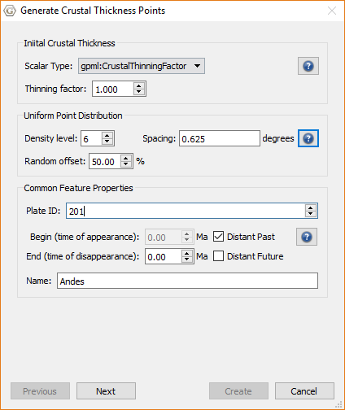

Generating initial crustal point positions within the boundary of the Andes deforming network. Here the points are uniformly distributed with a spacing of about 1 degree and with 50% random offset (circular region of about 0.5 degree diameter).
