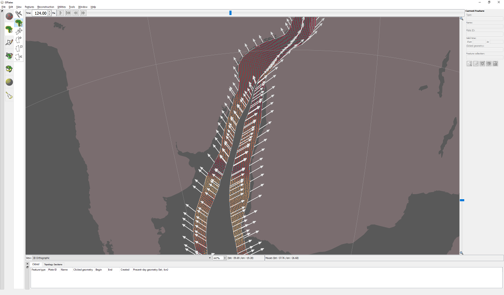

Africa separating from South America 124 million years ago. White arrows indicate direction of motion and red areas show where crust is stretching (high stretching factors). Stretching is mostly limited to regions where Africa and South America have not yet fully separated.
