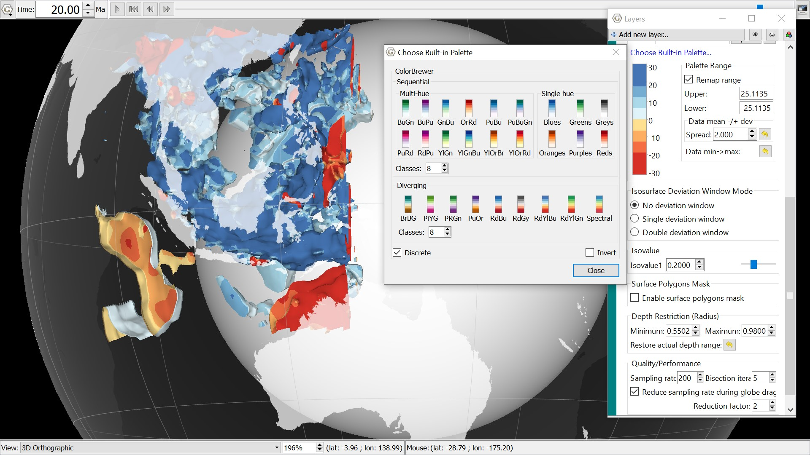

3D Scalar field under SE Asia, coloured to represent the temperatures of the material below the Earth's surface. Hot rising slabs are depicted in red, with the cooler down going slabs in blue. Coastlines to visualise the location globally. 
