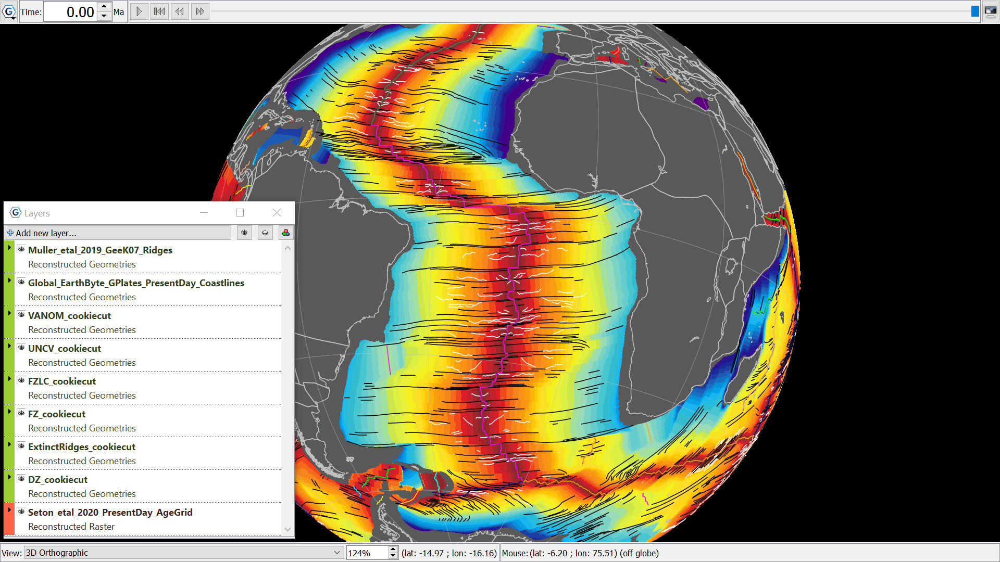

Seafloor fabric overlying a Traditionally coloured Age Grid to represent the hotter MOR in red, and the cooler, older oceanic crust in blue. The spreading path between Africa and South America is reflected in the seafloor fabric. 
