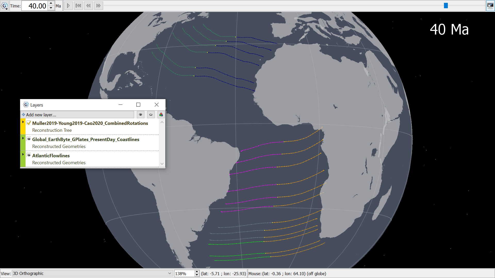

Atlantic Flowlines between Africa, South America and North America 40Ma. The coastline polylines are filled and slightly transparent, while the globe background is set at a medium grey. Stars are set in the background, with a text overlay displaying the reconstruction time.
