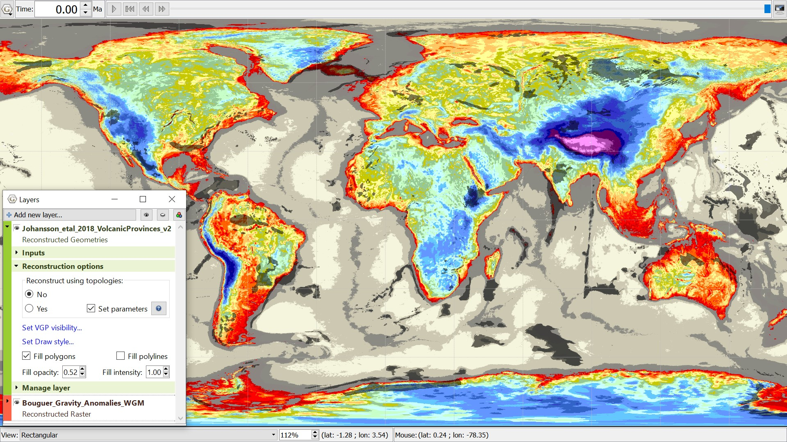

Continental Bouguer anomalies with overlain black transparent volcanic provinces. They often overlap in areas of strongly positive or negative (dark red or blue) anomalies such as the Icelandic or South American east coast regions.
