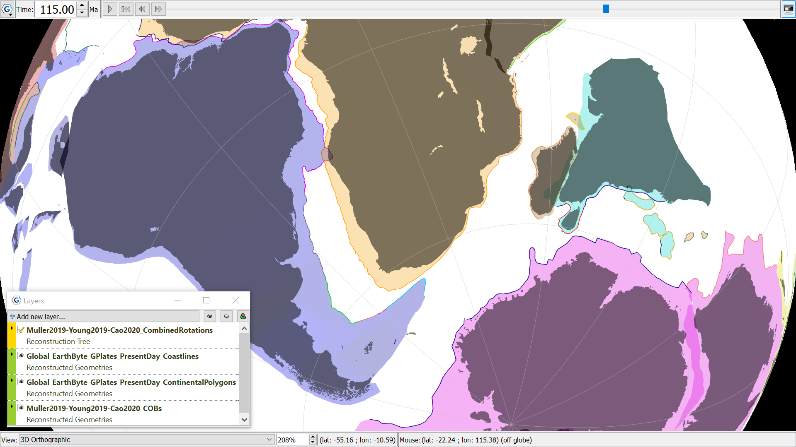

Coastlines shaded darker, with continents shaded in colours to match their regions. Focused on the Southern Ocean, reconstructed to 115Ma shortly after South American began separating from Africa, with Australia still attached to Antarctica off to the right of the image. The globe background is set to white. 
