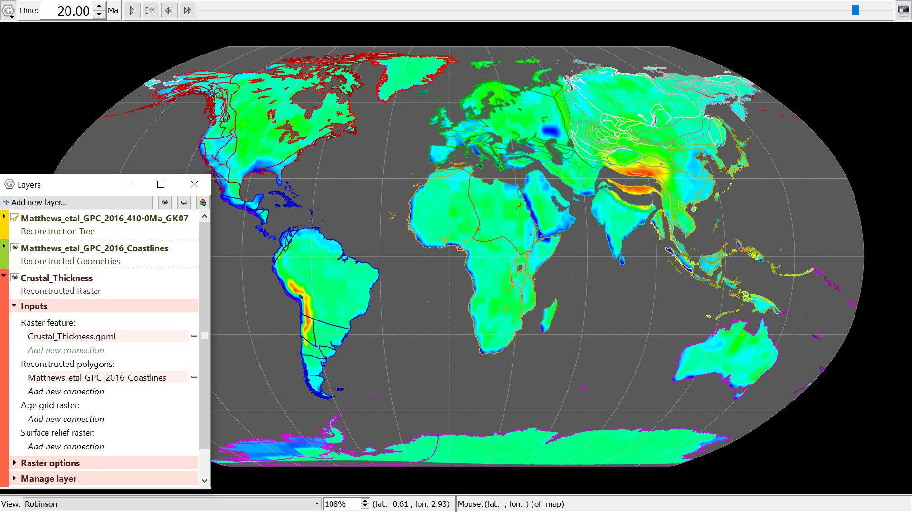

The crustal thickness raster here is ‘cookie-cut’ to the Coastlines of the world by specifying them as the reconstructed polygons in which the raster should confine itself to. The map is reconstructed to 20Ma in the Robinson view, showing the segmentation of the thick crust in the Himalaya’s and Tibetan Plateau region.
