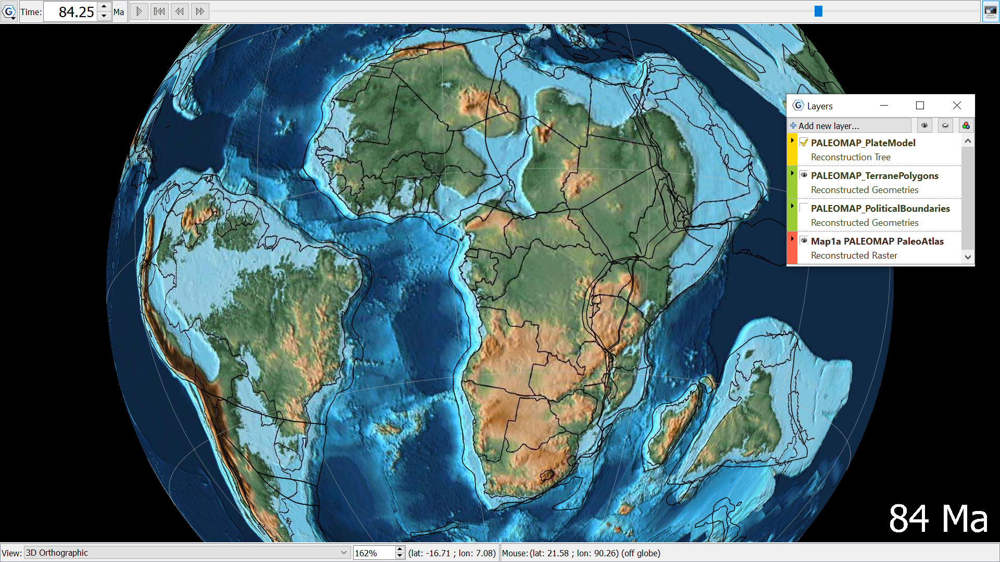

The PALEOMAP global paleogeography time-dependent raster for the phanerozoic produced by Scotese (2016). Focused on Africa, reconstructed to 84Ma, there is shallow marine regions in the North-West of the continent, with also significant water coverage in South America.
