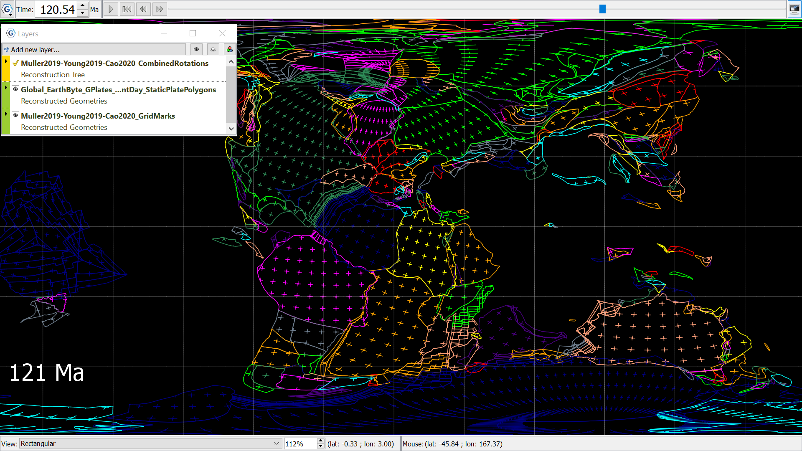

Grid marks overlain the static plate polygon reconstructed geometry, reconstructed to ~121Ma using the Muller (2019), Young (2019), Cao (2020) Combined Rotations as the Reconstruction tree. The background is set to black, and the view is Rectangular. 
