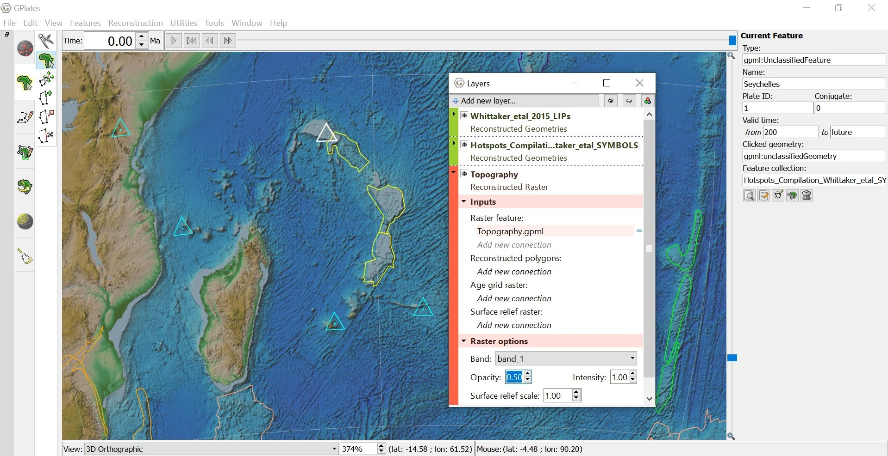

Off the coast of Madagascar there is a clear chain of LIPs produced by the movement of the plate over the hotspot in question, Seychelles. As you reconstruct back through time this relationship is affirmed. 
