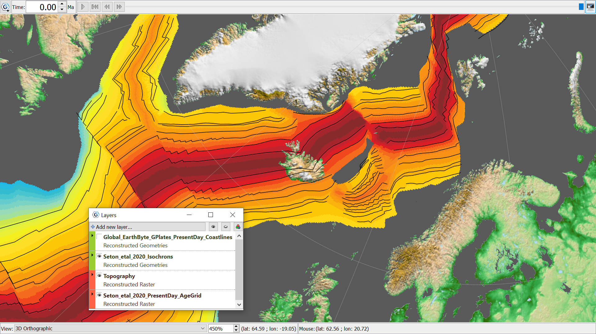

Isochrons in black and Age grid raster coloured with the traditional palette to reflect temperature of hot young rock rising at MOR in red, and cool older rock subducting in blue. A present day look at Iceland, with isochrons running throughout, and rock young rock rising beneath. The topography raster is ‘cookie-cut’ to fit the coastlines. 
