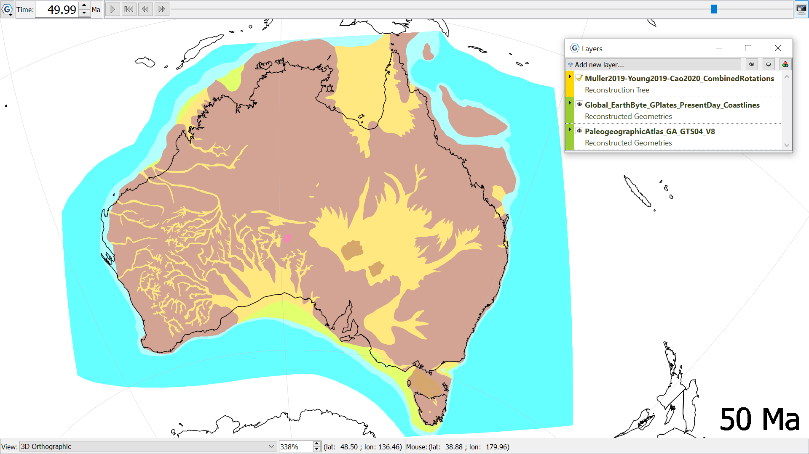

Paleogeographic Atlas of Australia created by Geoscience Australia, converted into shapefiles for use in GPlates by the EarthByte group. Reconstructed to 50Ma using the Muller (2019), Young (2019), Cao (2020) Combined Rotations as the Reconstruction tree. 
