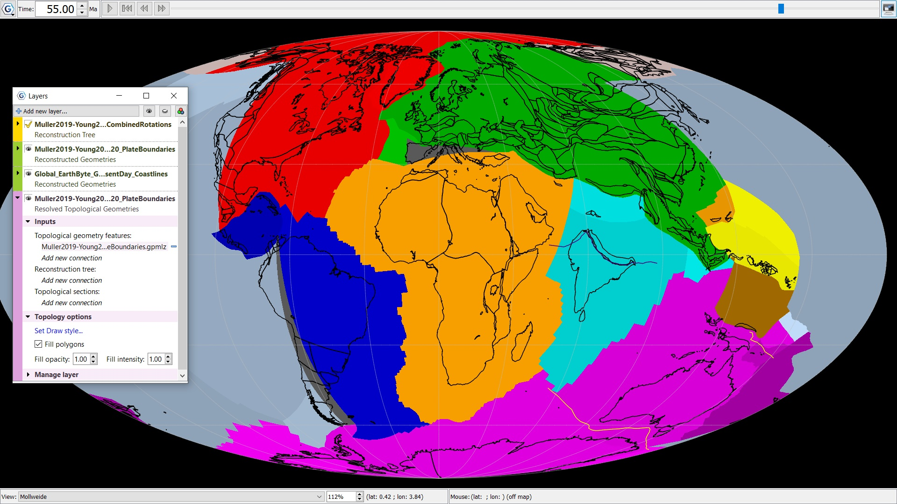

The plates are coloured based on their region, with overlying coastal outlines in black. The plates were reconstructed to 55Ma using the reconstruction tool bar and projected with a Mollweide view.
