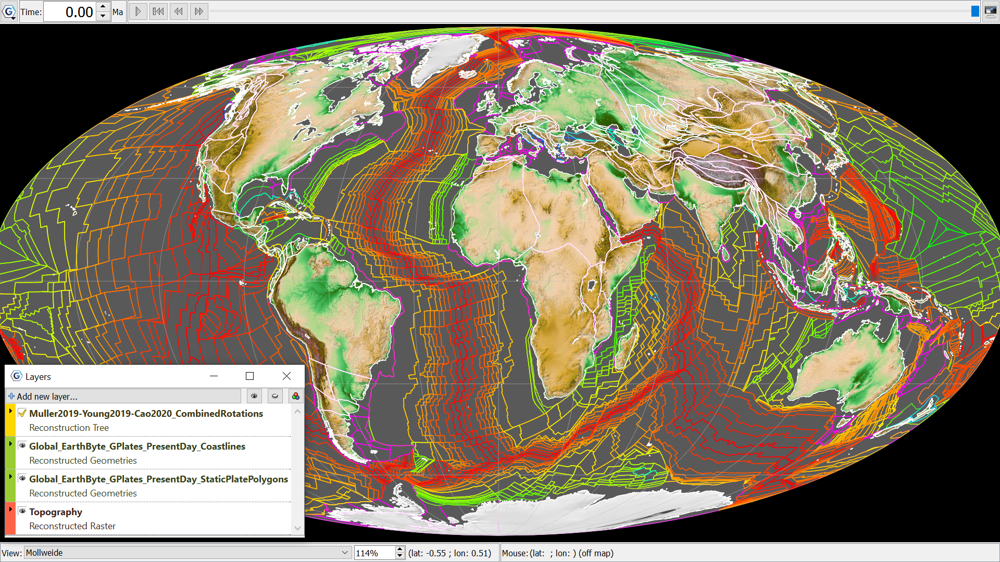

Static plate polygons at present day using a Mollweide projection and the Muller (2019), Young (2019), Cao (2020) Combined Rotations as the Reconstruction tree. Global Topography is ‘cookie-cut’ to the present-day coastlines (in white).
