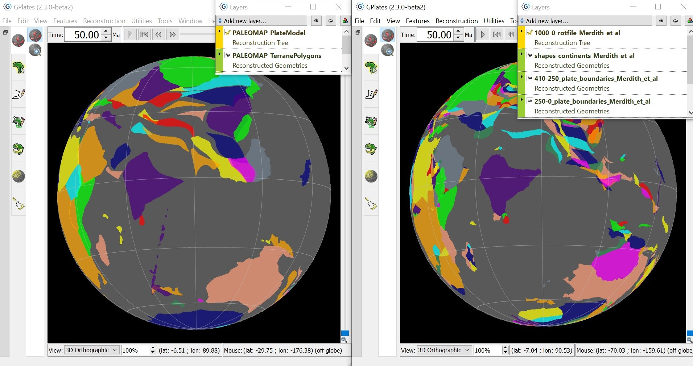

Alternate plate reconstruction models. Left: Scotese (2016) PALEOMAP glboal plate motion model for the phanerozoic. Right: Merdith et al. (2021) plate model back to 1 Ga. Reconstructed to 50Ma to compare the motion of India. 
