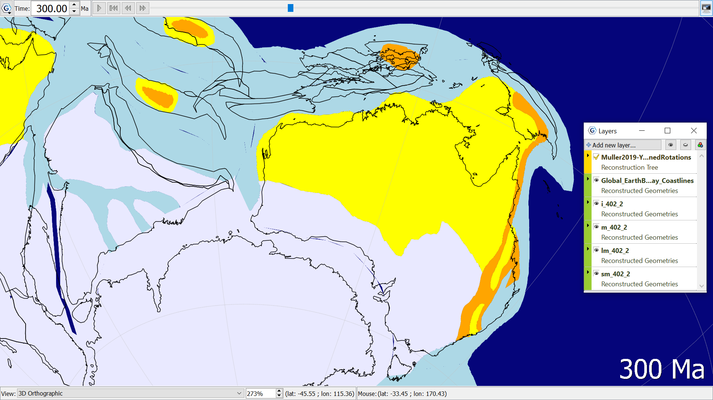

A Global Paleogeography model from Cao et al. (2017), containing four shapefiles:
-	i: ice sheet (white)
-	m: mountain (orange)
-	lm: landmass (yellow)
-	sm: shallow marine (light blue)
Reconstructed to 300Ma, showing the large ice sheet covering the southern extent of present-day Australia, all of Antarctica, and most of India. 
