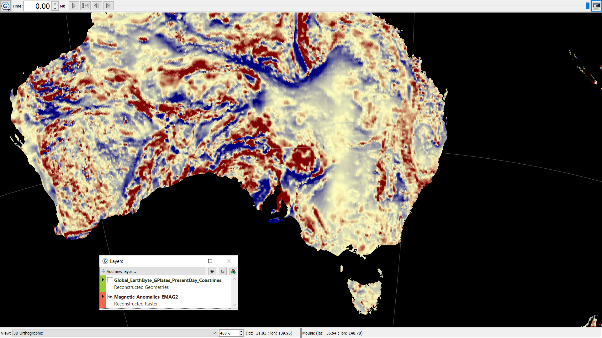

A colour grid of magnetic anomalies from EMAG2 with -80 nT as dark blue and 80 nT as dark red. Magnetic anomalies can be useful to locate how thick a sedimentary basin may be, or the presence of a geological body below the surface of the earth. 
