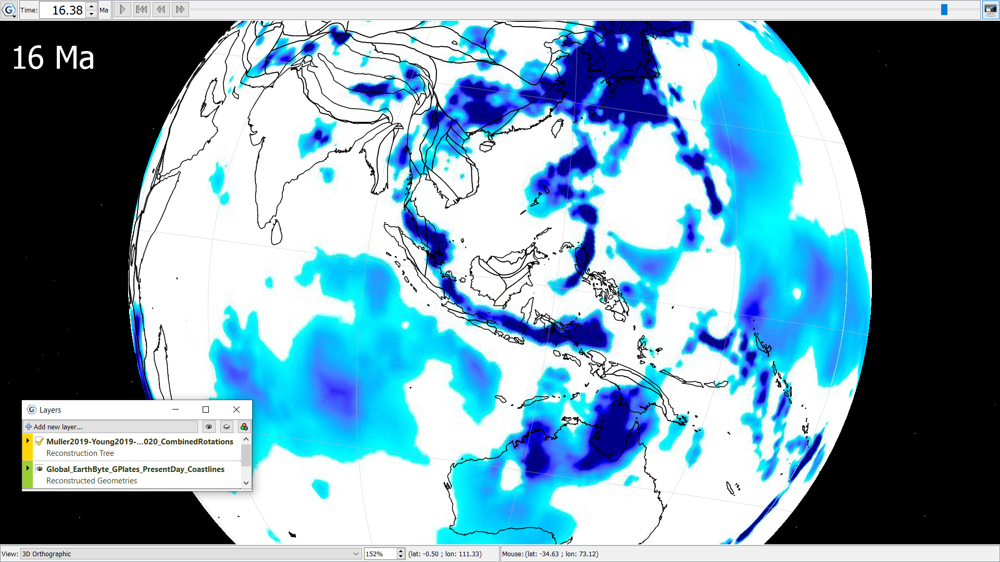

A time-dependent raster sequence displaying seismic velocity anomalies with overlying coastlines in black reconstructed to ~16Ma. The Raster ranges from 0.0 (white) - 0.5% (dark blue) of seismic velocity anomaly. These slabs are age-coded from the MIT-P P-wave seismic tomography (Li et al., 2008), where slabs are assumed (on the first order) to sink vertically with a constant sinking rate. The sinking rate applied here is 3 cm/yr in the upper mantle, and 1.2 cm/yr in the lower mantle. There are notably strong seismic velocity anomalies tracing the Indonesian islands in the centre of the frame. 
